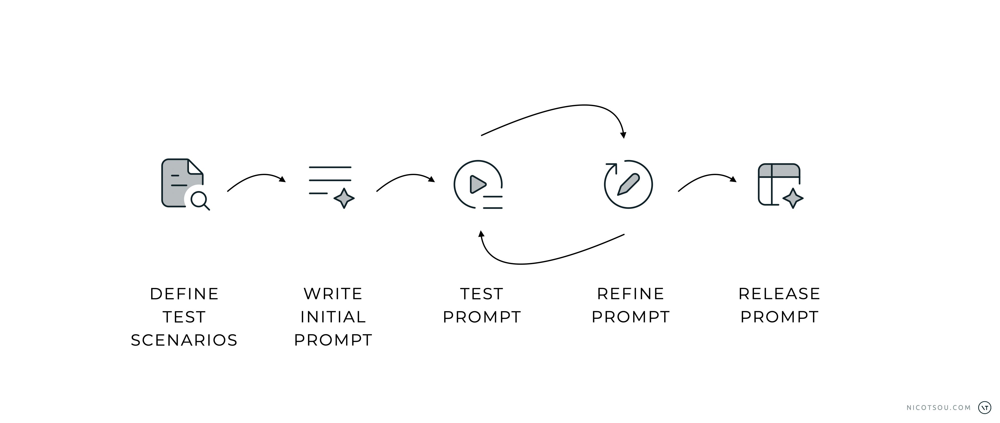

I've curated these advanced prompting techniques and strategies from my personal experience and ongoing learning journey. These techniques will help you elevate your prompts by achieving results that are challenging to get.

I've written everything in plain, simple language, without using complex math or scientific terms. This is just an overview, though. Each technique deserves its own detailed article—which I plan to write for some of them in the future.

Since prompt engineering is always changing, I'll keep updating this guide with new tips and best practices as I discover them.

Let’s see what we’ve got! 🥁

## Iterative prompt evaluation 🧪

As Generative AI transforms industries, effective prompt engineering has become essential for optimizing output **quality**, **speed**, and **costs**. Prompt evaluation is crucial but challenging for organizations developing AI solutions. Many struggle to maintain consistent prompt quality across applications, leading to variable performance and user experiences.

Just like agile development involves iterative cycles of planning, building, and refining, prompt engineering requires continuous experimentation and improvement. You start with a basic prompt, test it, analyze the results, and then make adjustments based on what you've learned. This cycle repeats until you achieve the desired outcome.

_Prompting is an iterative approach._

The iterative approach involves continuously refining and improving your prompts through multiple attempts. Instead of expecting perfect results on the first try, you experiment with different phrasings and structures to get closer to your desired outcome. This method helps you understand what works best for specific tasks while building an intuition for effective prompting.

> A prompt without evaluation is like a ⛴️ ship without a 🧭 compass.

To create test cases for prompt evaluation, start by defining the objective — what the prompt is intended to achieve. This can include factors like accuracy, relevance, creativity, clarity, and ethical compliance. Identify scenarios based on real-world use cases, edge cases, negative cases, and exploratory cases. For each test case, document the input prompt, expected output, evaluation criteria, priority, and any additional notes to provide context.

Evaluation metrics are critical for assessing the quality of outputs. Metrics can include [precision and recall](https://en.wikipedia.org/wiki/Precision_and_recall), [BLEU](https://en.wikipedia.org/wiki/BLEU)/[ROUGE](<https://en.wikipedia.org/wiki/ROUGE_(metric)>) scores, user satisfaction ratings, and compliance with ethical guidelines. Test cases should cover a variety of situations, from straightforward tasks like summarization to safety-critical negative cases where the model must avoid harmful outputs. Automating tests through frameworks like [LangChain](https://www.langchain.com), [LangSmith](https://www.langchain.com/langsmith), [DeepEval](https://docs.confident-ai.com), or other prompt evaluation tools can streamline the process, while A/B testing helps identify the best-performing prompts.

Finally, [human-in-the-loop](https://en.wikipedia.org/wiki/Human-in-the-loop) systems and feedback mechanisms are essential for refining prompts. By iteratively testing and analyzing results, you can ensure that prompts are optimized for their intended use, whether for generating content, answering questions, or interacting ethically as a chatbot.

## **Chain-of-Thought (CoT)**

Solving structured problems step-by-step. with prompts like "take your time" and "think step by step how to solve the problem" are related to the **Chain-of-Thought prompting technique**. It’s a powerful approach to guide the conversation coherently and logically. It involves building gradually on the previous parts of a response to create a flow of thoughts.

Here’s an example:

<aside>

**Prompt:** A company has noticed a 10% drop in sales over the last quarter. **_Let’s think through the possible reasons step by step_**.

</aside>

The AI will most likely follow a step-by-step reasoning similar to the following:

1. First, examine if there were any recent changes in product pricing or quality.
2. Next, consider external factors, such as competitors' actions or market conditions.
3. Finally, assess if there were any shifts in customer demographics or preferences.

This methodical approach leads to more comprehensive and well-reasoned responses by breaking down complex problems into manageable steps, allowing for thorough analysis at each stage. The result is a more detailed, logical, and carefully considered output that captures nuances that might otherwise be missed with a more direct approach.

The effectiveness of Chain-of-Thought prompting depends heavily on how well you start the reasoning process. If you begin with incorrect thinking, each following step can make the problem worse, leading to wrong conclusions.

This method has one main drawback: it can only move forward in one direction. Once you follow a particular path of thinking, you can't go back to try different approaches or rethink your earlier decisions. This can be especially limiting when dealing with complex problems that might need you to explore multiple solutions at the same time.

Also, this technique isn't great for problems that need creative thinking or sudden insights, since it works best with step-by-step logical thinking.

## **Prompt Chaining**

Prompt chaining is a technique where you break down a complex task into a sequence of smaller, focused prompts that build upon each other. Instead of trying to get the perfect response with a single prompt, you create a chain of prompts where each one refines or builds upon the output of the previous one.

Think of it like a conversation where each question naturally leads to the next, gradually working towards your goal. This approach gives you better control over the output quality since you can guide the AI more precisely at each step. It’s easier to detect errors and correct them at an early stage, as you can identify exactly where in the chain things might go wrong. You also get more detailed and thorough results since each prompt can focus on a specific aspect of the task.

We start with a simple request:

<aside>

**First Prompt:** Design an event-driven system using AWS Lambda functions. The system should process data uploaded to an S3 bucket, store metadata in DynamoDB, and notify users through SNS. Ensure high availability and scalability.

</aside>

Using the previous pair of prompt and prompt response as a “conversation memory”, we prompt the AI to optimize the result:

<aside>

**Second Prompt:** Optimize the architecture to minimize AWS Lambda invocation costs and storage costs in DynamoDB. Suggest changes or alternatives.

</aside>

We try again:

<aside>

**Third prompt:** Add robust error-handling mechanisms and monitoring tools to the architecture. Ensure failed events are retried or logged for further inspection.

</aside>

And again:

<aside>

**Final Prompt:** Ensure the architecture scales well with increased load and remains easy to maintain. Suggest any further improvements.

</aside>

As shown in the example above with the AWS architecture design, each prompt in the chain addresses a different aspect of the solution — from initial design to optimization, error handling, and scalability. This systematic approach helps ensure that all important aspects are covered thoroughly.

Popular orchestration frameworks like [LangChain](https://js.langchain.com/v0.1/docs/modules/chains/popular/api/) provide simple APIs for chaining your prompts.

## **Reasoning & Acting (ReAct)**

When working with dynamic tasks that require adaptive reasoning and actions based on feedback, the Reasoning & Acting prompting technique delivers excellent results. It enables intelligent problem-solving through a continuous cycle of observation, analysis, and response.

This method works best when you need to try things out in the real world and learn from the results. It's particularly useful for solving tricky problems where you need to adjust your approach based on new information and changing situations.

ReAct is inspired by the fundamental synergies between "acting" and "reasoning" which allow humans to learn new tasks and make decisions through a natural process of observation, reflection, and adaptive response.

Here’s an example:

<aside>

**First Prompt:** We are deciding on a cloud architecture for our new web application. Should we use _serverless_, _containers_, or a _VM-based approach_? The decision needs to account for _scalability_, _cost_, and _development speed_. **_What are the trade-offs of each and what’s the next logical step?_**

</aside>

Similar to CoT, just by adding this key phrase at the end, we expect the AI to come up with two components: Reasoning and Action.

**Reasoning:**

- Serverless is ideal for scalability and low initial cost but may have higher long-term costs for high workloads. Development is quick due to the reduced infrastructure management.
- Containers provide better control and portability with a balance of cost and scalability but require more setup and maintenance.
- VMs offer the most control and flexibility but can be costly and require significant maintenance, slowing development speed.

**Action:** How do serverless, containers, and VMs compare in terms of scalability?

Following the ReAct approach, we now use the AI's suggested action as our next prompt:

<aside>

**Second Prompt:** How do serverless, containers, and VMs compare in terms of scalability?

</aside>

This iterative process allows us to make decisions based on concrete observations rather than assumptions, adjust our approach as we gather more information, and break down complex technical decisions into manageable steps.

The power of ReAct lies in its ability to combine analytical thinking with practical action steps, leading to more thorough and well-considered solutions.

## **Tree of thoughts**

The Tree of Thoughts technique is a structured approach for tackling complex problems that have multiple possible solutions. It works by breaking down the decision-making process into four key steps:

1. first identifying all possible approaches to the problem,
2. then evaluating and scoring each approach for feasibility,
3. followed by a detailed exploration of the most promising solution,
4. and finally concluding with a selection of the best option based on the evaluation.

Here’s an example:

<aside>

**First Prompt:** _Let’s explore several potential strategies_ for migrating the existing relational database to Azure Cosmos DB, examining each approach from multiple perspectives _before choosing the best option_. **_Consider three main migration strategies_**.

</aside>

The AI will generate multiple migration strategies:

Strategy A

Lift and Shift Using Azure Data Migration Service (DMS)

- **Thought 1:** What are the advantages of using Azure DMS for a straightforward lift-and-shift migration? (e.g., minimal code changes, faster migration setup)
- **Thought 2:** What are the limitations of a lift-and-shift approach in this context? (e.g., potential data model mismatches between relational and NoSQL, need for reindexing)
- **Thought 3:** What additional optimizations would be necessary post-migration, such as adjusting indexing or partitioning to align with Cosmos DB’s architecture?

Strategy B

Data Model Transformation with Schema Redesign

- **Thought 1:** How could a schema redesign help optimize the data model for Cosmos DB? (e.g., moving from relational to document-based modeling, denormalization for performance)
- **Thought 2:** What challenges might arise when transforming the schema for Cosmos DB, especially regarding data consistency or query patterns? (e.g., handling joins, adapting to a non-relational mindset)
- **Thought 3:** What tools or strategies could assist in the schema redesign process, such as Cosmos DB’s Data Migration tool, or hybrid models that gradually phase in new data structures?

Strategy C

Hybrid Migration with Incremental Data Sync

- **Thought 1:** What benefits could a hybrid migration provide by syncing new data to Cosmos DB incrementally? (e.g., reduced downtime, ability to test Cosmos DB performance on real data)
- **Thought 2:** What complexities could arise with maintaining data consistency across both databases during migration? (e.g., handling real-time syncing, conflict resolution)
- **Thought 3:** How might we design an efficient syncing and switchover process, such as using Azure Functions for event-driven updates or a staged migration approach?

Now, we prompt the AI to evaluate the generated approaches and to select the one that best aligns with the target that we have:

<aside>

**Second Prompt:** Once we examine these migration strategies, considering ease of implementation, cost, performance, and long-term flexibility, we’ll **_select the approach that best aligns_** with the application’s scalability and operational requirements.

</aside>

This method is particularly useful when dealing with ambiguous problems and trade-offs that require careful consideration of multiple alternatives.

## X-Shot Prompting

In prompt engineering, "shot" refers to the number of examples provided to guide the AI model. When we talk about "X-shot" prompting, we're describing how many examples we're giving the model to help it understand the pattern we want it to follow.

By default, when no examples are provided (zero-shot), the model relies solely on its training data and the task description in the prompt to generate responses. As we increase the number of examples - whether it's one-shot (single example), few-shot (several examples), or many-shot (numerous examples) - we give the model more context to understand the specific pattern or format we're looking for. This approach helps the model better align its responses with our expectations and requirements.

Here’s an example:

<aside>

**Prompt:** _Classify the sentiment_ of a customer message. Focus on identifying the sentiment accurately based on context.

_For example_:

_"Your team helped me so quickly with my claim!" Meaning: Positive_

_"I am beyond frustrated with the wait times." Meaning: Negative_

_"Can someone explain this to me?" Meaning: Neutral_

_"I'm so grateful for the help I received!" Meaning: Positive_

_"This process is more complicated than I expected." Meaning: Ambiguous_

_Sentence to classify_: “{MESSAGE}”

</aside>

In this example, we're showing how to classify sentiment in customer messages. The prompt starts by clearly stating the task "Classify the sentiment" and then provides 5 examples that demonstrate different types of sentiment. These examples help the AI understand the nuanced differences between sentiments and how to categorize them appropriately. Notice how each example includes both the message and its classification, creating a clear pattern for the AI to follow.

Different AI models have varying abilities to learn from examples. Some advanced AI models can understand and copy patterns after seeing just a few examples. Other AI models need more examples to do the same task well.

---

## That’s all folks! 🙌

Thanks for reading! Stay tuned for more content about prompt engineering! I'll be sharing advanced techniques, real-world examples, and practical strategies to help you master the art of communicating with AI. MMy newsletter form is just a few DOM elements below. Don't forget to subscribe to get notified when new articles are published.

Do you have any other tips for crafting better prompts? I'd love to hear your thoughts and experiences.

---

Cover art generated with Adobe Firefly
