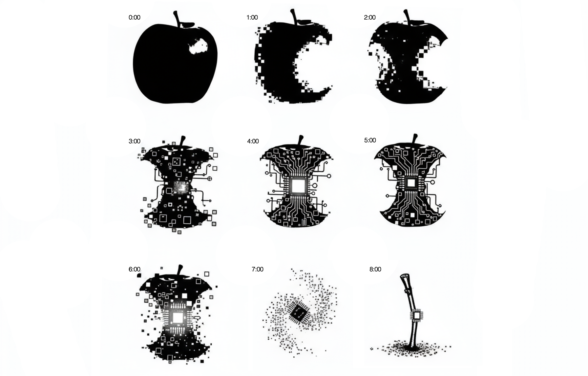

Generative AI is often overhyped, creating unrealistic expectations that frequently lead to failure.

You see, big tech companies promote their AI models as magical solutions, conveniently ignoring their [flaws](https://fortune.com/2025/08/18/sam-altman-openai-chatgpt5-launch-data-centers-investments/). Social media bombards us with fear-mongering and false promises designed to capture attention. And did you see those [massive investments](https://www.theverge.com/ai-artificial-intelligence/812455/ai-industry-earnings-bubble-fomo-hype)?

This often creates a pattern in company meetings: People unfamiliar with the technology get overly enthusiastic about its potential, pushing teams down risky paths. Other folks are way more conservative, slowing down huge transformation opportunities.

So how do you cut through the noise? How do you build AI products like a boss, without falling into traps?

Let’s talk about the realities nobody mentions in the keynote presentations. So when business is screaming “Profit! Profit! Profit!” and engineering pushes back with “That will end really badly”, let me help you bridge the gap between hype and reality.

This article is _that_ guide—my Holy Grail of AI.

Amen! 🙏

## 1. Most AI product pilots _fail_. And fail hard.

Here’s a [stat](https://fortune.com/2025/08/18/mit-report-95-percent-generative-ai-pilots-at-companies-failing-cfo/) that should make every product manager sweat: **95% of generative AI pilots at companies are failing.**

Not “struggling.” Not “underperforming”.

And it’s not because the models are broken. It’s because companies have no idea how to actually _ship_ AI features that users adopt.

Think about it: your competitors are building AI chatbots, recommendation engines, and automated workflows. Everyone’s racing to slap “AI-powered” on their feature list. But here’s what nobody talks about in those shiny product demos—most of these pilots never make it past the experiment phase.

_Megan is one of the most entertaining deadly AI Sci-fi characters. You definitely don't want your kid to be next to her._

Common reasons why AI product features fail:

- **The “me too” strategy** — You’re adding AI because your competitor announced an AI feature last quarter. Not because users are actually asking for it.
- **Wrong automation targets** — Teams automate complex, opaque workflows where AI errors are invisible until they explode. Instead, start with simple, transparent tasks where hundreds of users can immediately spot when something’s off.
- **Testing happy paths only** — Single question-and-answer? Easy to test. Multi-turn conversations that stay coherent and on-track for 10+ exchanges? That’s where most teams discover their AI is actually terrible.
- **The elephant in the room** — The research is clear: businesses are investing in the flashy, visible AI features that look good in demos, but they’re missing the real opportunity to save money and improve efficiency by automating their internal workflows.

> You’re building AI features in the wrong places, for the wrong reasons.

The harsh truth? Most companies treat AI pilots like innovation theater. Build a demo. Show it to executives. Get the green light. Ship to production. Then watch user adoption flatline because nobody actually _needed_ the feature you built.

Before you start your next AI pilot, ask yourself: “If this feature disappeared tomorrow, would users complain?” If the answer isn’t a clear yes, you’re about to become part of that 95%.

## 2. AI replaces _tasks_, not jobs

Companies are doing mass layoffs and blaming it on AI. We see the headlines every week. Although there is [no guarantee](https://youtu.be/8g5img1hTes?si=192xBKFaJj3yMmuw) that AI is the one to blame here, we are expecting many jobs to be replaced by AI in the following years. And as this technology evolves, more jobs will be at risk.

There’s something you don’t read in the news, though: **AI reliably replaces _tasks_, not whole jobs**. And for many workflows, fully removing human judgment is far riskier and more expensive than it looks.

In the TV series _Severance_, workers sort numbers on a screen and delete the ones that feel “wrong”, though no one knows why.

_A typical working day at the office, in the series "Severance"._

This is closer to reality than you might think. AI still requires human oversight to ensure important matters aren’t overlooked. The so-called “**human in the loop**” is not just a catchy phrase to use in your slides, it’s the difference between a working product and a liability.

Companies that treat AI as “set-and-forget” build up hidden costs that only become obvious when things break:

- **Data quality gaps** — garbage in, garbage out, but now at scale
- **Eval and monitoring debt** — no one’s watching what the AI actually does in production
- **Loss of user trust** — one simple anomaly can undo months of credibility, especially when user personal data are involved
- **Compliance exposure** — regulators don’t accept “the AI did it” as a defense
- **Brittle operations** — systems that can’t adapt when edge cases inevitably appear

The companies cutting people to the bone will learn this the hard way when their AI products fail in production.

You want people in your company who enjoy meaningful work and bring critical thinking to the table. That’s where productivity and innovation begin. You don’t want a skeleton crew babysitting AI outputs all day, catching mistakes after the damage is done.

Next time you approach AI as a way to replace human labor, just think twice!

## 3. There’s _always_ a chance to hallucinate

LLMs will generate content that's completely false—and present it to you as fact. No matter how hard you try, **there's [always](https://www.scientificamerican.com/article/chatbot-hallucinations-inevitable/) a possibility AI will [hallucinate](https://www.theverge.com/2024/5/15/24154808/ai-chatgpt-google-gemini-microsoft-copilot-hallucination-wrong)**.

And believe it or not, that’s a feature, not a bug. Sometimes we _do_ want a model to think out of the box. To be creative.

_Steven Spielberg's film "Artificial Intelligence" is playing with our emotions asking whether a human android that looks and behaves like a human is a human._

But here’s the thing: when the stakes are high—financial decisions, medical advice, legal guidance—you can’t afford to guess. That’s when [AI slop](https://www.theverge.com/2024/5/15/24154808/ai-chatgpt-google-gemini-microsoft-copilot-hallucination-wrong) can turn from interesting quirks into a disaster.

> The risk isn’t that AI will hallucinate. The risk is building systems that assume it won’t.

On a positive note, there are tools that can help you catch some hallucinations:

- Models with larger context window are less prone to making mistakes
- Consider adding cloud-based guardrails into your solution
- Another LLM can play the role of the “police” to validate the generated content
- Ground answers: retrieve sources and require citations to exact spans
- Use agentic tools for truth: DB queries, APIs, calculators via function calling
- Constrain outputs: JSON schemas or grammar; answer only if supported

These are just a few strategies to mitigate risk. The key is to layer multiple safeguards. No single technique eliminates the problem entirely, but combining them significantly improves reliability.

## 4. _Any_ software is prone to bugs.

Remember, AI software is _still_ software.

No matter how many tests you’ve written, even if you’re [Uncle Bob himself](https://blog.cleancoder.com/uncle-bob/2017/10/04/CodeIsNotTheAnswer.html), there is no way to end up with a bug-free application. This means even when the AI generates correct output, bugs in your integration code, API calls, or data pipelines can still produce false results.

But there’s a catch!

_Sometimes in client meetings, I feel like Lisa Simpson, voicing skepticism to an audience that doesn't want to hear it._

The key difference between a bug in an AI product versus regular user interfaces: AI fails by producing plausible-but-wrong outputs that flow straight to users or downstream systems. Errors aren’t obvious dialogs; they look like _truths_.

> UI bugs cost minutes; AI bugs cost _trust_.

Now is the time to enforce the engineering and architecture principles in your product that you may have overlooked before. You know all those debates about test-driven development and continuous integration? They matter more than ever when AI is in the mix. And the irony is you can use AI to integrate them faster.

Conduct security assessments and build guardrails to verify AI-generated content before it reaches end users.

## 5. AI is _not_ inherently ethical.

One of the unwritten rules of the _real_ Agile development manifesto is “bonuses and promotions over ethical considerations”. And “we’ll [pay](https://www.theverge.com/news/777344/perplexity-lawsuit-encyclopedia-britannica-merriam-webster) our [lawyers](https://edition.cnn.com/2025/08/26/tech/openai-chatgpt-teen-suicide-lawsuit) to [cover](https://www.bbc.com/news/articles/c5y4jpg922qo) our [crap](https://www.reuters.com/technology/artificial-intelligence/multiple-ai-companies-bypassing-web-standard-scrape-publisher-sites-licensing-2024-06-21/) (sic). Pretty soon we will use AI lawyers so we won’t have to pay those either”.

**Ethical design is _not_ a choice**. Companies that cut corners on ethical AI implementation risk significant damage to their brand reputation and may face substantial financial and legal consequences.

To put it simply, customers will always [prefer](https://www.cnbc.com/2025/11/05/tesla-musk-germany-sales-down.html) companies that are more ethical.

_Imagine how different the UX would have been if Theodore (Joaquin Phoenix) wouldn’t know that he’s talking with an AI. Hm, a bad example I guess?_

We can’t keep AI responsible for human lives. We can’t let AI make decisions that put people in trouble. The [EU AI Act](https://artificialintelligenceact.eu) introduces stricter regulations to prevent misuse of this technology. Because that’s what we like to do in EU, we regulate everything. Several other countries are developing their own rules.

The [2025 DORA report](https://dora.dev/research/2025/dora-report/) found that 70% of IT leaders cite regulatory compliance as their top GenAI challenge.

I know this topic is very abstract to many of us. Here are some practical tips:

- **Always inform your users that you use AI** — Transparency builds trust. Ultimately, you can provide users with reasoning or confidence scores, especially for high-stakes outcomes.
- **Implement audit logs** — Record all AI interactions, decisions, and overrides for compliance and retrospective analysis. When something goes wrong, you need a trail to understand what happened.
- **Embrace human in the loop** — Before AI commits to consequential decisions (financial transactions, medical advice, legal filings) add confirmation steps. A moment of human review can prevent catastrophic mistakes.
- **Create feedback loops** — Let users flag bad outputs and show them that their feedback improves the system. This empowers users and helps you catch issues early.

## 6. _Everyone_ is a hacker now

Vibe coding was the trend of 2025. Creating applications was never that easy. It’s just you in the safety of your couch, having a team of engineers building whatever comes to your mind, in seconds.

If it’s so easy to write code, why not vibe code the sh\*t out of it?

---

When I was studying at my university, I was always amazed by those assembly simulators and how much the technology had evolved during that time. I felt blessed I was born at that time, and I didn’t have to deal with those low-level coding languages. Back then, I couldn’t even imagine what an iPhone was, or that cars would be able to drive themselves.

_[Watch](http://www.youtube.com/watch?v=VhSdhen3FrM) how teens react to old technology._

Now imagine the kids growing up with AI-powered coding assistants. They’ll have capabilities that took us years to build, available from day one.

This democratization of development has a darker side. Before, you needed advanced programming and system knowledge to exploit vulnerabilities. Now, anyone with basic language skills can attempt to hack a system by simply describing what they want to accomplish. The barrier to entry for both creation and exploitation has dropped dramatically.

But the real problems emerge when vibe coders try to scale:

- **Initial productivity doesn’t scale** — Vibe coding delivers rare bursts of speed on one-off scripts, but once you need to maintain and evolve code, those gains evaporate quickly
- **Sites actually get compromised** — Real-world evidence shows vibe coders hit a wall where their applications get hacked, forcing them to learn security fundamentals they initially skipped
- **Context window limitations** — As apps grow beyond AI context windows, generated code becomes inconsistent in both appearance and functionality
- **Poor code quality from training data** — LLMs are trained on a mix of good, bad, and mediocre code from the internet, producing inconsistent quality without universal standards
- **Encourages unnecessary complexity** — AI often encourages hastiness and over-building rather than preventing unnecessary work
- **Maintenance becomes a nightmare** — Vibe-coded projects become difficult to modify and evolve, especially when code is regenerated from scratch rather than incrementally improved

So while my developer soul would beg for a true solution that eliminates the need to write code, we’re not there yet. It could be a great prototyping tool, though—and maybe a conversation starter for your next Scrum planning session. 😉

## Finding your balance

I know what you're thinking. In a world where everyone talks about AI revolutionizing everything, how can we be so conservative? It's true—AI will eventually become what you envision. But current AI iteration is just a stepping stone.

We are not there yet.

Every AI success story starts the same way: someone identified a _specific_ problem, built a _constrained_ solution, and put _guardrails_ around it.

They didn’t try to automate everything at once. They didn’t skip testing because “the model is really good now.” And they definitely didn’t fire half the team and hope AI would pick up the slack. The teams that win with AI are the ones who treat it like any other powerful, yet imperfect, tool.

Generative AI technology is powerful. It’s transformative. But it’s also immature, unpredictable, and prone to spectacular failures when misused. And that’s why we love it.

It reminds us of _us_.

---

Takeaways (summarized by AI, of course):

- **Build verification into everything** — Audit logs, human review checkpoints, confidence thresholds, feedback loops. If you can’t explain how you’ll catch mistakes, you’re not ready to ship.
- **Solve real problems, not imaginary ones** — Before you add an AI feature, ask if users are actually asking for it. If the answer is no, you’re about to waste a lot of money.
- **Automate the boring stuff first** — Start with simple, transparent tasks where mistakes are obvious. Save the complex workflows for later, once you’ve learned how AI actually behaves in your system.
- **Critical thinking over massive layoffs** — The companies that treat AI as a headcount replacement will discover the hard way that babysitting AI outputs is _way_ harder than doing the work properly from the start.

Let me know what your thoughts are on AI. You know where you'll find me. 😉

Cover art generated with Google Gemini.
