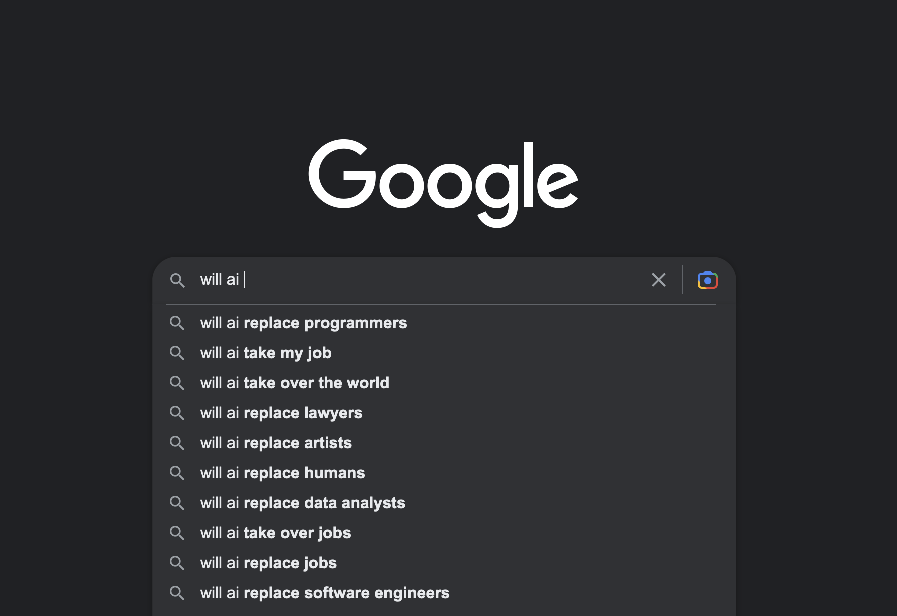
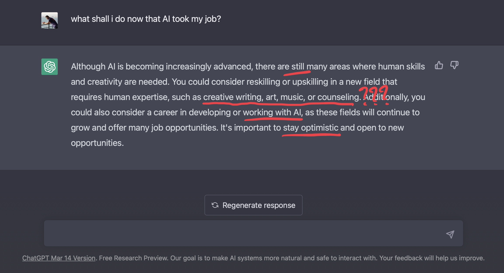

ChatGPT has changed our lives. No, seriously now. It’s the fastest-growing app in [history](https://mashable.com/article/chatgpt-fastest-growing), with 100 million users within only two months. But what is _really_ impressive is the results it produces.

We already knew AI was the future; computational photography, grammar-checking tools, robot vacuums, and self-driving cars (#not). But who could even imagine the profound effect of generative AI in software engineering?

You see, we never thought that AI could be creative. We were considering creativity as something spiritual that only humans could do. Today, you can ask AI to write songs, books, poems, essays, and of course… code!

ChatGPT has brought a lot of skepticism in the tech industry. Developers are concerned about their jobs being replaced by machines. I mean, how can’t you? Have you seen what this thing is capable of?

_It’s the most popular question on Google search._

So how will AI affect software engineers and what can we do to prepare ourselves for ‌doomsday? Well, I did my homework and I will provide my findings in this article.

You may think I have the answers. I don’t.

My approach instead is to help you have a better understanding of how to filter out everything you hear or read about AI. And maybe, I say [maybe](https://www.youtube.com/watch?v=6hzrDeceEKc), my article will calm you down a bit.

## A world gone wild

Generative AI (when it’s done [well](https://www.reuters.com/technology/google-ai-chatbot-bard-offers-inaccurate-information-company-ad-2023-02-08/)) can significantly reduce the time you spend on researching, training, meetings, code reviewing, problem-solving, mentoring, decision-making, debugging, testing, and the list goes on.

> AI can help us become more productive. Period.

It’s the “buddy” we always wanted to have next to us to answer every dummy question we were afraid to ask. I mean, who is willing to explain quantum mechanics to a 5-year-old in the middle of the night?

It’s the time-saving magic wand that brings information in seconds, without you having to browse websites, accept cookies, find controversial ways to avoid paywalls, dismiss ads and mailing list popups, and all of that just to read endless boring articles like this one.

An LLM not only has access to a global knowledge base, but it also distills the information and solves the problem for you. Connecting the dots is not always a straightforward process and it does require a lot of mental energy. That’s what makes generative AI so compelling. It unleashes the [superhero](https://powerlisting.fandom.com/wiki/Nigh-Omniscience) within you.

Generative AI is an amazing technology that when used correctly can really help a lot of people, or even [save lives](https://www.insider.com/chat-gpt-successor-gpt-4-can-help-doctors-save-lives-2023-4). Sometimes it’s incredibly [accurate](https://www.nytimes.com/2023/03/14/technology/openai-new-gpt4.html). Other times [not so much](https://bdtechtalks.com/2023/03/06/chatgpt-llm-mathematics/).

Of course, it’s time for a cliché. You know what comes with great power, don’t you?

From [misinformation](https://www.euronews.com/next/2023/05/02/rapid-growth-of-news-sites-using-ai-tools-like-chatgpt-is-driving-the-spread-of-misinforma) and [fake news](https://www.reuters.com/technology/china-reports-first-arrest-over-fake-news-generated-by-chatgpt-2023-05-10/) to [deepfakes](https://www.theguardian.com/technology/2023/may/25/deepfakes-ai-concern-microsoft-brad-smith) and [Balenciaga](https://www.nytimes.com/2023/04/08/technology/ai-photos-pope-francis.html). And what about the [copyrights](https://www.theverge.com/23444685/generative-ai-copyright-infringement-legal-fair-use-training-data) that feed those Large Language Models? Up until now, to increase the engagement in my blog I had to produce great content (or pay Google). Now, you can’t even tell if something here is original or [AI-generated](https://www.wired.com/story/cnet-published-ai-generated-stories-then-its-staff-pushed-back/).

How can you tell if your colleagues are really present in a meeting? Is this the real voice of my sister on the phone asking me to pay 10K because her bitcoins are gone? Even the future of [Google](https://www.npr.org/2023/02/09/1155650909/google-chatbot--error-bard-shares) itself is uncertain. I mean, [Bing](https://www.fool.com/investing/2023/05/16/will-chatgpt-replace-google-heres-what-we-know/) has become a trend. What kind world are we living in?

And these are just peanuts compared to the concerns about privacy, spamming, cybersecurity threats, online harassment, bullying, sexism, racism, propaganda, shall I go on?

And most importantly, what happened to the Metaverse? Why is nobody paying attention to that anymore?

But we’re here for the elephant in the room.

## Copilots — An Industrial revolution

Imagine a world where copilots are everywhere. Oh yeah, that’s already [here](https://observer.com/2023/05/google-sundar-pichai-ai-announcement/).

A significant amount of creative workers already use AI to boost their productivity. The author of this blog is included. Most of the applications I know have already introduced AI features or they are about to introduce them.

Now, imagine a world that developers depend on AI to do their jobs. We’re not as far away as you may think.

> The era of copy-paste is over.

Code completion has reached a new level, with [whisperers](https://aws.amazon.com/codewhisperer/) and [copilots](https://github.com/features/copilot/) integrated into your IDE. It only takes a few keystrokes to write a class, or a comment to refactor the whole file. Continuous Delivery tools can now search for security [vulnerabilities](https://snyk.io), or optimize your [workflow](https://about.gitlab.com/blog/2022/09/15/why-ai-in-devops-is-here-to-stay/). And finally, we don’t even need to write [documentation](https://mintlify.com) or [regex](https://www.autoregex.xyz/) ever again!

The more AI features will be integrated into the tools we use, the more people will depend on AI to do their job.

It’s not a secret. [Everybody](https://www.theverge.com/2023/5/19/23729619/apple-bans-chatgpt-openai-fears-data-leak) loves AI because they have to work less. Desperate managers are already trying to influence their developers to use ChatGPT in their workplace, even in companies where someone would think it’s strictly [forbidden](https://www.engadget.com/samsung-tells-employees-not-to-use-ai-tools-like-chatgpt-and-google-bard-114004180.html).

“C'mon, you can do that until tomorrow, why don’t you check ChatGPT? I heard it’s really good.”

“Why this will take so long? Here’s the code produced by ChatGPT, can’t we just use that one?”

Eventually, this creates a new generation of software engineers. The laziest ever.

Look at me. In the last few days I’ve written scripts in 3 languages I’ve never used in my life. Yes, in the beginning, it felt weird, later in the process I was asking AI to explain certain things. And now I know certain things, or at least I understand how certain things work.

How will it be when copilots will be integrated into every single application we’re using?

Lost a meeting? Just read the meeting notes your AI assistant has written for you. Requirements changed? Not a big deal, change the [prompt](https://en.wikipedia.org/wiki/Prompt_engineering), and we’ll have a demo in minutes. Technical debt? Not anymore, the code is being replaced in every iteration. Code smells? Ventilated, deodorized, absorbed. Documentation? Useless, AI knows everything. No more “Ask this guy who built that”. Cloud deployment? Just whisper how much you can afford and consider it done. Backend vs Frontend? 10x unicorns on the go, please. TDD? It’s included in our tier. Java vs JavaScript? [SudoLang](https://medium.com/javascript-scene/anatomy-of-a-sudolang-program-prompt-engineering-by-example-f7a7b65263bc). Disagreement over a pull request? Well, AI can’t do magic.

> Writing code will become more _accessible_.

Software engineers will eventually build complex tasks with significantly less effort. This will enable people with less or no programming skills to build their [prototypes](https://www.tweaktown.com/news/90725/openais-new-chatgpt-instantly-turns-napkin-sketch-into-website/index.html), or small production-grade applications, with [low](https://en.wikipedia.org/wiki/Low-code_development_platform) or even [no code](https://en.wikipedia.org/wiki/No-code_development_platform) at all. Soon you’ll be able to turn text into interactive 3D games.

By the way, imagine the AI project manager complaining to the AI code generators.

OK, jokes aside, that’s how AI will increase its competence. As our reliance on AI to perform our tasks grows, its capabilities will strengthen proportionally. And you know, cloud providers will do their best to convince us to switch to AI, since it will be much more profitable for them. You see, now you’re not only being charged for the infrastructure that keeps your app online, you have to pay extra to use some [graphics cards](https://www.bbc.com/news/business-65757812).

If these scenarios sound _artificial_ to you, rest assured that businesses are already considering their options on [how to replace jobs with AI](https://thehill.com/business/3982749-ibm-could-replace-roughly-7800-jobs-with-ai-report/). It’s already happening.

I certainly believe companies that choose _not_ to leverage AI will be left significantly behind, to the point where they may struggle to compete with their rivals.

Which brings me to the next question.

## Will Copilots ever evolve into pilots?

I know what you’re thinking. You spent your whole life studying to become a developer. You finally cracked that interview to get a job in the tech industry. Which sucks btw, but at least you have money to pay your bills. You’ve wasted your life in endless courses, coding bootcamps to eventually learn how to code.

And all these for what? To train LLM models so that evil corporations will sell them to replace you? That doesn’t sound fair.

And now, your boss can’t keep you busy anymore because you’re less productive compared to AI. And you know what? Humans are bad coders, they drink a lot of coffee, and they spend time on chats about unionizing.

Let’s pause for a minute to take a deep breath.

---

It’s unfortunate, but true. AI will replace a lot of jobs. Somebody may think that developers may have a competitive advantage here over other professions. I mean, the more someone understand how machines work, the better the machines will want to work with them. At the end, that's what they want, to rule the world, right?

But this scenario that AI will take over the world is a bit fictional, isn’t it?

Who do you think will help businesses in their AI transformation? Who will be there making decisions about what the software should or shouldn’t be? Will you let a machine responsible for customer satisfaction, user experience, cost evaluation, compliance, and maintainability? Software is not just about the code and developers are not just coders.

Do we really want to let AI decide for our software? No, we don’t. You can’t replace developers with machines.

> Humans should still be _accountable_ for their work.

No matter how well-trained and capable LLM models will become, there should always be a human making the final decision.

According to ChatGPT: _AI systems can make autonomous decisions or actions that may result in harm or damage. Determining liability and accountability when AI causes harm, whether in autonomous vehicles, medical diagnosis, or other domains, presents legal challenges in attributing responsibility between developers, operators, and users._

And what about data privacy? Which organization, or which [government](https://www.bbc.com/news/technology-65139406) will ever agree to leave AI responsible for their data?

Again, according to ChatGPT: _AI relies heavily on data collection and processing, raising concerns about the privacy and security of personal information._

_When AI assistants refuse to assist you._

Generative AI is often misunderstood by most people. In reality, it is simply a text prediction software. Ultimately, it's important to recognize that this technology is not magical.

The most significant vulnerability of LLMs is _hallucinations_, which are quite different from the ones humans experience.

ChatGPT is the most relevant source here: _In the context of generative AI, hallucination refers to the phenomenon where the AI model generates content that is not based on factual information or is purely imaginary. It occurs when the model produces outputs that go beyond the scope of its training data or exhibit creative but unrealistic behavior._

> GPT models can do _tasks_ not jobs. You can’t hire GPT to do your job.

Generative AI models are trained on large datasets to learn patterns and generate coherent and contextually relevant responses. However, due to the complexity of language and the limitations of training data, these models may occasionally produce outputs that are incorrect, nonsensical, or completely fictional.

ChatGPT and other LLMs cannot perform fact-checking, evaluate the input/output, and use human judgment to ensure the accuracy, reliability, and appropriateness of the generated content.

_To be or not to be?_

Ah, and I almost forgot.

Generative AI models may struggle with abstract reasoning and creative thinking. They excel at bringing up information from the training data but may struggle to provide novel or imaginative responses. Generating content beyond the scope of their training data is quite challenging.

No, [DALL·E](https://openai.com/product/dall-e-2) will never become the next Picasso. There will always be a human with a creative idea behind it.

As you can see, to say that AI will replace software engineers has its risks.

## Staying ahead of the game

The most significant challenge we face with AI is creating awareness and educating ourselves about its capabilities and limitations. [Regulations](https://www.bbc.com/news/world-us-canada-65616866) and ethical guidelines should be established to ensure its development and usage are beneficial and not harmful. Collaboration between researchers, developers, and policymakers can help create a balanced approach to AI development.

It’s our duty to inform our users about which parts of your application use generative AI, to avoid the risks associated with its limitations. If they know a response is baked by AI, they may understand that you never had the intention to produce harmful or biased content. A more ethical approach would be to let them have the option _not_ to use AI-generated content when it’s possible.

In regards to privacy, it’s highly recommended not to share private and confidential information with AI models. Not only are you risking a leak of information, but you may end up giving away your intellectual property.

On a personal level, it makes sense to start incorporating AI tools into your daily life. Just like we embraced PCs, smartphones, and social networks when they were introduced, Generative-AI is changing the game. Whisperers and copilots will help you become more competent and they’ll unlock new ways to learn things faster.

Don’t blindly accept every code or answer AI is producing. Read it carefully and understand how to properly adapt it to your codebase. Always maintain a critical mindset when it comes to AI-generated content. Consider AI as a helpful tool that suggests potential answers, but remember to verify their accuracy. Fact-checking is crucial to avoid finding yourself in a [difficult situation](https://arstechnica.com/tech-policy/2023/05/lawyer-cited-6-fake-cases-made-up-by-chatgpt-judge-calls-it-unprecedented/).

Have an open eye on new tech. Vector databases and cognitive services are some good examples, to begin with. Allow your curiosity to drive you further.

The software will not be the same as it was in the past decade. New businesses will be created, similar to how Web 2.0 changed the dynamics of our economy. Developing apps, video games, music, and various other creative content will become considerably more accessible. While downsizing may be tempting for some companies, the idea of expanding their product and service portfolio will also be compelling.

Be the first to take on new opportunities. If something that differentiates you from other software engineers is your critical thinking and experience. That’s something AI doesn’t have. Use your superpower.

The more you utilize these tools, the better you become at using them and grasping their limitations. In the end, they allow us to focus on what we do best; building software that solves people's problems.

## Navigating ‌Uncertainty

But wait a minute. There’s no smoke without fire. It can’t be that all the people went crazy from one day to another, right? There must be something there.

I’ve been in multiple discussions with friends and colleagues about the risk of AI taking our jobs. I have to admit, I was also very skeptical. It takes courage to stay positive with everything that is happening these days.

Some of us, the pessimists on this earth, have doubts about whether we’ll have a job to feed our families in the near future. The idea of losing our jobs or the fact of not staying relevant keeps us concerned. We picture the worst ideas in our heads and we try to react proactively to ensure we have a decent living.

And some ‌of us, the optimists of this world, aren’t afraid that AI will get to the level of replacing humans. And if that happens we will have the tools and we’ll acquire the skills needed to build something fresh and exciting. We believe AI optimizes our work and opens up [new opportunities](https://markwschaefer.medium.com/20-entertaining-uses-of-chatgpt-you-never-knew-were-possible-3bc2644d4507). It’s not a deadly virus, it’s a feature.

Now, [which side am I on](https://www.youtube.com/watch?v=9XEnTxlBuGo)?

Am I convinced that our future brings pain, poverty, and despair? Or am I looking forward to learning new tools and staying curious about what this technology brings?

The harsh truth is, it’s up to us to spot the good side of things and aim for a better world, instead of fearing what the future will bring and taking no action on it.

_ChatGPT suggests staying optimistic. Do some upskilling, stay creative, and obviously learn to work with AI. That’s the only way to help it achieve its ultimate goal. Rule the world._

I really find Simon Sinek’s speech very inspiring; the human brain [cannot comprehend the negative](https://www.youtube.com/watch?v=W05FYkqv7hM). It’s in our DNA. We spend so much energy worrying about everything that is happening, and we forget that _we_ can make this world a better place.

From that perspective, it doesn’t really pay off thinking as a pessimist here, doesn't it?

Sounds too good to be true? Well, give it [five minutes](https://signalvnoise.com/posts/3124-give-it-five-minutes).
