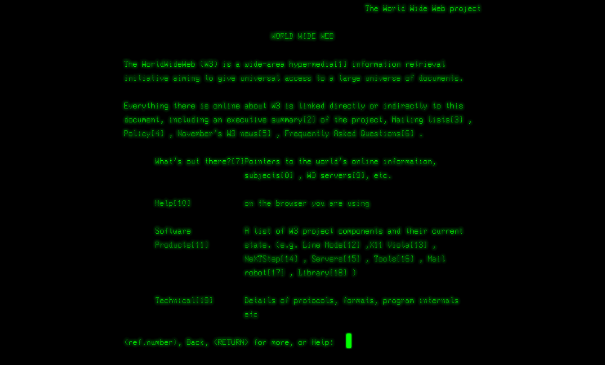
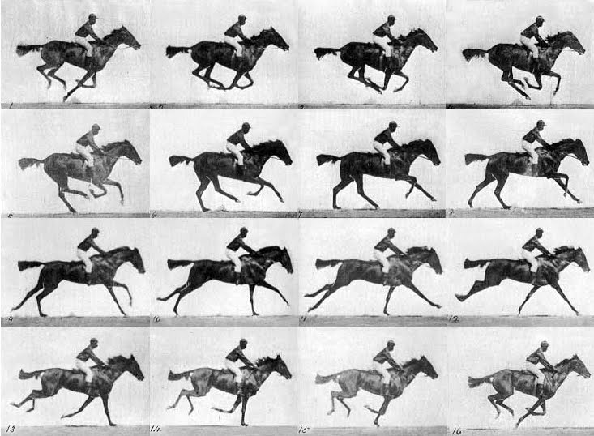
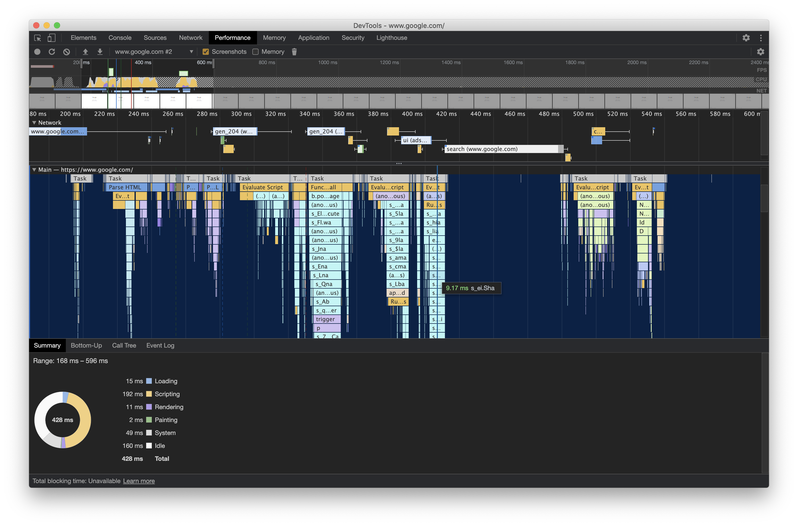

When you think about websites, think about _trees_.

The **Document Object Model** is a tree your browser produces to represent the UI of a website.

Every browser provides a JavaScript api for DOM operations. These are called _mutations_.

> DOM mutations are costly and occasionally inconsistent across browsers. Furthermore, its imperative api produces perplexed code, which is difficult to scale.

That's why there is a need for UI libraries like React, Angular and Vue.js. These modern JS technologies provide solutions to write declarative code that looks and behaves like plain HTML, by managing DOM mutations in the background.

Dealing with the DOM has troubled me a lot in the beginning of my career. I hope this article will help you understand these complicated parts. You can also use it as a refresher before joining a technical interview.

🤵🏼‍♂️ Challenge accepted? Ok, here we go...

## DOM Basics


_The birth of the Web. This was the first website ever created. (Source: [CERN](https://home.cern/science/computing/birth-web))_

> The Document Object Model represents a web page, which is currently loaded in a browser window.

In other words when you visit a website, your browser constructs a large JavaScript structure, which represents the contents of a website.

The DOM has a form of a family tree, with `parent`, `children` and `sibling` nodes.

```bash
article
|-- p
`-- ul
    |-- li
    |   `-- "text"
    `-- li
```

A node can be an HTML `element`, plain `text`, `attribute` and pretty much everything you will find in your markup.


_You can navigate to the available options using the browser console. Give it a try on this website! Right click on some text and select Inspect Element._

DOM is available _only_ on web browsers. For example, in Node.js you will not even find the object `window`, the outer container of the DOM. That's why testing environments mobilize libraries that simulate DOM.

In addition to the DOM, the browser `window` object provides access to the following:

- CSSOM, which as you guessed it represents the CSS styles and stylesheets that are attached to a website.
- BOM, which hosts various helpful apis your browser provides, such us `navigator`, `location`, `history`, `XMLHttpRequest`, and the (in)famous `alert()` function.

### What's wrong with the api?

Ah that's a good one, interacting with DOM elements can sometimes hurt your brain cells.

Writing code that performs low-level DOM manipulations is like opening the Pandora's box. Operations that are simple and repetitive, take a lot of code to be implemented.

Your junior colleagues are starting hating you, your senior colleagues are starting yelling at you, your codebase is becoming more complex than your favorite Italian pasta, changes are taking more time than your promotion, debugging is as painful as the loneliness of Britney Spears, and the fact you can't reason about your code makes you lose your sleep.

Let's see how we can interact with DOM elements.

Consider the following HTML somewhere in `<body>`:

```html
<nav>
  <ul id="navigationList">
    <li>
      <a href="/">Home</a>
    </li>
    <li>
      <a href="/contact">Contact</a>
    </li>
  </ul>
</nav>
```

Now let's assume we would like to add another list item in the middle because the user has logged in. Here's a way of approaching this task by using the DOM api:

```jsx
// create a li element
const li = document.createElement('li')

// create an anchor element and set its attributes
const anchor = document.createElement('a')
anchor.setAttribute('target', '_blank')
anchor.setAttribute('href', '/settings')
anchor.appendChild(document.createTextNode('User Settings'))

// append the anchor to li
li.appendChild(anchor)

// append the li to our list (DOM mutation)
document.getElementById('my-list').lastElementChild.prepend(li)
```

You can run the example by yourself in [Codepen](https://codepen.io/nicotsou/pen/abpxQYW?editors=1111).

As you can see the api is imperative which makes the developer experience to suffer. It is difficult to read the code and to perform changes.

But there is _another_ major problem with the DOM.

### What about cross-browser compatibility?

Ah yes, browsers used to have different DOM implementations and certain APIs are not available everywhere, especially the newest ones.

The story goes back to the [Browser wars](https://en.wikipedia.org/wiki/Browser_wars). For many years DOM was inadequate. The provided apis were not enough to support the complexity of our web applications. You see, it was never created to support applications in the first place. Web was about delivering content.


_Mosaic was one of the first web browsers. The [Evolution of the Web](http://www.evolutionoftheweb.com/) is a great website to learn about web history._

Many big corporations tried to force their own solutions to make the web interactive, which led to a tremendous confusion for web developers. You see, every api was different. Developing an app for Mozilla would not work for Internet Explorer.

The [W3C](https://www.w3.org/) organization was founded in 1994 to standardize browser behaviors and language features. I have to mention here that Microsoft was not willing to support this alliance for years, making [Internet Explorer](https://en.wikipedia.org/wiki/Internet_Explorer) the most hated software, after [Java applets](https://en.wikipedia.org/wiki/Java_applet) of course.

Although things are getting better nowadays, there are still a few traps. Quite often certain apis become deprecated in favor of newer ones. There are also cases where companies refuse to implement apis, because it gets in their monopoly plans.

Chrome is a good example. Developers have access to a superset of web apis that are not available elsewhere, creating a new wave of Chrome developers. On the other side companies which are more desktop-centric like Apple, detain from supporting those features at first place. They influence developers to write native apps for their platform, using the language and tools provided by them.

But how can you be sure if you are supposed to use an api or not?

To avoid unexpected surprises, you should _always_ consult online references like [MDN](https://developer.mozilla.org/en-US/), or [caniuse](https://caniuse.com/). In this way you can quickly distinguish any incompatibilities.

In most of the cases there is a way to use modern browser features using a [Polyfill](<https://en.wikipedia.org/wiki/Polyfill_(programming)>). These js scripts provide an identical api, making it easier to switch to native.

Using [feature detection](<https://en.wikipedia.org/wiki/Feature_detection_(web_development)>) techniques you can distinguish whether or not to load these extra scripts.

But wait, there is _another_ problem with the DOM.

### What about performance?

Ah I almost forgot, DOM operations can be really slow.

I'm pretty sure you ran into websites with sluggy animations that destroyed the smoothness of your user experience. Compare a gif animation to a Netflix series and you'll get what I'm trying to explain here.

<!-- prettier-ignore-start -->

*[The Horse In Motion](https://en.wikipedia.org/wiki/The_Horse_in_Motion) was the first move ever created and here you can see all of its frames.*
<!-- prettier-ignore-end -->

An animation is performant enough when it reaches at least [60 frames per second](https://developer.mozilla.org/en-US/docs/Web/Performance/Animation_performance_and_frame_rate). That's because a common monitor has usually a refresh rate of 60Hz[^In Europe the common refresh rate is 50Hz. There are devices in the market nowadays (like the iPad Pro) which have 120Hz or even more.].

But how can we reach those 60fps? To answer this question we will have to understand how browsers are rendering a website. How they translate an HTML script to actual pixels on your monitor.

Here's where the interesting part begins.

To render a _single frame_, your browser follows the steps below:

1. 👓 Parsing: Everything starts with a `GET` request to the server. The server responds back, by sending the HTML, which is then being parsed to produce the DOM and CSSOM trees.
2. 🧮 Style Recalculation: By combining those two trees, your browser produces the `Rendering Tree`. This is quite similar to the DOM, but it includes _only_ what it will be rendered on screen, at this specific frame.
3. 📐 Reflow: It then builds the `Layout`, by converting those elements in box containers and calculating how much space they take on screen. Elements can affect others, for example the width of the `body` element often affects the width of its children, and so on.
4. 🖌 Paint: Then for any of these boxes, it renders vectors and then it rasterizes them to create a pixel-friendly view.
5. 🏞 If there are images, they need to be decoded according to their format and then resized.
6. 🎼 Composition: Sometimes a website has different layers that are simultaneously evaluated (For example you may have a fixed `<div>` element). To optimize the performance, these layers are being transferred to the GPU.

Now, as we change the DOM (for example hiding an element, or setting a new background image), the browser follows most of the steps above, for every single frame. And sometimes it drops frames to ensure the app will remain responsive.

Modern browsers include Profiling tools to help you identify performance related issues.


_To understand the performance of your application and how it's affected by your changes, you can use the profiling tools._

Keeping a web application responsive at any given moment, and especially performing a fast initial load, is critical for reaching an acceptable user experience.

Ok that was it. Now you know why technologies like React exist. Now let's see how Virtual DOM fixes those issues.

## And the fun starts

Well, now you know.

That's why there is a need for UI libraries like React, Angular and Vue.js. These modern JS technologies provide solutions to write declarative code that looks and behaves like plain HTML, by managing DOM mutations in the background.

For example, React utilizes plain `render()` functions that describe how the UI looks like, at any given _state_. When the state changes, the function will be revoked and its associated UI will be re-rendered.

To automate this process, React keeps a clone of the DOM in memory. They call it **Virtual DOM**. It's way smaller than the actual DOM.

React performs DOM mutations in memory, as an intermediate step. Then, it frequently updates the real DOM _only_ in the parts that have actually changed.

To ensure this is performant enough (60fps), a pretty sophisticated "diffing" algorithm is used. The DOM updates are also being batched, to avoid expensive page _repaints_, which are forcing the browser to re-evaluate the styles of the page for every single frame.

Virtual DOM makes React extremely performant, while providing an incredible developer experience.

This is not a React exclusive feature. [Vue.js](https://vuejs.org/v2/guide/reactivity.html) and [Ember.js](https://emberjs.com/) have their own implementations.

Angular on the other side introduced a concept called [Incremental DOM.](http://google.github.io/incremental-dom/#:~:text=Incremental%20DOM%20is%20a%20library,HTMLElement%20s%20and%20Text%20nodes.) Compared to Virtual DOM, it has a low memory footprint and it is [tree-shakeable](https://en.wikipedia.org/wiki/Tree_shaking). This makes it ideal for mobile application development. Although it's considered slower, it can outperform the Virtual DOM at certain cases.

## That's all folks

We reviewed how DOM works under the hood and we explained why mutations are making a web application slow. Then we discovered how React handles DOM mutations with Virtual DOM.

As a JavaScript developer who cares about your craft, you should be familiar with those topics. Learn the DOM api. Stop using your favorite framework or library for a while and focus to build an app with plain vanilla JS. This experiment will make you more confident using those tools.

🏅 Achievement unlocked.

Cover Credit: [@matthew_t_rader](https://unsplash.com/photos/567UmWZIYJ8)
