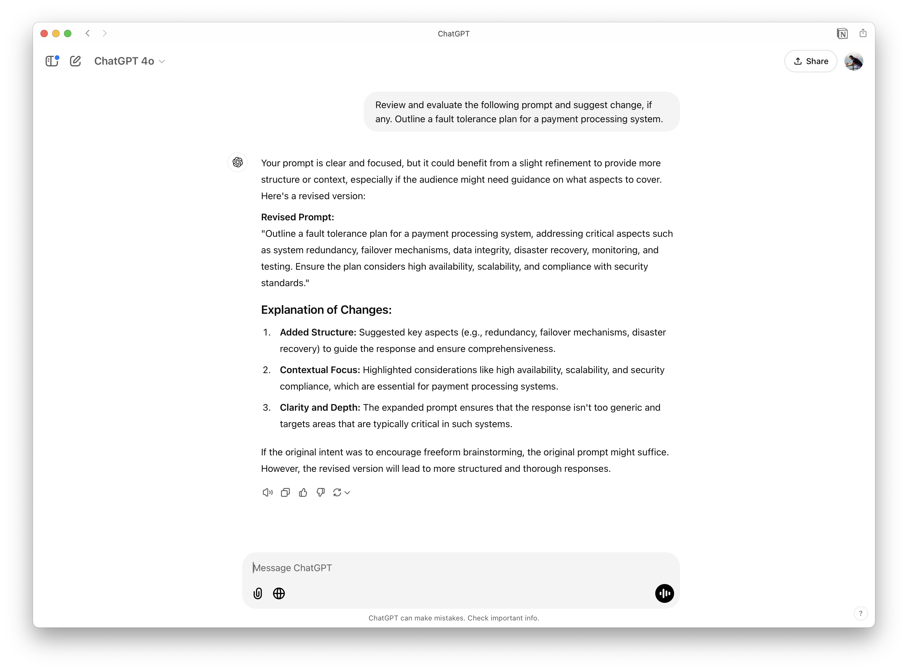

I was looking forward to post these prompt engineering tips bellow. Whether you're a developer, content creator, or just someone curious about AI, this article will give you five simple ideas that will vastly improve the way you interact with AI models, and save you some bucks.

These insights come from extensive experimentation and real-world applications. They aren't just theory — they're proven techniques that will make your AI interactions more efficient, accurate, and productive.

Camera? Lights? Let’s go! 🎬

## Tip #1 — **Allow the model to _fail_.** 🤷‍♀️

The fundamental principle of giving AI models permission to acknowledge their limitations. The "license to kill" — Ahm, I'm sorry, I mean… the "license to say I don't know" — is one of your weapons against hallucinations.

By explicitly allowing the model to admit when it doesn't know something or is uncertain, we create a more reliable and trustworthy interaction. This approach not only reduces the likelihood of incorrect responses but also helps establish a more honest dialogue between user and AI.

<aside>

**Prompt:** Please answer the following question as accurately as possible. If you don't know the answer or if the information is uncertain, **_it's okay to say, “I don't know.”_**.

<info>{INPUT DATA}</info>

<question>{QUESTION}</question>

</aside>

This approach helps create a more natural interaction where the AI can be upfront about its limitations.

## Tip #2 — **Use _leading_ words.** 🚏

Leading words are specific terms or phrases that guide the AI model's response in a particular direction. They act as signposts, helping to frame the context and shape the output in the desired way.

When strategically placing an incomplete sentence or structural element at the end of your prompts, these leading words serve as powerful directional cues that naturally guide the model toward completing the thought in a specific way. This method works by using the AI's natural tendency to complete thoughts in a logical way. When you leave an unfinished thought or pattern, the AI will try to complete it in a way that makes sense.

I mean, if we oversimplify it, at its core, Generative AI is essentially a sophisticated text prediction algorithm, right?

Here’s an example:

<aside>

**Prompt:** Generate an SQL query that retrieves the names and ages of users over 18 from the 'users' table.

**_SELECT name, age_**

</aside>

By providing `SELECT name, age` as a leading phrase, we're essentially giving the model a clear starting point. The AI will naturally continue with the `FROM` clause and `WHERE` conditions to complete a valid SQL query. This technique works particularly well for structured outputs like code, queries, or any format with a well-defined syntax.

The beauty of using leading words is that they subtly guide the AI without being overly prescriptive, allowing for both accuracy and flexibility in the response.

## Tip #3 — **Ask the model to evaluate a prompt and suggest changes 👩‍💻**

We spend time crafting the perfect prompt to properly instruct the AI. But what if we ask the AI itself to help us perfect our prompts?

When a colleague mentioned trying this technique and getting the results we wanted, I was eager to try it myself. I've been amazed by how effectively this works. I shouldn’t be surprised. The truth is, AI knows how to talk to… AI.


_Asking the AI to improve my prompt._

By asking the model to analyze and suggest improvements to your prompts, you can leverage its deep understanding of effective prompt structures and patterns. The model can help refine your prompt's structure and relevance, fix language issues like typos and grammar, and identify potential edge cases you might have overlooked.

This collaborative approach between human and AI can lead to more precise, efficient, and effective prompts that better achieve your desired outcomes.

## Tip #4 — **Use a mix of _hard_ and _soft_ prompts 🍬**

There are two main types of prompts you can use when talking to AI: hard ones and soft ones.

**Hard prompts** give clear, specific instructions that help you get exact answers. They will work great when you need precise information or are working with technical stuff.

**Soft prompts**, on the other hand, give the AI more room to think creatively and suggest different solutions. They're useful when you want the AI to explore options or think outside the box.

Combining both hard and soft prompts creates a powerful synergy in your interactions with AI. You can be precise when needed while still letting the AI suggest new and interesting solutions.

First, provide a hard prompt outlining the specific steps, inputs, desired output, and performance constraints

<aside>

**Hard Prompt:** Design a rate limiter algorithm for a RESTful API with a limit of 100 requests per minute per user. Consider tracking request count, managing expiration, and enforcing the limit.

</aside>

<details>
<summary>Produced code</summary>

```python
from time import time
from collections import defaultdict

class RateLimiter:
    def __init__(self):
        self.buckets = defaultdict(lambda: {"tokens": 100, "last_refill_time": time()})
        self.max_tokens = 100
        self.refill_rate = 100 / 60  # tokens per second

    def is_allowed(self, user_id):
        now = time()
        bucket = self.buckets[user_id]

        # Refill tokens
        elapsed_time = now - bucket["last_refill_time"]
        refill_tokens = elapsed_time * self.refill_rate
        bucket["tokens"] = min(self.max_tokens, bucket["tokens"] + refill_tokens)
        bucket["last_refill_time"] = now

        # Check if a token is available
        if bucket["tokens"] >= 1:
            bucket["tokens"] -= 1
            return True, bucket["tokens"]
        else:
            return False, bucket["tokens"]

# Example Usage
rate_limiter = RateLimiter()

def api_request(user_id):
    allowed, remaining_tokens = rate_limiter.is_allowed(user_id)
    if allowed:
        return {"status": 200, "message": "Request allowed", "remaining_tokens": remaining_tokens}
    else:
        return {"status": 429, "message": "Too Many Requests", "remaining_tokens": remaining_tokens}

# Simulate API requests
print(api_request("user_1"))
print(api_request("user_1"))
```

</details>

Once the initial solution is developed, you could offer a soft prompt encouraging LLM to consider potential improvements, optimizations, or alternative approaches.

<aside>

**Soft Prompt:** What are some creative ways to optimize or enhance the rate limiter algorithm to handle edge cases or scale with increased traffic?

</aside>

<details>
<summary>AI Recommendations</summary>
  Here are the recommendations made earlier for improving the rate limiter implementation:

1. **Optimize Data Storage**
   - Use Bloom filters for preliminary checks.
   - Employ sharded storage for distributed caching.
2. **Enhance Token Refill Strategy**
   - Implement lazy refills to avoid unnecessary computations.
   - Use sliding window rate limiting to smooth out request spikes.
3. **Handle Edge Cases**
   - Combine token bucket with leaky bucket for burst handling.
   - Include a `Retry-After` header in responses.
   - Adapt to user behavior dynamically for fair limits.
4. **Enhance Scalability**
   - Introduce hierarchical rate limiting (user, IP, API key levels).
   - Offload rate limiting to an edge service (e.g., CDN or API gateway).
   - Prefetch user buckets to reduce latency during peak usage.
5. **Support Multi-Tenancy**
   - Enable dynamic rate limits based on user tiers (e.g., free vs. premium users).
   - Differentiate between global and local rate limits for better efficiency.
6. **Optimize Distributed Systems**
   - Use Redis Lua scripts for atomic token updates.
   - Preallocate tokens across distributed nodes.
   - Accept eventual consistency for slight discrepancies in distributed setups.
7. **Real-Time Monitoring and Adjustments**
   - Implement adaptive limits based on system health metrics.
   - Log request details for analysis and anomaly detection.
8. **User-Friendly Enhancements**
   - Provide a quota display API for users to check their limits.
   - Allow grace periods for minor over-limit violations.
   - Escalate penalties for repeated violations (e.g., temporary blocks).
9. **Leverage Machine Learning**
   - Use predictive rate limiting to anticipate traffic patterns.
   - Detect abuse or anomalies with AI-powered fraud detection.
10. **Fail-Safe Mechanisms**
    - Use fallback policies to allow limited requests during backend failures.
    - Prioritize critical users to ensure system availability during high traffic.

</details>

Finally, once we get a clear list of enhancements, we ask the AI to refactor the previous example:

<aside>

**Hard Prompt:** Refactor the code above, by applying these recommendations

</aside>

<details>
<summary>Revised code</summary>

```python
from time import time
import redis
import math
from flask import Flask, request, jsonify

app = Flask(__name__)

# Initialize Redis connection
redis_client = redis.StrictRedis(host="localhost", port=6379, db=0)

# Constants
MAX_TOKENS = 100
REFILL_RATE = 100 / 60  # tokens per second

def get_current_bucket(user_id):
    """Fetch or initialize a user's bucket."""
    bucket = redis_client.hgetall(user_id)
    if not bucket:
        # Initialize a new bucket with full tokens
        redis_client.hmset(user_id, {"tokens": MAX_TOKENS, "last_refill_time": time()})
        redis_client.expire(user_id, 3600)  # Expire bucket after 1 hour of inactivity
        return {"tokens": MAX_TOKENS, "last_refill_time": time()}
    return {k.decode(): float(v) for k, v in bucket.items()}

def save_bucket(user_id, bucket):
    """Save the updated bucket state."""
    redis_client.hmset(user_id, {
        "tokens": bucket["tokens"],
        "last_refill_time": bucket["last_refill_time"]
    })
    redis_client.expire(user_id, 3600)  # Extend TTL on activity

def refill_tokens(bucket):
    """Refill tokens based on elapsed time."""
    now = time()
    elapsed_time = now - bucket["last_refill_time"]
    new_tokens = elapsed_time * REFILL_RATE
    bucket["tokens"] = min(MAX_TOKENS, bucket["tokens"] + new_tokens)
    bucket["last_refill_time"] = now
    return bucket

def is_request_allowed(user_id):
    """Check if a user request is allowed."""
    bucket = get_current_bucket(user_id)
    bucket = refill_tokens(bucket)

    if bucket["tokens"] >= 1:
        bucket["tokens"] -= 1
        save_bucket(user_id, bucket)
        return True, bucket["tokens"], None
    else:
        retry_after = math.ceil((1 - bucket["tokens"]) / REFILL_RATE)
        return False, bucket["tokens"], retry_after

@app.route("/api/resource", methods=["GET"])
def api_resource():
    user_id = request.headers.get("X-User-ID")  # Simulate user identification
    if not user_id:
        return jsonify({"status": 400, "message": "User ID missing"}), 400

    allowed, remaining_tokens, retry_after = is_request_allowed(user_id)
    if allowed:
        return jsonify({
            "status": 200,
            "message": "Request allowed",
            "remaining_tokens": remaining_tokens,
            "limit": MAX_TOKENS,
            "reset_in": 60  # Fixed time window for simplicity
        }), 200
    else:
        headers = {
            "X-RateLimit-Limit": MAX_TOKENS,
            "X-RateLimit-Remaining": remaining_tokens,
            "Retry-After": retry_after
        }
        return jsonify({
            "status": 429,
            "message": "Too Many Requests",
            "retry_after": retry_after
        }), 429, headers

if __name__ == "__main__":
    app.run(debug=True)

```

</details>

This enhanced version of the rate limiter showcases several key improvements over the original implementation. It utilizes Redis for distributed caching, implements proper HTTP status codes and headers, and includes user-friendly features like remaining token counts and retry-after intervals. The code structure is also more modular and maintainable, making it easier to extend with additional features in the future.

I know this may not be the most production-ready code out there, but I want to remind you that we only asked 3 simple questions.

## Tip #5 — Always keep the _dynamic_ part of a prompt at the end 💾

When crafting prompts, it's highly beneficial to structure them with static, repetitive content positioned at the beginning, followed by the dynamic, variable content at the end. This strategic arrangement takes advantage of [prompt](https://platform.openai.com/docs/guides/prompt-caching) [caching](https://www.anthropic.com/news/prompt-caching) mechanisms, which can significantly improve response times and efficiency.

The caching system is particularly effective for longer prompts, specifically those that exceed 1024 tokens in length, where the system automatically implements caching functionality to optimize performance.

The following image from [OpenAI’s official documentation](https://platform.openai.com/docs/guides/prompt-caching) explains the concept in detail:


_Source: OpenAI Documentation_

The API request process follows a systematic caching mechanism. When a request is initiated, the system first performs a Cache Lookup to determine if the initial portion (prefix) of your prompt exists in the cache. In the event of a Cache Hit, the system utilizes the cached result, which leads to decreased latency and reduced costs. Conversely, during a Cache Miss scenario, the system processes your complete prompt, and subsequently caches the prefix of your prompt to optimize future requests.

This technique not only increases the performance of your LLM interactions but can also provide up to 80% cost reduction.

---

## That’s all folks! 🙌

Thanks for reading! Stay tuned for more content about prompt engineering! I'll be sharing advanced techniques, real-world examples, and practical strategies to help you master the art of communicating with AI. MMy newsletter form is just a few DOM elements below. Don't forget to subscribe to get notified when new articles are published.

Do you have any other tips for crafting better prompts? I'd love to hear your thoughts and experiences.
