What makes Swiss transportation so good? Why is driving in Switzerland so boring? How does the Swiss army land aircrafts?

Let's discover some of the funniest facts about Switzerland, mixed with my personal experiences and tips. Normally, I write technical articles about software engineering on this blog. This time, I'm going to try something completely different.

But first, we need a proper introduction.

Cookie? 🍪

---

For the last 4 years, I live and work in Zurich. I have had so many nice experiences in this country. The nature, the people, the places, the life quality and the list goes on. I was originally born in Thessaloniki. This is the first time I live abroad. In fact, I haven't even visited Switzerland before moving. It was a completely new experience for me.

Many people are asking me about the life here. Is it worth it? I am usually trying to avoid all these questions, since it's a very personal decision at the end, whether a place is good or not for you. This is not what I'm trying to achieve with this article.

This article contains fun facts about Switzerland. Things I found interesting and unusual. I tried to stay away from stereotypes, although it's not always the easiest thing when you write an article with this topic.

The idea for this post came from my recent participation in the [Zed Conference](https://community-z.com/events/zed-compass). We worked with my colleague [Laszlo Markert](https://fcvbz.ch/fc/?lang=en) to make a very funny [presentation](https://community-z.com/events/zed-compass/talks/14399) about Living and Working in Switzerland. This was a good opportunity for me to put together some words and create this post. Many thanks to Laszlo and his wife for their contribution.

While I was writing this post, I discovered that I have too much to write. I started splitting them on multiple posts. I thought it would be easier for me to write and for you to read. This is the first part of the series. I will try to post a new one every week.

OK let's leave these disclaimers aside. It's time for the actual facts. Let's start with the most obvious. Nature.

---

Switzerland has over 48 mountains and 7000 lakes. It has plenty of activities for everyone. It really feels that you don't have the time to visit and do everything.

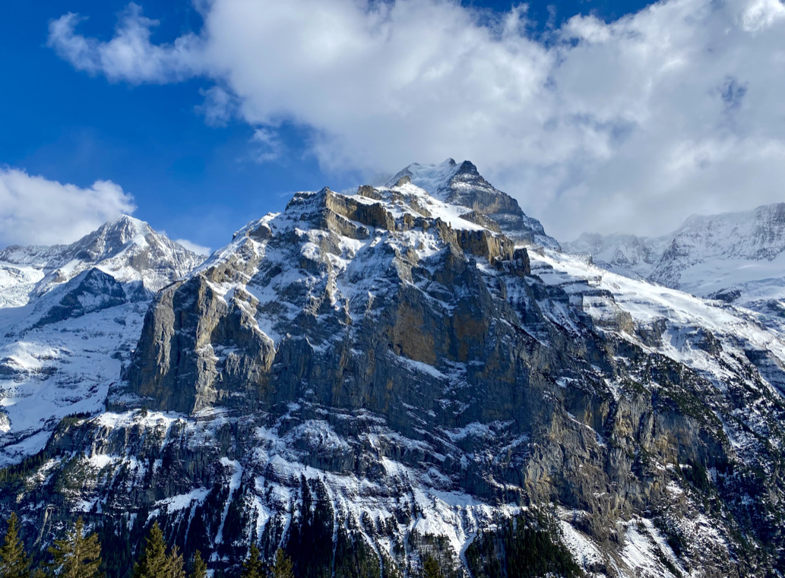

Growing up in Greece, I was convinced there was no other place as beautiful. Switzerland changed my mind. In the winter, the snow covers the tops of the mountains, which blend magnetically in the lake waters. In the summer, the whole country is transformed into an endless green land.

While you're enjoying your trekking on a mountain, it is very likely to meet a cow. You can hear them far away from their ringing bells they carry. You will also sense the smell.

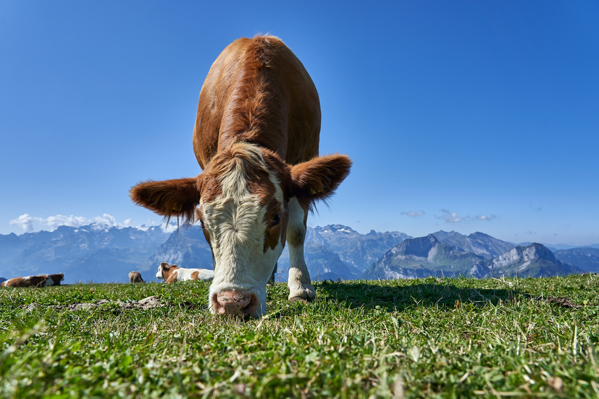
_Credit: [Wolfgang Hasselmann](https://unsplash.com/photos/aj4wPhXF3hA)_

Especially if you live in a village, it will be difficult to stay with the windows open while it is summer. This can also be a practical way for you to quit smoking.

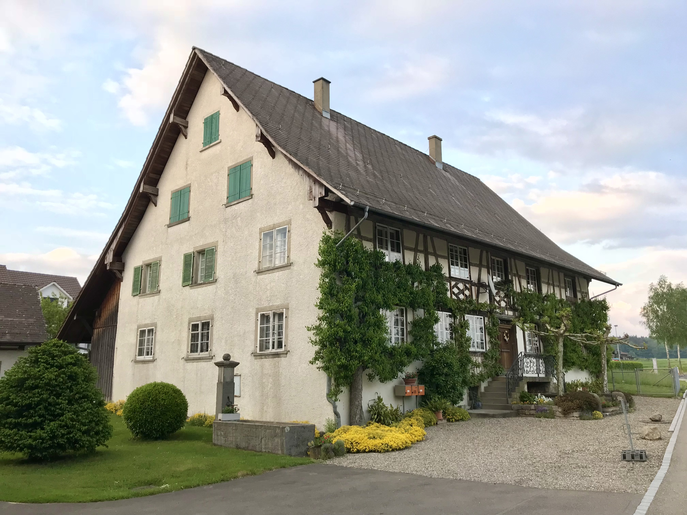

I mean seriously, take a look at this house. It's like a dream!

My previous apartment had a very important feature. A device that circulates the air, without having to keep your windows open. My landlord advertised this feature a lot when I was viewing his apartment. Back then, I couldn't understand the reason. You see, in Greece without an air conditioner, you will most probably be paralyzed every summer. My mind changed when I discovered the smell. Since then, I am very grateful for this masterpiece of machinery.

But enough with this cr@p. It's time to talk about something more adventurous.

---

To say that the Swiss transportation system is great, would be an understatement. It's so good that people who grew up here don't really understand how good it is.

You can conveniently go anywhere. To the most infamous village. To the tallest mountain and beyond. It's just possible. In many places around the world, this is unheard of.

But where the Swiss transportation system _really_ shines is not the flexibility, it's the punctuality.

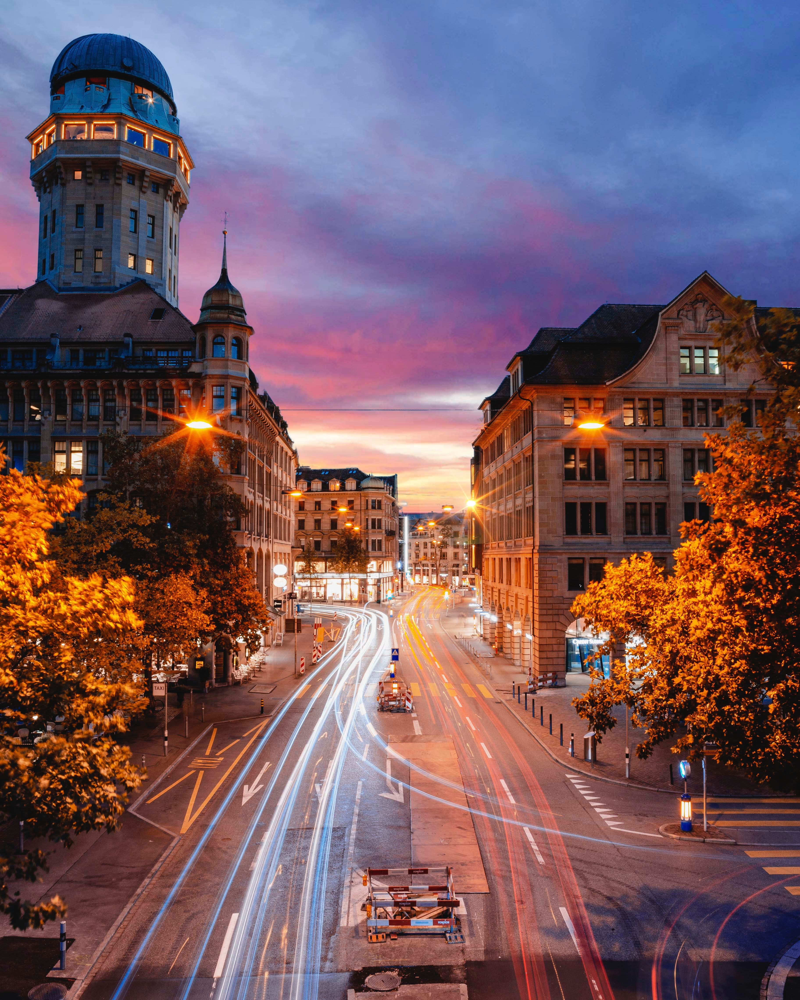
_Credit: [Eric Weber](https://unsplash.com/photos/_wB88hxsW8M)_

Imagine a world in which every bus, every tram, every train arrives on time. You can conveniently know the exact time you will arrive in your destination. Google Maps departure estimates simply make sense.

To put this in the appropriate context for everyone to understand, in the Zurich central station, if the train has a 30 second delay, everybody is in a panic. They are checking their watches. They are moving nervously. They are under stress.

And the best part of it is we already know when there is a delay. The digital signage software is one of the best in the market. The official application also provides useful information about every possible inconvenience.

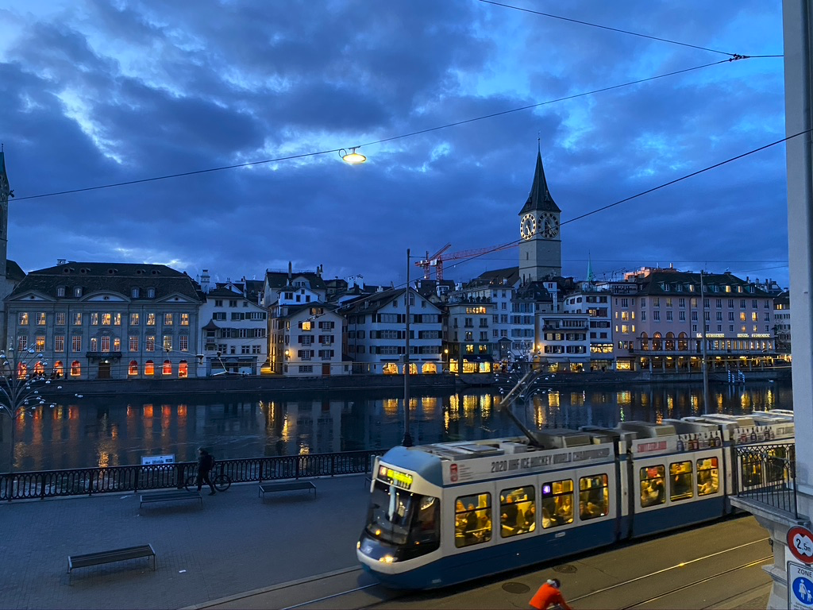

Of course, nothing comes for free. And I'm not talking about the cost of the tickets here. Although, now that I'm thinking, I really should, because they are extremely expensive. But that's another topic for another time. I'm taking about the side-effects of having everything running on time.

> In Zurich, tram and bus drivers can control the traffic lights. They simply stop all the cars.

What I hate the most is when you realize that your tram is on the other side of the road. You wait for the appropriate moment to cross the street and then you run a marathon to catch it. And right at the moment that you reach its doors, the doors shut in front of you. Now you have to wait for another 15 minutes.

There were cases where the bus stayed there, with the doors closed, for 1-2 minutes, even if there was a red light in front of it. The driver will completely ignore the people there are yelling and knocking on the doors.

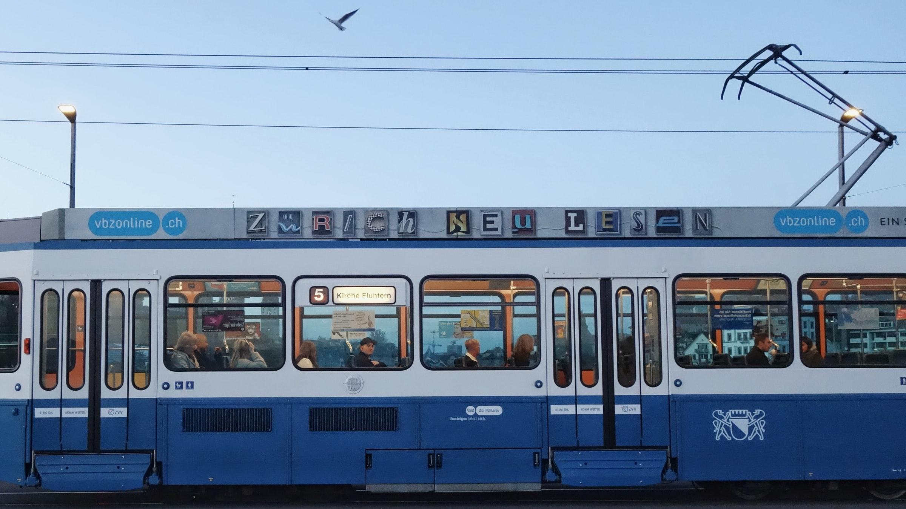
_Credit: [Alexis Fauvet](https://unsplash.com/photos/g9iXQKjPlGM)_

But what's their problem, you may ask? Well, as it turns out, the drivers are stressed about being on time. If they are delayed, the system will be notified and this will have a negative impact on their performance. Which may give their manager a reason to write a negative review. At least that's what they think.

If you visit Switzerland, make sure to get a ticket for your dog or your bike.

What did you say? You are arriving by car? Well, keep reading. The next section is dedicated to you.

---

Driving in Switzerland can be boring.

You see, most people are driving ridiculously expensive super cars. And yet, the speed limits are some of the lowest you will find in Europe.

On top of that, you have sneaky cameras everywhere. The police are actually moving them to catch you by surprise. And they are working pretty well. In Switzerland, most drivers respect the speed limits. Because they don't have another option. The law is [very strict](https://www.ch.ch/en/driving-over-speed-limit/).

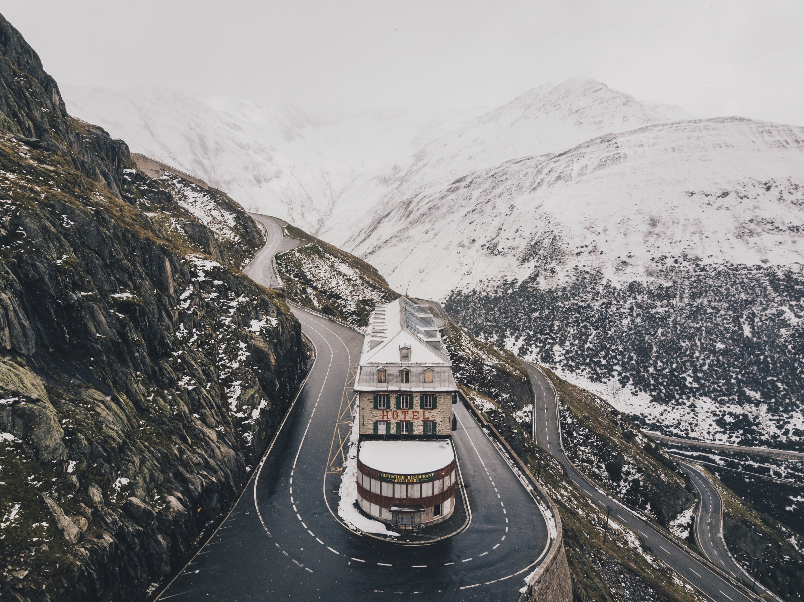
_Credit: [Nigel Tadyanehondo](https://unsplash.com/photos/d30E78EkCIE)_

To some extent, I believe the police intentionally set the speed limits that low, in order to collect more money. Otherwise, I'm not sure why there is a limit of 80 km/h (50 mph) on certain highways. In comparison with other countries, Switzerland has the best roads in terms of construction. On top of that, our neighbors in Germany have highways with no speed limits. And in Italy on the other side, the speed limits are just for decoration.

OK, you didn't read this from me. Speed limits are actually helping us. Switzerland is one of the safest countries to drive worldwide.

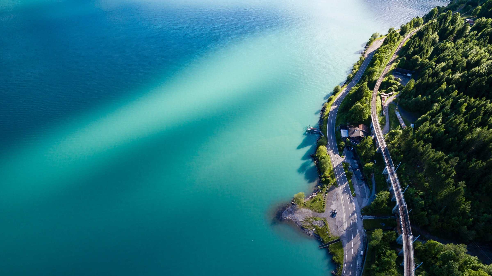
_Credit: [Andreas Gücklhorn](https://unsplash.com/photos/X3420VR5T9w)_

On another note, I have observed that people have the tendency to lease their cars, instead of purchasing them. Nobody wants to maintain the running costs of having a car. As a trend, there are a lot of people who don't even keep a car in their garage. Why do you need a car if you can just get the train to go anywhere you want?

Interestingly, other people prefer to use services like Mobility. You locate one of their cars using their app, you enter with your Swiss transportation card, and you basically rent the car for a couple of hours. Once you finish, you can return it to its original location. You may consider this as an option if you don't use your car on a daily basis.

I have also observed green buildings, that prevent car owners for renting apartments.

We are approaching the end of this first part of our Swiss special. Before I let you go, there is one more story I would like to share with you. It is somehow related to the transportation topic.

---

Flight 702 departs from Addis Ababa Bole International Airport in Addis Ababa, Ethiopia, at 00:30 EAT on 17 February 2014. During the flight, the aircraft's transponder begins to emit squawk 7500 — the international code for an aircraft hijacking — while flying north over Sudan.

When the pilot exited the cockpit to use the restroom, the co-pilot locked the cockpit door and continued to fly the aircraft.

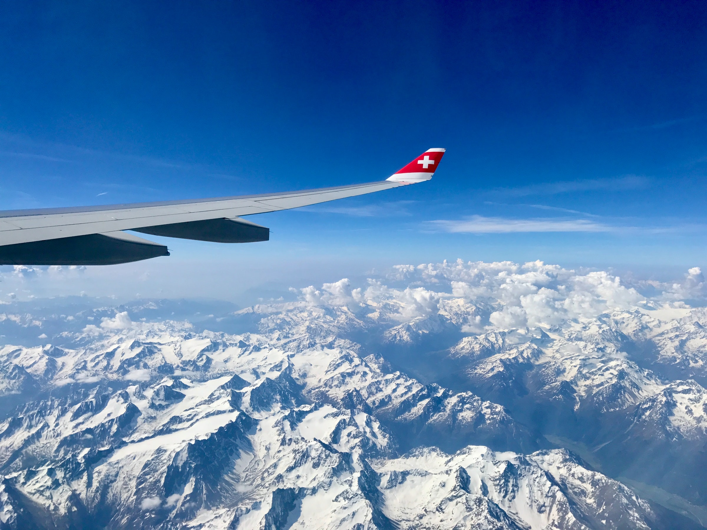
_Credit: [Devam Jhabak](https://unsplash.com/photos/OcFOfR8QI4g). Please note that Swiss Air has nothing to do with this story._

The flight was originally scheduled to arrive at Leonardo da Vinci–Fiumicino Airport in Rome, Italy, at 04:40 CET, before continuing to Malpensa Airport in Milan, Italy. Instead, the aircraft was flown to Geneva, Switzerland.

The co-pilot makes several circles while communicating with air traffic control at Geneva International Airport. He is trying to negotiate political asylum for himself and an assurance that he would not be extradited to Ethiopia.

At 06:02 CET, the airplane lands at Geneva International Airport with about 10 minutes of fuel remaining. One of its engines had suffered a flameout.

The co-pilot exits the aircraft by scaling down a rope that he throws out of the cockpit window, before walking over to police. He surrendered after identifying himself as the hijacker, and was taken into custody. The airport was briefly shut down during the incident. No passengers or crew were injured.

Now you will ask, how do all these relate to our topic? Keep reading, now the good part starts.

While flying through their respective airspaces, the flight was escorted by Italian Eurofighter and French Mirage fighter jets. The Swiss Air Force did not respond because the incident occurred outside normal office hours, which are 08:00–12:00 and 13:30–17:00 Monday to Friday.

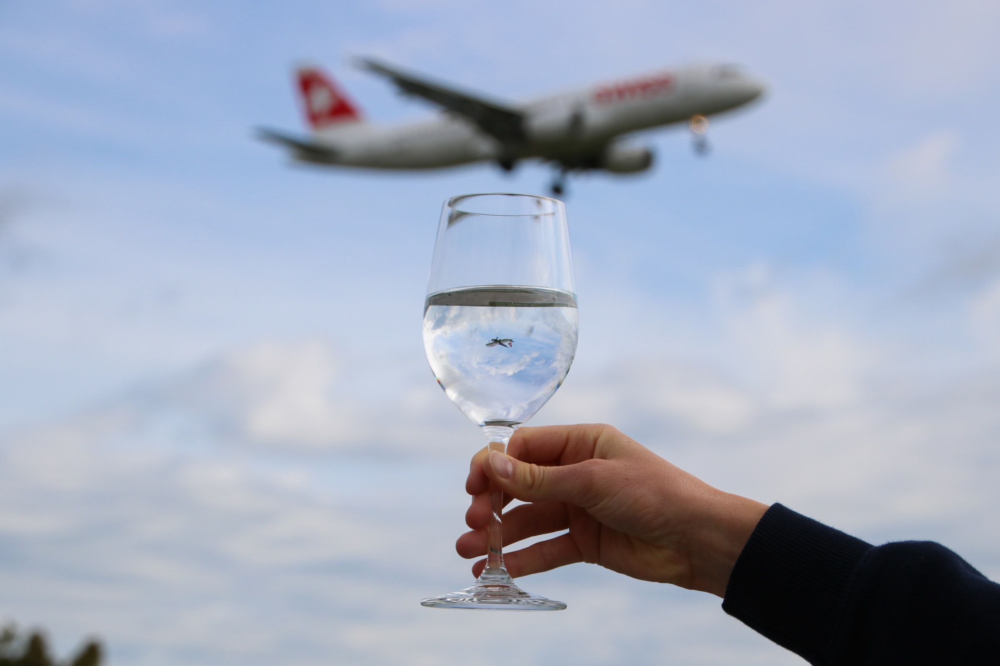
_Credit: [Ellen Jenni](https://unsplash.com/photos/WkuEX4soRRQ)_

A Swiss Air Force spokesman stated: "Switzerland cannot intervene because its airbases are closed at night and on the weekend. It's a question of budget and staffing." Switzerland relies on neighboring countries to police its airspace outside of regular business hours. The French and Italian Air Forces have permission to escort suspicious flights into Swiss airspace, but do not have authority to shoot down an aircraft over Switzerland.

---

Let me share with you a personal photo. What kind of a personal blog would this be without such a photo, right?

This is me hang gliding above Interlaken.

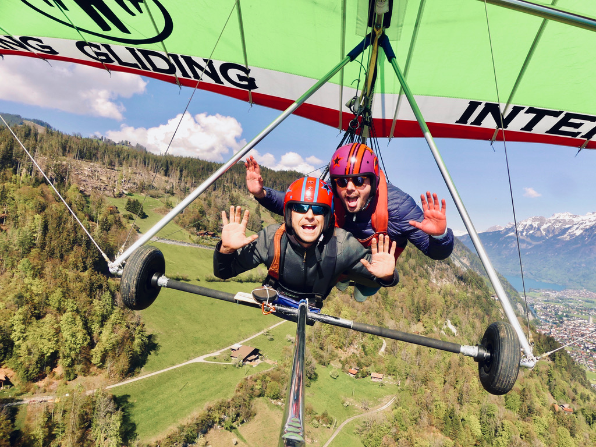

Hang gliding is the closest thing you can get to flying like a bird, and Interlaken is one of the best places in the world to do it!

This is one of the moments you question your friendship with [panos.tech](http://panos.tech). After some days he texted me the following video. Thankfully, he lives far away.

<iframe width="100%" height="360" src="https://www.youtube.com/embed/dLBJA8SlH2w" title="YouTube video player" frameborder="0" allow="accelerometer; autoplay; clipboard-write; encrypted-media; gyroscope; picture-in-picture" allowfullscreen></iframe>

Well, I don't want this to discourage you. It really worths a try.

That's all, folks! I hope you found these facts entertaining as much as we did. I have already started writing the second part.

Uf Wiederluege! 👋

Cover Credit: [Alain Rieder](https://unsplash.com/photos/MpufQjt8b3o)
