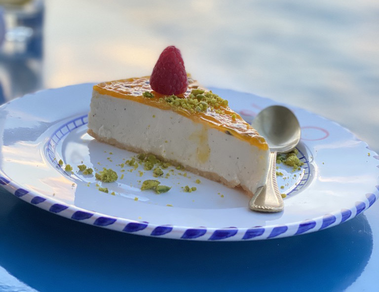
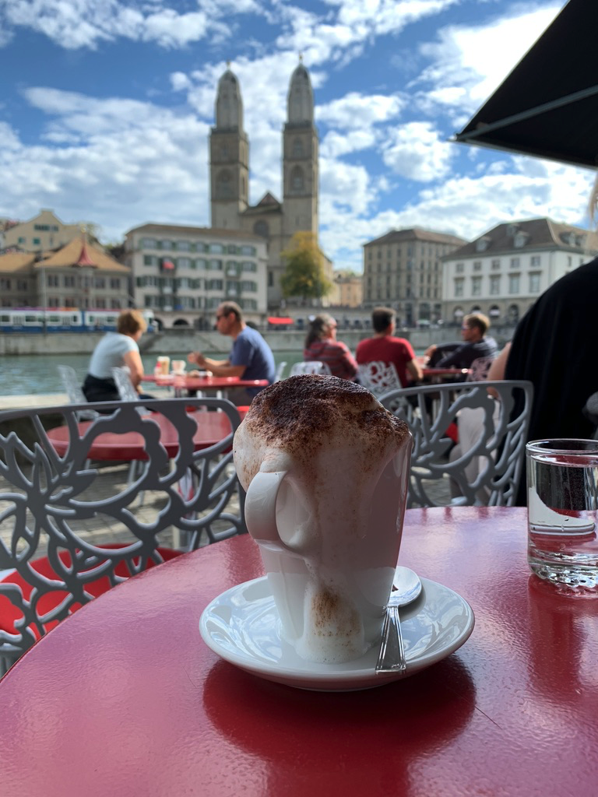
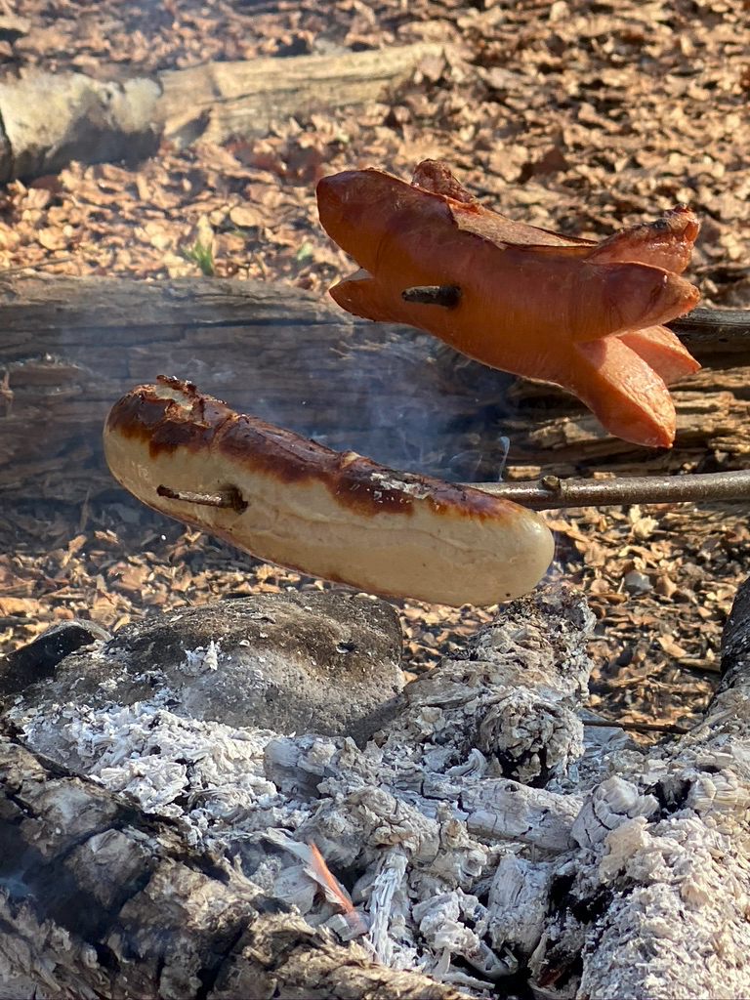
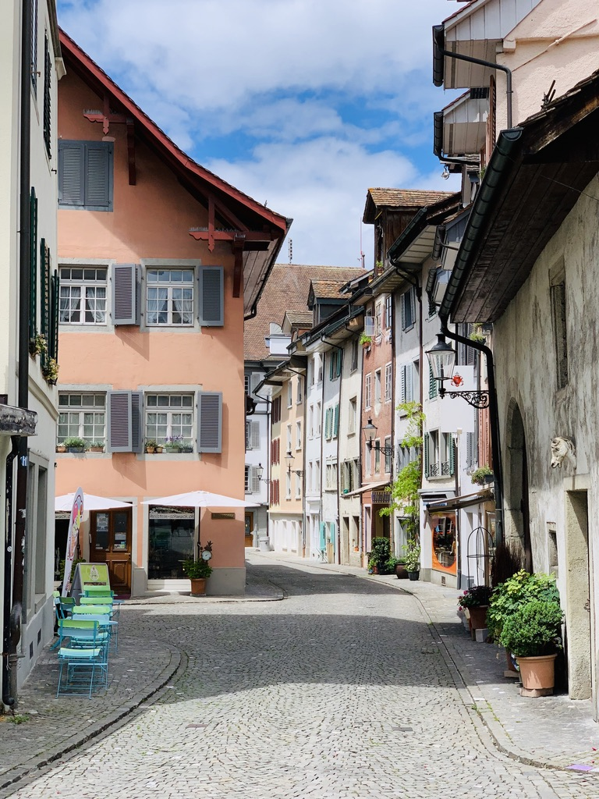
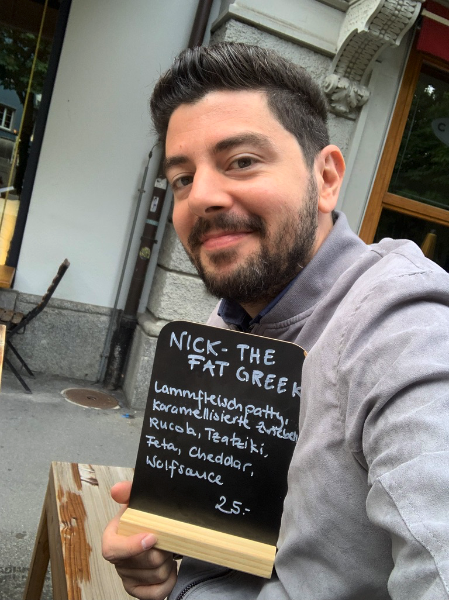

What do we really mean in Switzerland when we talk about hot dogs? Which are the most indistinguishable Swiss meals? How to eat a salad like the Swiss? And what do you need to know in case they invite you for lunch?

Yes, you guessed it right! This will be a food special.

In case you missed [my previous post](/fun-facts-about-switzerland-part-i/), this is the second part with fun facts about Switzerland. It's pretty biased, not sophisticated whatsoever, and I will do my best to not include any stereotypes.

Cookie? 🍪

---

Grüezi wohl! It's finally time for lunch! The best way to socialize with your friends and colleagues. Here I have some tips for you if you ever visit Switzerland. Let's start with the basics.

The most important phrase to remember is "En guete", which literally means "Have a good one". It is similar to "Bon Appétit". You will hear people here use it a lot. They actually expect to hear it from you before they even eat.

Don't worry if you forget it, somebody will remind you to do so. It's one of these moments that you feel like a kid, and your parents are teaching you how to behave.

_The German version of the cheesecake is one of my favorite deserts. You can find plenty of them in multiple variations._

Time to raise your glass? Yeah, I know you will probably try to cheer anyone on the table, but this is not how it works here.

You should greet every person on the table individually, by looking at their eyes. Maintaining a visual with the suspect is really important. Sometimes, when I forget, people are staring at me with a question on their faces. "Why he doesn't even look at me? What is his problem?".

Time to go home? I know it's a bit late. Get your coat ready and prepare for a warm goodbye gesture.

In Switzerland, it is common to give 3 kisses and a hug when you say goodbye. There is also a strict specification on which side to go first, to avoid the awkward moments. Actually no, that's sometimes unavoidable. Thankfully, this is only between friends, so you will not have to kiss your boss.

---

---

What about the food Nick?

Well, since I'm coming from a Mediterranean country, I usually find the food in Switzerland kinda meh. I don't have a problem with the quality, as much as I have with the quantity. The truth is, there are plenty of nice dishes to try.

One of the most traditional Swiss delights is [Fondue](https://en.wikipedia.org/wiki/Fondue) and [Raclette](https://en.wikipedia.org/wiki/Raclette). They are both really tasty. It's one of the best activities you can do with friends. I mean, who needs to ski anyway...

But be careful. They do smell a lot. I haven't been on sports that much in my life, but I can tell you that my socks after a long workout don't even compare to that smell. We always have to come up with a practical solution in order to cover the smell when we're inviting friends home to enjoy some cheese.

My least favorite Swiss desert is called "Gipfeli". It looks a lot like a croissant. But it's not! I think the people who brought the first croissant from Austria forgot to put butter, sugar and make it crispy. It's a terrible disappointment when you are craving something sweet.

Now let's talk about pizza. As a pizza lover, I usually don't trust people who don't like pizza. And Switzerland, has some very nice pizza restaurants. The dough is highly influenced by our Italian neighbors, and yet it's very thin.

The unusual part about the pizza here in Switzerland is when you order in. They never cut the pizza into slices. Apparently, this is a way to preserve the taste. So when you are home, watching the movie with friends and the delivery arrives, everybody takes a break to cut the pizzas. Cutting the pizza with friends is another entertaining activity to do at home.

> In Switzerland, it is allowed to eat your dog. You are not allowed to bring company at home to eat it together.

OK, I know you need some minutes to recover after this fact. Let's talk about the regular hot dog. I promise no more Halloween splatter references.

The Swiss hot dog is called [Bratwurst](https://en.wikipedia.org/wiki/Bratwurst). It's basically a type of German sausage, which is extremely popular here. When you order a Bratwurst, you get separately the sausage, the bread, and the sauce, which is usually mustard. Good luck fitting the sausage in the bread. Despite the fact that you don't have any hands, the bread is much smaller.

But my biggest fight when it comes to food is the salad. I don't know why, but the lettuce pieces, here in Switzerland, are ridiculously large. It's just ludicrous. Don't even think to grab them with your spoon, you will embarrass yourself trying to eat the whole piece at once. You will also decorate the table with the salad dressing.

After some research, I found the approved way to eat a salad. You have to use your fork and knife to fold them into pieces. Here's a video for dummies.

## <iframe width="100%" height="315" src="https://www.youtube.com/embed/lTBq3LwSr-8" title="YouTube video player" frameborder="0" allow="accelerometer; autoplay; clipboard-write; encrypted-media; gyroscope; picture-in-picture" allowfullscreen></iframe>

Having a barbecue is one of our most favorite urban activities. Drinks are allowed in the public. Usually people grill sausages, and they enjoy them with fresh salad and drinks. Beer is our national drink.

> There are open fireplaces in many parts of the city to barbecue with friends. Some of them even provide firewood and dining furniture.

In Switzerland, we celebrate with [Apéros](https://swissandchips.com/swiss-apero/). These are in-betweens, organized on special occasions, celebrations, and team bonding events. Their menus usually involve wine, cold meals, cheese, and crackers.

Due to the fact that I am working in a multinational company, I had the chance to participate in many Apéros and try a variety of cuisines. Every individual brings their national delights to the table.

You want to celebrate for a release? It's time for an Apéro. Your friend got a new job? Time for an Apéro. You have no clue what to do with your life? Well, an Apéro may help here, but it's better to stay away from Alcohol. Just saying...

---

That's all folks. I have to go. Suddenly I am craving Bratwurst. Don't worry, I will not eat my dog.

I have more things to share with you. I am already preparing the third part, with more fascinating facts about Switzerland. So stay tuned. You know where you will find me.

If you are living in Switzerland, don't hesitate to suggest your favorite fun facts. You can [reply to this tweet](https://twitter.com/nicotsou/status/1455967631081619460?s=21).

Adieu 👋

---
