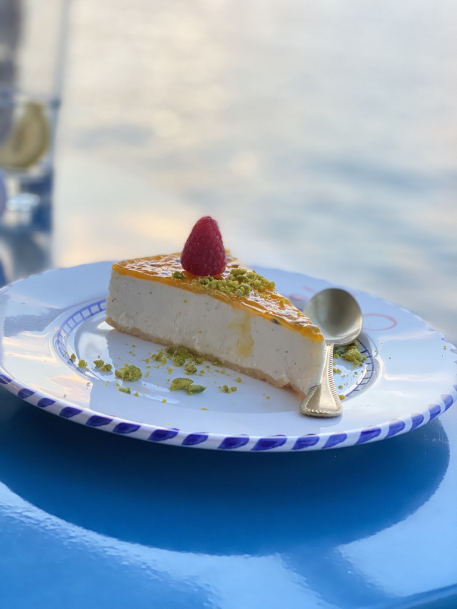

What do we really mean in Switzerland when we talk about hot dogs? Which are the most indistinguishable Swiss meals? How to eat salad as a Swiss? And what do you need to know in case they invite you for lunch?

Yes, you guessed it right! This will be a food special.

In case you missed my previous post, this is the second part with fun facts about Switzerland. It's pretty biased, not sophisticated whatsoever, and I will do my best to not include any stereotypes.

Cookie? 🍪

---

Grüezi wohl! It's finally time for lunch! The best way to socialize with your friends and colleagues. Here I have some tips for you if you ever visit Switzerland.

The most important phrase to remember is "En guete", which literally means "Have a good one". It is similar to "Bon Appétit". What is not similar is the fact that people here use it a lot. They don't only use it a lot, they expect you to say it.

The German version of the cheesecake is one of my favorite deserts. You can find plenty of them in multiple variations.

Time to raise your glass? Yeah, I know you will probably try to cheer anyone on the table, but this is not how it works here. You should greet every person on the table individually, by looking at their eyes. Sometimes I forget that I have to maintain eye contact with the suspect and people are staring at me with a question in their faces. "Why he doesn't even look at me? What is his problem?".

Time to go home? I know it's a little bit late. Prepare for a warm goodbye gesture. In Switzerland, it is common to give 3 kisses and a hug. The side of the face is also the same in order to avoid awkward moments. Thankfully, this is only between friends, so you will not need to kiss your boss.

---

---

What about the food Nick?

Well since I'm coming from a Mediterranean country, I find the food in Switzerland kinda boring. Of course, there are exceptions. But let's start with the basics.

That's the main feeling from the regular Swiss town.

One of the most traditional Swiss delights is [Fondue](https://en.wikipedia.org/wiki/Fondue) and [Raclette](https://en.wikipedia.org/wiki/Raclette). They are both really tasty and one of the best activities you can do with friends. But be careful. They do smell a lot. I mean I haven't been on sports that much in my life, but I can tell you that my socks after a long workout don't even compare to that smell. You need to come up with a practical solution in order to cover the smell when you're preparing them at home.

My least favorite Swiss desert is Gipfeli. It looks a lot like a croissant. But it's not! I think the people who brought it from Austria forgot to put butter, sugar and make it crispy. It's a terrible disappointment when you are searching for something sweet.

Now let's talk about pizza. As a pizza lover, I usually don't trust people who don't like pizza. And Switzerland has some very nice pizza restaurants. The dough is highly influenced by our Italian neighbors, and yet it's very thin.

The unusual part about the pizza here in Switzerland is when you order in. They never cut the pizza into slices. Apparently, this is a way to preserve the taste. So when you are home, watching the movie with friends and the pizza arrives, everybody takes a break to cut the pizzas. Cutting the pizza with friends is an entertaining activity to do at home.

> In Switzerland, it is allowed to eat your dog. You are not allowed to bring company at home to eat it together.

OK, I know you need some minutes to recover after this fact. Let's talk about the regular hot dog. I promise no more Halloween splatter references.

The Swiss hot dog is called [Bratwurst](https://en.wikipedia.org/wiki/Bratwurst). It's basically a type of German sausage, which is extremely popular here. Of course, the habit of optimizing taste over convenience applies here as well. When you order a Bratwurst, you get separately the sausage, the bread, and the sauce, which is usually mustard. Although it tastes really well, you are struggling to put the sausage in the bread. Despite the fact that you don't have any hands, the bread is actually way smaller than the sausage.

But my biggest fight when it comes to food is the salad. The lettuce pieces are ridiculously large. It's just ludicrous. Don't even think to grab them with your spoon, you will embarrass yourself trying to eat the whole piece at once. You will also decorate the table with the dressing. After some research, I found the approved way to eat a salad. You have to use your fork and knife to fold them into pieces.

For those who want specific instructions, here's a video that explains how to properly eat a salad like a Swiss.

[https://www.youtube.com/watch?v=lTBq3LwSr-8](https://www.youtube.com/watch?v=lTBq3LwSr-8)

---

What I really enjoy about Switzerland is the options that the city provides for barbecue with friends.

> There are open fireplaces in many parts of the city, by the lake or in the forest. Some of them are very organized, they even provide firewood and dining furniture.

Having a barbecue is one of our most favorite urban activities. Drinks are allowed in the public. Usually people grill sausages, and they enjoy them with fresh salad and drinks. Beer is our national drink.

In Switzerland, we celebrate with Apéros. These are in-betweens, organized on special occasions, celebrations, and team bonding events. Their menus usually involve wine, cold meals, cheese, and crackers.

Due to the fact that I am working in a multinational company, I have the chance to try a variety of cuisines. Every individual brings their national delights to the table.

---

That's all folks. I have to go. Suddenly I am craving Bratwurst.

Don't worry, I will not eat my dog.

I have more things to share with you. I am already preparing the third part, with more fascinating facts about Switzerland. Stay tuned.

If you are living in Switzerland, don't hesitate to suggest your favorite fun facts.

Adieu 👋

---
