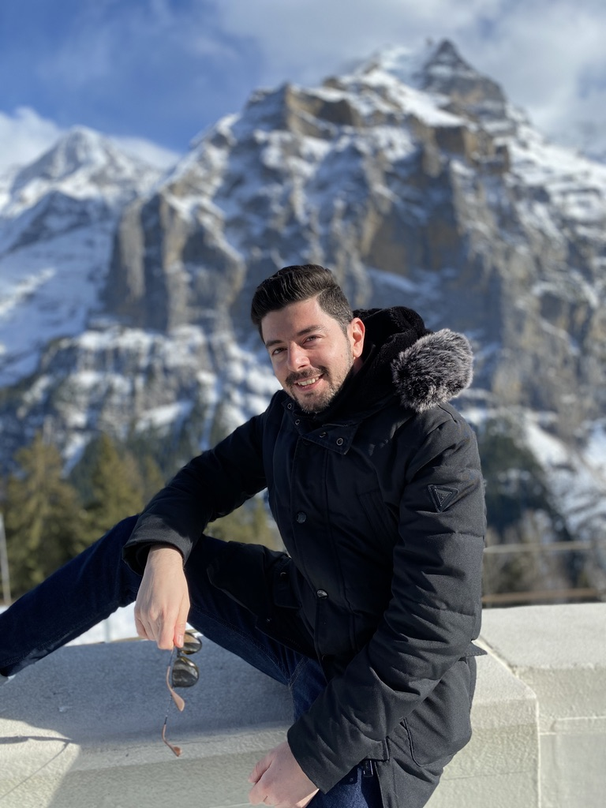
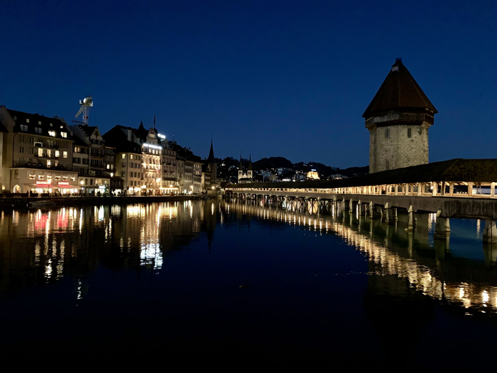
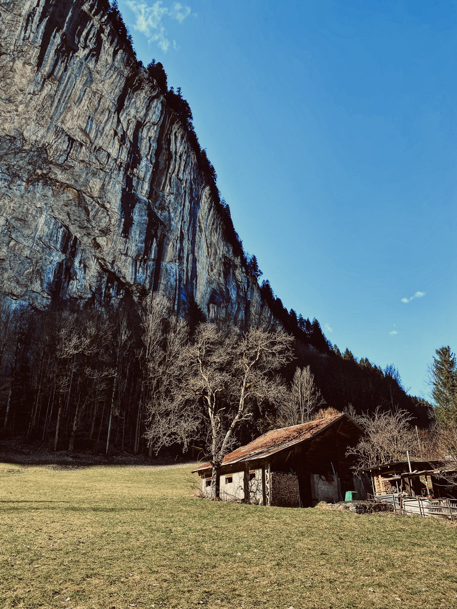

What is forbidden to ask in a Swiss restaurant? Where all the people go on Sundays? Where do all the cows go in summer? What is a Hüsli?

Our journey continues with another post about Switzerland. This time we will talk about life in the city, traveling and languages.

Bratwurst? 🌭

---

The most important question I get from my friends from Greece is related with nightlife. You see, Thessaloniki, my hometown, has a very vivid nightlife. People like to go out several times per week. We are even receive jokes about the coffee habit that we have from other cities of Greece.

Well, I have to say, Zurich has a pretty balanced nightlife. You can potentially find a wide list of options for entertainment, but it may be a little bit limited. Don't expect the variety of Berlin or London, for example.

What was unusual for me here is the fact that people are drinking on their way to the bar. You will see a lot of teenagers carrying beers on the street or sometimes even in the busses. No, they are not alcoholics, they are just trying to reduce their costs. Drinks can be an expensive hobby here, especially if you are a student.

Public drinking is awesome in the summer. You don't need to dress perfectly to go out, you don't need to wait for hours in the lines, or to impress the doorman guy. You call your friends, you grab a couple of beers, snacks, sometimes a fully charged bluetooth speaker, which at the end it only works for 15 minutes. There are plenty of places to go, usually people prefer to stay by the lake. The vibe is really relaxed. Sometimes you may be lucky to find a spot next to a band, and you can enjoy excquisite music. Sometimes the music can be really poor.

](images/wyron-a-PnFAa1ro9b0-unsplash.jpg)
_Credit: [Wyron A](https://unsplash.com/photos/PnFAa1ro9b0)_

The story can be a little bit different for other cities. I have the sense that most of the Swiss cities are very silent at night, except of Zurich. The most disappointing for me was Geneva. Don't be surprised if you find no people on the streets on a Saturday summer night.

Zurich is known as the venue for the brightest Swiss festivals, events, and celebrations. Sometimes the whole city is being transformed into a trance club. You may enjoy popular bands and DJs. And it goes really wild. But the impressive thing is, the next morning, everything goes back to normal. No more confetti, empty cups, bottles, DNA, or any other waste. It's like nothing ever happened.

---

If you ever visit a Swiss city, you will most probably notice the water fountains. And I'm not talking about these large fountains that are used for decoration purposes, I'm talking about drinkable water flows. For example, in Zurich you will find 1,200 fountains.

In your face Fontana di Trevi.

A lot of people are carrying a small water bottle and they fill it up with fresh water.

](images/dorothea-oldani-c01oPaDbxWw-unsplash.jpg)
_Credit: [Dorothea OLDANI](https://unsplash.com/photos/c01oPaDbxWw)_

What is really weird is if you ever ask for tap water in a restaurant. The waiters will look at you like you are doing a crime or something. It's kinda ironic if you think that the water quality of Switzerland is one of the best you can find on earth.

---

What also impresses me is the fact that people travel a lot. And I mean a lot! Sometimes it's hard to meet friends because they may be in different mountains. The author is not excluded. Alongside Switzerland is in the center of Europe. For starters, Switzerland is next to Germany, Italy, French and Austria. The Swiss salary is also another factor that makes people less concerned about the hospitality and transportation costs.

Having a stressed week? No problem. Just book a Chalet on a mountain for the weekend and enjoy the iced view while you are relaxing in your warm Jacuzzi. What? It is summer you said? Kein Problem. Get a plane for Malta and in 2 hours you can get louse at the beach. It only costs hundred Swiss franks. That's what you will pay if you go out Saturday night anyway.

---

People in Switzerland like to plan in advance. Don't be surprised if you don't find any friend to join you for a coffee this weekend. Most probably they have planned to go to a mountain, ride the whole city with a bicycle, visit their parents in Saint Gallen, or even being in another country for a long weekend trip.

I have observed that people are more active here. They will most likely prefer to spend 1-2 days in their free time on the mountains, doing sports or enjoying the nature. I also changed my habits for the better.

That's why you may not find a lot of people in the city on Sundays. They are most likely to some away or they enjoy their family time. Restaurants and coffee bars are also likely to be closed for Sunday.

This means you should definitely reserve your table in advance. I have a friend who tried to book a table for brunch and they told him that the next available date is in one month.

> Even cows in Switzerland go for holidays during the summer months.

I'm not kidding. According to the [Federal Office for Agriculture](https://www.agrarbericht.ch/de/betrieb/strukturen/soemmerungsbetriebe?_sm_au_=iVVFrz6tDqV3040H), around 270,000 cows are marched from their valley farms to mountain meadows at the start of every summer, just to come back down again in early autumn. Apparently this [increases the quality of the milk](https://www.swissinfo.ch/eng/milk-run_why-swiss-cows-climb-mountains/44380436). Which is an extremely important ingredient for the famous Swiss cheese.

So don't get bored, do it like a cow!

> I have observed that many of my Swiss friends, travelled from 6 months up to a year somewhere in the world, right after their university studies.

Besides the fact that it's costly, and it's not an easy to manage if your budget doesn't allow it, I find it one of the nicest things to do in your life. You have the opportunity to discover the world and earn new experiences. Plus, you are more relaxed and prepared to ride your career train. Of course, as everything in this life, it depends on your wealth and life situation.

But don't let the money discourage you. It's relatively easy to make some savings here and give a long break to yourself and your family. A lot of people take this opportunity to learn, for example Italian, so they leave for 1-3 months in Italy and they are working from there, practicing their language skills with native speakers. Companies will also welcome your decision, if the language is important to their business.

Now, you may ask, how you can manage to leave everything behind for such a long period of time. The best way is by subletting your apartment. You will help other people, and more precisely students, to find a decent and affordable place to stay. And the amount of money you will save is usually enough to pay for your accommodation.

---

Now I would like to open another big topic, which is the language.

> Switzerland has 4 official languages; German, French, Italian and Romansh. It is common to find people that speak or at least being able to understand most of the languages.

In Zurich people speak German (Deutsch). To be able to communicate with them it requires a lot of effort. You start by taking German classes. After some months, you feel empowered with your achievements. You can perfectly communicate with your teacher. Now it is time to practice your skills with locals, you think. What can possibly go wrong, right? Well, my friend, I'm afraid it's not gonna work.

_Luzern is one of the most beautiful Swiss cities._

In Switzerland we speak Swiss German (Schwiizertüütsch). Don't be surprised if you don't understand a thing from what you hear in the streets, even if you you speak German fluently. You may want to spend some time to learn the dialect. But that's also not enough.

And to make it even more difficult, the cantons of the German part have their own dialects. People from Zurich speak differently from people from Bern. Some cities have a lighter version, others a forcefull one.

What I was struggling the most here in Zurich is to learn how to greet people. You always need to check for the other person's age. There are different phrases for people younger than you, and different for older people. Also there are formal and informal phrases. You can't just say Grüezi to a kid that passes by, it will be very formal.

Of course, the more Swiss German you speak, the more people will like you, no matter which phrases you are using. Good luck when you go back to German-speaking countries. You now have the habit to speak with your Swiss dialect. I have a friend who received complaints because he wasn't speaking German in a German train somewhere in Germany. Of course, the old lady who complained didn't know this is a German dialect.

The only Swiss word I used to know before I move here was Müesli.

Yes, you most probably know it as well, it's the healthy yogurt companion. What I didn't know is that Swiss German is characterized by the frequent use of the diminutive. This means that nouns are usually “reduced in size” by adding the suffix “li” to them.

For example, if you want to say little man (Man in German) you say Männli, for little mountain (Berg) you say Bergli, and for little house (Haus) you say Hüsli.

If you ever want to make fun of a Swiss friend, just put -li at the end of every word. Who knows, maybe you will catch some.

---

Once again, thank you for reading this post. I am saving the forth part for next time, which will probably be the last. After that, I will continue with my boring programming topics. I forgot how to write technical articles after all these posts.

The beautiful cover is taken at the lake Klöntalersee, by [Dave Ruck](https://unsplash.com/photos/pxjN_6Z_3x8)
