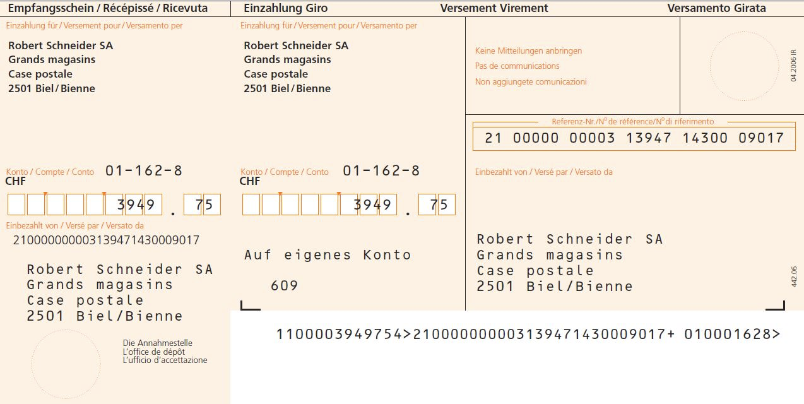

How you answer a phone call in Switzerland? How you can buy goods without paying a rappen? Why people in Switzerland know what time and day will wash their clothes next year?

In case you missed my previous posts, this is the fourth part with fun facts about Switzerland. It's pretty biased, not sophisticated whatsoever, and I will do my best to not include any stereotypes.

Cheese? 🧀

---

Before we start, I just want to drop this here:

_The Swiss keyboard layout_

This is one of my worst nightmares. Not only it is QWERTZ instead of QWERTY and every time you confuse the letter `Z` with `Y`, it is a mixture of German and French keyboard layouts. You can switch to English of course.

I thought as a developer, I was very familiar with the keyboard and this layout change will not affect my typing. I was wrong. Good luck finding where the special characters are located. The trick I have found is to press any key just to see the output, until I find the one I'm looking for. Such an entertaining activity to try at work.

---

Now I will teach you how to answer phone calls in Switzerland. Usually, when you receive a phone call, your first reaction is to say something like "Hello".

Nope. This will not work in Switzerland.

Here in Switzerland, people are used to answer with their family names. Yes, this includes every stranger who's calling you. If you don't pronounce your last name, the other person will be confused. They will try to identify with whom they are talking to. Think of it as if you had to press slide to unlock, but with your voice.

Since I'm not used to this habit, I spend one minute in every phone call, waiting for them to pronounce my family name correctly.

"Is this Mr. Tsourekitibitidis?".

---

Now let's talk about God.

If they ever ask you what is your religion in Switzerland, be a bit more skeptical about what you will answer. They don't really care in which God you're praying, they actually want you to pay the church tax. Yes, even God itself here requires money.

](images/henrique-ferreira-V7GrFTVwdko-unsplash.jpg)
_Credit: [Henrique Ferreira](https://unsplash.com/@rickpsd)_

Now, if you are a little unlucky and your apartment is located near a church, be ready for some bell entertainment. For reasons unknown, the church bell rings multiple times per day. Sometimes it can even stuck, and you hear it for several minutes.

The perfect way to enjoy your hangover.

---

Now let's address the elephant in the room; Money.

OK, this is not a secret. In Switzerland, we have a lot of money. You probably know that a Big Mac costs 12.50 euros, which is something like the global measure unit for wealth. This doesn't mean that people are rich, not even close, but it gives you an impression for how much money is being transferred on a daily basis.

What it's more impressive is the fact that people trust you.

When I moved to my previous apartment, I went to the famous Swedish furniture store (now that I'm a content creator, I don't really promote brands for free) to buy everything I needed. Yes, you guessed it right, I ended up spending a large amount of money on the most useless stuff. When went to the counter to pay, there was a mistake related with the product tags, and they promised to send me the bill via post.

I paused for a minute to think what they meant. Maybe I misheard. Maybe I was confused after all this time choosing colors for the toilet cover. But when I asked them to repeat what they said, I was even more surprised with their confirmation.

_This is an orange payment slip. It's the most common way to pay bills here in Switzerland._

They did want me to leave without paying. I ended up going home with multiple-K worth of furniture, without paying a single rappen (the Swiss equivalent of a cent). Of course, in the following week I had received the bill.

This is very common here. You take your car to the garage, you leave without paying. They will send you the bill at home someday in the near future. Sometimes they don't even tell you what they fixed and how much you are supposed to pay. It takes extra effort to get this information.

Now make sure you pay this bill to avoid the consequences.

---

We talked about so many things, maybe some of you are already convinced to move here. Well...

Finding an apartment can be very hard, especially in big cities. There was recently a [story in the news](https://www.thelocal.ch/20181122/hundreds-queue-for-zurich-apartment-viewing-on-freezing-night/) that hundreds of people were waiting to view an apartment in the center of Zurich. But seeing the apartment is only the beginning.

To rent an apartment, you need to prepare yourself for a fair amount of paperwork. After viewing the apartment, you will receive the official application form, which contains a lot of nice checkboxes like if you have any pets, if you play a music instrument or if you are a programmer. No, I'm kidding they don't ask you that, they get this information from the papers you are providing to them. Which papers?

So, to get an apartment you have to provide them with your CV, a confirmation from the local authority that you don't owe any money (check the previous section), a motivation letter with how much you want to rent this apartment, and some references. Yes, they call your boss to confirm that you are working, your neighbors to confirm you are not an annoying person, and of course, your current landlord, to check if you follow the rules as you're supposed to.

> It kinda feels like this episode of Black Mirror, where people can rate each other from one to five stars for every interaction they have, which can impact their socioeconomic status.

](images/anokhi-de-silva-bFDLzdLHjHo-unsplash.jpg)
_Credit: [Anokhi De Silva](https://unsplash.com/@anokhi_08)_

But you haven't finished yet. Now you have to give the keys from your previous apartment. Good luck with that. The last day of your rental, you will have a meeting with your landlord together with the next person who will rent the apartment. They will search the place centimeter by centimeter. They will try to find every possible defect or dirt.

I had to pay a professional cleaning company to clean my previous apartment, and it turned out that they had to visit again to clean the parts that were not properly cleaned. There was an awkward moment where four people were on top of my shower sifone, the pipe that collects all the water. I didn't dare to ask what they found inside, but there was a big discussion with all the parties involved.

Now, you may want to buy your own apartment at some point. Why spending your money on rent, you may think.

Well, my friends, I have bad news for you. The apartments in Switzerland are extremely expensive. You can easily spend a million of Swiss Franks. Many of the people I know have a loan until their retirement. Sometimes even until death.

---

You finally made it! You have your own apartment. Furthermore, you may think that it's all over now. But now it's where the fun begins. You have to agree with the terms and conditions. My previous apartment had 7 pages full of rules.

Front and back.

](images/claudio-schwarz-NPOz6vzYdWQ-unsplash.jpg)
_Credit: [Claudio Schwarz](https://unsplash.com/@purzlbaum)_

But what kind of rules, you may ask. Well, most of the time, don't expect something crazy. I said most of the time.

> In some apartments, it is forbidden to flush your toilet after 10pm.

Yes, you heard it right. The older buildings have very old pipe installations and every time that you visit the WC, the noise of the flush is very prominent to all the tenants. Not the best thing to do in a country that detests any kind of neighbor activity.

You also have to book your laundry times. You see, most of the apartments in the city center are relatively old, and they can't host a washing machine. What you get instead is a laundry room somewhere in the basement. Each tenant books the time that is most convenient for them. Sometimes you have to pay a small amount of money every time that you use the washing machine or the tumbler. I told you, nothing comes for free.

](images/engin-akyurt-yCYVV8-kQNM-unsplash.jpg)
_Credit: [engin akyurt](https://unsplash.com/@enginakyurt)_

Of course, it doesn't mean that the machines will be 100% free at the time you bring all your belongings downstairs. Some people simply don't respect the schedule. Just make sure not to forget your underwear in one of the machines and turn your neighbor's clothes pink.

---

Speaking about rules, I have another topic which needs its own section. It's about recycling.

When I first registered myself in Zurich, I received the official guide for recycling. In the beginning I though, wow how they have it well organized. Later on, I started struggling to divide my trash in multiple groups.

The most difficult is paper and carton. Let's say you receive a package at home. In order to recycle the carton, you need to remove all the plastic, the paper, any stickers or tape. Sometimes it's very difficult to understand if something goes to carton or paper. For example, the bag from the supermarket goes to carton collection.

](images/tran-mau-tri-tam-hmBJtWxFOdg-unsplash.jpg)
_Credit: [Tran Mau Tri Tam](https://unsplash.com/@tranmautritam)_

And don't even think about cheating, the garbage police will get you. They have people who open the trash bags, searching for any clue to identify your identity. Maybe you forget the receipt in the package. Silly you. In that case, you will receive the trash bag outside your door, with a friendly post-it on it.

"Please don't do this again, we know where you live".

Glass is also challenging to recycle. You need to remove the cover, of course, because it's plastic. There are different bins depending on the color of the glass. Ah, and never recycle glass on Sundays. The noise will make everyone crazy. People will be very mean to you. They will start yelling from their balconies. Don't tell me I didn't warn you.

---

We reached at the end of our journey, my friends. This will be most probably the last part of this special series. I think I covered most of the points I wanted to share with you. Now that I'm thinking, I have one post for every year I'm living here.

A special thanks to my colleague [Laszlo Markert](https://fcvbz.ch/fc/?lang=en) and his wife. They contributed a lot to collect these facts.

Until the next post, take care and wear your mask! 😷

The beautiful cover is taken somewhere in Montana, by [Artiom Vallat](https://unsplash.com/photos/frkc9sO47Ag).
