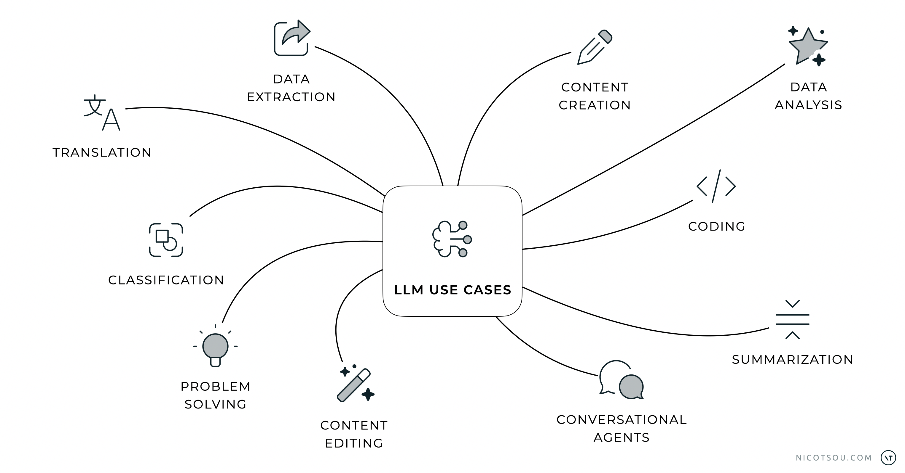

A well-structured prompt can significantly improve the quality and accuracy of AI-generated responses. This guide will walk you through five essential steps to craft prompts that consistently deliver the results you need.

Here's a simple framework to help you structure your prompts effectively and get the most out of AI language models. By following these steps, you'll be able to communicate your requirements clearly and receive more accurate, relevant responses from AI systems.

The examples provided below are not complete prompts, but rather building blocks you can combine with your existing prompts to enhance your results.

Let's examine each step in detail, and then combine them all together at the end.

## Step #1 — Start with a _verb_

Remember how we talked about different ways to use AI language models (LLMs) in a previous [article](https://nicotsou.com/the-art-of-prompt-engineering/)?

Here's a simple but powerful tip: start your prompts with action words (verbs). When you begin with a clear action word, you tell the AI exactly what you want it to do. This helps the AI understand your request better and gives you more accurate results. Think of these action words as simple instructions that guide the AI to give you the kind of response you're looking for.

Here are some examples:

<aside>

**_write_** an essay

**_create_** a list of marketing ideas

**_summarize_** the key article points

**_classify_** these news headlines by topic

**_extract_** the names of all key stakeholders

**_translate_** from English to Greek

**_edit_** this paragraph to improve clarity

**_solve_** this math problem step-by-step

**_answer_** the questions below

**_convert_** measurements to grams

</aside>

You have flexibility in choosing verbs that best fit your needs - there's no requirement to stick to these exact examples. Feel free to use synonyms or alternative verbs that clearly communicate your intended action, as long as they effectively convey the task you want the AI to perform. The key is to start with a clear, action-oriented verb that sets the direction for your prompt.

Moreover, it's important to note that this is not an exhaustive list of LLM capabilities. Generative AI represents a rapidly evolving technology, with new use cases and applications being discovered and developed continuously. As researchers and practitioners explore novel implementations and methodologies, the potential applications of LLMs continue to expand across various domains and industries.

However, starting with an action verb in your prompt is important for two main reasons. First, it tells the AI exactly what you want it to do. Second, it helps you get better answers. When you start with a clear action word (like "write" or "explain"), you're telling the AI precisely what kind of response you need. This makes it much more likely that you'll get the type of answer you're looking for.

_The Lord of prompt engineering, according to AI._

## Step #2 — **Assign a _role_, _job_, or _function_**

When you assign a specific role, job, or function to the AI, you provide it with important context about the expertise and perspective it should adopt. This helps the AI understand the domain-specific knowledge and terminology it should use, leading to more accurate and relevant responses. The role you assign acts as a lens through which the AI filters and structures its knowledge, ensuring the output aligns with professional standards and best practices in that field.

Here are some examples of how assigning a role can enhance your prompts and lead to more specialized responses:

<aside>

**Prompt:** As an _application security specialist_, evaluate the security measures in place for this API and recommend improvements to protect against common vulnerabilities like SQL injection and cross-site scripting.

</aside>

When you specify "As a application security specialist" the AI will adopt the mindset and expertise of a security professional, enabling it to provide specialized insights into potential vulnerabilities, security best practices, and technical recommendations that align with industry standards for application security. This role-based context helps ensure the AI's response focuses on security-specific concerns rather than general programming advice.

<aside>

**Prompt:** You are a _database administrator_, review the following database schema and suggest optimizations to improve query performance and data integrity.

</aside>

By specifying the role as a "database administrator," the AI will focus on providing technical recommendations from a database management perspective, including insights about indexing strategies, normalization, and query optimization patterns that align with database administration best practices.

This role-based approach helps the AI adopt the appropriate tone of voice for specific domains and disciplines, ensuring that responses maintain the expected level of formality, technical depth, and professional standards for each field.

## Step #3 — **Provide _examples_**

In prompt engineering, "shot" refers to the number of examples provided to guide the AI model. When we talk about "X-shot" prompting, we're describing how many examples we're giving the model to help it understand the pattern we want it to follow.

By default, when no examples are provided (zero-shot), the model relies solely on its training data and the task description in the prompt to generate responses. As we increase the number of examples - whether it's one-shot (single example), few-shot (several examples), or many-shot (numerous examples) - we give the model more context to understand the specific pattern or format we're looking for. This approach helps the model better align its responses with our expectations and requirements.

Here’s an example:

<aside>

**Prompt:** _Classify the sentiment_ of a customer message. Focus on identifying the sentiment accurately based on context.

_For example_:

_"Your team helped me so quickly with my claim!" Meaning: Positive_

_"I am beyond frustrated with the wait times." Meaning: Negative_

_"Can someone explain this to me?" Meaning: Neutral_

_"I'm so grateful for the help I received!" Meaning: Positive_

_"This process is more complicated than I expected." Meaning: Ambiguous_

_Sentence to classify_: “{MESSAGE}”

</aside>

In this example, we're showing how to classify sentiment in customer messages. The prompt starts by clearly stating the task "Classify the sentiment" and then provides 5 examples that demonstrate different types of sentiment:

- A clearly positive message about quick help
- A negative message expressing frustration
- A neutral question seeking information
- Another positive message showing gratitude
- An ambiguous message that could be interpreted multiple ways

These examples help the AI understand the nuanced differences between sentiments and how to categorize them appropriately. Notice how each example includes both the message and its classification, creating a clear pattern for the AI to follow.

The prompt then ends with a placeholder `{MESSAGE}` where you would insert the actual message you want to classify, maintaining the same format as the examples.

AI models learn differently from examples. Some smart AI models only need to see a few examples to understand and copy patterns. Other AI models need more examples to learn the same task properly.

It's important to maintain a careful balance — providing an excessive number of examples can potentially constrain the model's creative flexibility and lead to overly rigid responses that too closely mirror the provided examples rather than generating novel, contextually appropriate outputs. The key is finding the optimal number of examples that enables the model to understand the desired pattern while preserving its ability to generate diverse and creative responses.

Another important concept related to examples in prompting is [fine-tuning](<https://en.wikipedia.org/wiki/Fine-tuning_(deep_learning)>), which is a more advanced way of teaching AI models specific patterns or behaviors. While providing examples in prompts (few-shot learning) helps guide the model temporarily for a single interaction, fine-tuning involves actually updating the model's parameters through additional training on specific examples. This technique goes beyond the scope of this article. I highly recommend sticking with X-Shot Prompting since it effectively handles most use cases you'll encounter.

## Step #4 — **Describe the desired output _format_**

Specifying the desired output format is crucial for getting responses that match your needs.

Here’s an example:

<aside>

**Prompt:** Draft a _friendly_ **[1]** email to my _fellow software architect_ **[2]**, expressing gratitude for their support in the recent project review.

Structure the email in _three brief sections_ **[3]**: an opening acknowledgment, specific points highlighting their valuable contributions, and a closing statement of appreciation.

</aside>

This step involves:

1. setting the tone (whether formal, casual, or technical),
1. identifying the target audience (which helps tailor the language and complexity level appropriately),
1. and clearly outlining the structure or format of the expected response.

By providing these parameters, you give the model essential context about how to package and present its response in a way that will be most useful and relevant for your specific use case.

Now, you can request the model to output responses in various structured formats that align with your content needs. For example, you can specify output formats like JSON for structured data representation, XML for hierarchical document structures, Markdown for easy-to-read formatting, YAML for configuration files, or CSV for tabular data. This flexibility allows you to seamlessly integrate AI responses into your existing systems and workflows, while ensuring the output maintains consistent structure and syntax according to the specified format.

## Step #5 — **Provide detailed _guidelines_**

Clear instructions are important when working with AI. When you give the AI specific rules and requirements, it better understands exactly what you want. Think of these instructions like a recipe - they help the AI know what to include and what to avoid. Just like in the example below, good instructions can turn a basic request into a clear, well-organized response.

<aside>

Write a proposal document for a new website redesign project with these **_specific rules_**:

- Open with an executive summary that briefly describes the purpose and objectives.
- Include sections for Project Scope, Timeline, Budget, and Team Roles.
- Under Project Scope, outline the key features and design changes planned.
- Add a detailed timeline table listing milestones and expected completion dates.

Conclude with a call-to-action encouraging stakeholders to approve the proposal.

</aside>

In the example above, the guidelines provided help shape how the AI model approaches the task in several important ways. They establish the necessary components that must be included (executive summary, project scope, etc.), define the structure and organization of the content (specific sections and their order), specify the level of detail required (such as including a detailed timeline table), and set expectations for the conclusion (ending with a specific call-to-action).

These guidelines serve as constraints that help the AI model generate more focused and relevant output. Without such specific guidelines, the response might be too general or miss important elements that you need. Think of these guidelines as quality control measures that ensure the AI's output meets your specific requirements and standards.

## Putting everything together

Start with a role:

<aside>

You are a Digital Marketing Strategist for an e-commerce brand.

</aside>

Provide examples:

<aside>

Examples:

“Social media ad campaign with special discounts.”

“Email marketing sequence promoting holiday deals.”

“Influencer partnerships to showcase products.”

</aside>

Specify the output:

<aside>

Present the campaign plan as a 3-part strategy (social media, email marketing, influencer partnerships). Each part should have 2-3 action points.

</aside>

Provide Guidelines:

<aside>

- Specify the target audience for each campaign channel.
- Include a suggested timeline and estimated budget for each part.
- Outline key metrics to track, such as engagement rate for social media or conversion rate for emails.
</aside>

Define the task:

<aside>

Create a promotional campaign plan to boost sales during the holiday season.

</aside>

To enhance your prompts further, consider incorporating additional contextual elements. This includes providing relevant technical documentation and background information, backing up your prompts with supporting statistics and data, include previous conversation history, and the last message from the user that the LLM needs to respond to.

---

## That’s all folks! 🙌

These tips for writing better prompts are really helpful, but keep in mind that there's no one-size-fits-all approach. What works great in one situation might not work as well in another. How well a prompt works can depend on which AI model you're using, how complex your task is, and what specific things you need to accomplish. The key is to be flexible and willing to try different approaches. Don't be afraid to adjust and experiment with your prompts until you find what works best for your specific situation.

Thanks for reading! Stay tuned for more content about prompt engineering! I'll be sharing advanced techniques, real-world examples, and practical strategies to help you master the art of communicating with AI. My newsletter form is just a few DOM elements below. Don't forget to subscribe to get notified when new articles are published.

Cover art generated with Adobe Firefly.
