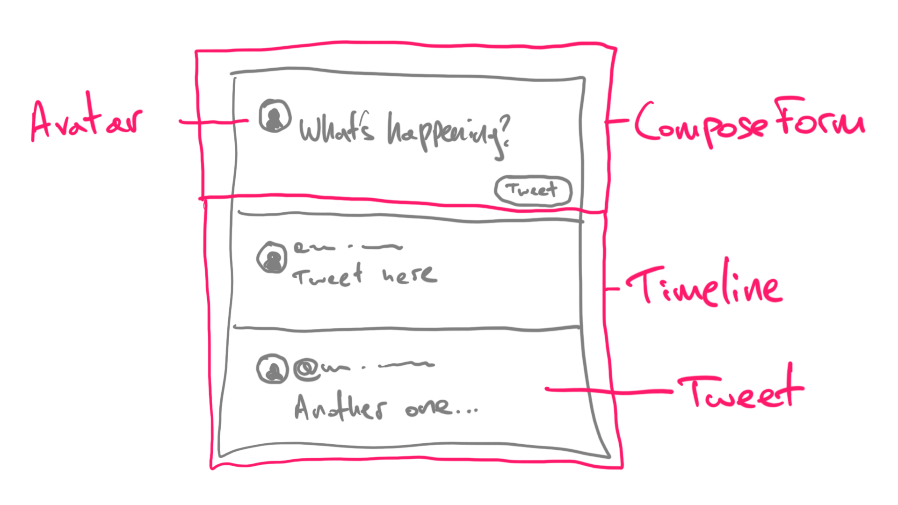

My goal with this article is to help you learn React. We will create a small application that displays tweets.

If you never tried React, this will be a good article for you. If you know already the basics of React, you may find this article boring at least.

Feel free to submit fixes via pull requests or to create issues in the GitHub repo.

You can find GitHub repo: [https://github.com/nicotsou/react-twitter](https://github.com/nicotsou/react-twitter).

To follow this guide you must have [Node.js](https://nodejs.org/en/) installed.

## Create a React application

Open your terminal, move to your development directory and run the following command:

```jsx
npx create-react-app my-twitter-clone
```

The following prompt will appear. Accept the installation and take a small ☕️ break. The installation will take some time, especially if you don't have any React projects in your system.


This will create a subfolder with all the files we need to run our newly created React application:


Let's have a closer look at the initial folder structure:

- `/node_modules`: This hosts all third-party npm packages that are needed in order to run and deploy our application. This folder is ignored from git. Sometimes it makes sense to delete it and run `npm install`. re-create it.
- `/public`: This folder hosts public static files. The best place to put favicons, iOS icons or any other complementary file.
- `/src`: This holds the source code of our application. We will work here to build our application.

## How to run the application

Give it a try! The application is pretty functional.

At first you have to navigate inside the application folder:

```jsx
cd my-twitter-clone
```

The only thing you have to do is to run the following command:

```jsx
npm start
```

Now wait a bit. Your JavaScript application is building. Since our app is pretty small, this will not take much time.

If your firewall prompts you about allowing this application to access networks, press accept.

In seconds you will notice a new browser tab with the following page. If not, try to visit [http://localhost:3000/](http://localhost:3000/).


The application is running successfully and you can interact with it. Well, there's nothing to interact with at the moment, but we're gonna change that soon.

Now try this one. Edit `/src/App.js` file. Change some of its text and save it. Notice that as you save the file, the changes are being reflected to your browser window automatically. That's the best way to test our application in real time.

Stop the application by running `Ctrl+C` on the terminal window.

I want you to delete all the files inside the `/src` folder. We will recreate them one-by-one in the following section.

Now it's time to write some code. 👨‍💻

## Render the React application

In this section we will write all the elements that are needed in order to run our app. It's better to spend some time to understand what is happening under the hood.

I want to give you an overview of how React works. Unfortunately in this article we can't explain everything in detail. But I have selected a bunch of nice articles you can read at the end of this experiment.

In our public folder you will find an `index.html`. Search for the following div element:

```jsx
<div id="root"></div>
```

This is basically where we are planning to render our React application. The root element.

React gives us an easy api to place React applications in our existing html elements. You just register them and you forget about them. React will manage all DOM changes for you inside those elements, but it will not touch anything outside.

The part of the React library that is handling DOM is called `react-dom`. Let’s see how we can use it.

By the way. If you are thinking now to change the _favicon_ with the one from twitter, I would not judge.


To render a React element, create a new file `/src/index.js`:

```jsx
// index.js
import ReactDOM from 'react-dom';

ReactDOM.render('no more hello worlds please', document.getElementById('root'));
```

Go ahead and run the application. You should see our friendly message.

Note that changes specifically to this `index.js` are not being automatically transferred to your browser window. You will have to manually refresh the page every time to see the changes.

The method `ReactDOM.render()` takes the following parameters:

- The React component we wand to render.
- a DOM element in which we are planning to render the markup (render output).

ReactDOM is the one who will take care of updating the DOM as we dynamically make changes. At the moment it will display the following message:


We haven't defined a React component yet. Let's do so:

```jsx
// highlight-start
import React from 'react';
// highlight-end
import ReactDOM from 'react-dom';

// This is our first React component
// highlight-start
function App() {
  return <div className="App">no more hello worlds please</div>;
}
// highlight-end

// We use <App /> as the root React component to render
// highlight-start
ReactDOM.render(<App />, document.getElementById('root'));
// highlight-end
```

Here we imported the core `react` library. This one allows you to create and manipulate React components. It hosts all the core react features, except everything DOM or mobile related.

You have to import this library, otherwise your JS runtime will not be smart enough to understand the syntax inside the function `App()`.

That's [JSX](https://reactjs.org/docs/introducing-jsx.html). It basically allows us to write HTML inside JS. It has _almost_ the same syntax, with some minor differences.

Our first component is named `App` and it will be the root component of our application. React allows you to write components in the form of JS functions. Simply use the `return` statement to return what you want this component to display on screen.

Every React component renders something on screen. If you don't want to render something, then you can use a plain JS function instead of a React component.

You can create as many components as you want. You can nest components within other components to declaratively express your UI. Similar to how you write HTML.

In the next section we will do exactly that. We are building a twitter clone, so we will definitely need some React components to display its UI.

But first let's fix some minor issues.

---

Theres nothing cool with Times New Roman or whatever the default serif font is in your OS.

Let's make it nicer by adding the following file under `/src/index.css`:

```jsx
body {
  margin: 0;
  font-family: sans-serif;
}
```

Ok now it’s more UIsh… We also removed the default margin in `body`.

To see the changes we will have to import this css file in our main `index.js`:

```jsx
import './index.css';
```

Now you will be wondering, what the hell? We import a css file inside a JS file? How this is even legal?

Well, it is working perfectly if you refresh your browser. And that's because your react application is using a bundle loader called [webpack](https://webpack.js.org). Pretty awesome isn't it?

If you managed to do everything your codebase will look like this: [https://github.com/nicotsou/react-twitter/tree/step-1](https://github.com/nicotsou/react-twitter/tree/step-1).

Now let's implement that 🐤 twitter app.

## Display some tweets

It's time to show those tweets! Now it will get more interesting. 😁

Since this will be a very simple app without any api integration, I have prepared some initial data for you. It's basically a json file with a list of tweets in it. To make things easier, copy its contents in a new file `src/tweets.json`.

Now we can move the implementation of the `<App />` component to a new file. In general, it's a good practice to keep every React component in its own file.

As a first step, we will update the `index.js` as follows:

```jsx
import React from 'react';
import ReactDOM from 'react-dom';
import App from './components/App.jsx';

import './index.css';

ReactDOM.render(<App />, document.getElementById('root'));
```

Now, let's create another file `/src/components/App.jsx`. Type the following code in it:

```jsx
// App.jsx
import tweets from '../tweets.json';

function App() {
  return (
    <div>
      {tweets.map((tweet) => (
        <span>tweet.content</span>
      ))}
    </div>
  );
}

export default App;
```

Here we are leveraging the `map()` function to loop through all the tweets. That’s how you loop elements in JS. Which brings us to an important observation.

> React is just JS. There’s no pseudo code for us to remember. React basically embraces you to learn JS.

We imported the list of the tweets from a json file. Similar to css, Webpack can handle other filetypes too. One of these filetypes is the `.jsx`. This is a common pattern to name React components. It's not mandatory thought. You can use `.js`.

Note that a React component must always return a single root element. In our case this is a `<div>`. Try to remove it, it will fail. Try to return more elements at the same level, it will again fail. One React element at the root level. Simple rule right?

---

You may ask why this is a React element and not an HTML element. Well, it looks alike because they both use the same tag name `<div>`. But don't let it fool you.

React has one React element for every HTML element that is available. When you `return <div>text</div>;` you are not returning an DOM element. You are returning a React element.

The `react-dom` library (the one we declared before in `index.js`) will take all these React elements, render them and this will produce the corresponding DOM tree. Another important thing to have in mind. A small detail, but it makes a lot of difference.

---

There's another thing that is missing.

If you check the console in DevTools you will see the following warning message:

```jsx
Warning: Each child in a list should have a unique "key" prop.
```

React also provides you a link to the [associated article](https://reactjs.org/docs/lists-and-keys.html#keys) in their documentation.

Basically, React internally creates an auto generated key for every element. This key is being used in order to associate the actual DOM elements with the React elements. When you are dynamically rendering a list of items, React isn't able to generate keys automatically. It simply cannot distinguish those elements because there's no common attribute.

In order to help React recognize what is being rendered, we need to manually add a key attribute:

```jsx
function App() {
  return (
    <div>
      {tweets.map((tweet) => (
        // highlight-start
        <span key={tweet.id}>tweet.content</span>
        // highlight-end
      ))}
    </div>
  );
}
```

This key is a reserved prop for every React component. The key has to be unique, otherwise React will not be able to update the DOM correctly.

---

Now let's add some structure:

```jsx
import tweets from '../tweets.json';

function App() {
  return (
    <div className="timeline">
      // highlight-start
      {tweets.map(({ id, user, created_on, content }) => (
        <div key={id} className="tweet">
          <div className="tweet-header">
            <span className="tweet-user">@{user}</span> ·{' '}
            <span className="tweet-created-on">{created_on}</span>
          </div>
          <div className="tweet-content">{content}</div>
        </div>
      ))}
      // highlight-end
    </div>
  );
}

export default App;
```

Here I used classes to differentiate the divs. We will add the corresponding styles later.

Take a look on how we retrieve the data from tweets. We use a cool new syntax called [Restructuring Assignment](https://developer.mozilla.org/en-US/docs/Web/JavaScript/Reference/Operators/Destructuring_assignment). That makes the code shorter and easier to follow. Of course it gets some time to practice it.

Note that even in the map loop, we are _only_ allowed to return a single root element. If we don't want any DOM element to be rendered as a wrapper we can use an empty `<>`. This is a syntactic sugar for `React.Fragment`.

Now that we learned how to create React components, let's create more. Our goal is to separate the concern of the tweet from the actual application. Then we can add some styling.

## Displaying our tweets

Let's create a new component `src/components/Tweet.jsx` with the following code:

```jsx
function Tweet(props) {
  const { user, createdOn, children } = props;

  return (
    <div className="tweet">
      <div className="tweet-header">
        <span className="tweet-user">@{user}</span> ·{' '}
        <span className="tweet-created-on">{createdOn}</span>
      </div>
      <div className="tweet-content">{children}</div>
    </div>
  );
}

export default Tweet;
```

Our newly created `<Tweet />` component is only responsible to render tweets. Now it is time for some theory lessons. It will help us understand what is actually happening here.

I suppose you are familiar with HTML attributes. For example an anchor tag has an attribute to set the href:

```jsx
<a href="/">Home</a>
```

Similar to HTML elements, React components can have their own attributes. For example our Tweet component has an attribute `<Tweet name="nicotsou" />` which can be used from consumers to set the handle name for this tweet. It also has another attribute for the creation date.

There's a reserved attribute called `children`. React uses this name convention for all the elements that you render inside this element.

This means that you are free to decide how to implement the api of your component. If you want your component to accept children, just use this prop.

In React there is also an easy way to do type checking. You can use a package called `prop-types`:

```jsx
// highlight-start
import PropTypes from 'prop-types';
// highlight-end

function Tweet(props) {
  const { user, createdOn, children } = props;

  return (
    <div className="tweet">
      <div className="tweet-header">
        <span className="tweet-user">@{user}</span> ·{' '}
        <span className="tweet-created-on">{createdOn}</span>
      </div>
      <div className="tweet-content">{children}</div>
    </div>
  );
}

// highlight-start
Tweet.propTypes = {
  user: PropTypes.string,
  createdOn: PropTypes.string,
};
// highlight-end

export default Tweet;
```

React will now check whether the types of the values match with the types you declared in your component implementation.

Note that we do _not_ need to set a type for children, because we allow the consumers of our component to put anything they like.

Now here's the good thing about this type checking system. It will _only_ happen during development. This means while you are running your app locally. This part of the code will not be included in the actual application. That's good right?

Of course nowadays we have some more sophisticated tools for type checking, like [TypeScript](https://www.typescriptlang.org) or [Flow](https://flow.org). Since React is just a JS library, you can integrate it with any tool you like.

Another small note from my side. Notice that I'm using `className` instead of `class`. I guess you've read this [JSX article](https://reactjs.org/docs/introducing-jsx.html) I referenced before. No? Well, it looks like jsx has some tiny minor differences compared to HTML. Since `class` is a reserved word in JS, they had to come up with a different naming convention for classes that have to do with styling.

Ok that's it! We made our first reusable React component.

To render our new component we have to modify `/src/components/App.jsx` as follows:

```jsx
import tweets from '../tweets.json';
import Tweet from './Tweet';

function App() {
  return (
    <div className="timeline">
      {tweets.map(({ id, user, created_on, content }) => (
        // highlight-start
        <Tweet key={id} user={user} createdOn={created_on}>
          {content}
        </Tweet>
        // highlight-end
      ))}
    </div>
  );
}

export default App;
```

Notice the difference in the api. The json property `created_on` has been renamed to camelCase. Well that's not a strict rule. You can name your attributes however you like. But, please don't! Be a good person. Nobody uses kebab_case in HTML. 🙈

Also notice that the `key` attribute is _only_ needed in the parent component and it doesn't even appear in the `<Tweet />` component.

> Remember: Only when you render multiple React elements dynamically you have to provide a `key`. The key is _not_ meant to be used inside the children component.

Our app is finally ready, but it looks like the famous emoji (sic). We will deal with this in the following section.

## Adding styles

When it comes to styling we have plenty of options in React. The simplest one is to use a style attribute:

```jsx
<div className="tweet" style={{ marginBottom: '20px' }}>
  ...
</div>
```

In certain situations this can be useful. Especially when we have dynamic styles. Instead I will use the same pattern we used in the `index.js` file.

Next to our Tweets component, let's add a new stylesheet file called `/src/components/Tweet.css`:

```css
.tweet {
  padding: 10px;
}

.tweet-header {
  display: flex;
  justify-content: space-between;
  margin-bottom: 5px;
}

.tweet-user {
  font-weight: bold;
  color: rgb(29, 161, 242);
  padding-right: 5px;
}

.tweet-created-on {
  flex-grow: 1;
  padding-left: 5px;
  color: rgb(110, 118, 125);
}

.tweet-content {
  padding-left: 16px;
  padding-bottom: 20px;
}
```

Of course in order to make it work we would need to import this file in our `Tweet.jsx`:

```css
import './Tweet.css';
```

Not bad isnt't it? I would _not_ call it art. At least not yet. But we are getting there... 🎨


If you followed everything until this point, your codebase will look like this: [https://github.com/nicotsou/react-twitter/tree/step-2](https://github.com/nicotsou/react-twitter/tree/step-2).

Next step: refactoring! 🧑‍🎨

## Adding more components

I'm not 100% satisfied with the current version of our `<App />` component. I am thinking to separate the logic of the timeline with the app itself. I take my notepad and after some thinking, I came up with the following sketch:



We have the following components:

- `ComposeForm`, is just an input to post a new tweet.
- `Timeline`, is a list of tweets.
- `Tweet`, is a tweet that's being tweeted by tweeters.
- `Avatar`, will be used to display profile photo circles.
- `App`, is the one that contains the compose form and the timeline.

Let's transfer it in code. Before we start I want you to stop the project and install the following npm package:

```bash
npm install react-icons --save
```

We want icons to make our app look awesome. Instead of downloading manually those svg files and importing them to our project, we are using a third-part package called [react-icons](https://github.com/react-icons/react-icons#readme).

> We used to say "There's an app for that" for mobile applications. Similarly, in React/JS you will find a lot of open source projects for everything you can imagine. It's the perfect way to create a beautiful prototype for your app.

I'm now going to paste here the final version of my files. With the knowledge you gained so far, you can follow without me.

You know what? Let's go with dark mode. We only need to change some styles in `index.css`:

```css
body {
  margin: 0;
  font-family: sans-serif;
  // highlight-start
  background: black;
  color: white;
  // highlight-end
}

// highlight-start
* {
  box-sizing: border-box;
}
// highlight-end
```

We will begin with the `/src/components/Timeline.jsx`, which is very similar to our App component:

```jsx
// Timeline.jsx
import PropTypes from 'prop-types';
import Tweet from './Tweet.jsx';
import './Timeline.css';

function Timeline({ tweets }) {
  return (
    <ul className="timeline">
      {tweets.map(({ id, user, created_on, content }) => (
        <li key={id} className="timeline-item">
          <Tweet user={user} createdOn={created_on}>
            {content}
          </Tweet>
        </li>
      ))}
    </ul>
  );
}

Timeline.propTypes = {
  tweets: PropTypes.array,
};

export default Timeline;
```

This component now receives as a prop the `tweets` collection. For the sake of semantics, I have converted the div to an unordered list. Again, notice how we now use a key for every `<li>`.

Another note on thing to note here is how we access the `tweets` variable from the `Timeline()` function. Notice the `{}`. The following syntax is equivalent:

```docker
function Timeline(props) {
	const tweets = props.tweets;
}

function Timeline(props) {
	const { tweets } = props;
	...
}

function Timeline({ props }) {
	...
}
```

And here is its associated stylesheet `/src/components/Timeline.css`:

```css
/* Timeline.css */
.timeline {
  margin: 0;
  padding: 0;
  border: 1px solid rgb(47, 51, 54);
}

.timeline-item {
  list-style: none;
  border-bottom: 1px solid rgb(47, 51, 54);
}

.timeline-item:last-child {
  border-bottom: none;
}
```

Now let's add the Avatar component in `/src/components/Avatar.jsx`:

```jsx
// Avatar.jsx
import PropTypes from 'prop-types';
import './Avatar.css';

function Avatar({ name = '' }) {
  return <div className="avatar">{name.charAt(0)}</div>;
}

Avatar.propTypes = {
  name: PropTypes.string,
};

export default Avatar;
```

This basically doesn't display the image of the user, but it just renders the first letter of their username. Having access to profile images requires access to the [Twitter developer api](https://developer.twitter.com/en). I thought this project is already too much for people who start with React and I didn't want to introduce extra complexity. In a future post we will learn how to consume apis, by implementing more complex React applications.

Here's the associated stylesheet `/src/components/Avatar.css`:

```css
/* Avatar.css */
.avatar {
  border-radius: 50%;
  background-color: rgb(29, 161, 242);
  width: 50px;
  height: 50px;
  margin-right: 10px;
  flex: 0 0 auto;
  text-align: center;
  line-height: 50px;
  font-size: 1.3em;
  font-weight: 200;
  text-transform: uppercase;
}
```

We will now consume the Avatar component in `/src/components/Tweet.jsx`:

```jsx
// Tweet.jsx
import PropTypes from 'prop-types';
import Avatar from './Avatar';
import './Tweet.css';

function Tweet(props) {
  const { user, createdOn, children } = props;

  return (
    <div className="tweet">
      <Avatar name={user} />
      <div>
        <div className="tweet-header">
          <span className="tweet-user">@{user}</span>·
          <span className="tweet-created-on">{createdOn}</span>
        </div>
        <div className="tweet-content">{children}</div>
      </div>
    </div>
  );
}

Tweet.propTypes = {
  user: PropTypes.string,
  createdOn: PropTypes.string,
};

export default Tweet;
```

And its associated stylesheet `/src/components/Tweet.css`:

```css
/* Tweet.css */
.tweet {
  display: flex;
  ...;
}
... .tweet-content {
  padding-left: 3px;
  ...;
}
```

Now let's create the compose form component in `/src/components/ComposeForm.jsx`:

```jsx
// ComposeForm.jsx
import Avatar from './Avatar';
import './ComposeForm.css';

function ComposeForm() {
  return (
    <form className="compose-form">
      <div className="compose-form-container">
        <Avatar />
        <textarea
          className="compose-form-textarea"
          placeholder="What's happening?"
        />
      </div>
      <button className="compose-form-submit">Tweet</button>
    </form>
  );
}

export default ComposeForm;
```

We haven't implemented yet the functionality to tweet, but we are going to add some extra code in the following section. For now it helps to put all the layout together.

Here's its associated stylesheet `/src/components/ComposeForm.css`:

```css
/* ComposeForm.css */
.compose-form {
  display: flex;
  flex-direction: column;
  align-items: flex-end;
  padding: 10px;
  border: 1px solid rgb(47, 51, 54);
}

.compose-form-container {
  display: flex;
  width: 100%;
}

.compose-form-textarea {
  background: none;
  border: 0;
  outline: none;
  width: 100%;
  min-height: 70px;
  font-family: sans-serif;
  font-size: 1.2em;
  color: white;
}

.compose-form-submit {
  flex: 0 0 auto;
  padding: 5px 18px;
  width: auto;
  line-height: 28px;
  background-color: rgb(29, 161, 242);
  color: white;
  border-radius: 50px;
  border: 0;
  font-size: 0.9em;
  font-weight: bold;
}
```

Let's put everything together into `/src/components/App.jsx`:

```jsx
// App.jsx
import ComposeForm from './ComposeForm';
import Timeline from './Timeline';
import { FaTwitter } from 'react-icons/fa';
import './App.css';

import tweets from '../tweets.json';

function App() {
  return (
    <div className="app">
      <FaTwitter className="app-logo" size="2em" />
      <ComposeForm />
      <div className="separator"></div>
      <Timeline tweets={tweets} />
    </div>
  );
}

export default App;
```

And its associated stylesheet `/src/components/App.css`:

```css
/* App.css */
.app {
  max-width: 600px;
  margin: 0 auto;
  margin-top: 20px;
}

.app-logo {
  margin-bottom: 18px;
}

.separator {
  background-color: rgb(21, 24, 28);
  border: 1px solid rgb(47, 51, 54);
  border-top: 0;
  border-bottom: 0;
  height: 10px;
}
```

That was it. Here's the result UI:


And your codebase will look like this: [https://github.com/nicotsou/react-twitter/tree/step-3](https://github.com/nicotsou/react-twitter/tree/step-3).

This is basically an idea of how we build React apps. We start from a basic structure that makes more sense at that specific moment. We give it a try for a while. Later on, new requirements will come and we may want to restructure our app. Or our app stays forever like this, which is also fine.

> Don't think too much about how to break your app in components. It's so easy to refactor your code. Go with what you think it makes more sense. This is an art you will learn as the time goes.

In the next session we will add interactivity to our UI elements.

## Adding interactivity

So far we were dealing with the layout, by breaking our application in reusable components. We managed to display a list of tweets and a form that allows the user to post a new tweet. Learning how to deal with UI elements is the half side of the story.

Now we will go a step further. We will make those components interactive. At the moment, nothing is happening when you press the tweet button. And this is exactly where we will start from.

Let's revisit our `<ComposeForm />` component. To make an input interactive in React you have to actually store its value somewhere. The library provides an api for us. It's called _state_.

We can add state to any React component with a function that React provides for us. It's called `useState()` and here's how you can use it:

```jsx
// useState is a part of the React library - mind the {}
import { useState } from 'react';

function SomeComponent() {
  // We define a state variable called day.
  // useState() returns a pair of getter & setter within an array.
  // We use destructuring to assing them in variables of our choice.
  // useState() accepts the initial value as a parameter.
  // highlight-start
  const [day, setDay] = useState('Monday');
  // highlight-end
  //       ^  ^                   ^
  // [getter, setter]             initial value (optional)
}
```

This is basically a _hook_. It's a kinda complicated topic that you can read more about it in the [official documentation](https://reactjs.org/docs/hooks-intro.html). We will come back to this topic in more detail. I have another post for you. For now, learn its api so and understand how React manages state.

Ok, it's time for a small experiment. Take a look at the following example:

```jsx
// ComposeForm.jsx
// highlight-start
import { useState } from 'react';
// highlight-end
import Avatar from './Avatar';
import './ComposeForm.css';

function ComposeForm() {
  // As we've seen before, useState() returns an array
  // of [getter, setter] that we can name as we want.
  // We set the initial value of editorValue to an empty string.
  // highlight-start
  const [editorValue, setEditorValue] = useState('');
  // highlight-end

  // Before we return anything, we log the current value
  // highlight-start
  console.log(editorValue);
  // highlight-end

  // We define a handler for the onChange event of our textarea
  // highlight-start
  const handleEditorValueChange = (e) => {
    setEditorValue(e.target.value);
  };
  // highlight-end

  return (
    <form className="compose-form">
      <div className="compose-form-container">
        <Avatar />
        <textarea
          // highlight-start
          value={editorValue}
          onChange={handleEditorValueChange}
          // highlight-end
          className="compose-form-textarea"
          placeholder="What's happening?"
        />
      </div>
      <button className="compose-form-submit">Tweet</button>
    </form>
  );
}

export default ComposeForm;
```

Here notice that the `onChange` attribute of our `<textarea>` is assigned to the `handleEditorValueChange` function _without_ calling it. In case you are not familiar with this syntax, this is a feature of JS that allows you to pass functions as plain variables.

Remember this `console.log()` that we put in our component? I want to show you something. Try to type a message in the `textarea` and check the console output:


Let's break down what exactly is happening here:

1. Our component will be initially rendered. In the very beginning the value of our state element is an empty `""` string.
2. The user interacts with the `textarea`. In every keystroke, the `onChange` event is being triggered, which is handled by the function `handleEditorValueChange(e)`.
3. Inside the implementation of this handler function, we call `setEditorValue(newValue)` to update the state variable.
4. React re-renders the current component. Every time we update a state variable, the component gets re-rendered. That's why you need the `useState()` hook.
5. In this second render of the `<ComposeForm />` component, the value of our state variable `editorValue` will now contain the newly saved value.
6. The user presses another key and the process repeats from step 2.

Every time the `onChange` event of the `textarea` is being triggered, our component is being re-rendered. That's how React works.

> At first we describe our UI with pure JS functions. Then for every event that occurs inside our component, we update the state. This causes the component tree from that point and bellow, to be re-rendered.

In our example above, the `<ComposeForm />` component was updating its own state. But state can live in a parent component, if you pass the state variable as a prop to a children component. The state can live in the same level or above, but _never_ below.

That's exactly what we want to achieve with our `tweets`. When the user adds a new tweet, we want to append it to the list of tweets we are currently displaying on screen. But the `<ComposeForm />` component doesn't know anything about `tweets`. The `<App />` component does. We would need to lift the state up.

---

But first let's take a pause.

To implement this functionality we have to automatically generate unique ids for our tweets. This usually happens on the server, but for simplicity we are going to dynamically generate an id every time the user adds a new tweet.

There's a very nice library for that. Stop the project and install it:

```jsx
npm install nanoid --save
```

Ok, now back to `/src/components/App.jsx`:

```jsx
// App.jsx
// highlight-start
import { useState } from 'react';
import { nanoid } from 'nanoid';
// highlight-end
import ComposeForm from './ComposeForm';
import Timeline from './Timeline';
import { FaTwitter } from 'react-icons/fa';
import './App.css';

// highlight-start
import initialTweets from '../tweets.json';
// highlight-end

// this is a way to store the current user name
// highlight-start
const CURRENT_USER = 'nicotsou';
// highlight-end

function App() {
  // We now store the tweets in the state of our component
  // highlight-start
  const [tweets, setTweets] = useState(initialTweets);
  // highlight-end

  // This handler will be called when we want to post a new tweet**
  // highlight-start
  const handlePostTweet = (content) => {
    const newTweet = {
      content,
      id: nanoid(),
      created_on: Date(Date.now()),
      user: CURRENT_USER,
      comments_count: 0,
      retweets_count: 0,
      favorites_count: 0,
    };

    // The new tweets array is being created from the values of the
    // existing one + the newly created tweet
    setTweets([...tweets, newTweet]);
  };
  // highlight-end

  return (
    <div className="app">
      <FaTwitter className="app-logo" size="2em" />
      // highlight-start
      <ComposeForm onSubmit={handlePostTweet} />
      // highlight-end
      <div className="separator"></div>
      <Timeline tweets={tweets} />
    </div>
  );
}

export default App;
```

Here we declared a state variable `tweets` and we stored the contents of the `tweets.json` as the initial value for our array. Previously, our tweets collection was a constant value. Now it is possible to alter modify its contents.

We have created the `handlePostTweet()` function which can append a given tweet content to the `tweets` array. Who is triggering this function? The tweet button of course. But this button lives in the `<ComposeForm />` component.

We need a way to connect this component with this function. To deal with that, we introduced a new prop `onSubmit` which accepts a function. The function will be called with the new tweet content.

---

We will take a moment here to understand what `[...tweets, newTweet]` does. It's basically generating a new array, with the contents of the existing `tweets` array, by appending the new tweet object. Now you may ask me, why can't we just use the `.push()` method to add another item to our array? Well, my friends, this is because we try to avoid _mutation_.

Mutation is a common side-effect in programming. When you touch existing objects to modify their values, you are mutating them. What you have to do instead is to return a copy of your array or object.

When you work with JS objects and arrays (which are also objects), you should avoid mutations. This makes your app run slower and it can also cause some state inconsistencies. Something that was supposed to be displayed, it simply doesn't, although its value seems to be updated.

In JS there are several array methods that can cause mutations. Always check the implementation of these methods, before you use them.

---

Let's add this implementation to `ComposeForm.jsx`:

```jsx
// highlight-start
import PropTypes from 'prop-types';
// highlight-end
import { useState } from 'react';
import Avatar from './Avatar';
import './ComposeForm.css';

function ComposeForm({ onSubmit }) {
  const [editorValue, setEditorValue] = useState('');

  const handleEditorValueChange = (e) => {
    setEditorValue(e.target.value);
  };

  const handleSubmit = (e) => {
    // Prevent the default behavior of the form submition
    // which usually triggers a page reload
    // highlight-start
    e.preventDefault();
    // highlight-end
    // Call the onSubmit function with the latest textarea value
    // highlight-start
    onSubmit(editorValue);
    // highlight-end
    // Reset the textarea content
    // the user may wants to write another tweet
    // highlight-start
    setEditorValue('');
    // highlight-end
  };

  return (
    // highlight-start
    <form className="compose-form" onSubmit={handleSubmit}>
      // highlight-end
      <div className="compose-form-container">
        <Avatar />
        <textarea
          value={editorValue}
          onChange={handleEditorValueChange}
          className="compose-form-textarea"
          placeholder="What's happening?"
        />
      </div>
      <button className="compose-form-submit">Tweet</button>
    </form>
  );
}

// highlight-start
ComposeForm.propTypes = {
  // highlight-end
  // Mind the isRequired flag,
  // if we don't provide any function it will trhow an error
  // highlight-start
  onSubmit: PropTypes.func.isRequired,
  // highlight-end
};

export default ComposeForm;
```

We made it! Here's how this works:

1. Every time we submit the form (click on the Tweet button), the `<ComposeForm />` component will trigger the `onSubmit()` event.
2. This will be handled by the `handlePostTweet()` handler inside the `<App />` component, which will update the list of `tweets`.
3. What will happen next? Well, the `<App />` component will be re-rendered, because its state has changed. Of course this applies to all the components below it.
4. The `<Timeline />` component will now display the all new `tweets` list, which of course, includes the tweet that was posted.

Well, there's a catch here. We implemented the functionality to add a new tweet. But the UX is kinda annoying:


We don't see the newly added tweet on top of the list, but we have to scroll all the way down to find it. That's because our list of tweets is not ordered by date. We display the tweets in the same order we received them from the json file.

Here's how you can quickly sort those tweets:

```jsx
// Timeline.jsx
<ul className="timeline">
  {tweets
    // highlight-start
    .sort((a, b) => new Date(b.created_on) - new Date(a.created_on))
    // highlight-end
    .map(({ id, user, created_on, content }) => (
      <li key={id} className="timeline-item">
        <Tweet user={user} createdOn={created_on}>
          {content}
        </Tweet>
      </li>
    ))}
</ul>
```

Another issue that we have is the fact that the dates aren't really readable. We want something closer to how Twitter displays the dates.

To deal with this issue, we will have to install another npm package:

```jsx
npm install moment --save
```

I think JS folks know this one pretty well. There's no better library to deal with dates other than [moment](https://momentjs.com). Here's what we can do with it:

```jsx
// Tweet.jsx
// highlight-start
import moment from 'moment';
// highlight-end
import PropTypes from 'prop-types';
import Avatar from './Avatar';
import './Tweet.css';

function Tweet(props) {
  const { user, createdOn, children } = props;

  return (
    <div className="tweet">
      <Avatar name={user} />
      <div>
        <div className="tweet-header">
          <span className="tweet-user">@{user}</span>·
          <span className="tweet-created-on">
            // highlight-start
            {moment(createdOn).fromNow()}
            // highlight-end
          </span>
        </div>
        <div className="tweet-content">{children}</div>
      </div>
    </div>
  );
}

Tweet.propTypes = {
  user: PropTypes.string,
  createdOn: PropTypes.string,
};

export default Tweet;
```

Moment reads the dates and converts them to a very readable text. Now our newly created tweet goes on top of the list:


And that, ladies and gentlemen, was the implementation of the compose tweet form. I know, it can be trickier than you initially anticipated. React can be a little hard to get in the beginning. But once you understand this reactive nature of the library, you're gonna fall in love with its simplicity.

Your codebase will look like this after applying all the changes: [https://github.com/nicotsou/react-twitter/tree/step-4](https://github.com/nicotsou/react-twitter/tree/step-4).

## Exercises

We are approaching at the end of this post, but the fun has _just_ started. 🤩

I have prepared a couple of simple features you can implement to our twitter clone. Most of them are easy, others may require some extra effort from your side, especially if you are a beginner in JS and Node.js. But definitely it's a good start.

I have committed the solutions as separate branches. I encourage you to spend some time trying to implement those features, without looking on my solutions. Partially because your solution could be much better than mine. And of course, because you have to practice what you've learned.


Here's what you can work on:

1. Display counters for comments, retweets, favorites and the share button. The last one doesn't have any counter. You can use the icon library we have already installed. I don't want to give you more instructions. You can place the buttons wherever you think they fit better.
2. Implement share button functionality. For the sake of simplicity, we can just copy the tweet on clipboard. You can also include the name of the user who posted it, for example: `@nicotsou: "Tweet content"`.
3. Implement retweet button functionality. Similar to the previous one, we copy the contents of the tweet, but this time we post them as a new tweet. You can have a message like `Retweeted from @nicotsou: "Tweet content"`.
4. Implement favorites: The goal here is to store when the tweet is favorite or not. If the tweet is favorited you can change the color of the icon to _red_ and you can increase its counter by 1. When we click on the favorite button again, restore the color and the counter. To keep the implementation simple, we will only implement this in the button and not involve the `tweets` object. Of course if you refresh your browser window, no favorites will be kept. Not the best UX, but enough for us to get started.

Ah and it doesn't have to finish today. Nobody is chasing you. 🥸 Take a break and come back to this post tomorrow or some other day. Try to apply what you've learned. It's the best way to learn.

## Deploying our app

Ok I hear you. You want to show your creation with your friends and family. Or let's just pretend this is a final product that you eventually want to sell.

Please don't, we don't have the copyrights for this social media platform. 🤑 Well, do what you want. Just when they will ask you, you didn't find this tutorial from me, ok?

To prepare our app for production we have to run the following command:

```bash
npm run build
```

This will keep your processor busy for a while. Once it is ready, you will find a new `/build` folder in your repo.

After building your app, you can serve it in your local network by running the following command:

```bash
npx serve -s build
```

This will serve the build folder on [http://localhost:5000/](http://localhost:5000/).

You can find more information about hosting your app in the [official create-react-app documentation](https://create-react-app.dev/docs/deployment/).

### Resources

- Here are the solutions for the exercises: [1](https://github.com/nicotsou/react-twitter/compare/step-4...step-5), [2](https://github.com/nicotsou/react-twitter/compare/step-5...step-6), [3](https://github.com/nicotsou/react-twitter/compare/step-6...step-7), [4](https://github.com/nicotsou/react-twitter/compare/step-7...step-8)
- The official [repo on GitHub](https://github.com/nicotsou/react-twitter).
- Read everything about React in the [official documentation](https://reactjs.org).
- We used [create-react-app](https://create-react-app.dev) to build this app, which has its own [documentation](https://create-react-app.dev).

Cover Credit: [Chris J. Davis](https://unsplash.com/@chrisjdavis)
