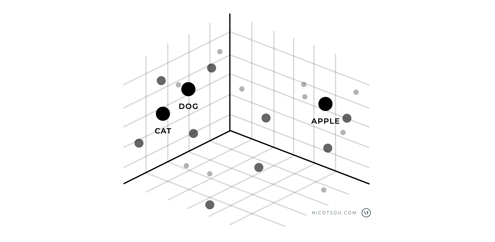

The journey of working with artificial intelligence has evolved dramatically over the past few years. What started with simple prompt engineering has grown into a sophisticated ecosystem of techniques and approaches, each building upon the last to create more powerful and personalized AI solutions.

_The LLM customization options. Complexity and cost increase as we move on the right._

This diagram illustrates the spectrum of AI model customization options, ranging from basic to advanced approaches. The simplest way is Prompt Engineering, which requires minimal setup. In the middle, you'll find RAG (which helps AI access specific information) and Fine-Tuning (which adapts AI for special tasks). The most complex option is building your own AI model from scratch, which is costly and requires the most effort, but eventually gives you complete control.

In this article, I would like to elaborate more on these techniques, and explain under which circumstances you should consider them.

## Prompt Engineering: The Art of Asking the Right Questions 📇

At its core, prompt engineering is the art of effectively communicating with AI models. It's like learning a new language - one that bridges human intent with machine understanding. By carefully crafting our prompts, we can guide AI models to provide more accurate, relevant, and useful responses.

If you want to dive deeper, I have a series of articles in this blog:

1. The Art Of Prompt Engineering
2. How to structure your prompts
3. Five prompting techniques

This approach plays a critical role in other customization strategies. In **retrieval-augmented generation (RAG)**, for example, the prompt must integrate external knowledge retrieved from a database seamlessly. Even in fine-tuned or custom-trained models, prompt engineering remains relevant to optimize the interaction between the user and the model. Its low cost and ease of use make it a powerful starting point for those exploring LLM customization.

However, as powerful as prompt engineering is, it has its limitations. Models can sometimes struggle with specific domain knowledge or fail to maintain consistency across responses.

## RAG: Bridging Knowledge Gaps 📚

AI models have a distinct knowledge cutoff date and are trained on a generic set of information. When you need to "educate" your model with domain-specific knowledge, RAG is the simplest and most efficient way to accomplish this.

Retrieval-Augmented Generation (RAG) emerged as a natural evolution to address the limitations of prompt engineering. By combining the language model's capabilities with specific, retrievable knowledge, RAG creates a more informed and accurate system. Think of it as giving the AI access to a specialized library of information that it can reference while formulating responses.

_RAG Flow_

When a user asks a question, the system searches our knowledge base for relevant documents. These documents, along with the user's original question, are then passed to the LLM. The LLM combines its existing training data with this provided information to generate a response.

RAG works with various types of databases. You can call a public API and use its response, perform a web search and analyze its results, or use traditional databases. The system works as long as the content fits within the LLM's context window and you can create a meaningful query from the user's prompt. Both requirements can be challenging, though. To overcome the limitations of conventional APIs and databases, RAG implementations often combine search indexing and vector databases.

A vector database is a special type of database that stores high-dimensional vectors representing the semantic meaning of text, images, or other data. These vectors allow for similarity searches, making it possible to find relevant information based on _meaning_ rather than just _keywords_. When integrated with RAG, vector databases enable more nuanced and contextually accurate information retrieval.

For example, in a vector space, the words "cat" and "dog" would be closer together than either word is to "apple". This is because "cat" and "dog" share many semantic properties (they're both pets, mammals, domestic animals), while "apple" represents a completely different concept (a fruit). When these words are converted to vectors, this semantic similarity is reflected in the mathematical distance between their vector representations.

Fun fact: LLMs also use dense vector embeddings as part of their neural network architecture to represent and process language. This means that when you input text to an LLM, it first converts your words into these mathematical vectors to process their meaning and relationships before generating a response. This deep understanding of semantic relationships is what enables LLMs to generate contextually appropriate and coherent text. The larger the vector space, the more nuanced these relationships become, enabling the model to capture increasingly subtle distinctions in meaning.

RAG is particularly useful for companies that need to work with their own private information or specialized knowledge that regular AI models don't know about. Companies can use RAG to help their AI systems access and understand internal documents, research, technical guides, and industry information while keeping everything secure and accurate. By combining the AI's general knowledge with a company's specific information, RAG becomes a valuable tool that helps businesses stay competitive while making the most of AI technology.

## Fine-tuning: Teaching the Model New Tricks 🎚️

While RAG enhances a model's knowledge, fine-tuning goes a step further by actually modifying the model's behavior. It's like sending an experienced professional back to school for specialized training.

Through fine-tuning, we can adapt existing models to better understand specific contexts, terminology, or ways of communicating. You show it lots of examples of questions and the kinds of answers you want it to give. This teaches the AI to respond the way you want without needing detailed instructions every time you ask it something.

Fine-tuning enables models to maintain consistent tones, incorporate standard information (like support contact details), and perform specific actions such as referencing documents or databases. However, this approach requires extensive training data and multiple iterations to achieve desired results. This can be challenging, often requiring significant trial and error before reaching optimal performance. Also, not all LLMs support fine-tuning.

I strongly recommend starting with simpler, more cost-effective solutions before moving to complex approaches. The ideal progression is to first exhaust the possibilities of prompt engineering, and RAG to enhance the model's knowledge base, or explore building agentic applications that can coordinate multiple AI capabilities. Only after thoroughly testing these approaches should you consider fine-tuning, which demands significantly more resources and technical expertise.

Despite these challenges, fine-tuning is valuable when you need consistent responses for large-scale operations. It gives you better control over how the LLM behaves than foundation models do, making responses more predictable and reducing unwanted variations.

## Training Your Own LLM: The Ultimate Customization 🐉

For organizations with unique needs and substantial resources, training a custom LLM represents the pinnacle of AI customization. This approach offers complete control over the model's capabilities and biases, but it comes with significant computational and data requirements.

Training your own LLM requires massive datasets, specialized expertise in machine learning, and substantial computing infrastructure. While this approach provides unparalleled customization potential, it's typically only feasible for large tech companies or organizations with significant AI research capabilities. The costs can run into millions of dollars, making it crucial to carefully evaluate whether the benefits justify such an investment.

## That’s all folks! 🙌

Thanks for reading! Stay tuned for more content about prompt engineering! I'll be sharing advanced techniques, real-world examples, and practical strategies to help you master the art of communicating with AI. My newsletter form is just a few DOM elements below. Don't forget to subscribe to get notified when new articles are published.

Do you have any other tips for crafting better prompts? I'd love to hear your thoughts and experiences.

Cover art generated with Adobe Firefly.
