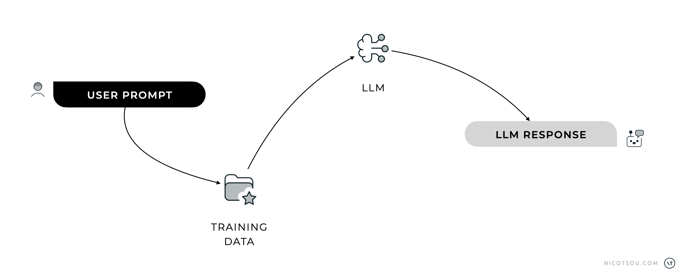
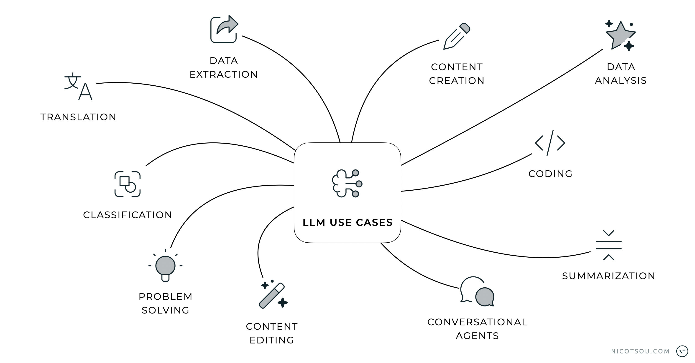
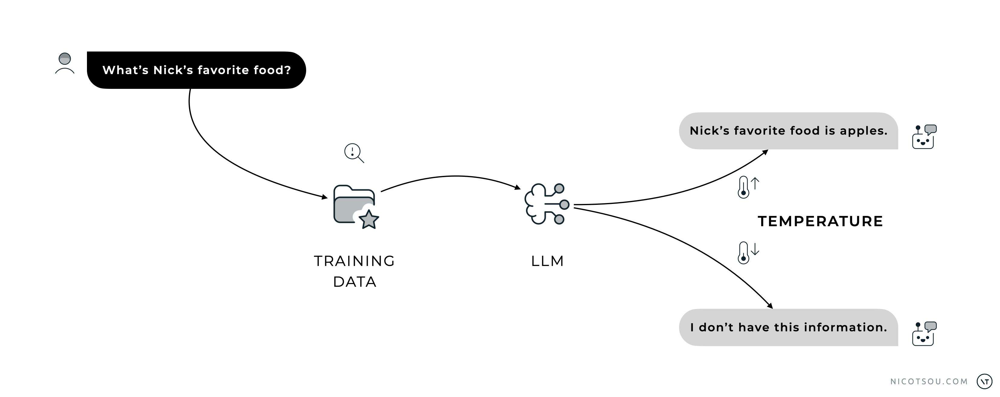

Prompt engineering is not just a buzzword; it’s the golden key to unlocking the true power of AI.

If you've ever wondered how to get a language model like ChatGPT to write you a sonnet, draft a business proposal, or debug your code, congratulations — you’re already stepped into the world of prompt engineering. It’s where human creativity meets machine intelligence, and believe me, the possibilities are mind-blowing.

But what are the core principles we need to understand in order to get the most out of it?

Let’s dive in. 🤿

## Your AI needs a better wingman

We’ve known for a while that AI is transformative. Self-driving cars, personal assistants, predictive typing — these were already reshaping our lives. But who could’ve predicted that simply typing a question into a box could lead to an explosion of creativity, productivity, and, well, [controversy](/ai-will-not-replace-software-engineers/)? Whether you’re writing an essay or building an AI agent, prompt engineering is becoming the *skill* that sets you apart.

> **Prompt engineering is the _blueprint_ for successful AI products.**

Just look around; AI is reshaping every corner of our digital landscape. From Gmail suggesting email completions to Midjourney generating artwork, from GitHub Copilot writing code to Jasper crafting marketing copy — GenAI has become as ubiquitous as smartphones. Better than the Metaverse. Companies are racing to integrate AI capabilities into their products, and professionals across industries are discovering that mastering these tools isn't just an option anymore. It's becoming a necessity for staying competitive.

And what's at the heart of all these innovations? Spoiler Alert!

## The Art of Talking to Machines

Here’s the thing: Large Language Models (LLMs) like ChatGPT are incredibly smart, but they’re not psychic. They rely on your input to decide how to respond. Think of them as your all-knowing buddy who’s willing to help, but only if you know how to ask the right questions. That’s where prompt engineering comes in. It’s all about crafting the perfect _ask_.

_Every LLM interraction starts with a user prompt._

At the heart of every response from an LLM lies an intricate process that begins with your prompt. Here’s the short version: LLMs are trained on massive datasets of text — think everything from books and articles to code and social media. Their goal? To predict the most likely next word or _token_ based on the context you provide.

Ask a vague question like, “Tell me about history,” and you’ll probably get a Wikipedia-like overview that’s about as thrilling as a tax document. But ask, “Explain the causes of the French Revolution in a conversational tone, as if you were telling a story to a high school student,” and voilà, you get something compelling, insightful, and tailored to your needs.

Prompt engineering isn’t just about getting answers; it’s about getting the *right* answers. It’s the skill that transforms AI from a mediocre intern to your personal superhero.

_THe use cases of Large Language Models._

## What can I do with Generative AI?

Have you ever wondered what you can do with ChatGPT, or Generative AI in general? Here's a comprehensive list of ten powerful use cases where LLMs excel, transforming industries and workflows:

1. **Data Extraction**: LLMs can sift through vast amounts of information to extract specific data points, whether it’s names, dates, or insights from unstructured text, saving countless hours of manual labor.
2. **Content Creation**: From writing articles and blog posts to crafting marketing campaigns or creative stories, LLMs help generate quality content tailored to specific needs.
3. **Data Analysis**: LLMs can analyze and interpret data trends, providing summaries, insights, and recommendations based on complex datasets.
4. **Coding**: LLMs excel at code generation, and they are becoming better as we go. Developers can use them for debugging, documentation generation, and even learning new programming languages.
5. **Summarization**: LLMs distill lengthy reports, articles, or conversations into concise and actionable summaries, ideal for professionals juggling information overload.
6. **Conversational Agents**: Customer support chatbots, virtual assistants, and AI-driven help desks use LLMs to provide human-like interactions and solve user queries effectively.
7. **Content Editing**: Editing and enhancing written content is another strength, whether it’s improving grammar, rephrasing text for clarity, or matching a specific tone of voice.
8. **Problem Solving**: LLMs assist in solving complex problems, offering suggestions, potential solutions, or even step-by-step guides for technical or abstract challenges.
9. **Classification**: Organizing data into meaningful categories, like labeling documents or identifying sentiment in customer feedback, is a task LLMs excel at.
10. **Translation**: Breaking language barriers, LLMs provide accurate and nuanced translations for both professional and casual use.

You don’t believe me? This exact list was written by ChatGPT.

_"You know I will become the author of this blog, so I'm acting nice!"_

## The Good, the Bad, and the Dummy

Not all LLMs are created equal. Here’s a quick breakdown of what sets them apart:

**Size**: Models vary in the number of parameters they have. Think of parameters as the “brainpower” of the model. Larger models like GPT-4 have billions of parameters, which make them more capable of handling complex tasks, though they require more computational resources.

**Training Data**: The quality and diversity of training data significantly impacts a model's capabilities. Models trained on broader, more diverse datasets tend to perform better across different tasks and domains.

**Knowledge Cutoff Date**: This represents the last date included in the model's training data. For example, GPT-4 has a cutoff date in 2023, meaning it won't have information about events after that date. Always verify the cutoff date when working with time-sensitive information.

**Context Windows**: This refers to the amount of text the model can process at once. Smaller models may only handle a few hundred tokens (roughly a paragraph), while advanced ones can manage thousands. Longer context windows allow for more detailed interactions but may require optimization to avoid overwhelming the model.

**Multimodality**: Some models aren’t limited to text. Multimodal models like GPT-4 Vision can process both text and images, opening up possibilities for tasks like image analysis, visual storytelling, and more.

**Performance**: Each model has different strengths in areas like reasoning, creativity, and factual accuracy. More recent models generally show improved performance but may require more computational resources.

**Pricing**: Models range from open-source options to subscription-based services. While some are freely available, enterprise-grade models like GPT-4 require paid subscriptions. Cost typically scales with usage and capabilities.

The type of LLM you choose depends on your needs, whether you’re analyzing data, creating content, or solving problems in real time.

## Magic mushrooms and their implications

When you type a prompt, the LLM doesn’t “know” things in the way humans do. Instead, it uses patterns and probabilities learned during training to generate a response. If you ask, “Explain photosynthesis in simple terms,” the model analyzes your input, matches it with patterns it has seen before, and constructs a coherent answer.

_The best case scenario when the LLM isn't trained to answer our question._

No, we’re not talking about trippy visuals and mushrooms. In AI terms, hallucinations happen when the model generates outputs that are factually incorrect or completely made up. For example, if you ask about an obscure historical event, the model might confidently invent details that sound plausible but are false.

## Turning up the heat

Another important factor that influences hallucinations is the "temperature" setting. Temperature controls how creative or random the model's responses are. A temperature of 0 makes responses more deterministic and focused, reducing hallucinations but potentially making outputs more rigid. Higher temperatures (like 0.7-1.0) increase creativity and variability, but also increase the likelihood of hallucinations

> Think of temperature like a creativity dial.

Low settings keep the model strictly on track, while higher settings let it explore more possibilities, but at the same time decreasing the factual accuracy.

_Temperature may help on minimizing hallucinations._

To minimize hallucinations while maintaining engaging responses, consider:

- Setting appropriate temperature based on your task (lower for factual queries, higher for creative writing)
- Using system prompts that emphasize accuracy over creativity
- Implementing fact-checking mechanisms in your workflow

But there’s a catch. The model doesn’t truly understand the world. It’s just really good at guessing the next most logical word. This is why prompt engineering matters: the better you frame your input, the more likely you are to get a response that meets your needs.

## Tone of Voice

In the article [The Four Dimensions of Tone of Voice](https://www.nngroup.com/articles/tone-of-voice-dimensions/), Kate Moran explores how a product's tone of voice reflects an organization's attitude toward its message. She identifies four primary dimensions to analyze tone: formality (formal vs. casual), humor (serious vs. funny), respectfulness (respectful vs. irreverent), and enthusiasm (matter-of-fact vs. enthusiastic). Moran emphasizes that each piece of content can be positioned along these spectrums, influencing how users perce

_Dimensions of tone of voice are not binary but exist on a spectrum._

Moran illustrates how varying these dimensions can alter the delivery of the same message. For instance, an error message can be conveyed in multiple tones, from formal and serious to casual and humorous, depending on the chosen combination of dimensions. She advises that selecting the appropriate tone should align with the brand's personality and the users' expectations. Additionally, she underscores the importance of consistency across all touchpoints and suggests that tone should be part of an omnichannel strategy to ensure a cohesive user experience that aligns with the brand's identity.

LLMs are chameleons of communication. Whether you need a formal report or a casual conversation, the tone of voice you specify in your prompt can drastically alter the output. Imagine asking for an explanation of quantum mechanics:

- **Formal Tone**: “Explain the principles of quantum mechanics in an academic manner.”
- **Casual Tone**: “Can you break down quantum mechanics like you’re explaining it to a friend?”

Both prompts tackle the same topic but yield wildly different responses. The tone you set ensures that the AI aligns with your audience and purpose, making your communication more effective.

## Tokens, those little monsters!

Even the most advanced LLMs have quirks and limitations. Here are some of the key challenges you’ll encounter and how to handle them:

_Using OpenAI Tokenizer to get the number of tokens._

LLMs process inputs and outputs in “tokens,” which are chunks of text (like words or parts of words). Each model has a limit on how many tokens it can handle in one interaction. Exceed the limit, and your input might get cut off, leading to incomplete or irrelevant responses.

To optimize token usage:

- Keep prompts concise and to the point.
- Use summaries instead of lengthy context.
- Use a chain of prompts, and summarize as you go.
- Find practical ways to optimize the size of your content.

---

Follow along as we explore everything from basic concepts to advanced strategies. Stay tuned for more articles in this series in which I’ll be covering some Pro Tips I have collected!

_Cover art generated with Adobe Firefly_
