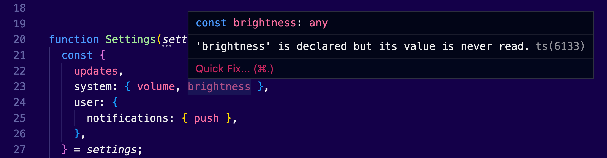

Destructuring is one of these _aha_ moments you have as a software engineer. It's actually a JavaScript feature.

> After spending your life trying to read values from arrays or objects, you discover the syntax that changes your life. Forever.

This article will teach you the basics of destructuring arrays and objects. I have collected some useful tips on how to set default values and how to use aliases. We will also learn how to integrate types in TypeScript.

It wasn’t a straightforward process for me, but I have to say it made sense after all. 🤓

If you’re new to JavaScript or TypeScript, this article will help you understand many of the things that are happening in the code. It’s a feature that is highly used in every project.

Apfelkunchen? 🍰

## Destructuring Objects

To explain how destructuring works, consider the following object structure that hosts application settings:

```tsx
const settings = {
  updates: 0,
  system: {
    volume: 0.5,
    brightness: 0.7,
    darkMode: false,
  },
  user: {
    notifications: {
      email: false,
      push: true,
      inApp: true,
    },
  },
}
```

We could write a React component to display the values to the user:

```tsx
function Settings(settings) {
  // Declaring variables for the properties we're consuming
  const updates = settings.updates
  const volume = settings.system.volume
  const push = settings.user.notifications.push

  return (
    <ul>
      <li>There are {updates} updates pending.</li>
      <li>The volume is set to {volume}.</li>
      <li>You have {push ? '' : 'not'} enabled push notifications.</li>
    </ul>
  )
}
```

Not a big fan of React? Well, it’s not important for this example. You can simply imagine that this function will output HTML markup for us.

Let’s focus on the first 3 lines within our function.

This initialization could become extremely useful when we are consuming values multiple times within the scope of a function or a method. It’s better if you have to type `push` instead of the complete path `settings.user.notifications.push`.

Yes, I know.

IDEs are our friends. They could make code completion very easy for us. But such verbosity will make your code harder to read.

So, what are you telling me Nicos? Do I have to instantiate the values for all these properties? In every single function that I’m writing? That’s nonsense!

Well… Yes!

You should strive to declare the variables, but not all of them, just the ones you are consuming. And the destructuring operator makes the whole process much easier for you.

Here’s how we could destructure the `updates` property from the `settings` object:

```tsx
const { updates } = settings
```

And that was it!

In this example, we have just created a constant `updates`, which is a _copy_ of the settings counter. And I’m highlighting the word copy here, because if you remember literal values are being copied, reference values are not. The same doesn’t apply if you try to destructure an object value.

Now, what if I wanted to access a nested value?

Here’s what we could try:

```tsx
const {
  updates,
  system: { volume },
  user: {
    notifications: { push },
  },
} = settings
```

If this is a new concept for you, it may take you some time to read and understand. Take your time. All we’re doing here is to use the same logic that we use to define an object structure, but instead of creating an object, we are declaring constants that host the values of the `settings` object properties that we select.

The previous example will produce the following constants: `updates`, `volume`, and `push`.

It’s important to note here, that the `system`, `user`, and `notifications` are not going to be declared. The compiler will use them as a map to understand from where it will retrieve the values they encapsulate.

And that’s it! We can now replace the previous code in our function:

```tsx
function Settings(settings) {
  // Destructuring the variables before using them
  const {
    updates,
    system: { volume },
    user: {
      notifications: { push },
    },
  } = settings

  return (
    <ul>
      <li>There are {updates} updates pending.</li>
      <li>The volume is set to {volume}.</li>
      <li>You have {push ? '' : 'not'} enabled push notifications.</li>
    </ul>
  )
}
```

Now someone will argue if this is actually less code than we used to have before. And I would agree with you that this produces more lines of code than we had. But we don’t repeat ourselves. If we want to display, let’s say for example the brightness level, all we have to do is to destructure its property name:

```tsx
function Settings(settings) {
  const {
    updates,
    // highlight-start
    // Adding another variable is easier now
    system: { volume, brightness },
    // highlight-end
    user: {
      notifications: { push },
    },
  } = settings

  return (
    <ul>
      <li>There are {updates} updates pending.</li>
      <li>The volume is set to {volume}.</li>
      <li>The brightness is set to {brightness}.</li>
      <li>You have {push ? '' : 'not'} enabled push notifications.</li>
    </ul>
  )
}
```

It’s much easier to work with this component.

Since these are actual variables, our text editor will let us know if some of the variables are not being used anymore.



### Setting default values

The destructuring operator allows us to specify _default_ values, in case there are no values set.

For that, we use the `=` operator:

```tsx
const {
  // Setting the default value for the updates to be 0
  updates = 0,
  // highlight-start
  // Setting the default value for the volume to be 0.3
  system: { volume = 0.3 },
  // highlight-end
  user: {
    // Setting the default value for the push notifications to be false
    notifications: { push = false },
  },
} = settings
```

Here we are setting that the `updates` should have a default `value = 0`, the `volume = 0.3`, and the `push` notifications must be `false` by default.

### Aliases

Another cool feature is that we could rename the properties. This is needed in many cases. For example, you may have another variable in that scope which already uses that name `updates`. This conflict will reduce compiler errors in TypeScript, or it will silently fail in JavaScript.

Here’s how we can set a custom name, aka _alias_:

```tsx
const { updates: updatesCounter } = settings
```

This is equivalent to the following:

```tsx
const updatesCounter = settings.updates
```


### How to add types?

Now, the tricky part is that the syntax is pretty much the same as the one TypeScript uses to declare the types.

Because of that, we need to define types in a separate object structure, following the initial destructuring object:

```tsx
const { updates: updatesCounter }: { updates: number } = settings
```

This is cumbersome on multiple levels:

- To destructure the value `settings.updates` you must get it from the `updatesCounter` constant. It’s like an alias for the `updates` property.
- The constant `updates` is _not_ going to be declared, which lets you use it in that scope for something else.
- The type declaration is defined in a second object structure, right after the first one. For this object structure we are using the `initial` name of the property `updates`, and not the alias `updatesCounter`.

And that’s it! Basically now you are able to use the destructuring operator with any object type, you know how to define types for it, how to set default values, and how to use aliases for it’s property names.

Now try it by yourself!

Can you add types to the following code?

```tsx
const {
  updates,
  // highlight-start
  system: { volume, brightness },
  // highlight-end
  user: {
    notifications: { push },
  },
} = settings
```

You will find the solution at the end of the article.

---

One last tip: We could move the destructuring operator in the function parameters:

```tsx
// We pass an object in the parameters
function Settings({
  updates,
  system: { volume, brightness },
  user: {
    notifications: { push },
  },
}) {
  return (
    <ul>
      <li>There are {updates} updates pending.</li>
      <li>The volume is set to {volume}.</li>
      <li>You have {push ? '' : 'not'} enabled push notifications.</li>
    </ul>
  )
}
```

This is a bit trickier to read, especially if you are new to destructuring objects. But it’s actually simpler if you get used to it. Many developers prefer this way for writing React components.

As an exercise, you can try to write types for these React component constants. You will find the answer at the end of this post.

## Destructuring arrays

Destructuring works perfectly with arrays.

Now, arrays don’t exactly have named properties, like objects do:

```tsx
const genres = ['Rock', 'Pop', 'RnB']
```

We can only store their indexed values with a more friendly name:

```tsx
const first = genres[0]
```

Here’s how you can use destructuring to get the same result:

```tsx
const genres = ['Rock', 'Pop', 'RnB']
const [first, second] = genres
first // 'Rock'
second // 'Pop'
```

Note that we use `[]` brackets instead of `{}` object literals.

Also, we don’t care about how many elements an array has. We are only storing the first two items.

This code is equivalent to the following:

```tsx
const first = genres[0]
const second = genres[1]
```

Comparing these two approaches, we could see that the first one is much simpler to read and more compact.

Similar to how we declare types for object destructuring, we could specify the types of our variables right after their declaration:

```tsx
const [first, second]: string[] = genres
```

We can also skip items that we don’t want:

```tsx
const [first, , third] = genres
```

Here, we are getting only the first and the third items.

We can also skip the first item:

```tsx
const [, , third] = genres
```

This will only give us the third item.

### Default values

Of course, default items are also supported:

```tsx
const [first = ''] = genres
```

The first item will get the item of an empty string, if it’s `undefined` or `null`. For example, when the array is empty.

Pretty practical, right? 😎

Ah, and one more tip.

This becomes quite useful when you combine it with functions:

```tsx
function getFirst([first]: [string]) {
  return first
}
```

## The solution

Here’s how we could declare types for our destructured constants:

```tsx
const {
  updates,
  system: { volume, brightness },
  user: {
    notifications: { push },
  },
}: {
  updates: number
  system: { volume: number; brightness: number }
  user: {
    notifications: { push: boolean }
  }
} = settings
```

We can increase readability by separating the types to an interface:

```tsx
interface SettingsProps {
  updates: number
  system: { volume: number; brightness: number }
  user: {
    notifications: { push: boolean }
  }
}

const {
  updates,
  system: { volume, brightness },
  user: {
    notifications: { push },
  },
}: SettingsProps = settings
```

And this is the most common way to specify props for our React components in TypeScript projects.

Cover artwork by [Pawel Czerwinski](https://unsplash.com/@pawel_czerwinski). The artwork within the article is created by [Milad Fakurian](https://unsplash.com/@fakurian).
