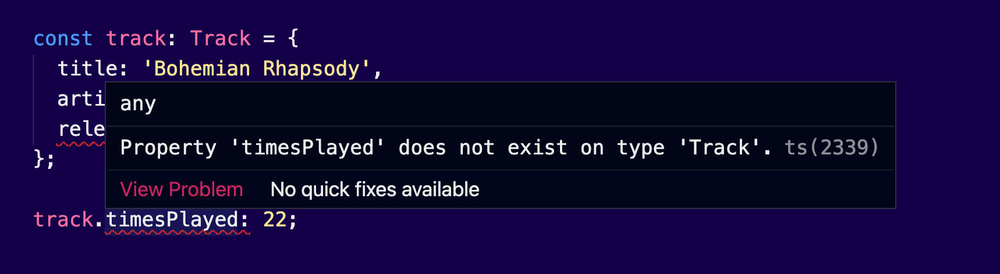
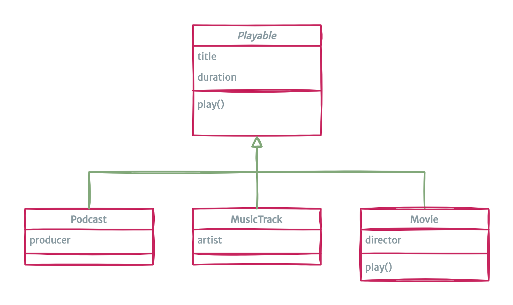
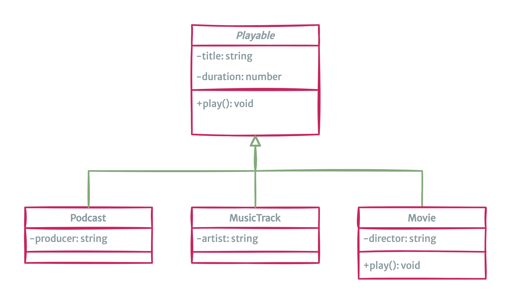
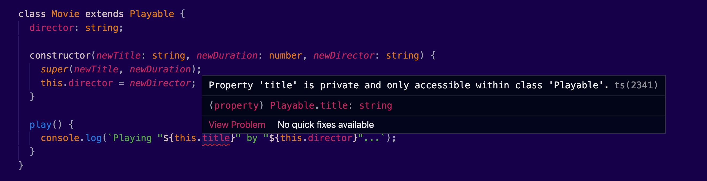
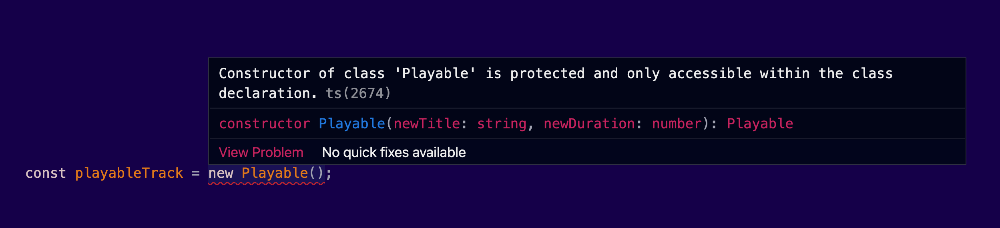
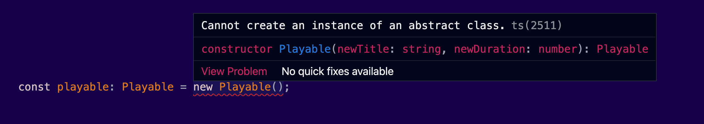
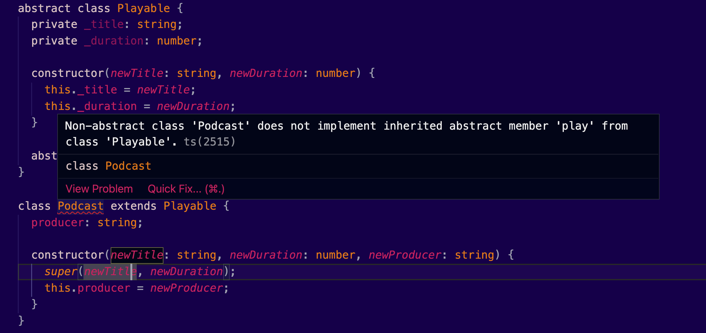
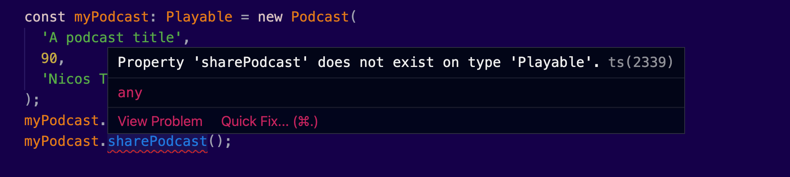

Since the very early versions of TypeScript, the language provided support for the `class` keyword, together with some additional features, that you find in classic object-oriented languages.

In this article we will discover how TypeScript helps us create classes and how it transforms JavaScript into a more traditional OOP experience. I will explain how to add types and how to implement inheritance, enforce private and protected members, add accessors and abstract classes. We will then talk about the structural type system of TypeScript, which differs from the other flavors of OOP, you may probably be familiar with.

But first, let’s revisit what we’ve learned about classes and how JavaScript defers from it. This will help you have a better understanding of what’s going on.

Sandae? 🍧

---

## Let’s talk about objects, first

There are multiple ways to create an object in JavaScript. Here's the most convenient and common way:

```typescript
const track = {
  title: 'Bohemian Rhapsody',
  artist: 'Queen',
  releasedAt: 1975,
}
```

Now, in contrary to other languages, nobody stops me from editing this object by adding or changing its properties:

```typescript
track.timesPlayed: 22;
```

Nobody except TypeScript of course. Here’s the same example, after adding types:

```typescript
type Track = {
	title: string;
  artist: string;
	releasedAt: string;
}

const track: Track = {
  title: 'Bohemian Rhapsody',
	artist: 'Queen',
  releasedAt: 1975 // Type error: not a string
};

track.timesPlayed: 22;  // Property 'timesPlayed' does not exist on type 'Track'
```

And here's the error I will get when I try to set a value to a property that doesn’t exist:



Brilliant! Now we can relax because our objects will follow a structure. There are rules in the game. TypeScript acts again as a guard against typos or common mistakes.

Although, this adds a lot, we still have the problem of how to organize our code. You see, types are perfect for protecting us from errors, but they simply don't exist at runtime. TypeScript will remove those types altogether, when it will compile our code to JavaScript.

We need a better tool to define object structures and their relationships.


_Photo Credit: [Debby Hudson](https://unsplash.com/photos/RXKERUSGN8U)_

## What is a class?

> A class is a blueprint for an object.

Think of it as a higher-level data type, similar to how you use `const` or `let`.

```typescript
const x
```

Similarly, you can use a _class_ to create objects that have a specific structure:

```typescript
MyClass myObject;
```

In this example we have a class `MyClass` and we instantiate the object `myObject`. Note that classes, by convention, start with a capital letter (PascalCase) but objects, like any other variable by convention, start with a small letter (camelCase).

Matt Weisfeld, in his book “The Object-Oriented Thought Process”, resembles a class as a cookie cutter. You take the cookie dough and you use the cookie cutter to make the cookies. That’s how you can use a `class` to _instantiate_ objects.

Classes help us organize our code. Instead of having your code in a bunch of functions and variables, that are unrelated to each other, you can structure everything into a _class_.

In most programming languages, a `class` is used to create an _object_. It describes the contents of objects that belong to it. The data fields that it contains, and its operations. We call those _properties_ and _methods_ accordingly.

## The ugly truth

> As you may already know, there are no classes in JavaScript.

It is a prototype-based object oriented language. This basically means that any object in JavaScript inherits properties and methods from a _prototype_. This prototype could be another object, or one of the built-in objects.

This maximizes code reuse. Think of it like a traditional class inheritance, but without the necessity of defining everything upfront.

It’s easy to follow a prototype chain. Just try to get the prototype of a `date` variable:

```typescript
const date = new Date()
Object.getPrototypeOf(date) // returns a reference to Date
```

Up until now, in JavaScript, you couldn’t define the relationships of the objects upfront using a class. You _had_ to create objects that inherit from other objects. There was a need to have a more sophisticated way to create objects with a given structure. That’s why JavaScript developers were used to leverage plain functions to create objects. They worked exactly as _constructors_.

Take a moment to review the functional constructor below:

```typescript
var Track = (function () {
  function Track(title, artist, releasedAt) {
    // set default values
    this.title = 'Untitled'
    this.artist = 'Unknown Artist'
    this.releasedAt = 'Unknown Release Date'

    // assign values passed via arguments
    this.title = title
    this.artist = artist
    this.releasedAt = releasedAt
  }
  return Track
})()
```

It’s quite an inconvenient way to write code, don’t you think?

Since ES6, we can simply use the `class` keyword to define classes:

```typescript
class Track {
  title = 'Untitled'
  artist = 'Unknown Artist'
  releasedAt = 'Unknown Release Date'

  constructor(title, artist, releasedAt) {
    this.title = title
    this.artist = artist
    this.releasedAt = releasedAt
  }
}
```

This is just a syntactic sugar. In the background it _still_ works exactly as before.

## TypeScript to the rescue

TypeScript was one of the first languages that provided support for creating classes. Any valid JS `class` declaration is valid in TypeScript as well.

Depending on the compiler configuration, you have to define types for the class members.

Remember the previous example? Let’s add some types on it:

```typescript
class Track {
  // highlight-start
  title: string = 'Untitled'
  artist: string = 'Unknown Artist'
  releasedAt: string = 'Unknown Release Date'
  // highlight-end

  // highlight-start
  constructor(title: string, artist: string, releasedAt: string) {
    // highlight-end
    this.title = title
    this.artist = artist
    this.releasedAt = releasedAt
  }
}
```

Here’s how we can create an object from our class, by consuming its constructor:

```typescript
const track = new Track('Bohemian Rhapsody', 'Queen', 1975)
```

As you may have noticed, we don't explicitly specify a type for the `track` object. TypeScript will automatically set that this is an instance of `Track`. There is a way to explicitly define the type, though:

```typescript
const track: Track = new Track('Bohemian Rhapsody', 'Queen', 1975)
```

Many developers prefer this way, because it's much more readable. If you use a function that returns an object, for example, you will miss the information in your head what kind of object our `track` was. It’s a detail, I know. But it helps a lot!

Now, let’s try to add a new property that doesn't exist in the class definition:

```typescript
const track: Track = {
  title: 'Bohemian Rhapsody',
  artist: 'Queen',
  releasedAt: '1975',
  // highlight-start
  newProp: 'with a value',
  // highlight-end
}
```

Yes, my friends, you guessed it correctly. We will get an error:


---

In JavaScript, when a variable doesn't have a value, it's `undefined`. The same applies for our class properties. We could leverage the usage of unions to allow `undefined` values:

```typescript
class Track {
  // highlight-start
  id: string | undefined
  // highlight-end
  title: string = ''
  artist: string = ''
  releasedAt: string = ''

  // highlight-start
  constructor(id: string, title: string, artist: string, releasedAt: string) {
    this.id = id
    // highlight-end
    this.title = title
    this.artist = artist
    this.releasedAt = releasedAt
  }
}
```

We could also have optional properties with the `?` character:

```typescript
class Track {
  id: string | undefined
  title: string = ''
  artist: string = ''
  releasedAt: string = ''
  isFavorite?: boolean

  constructor(
    id: string,
    title: string,
    artist: string,
    releasedAt: string,
    isFavorite?: string
  ) {
    this.id = id
    this.title = title
    this.artist = artist
    this.releasedAt = releasedAt
    this.isFavorite = isFavorite
  }
}
```

Here, the `isFavorite` flag can be completely omitted when we are instantiating object from this class. Basically, this means its value will be `undefined`.


_Photo Credit: [Eugenia Kozyr](https://unsplash.com/photos/r1sTNKz0omE)_

## Structural type system

This is one of the most difficult concepts of TypeScript, for people who are not familiar with JavaScript. It’s the way the language checks the compatibility of the types.

Here’s a simplified version of what is possible in TypeScript:

```typescript
const track: Track = {
  title: 'Bohemian Rhapsody',
  artist: 'Queen',
  releasedAt: '1975',
}
```

Here, we're basically bypassing the constructor altogether. We are creating an object, using an object literal, and then we're passing this object to a `track` variable. TypeScript will compare the shape of this object with the shape of the class `Track`. If there are no type violations in its methods, no errors will be thrown.

Now let’s see a different example:

```typescript
class Dog {
  name: string = 'Nobody'
}
class Cat {
  name: string = 'Nobody'
}
const cat = new Cat()
const dog = new Dog()
const animal: Dog = cat
```

Here these two objects originate from completely different classes. We have a `Cat` and a `Dog`. But observe what is happening if I assign a cat to a dog. No errors whatsoever.

Somebody will argue how good this approach really is. TypeScript has to be more flexible here, because JavaScript doesn't have types. And strategically speaking, backwards compatibility is really crucial. That's why they had to use a concept called duck typing. [Duck typing](https://en.wikipedia.org/wiki/Duck_typing) in computer programming is an application of the duck test:

> "If it walks like a duck and it quacks like a duck, then it must be a duck"

In the example above, both these objects have a `name` property, which is of course `public`. That makes them practically compatible.

## Inheritance

In the following example, I’m declaring a `Playable` class, and I’m using it to create three additional classes that derive from it:



Here is how we can implement it in TypeScript:

```typescript
class Playable {
  title: string
  duration: number

  constructor(newTitle: string, newDuration: number) {
    this.title = newTitle
    this.duration = newDuration
  }

  play() {
    console.log(`Playing "${this.title}"...`)
  }
}

class MusicTrack extends Playable {
  artist: string

  constructor(newTitle: string, newDuration: number, newArtist: string) {
    super(newTitle, newDuration)
    this.artist = newArtist
  }
}

class Podcast extends Playable {
  producer: string

  constructor(newTitle: string, newDuration: number, newProducer: string) {
    super(newTitle, newDuration)
    this.producer = newProducer
  }
}

class Movie extends Playable {
  director: string

  constructor(newTitle: string, newDuration: number, newDirector: string) {
    super(newTitle, newDuration)
    this.director = newDirector
  }
}
```

Note that I’m using the `extends` keyword, which is another feature of JavaScript.

I can then instantiate an `Movie` object:

```typescript
const myMovie = new Movie('The Godfather', 175, 'Francis Ford Coppola')
myMovie.play() // Playing "The Godfather"...
```

Now, let’s try to override the `play()` method of the class `Movie`:

```typescript
class Movie extends Playable {
  director: string

  constructor(newTitle: string, newDuration: number, newDirector: string) {
    // calls the constructor of the parent class
    super(newTitle, newDuration)
    this.director = newDirector
  }

  // highlight-start
  play() {
    console.log(`Playing "${this.title}" by "${this.director}"...`)
  }
  // highlight-end
}
```

And, as expected, when we call the `play()` method, the message that we get is different:

```typescript
const myMovie = new Movie('The Godfather', 175, 'Francis Ford Coppola')
myMovie.play() // Playing "The Godfather" by "Francis Ford Coppola"...
```

## Private & protected methods

Class properties and methods are kinda useless without specifying their privacy. In the previous example, I can directly change the values of the properties or call the `play()` method, from anywhere in my code:

```typescript
myMovie.title = 'broken title'
myMovie.play() // Playing "broken title" by "Francis Ford Coppola"...
```

In a real-world application, you wouldn’t allow anyone to access our class members directly. In fact, this privacy is one of the key benefits of OOP.

An improved version of our previous design can be the following. Our ultimate goal is to protect the properties:



TypeScript adds better support for private methods. It’s important to remember that the following keywords are only available during compilation, and they aren’t available at runtime. Nothing protects you from accessing their values. If you really need that protection, ECMAScript 2015 has support for private properties or methods. But I would say it’s syntax [is quite weird](https://developer.mozilla.org/en-US/docs/Web/JavaScript/Reference/Classes#field_declarations). So use it only in rare cases, when it’s really important to protect your objects.

By default, all class members are public. You can omit the `public` keyword. Here’s what we’ve meant in the previous example, when we were declaring the class `Playable`:

```typescript
class Playable {
  public title: string
  public duration: number

  constructor(newTitle: string, newDuration: number) {
    this.title = newTitle
    this.duration = newDuration
  }

  public play() {
    console.log(`Playing "${this.title}"...`)
  }
}
```

To restrict access to our properties, we can use the `private` keyword:

```typescript
class Playable {
  // highlight-start
  private title: string
  private duration: number
  // highlight-end

  constructor(newTitle: string, newDuration: number) {
    this.title = newTitle
    this.duration = newDuration
  }

  play() {
    console.log(`Playing "${this.title}"...`)
  }
}
```

An attempt to change the title will fail:

```typescript
myMovie.title = 'broken title'  // Error: Property title is private and only accessible within class Playable
```

That’s very convenient and secure. As a side effect, we can’t even access or change this property from within the derived classes. You will notice that now our Movie class, has a very interesting error:



We can use the `protected` keyword, to allow accessing class properties, or methods, from derived classes:

```typescript
class Playable {
  protected title: string;
  protected duration: number;

	...
}
```

A constructor can also be marked as `protected`. This means that the class cannot be instantiated outside its containing class, but can be extended.

For example, if we set our costructor to `protected`:

```typescript
class Playable {
  // highlight-start
  protected title: string;
  protected duration: number;
  // highlight-end

  // highlight-start
  protected constructor(newTitle: string, newDuration: number) {
  // highlight-end
    this.title = newTitle;
    this.duration = newDuration;
  }

  ...
}

const playableTrack = new Playable();  // throws an error
```

Which doesn't allow my to access:

It won’t be possible to instantiate new objects from the `Playable` class:



---

We can use the `readonly` keyword to define properties that behave as constants:

```typescript
class Playable {
  // highlight-start
  protected readonly title: string;
  protected readonly duration: number;
  // highlight-end
	...
}
```

Properties that are marked as `readonly`, cannot change, even within derived classes:

```typescript
class Movie extends Playable {
  director: string;

  constructor(newTitle: string, newDuration: number, newDirector: string) {
    super(newTitle, newDuration);
    this.director = newDirector;
    // highlight-start
    this.title = '';  // cannot assign to title because it is a read-only property
    // highlight-end
  }

	...
}
```

## Accessors

We can use setters and getters in combination with our private properties:

```typescript
class Playable {
  private _title: string
  private _duration: number

  // highlight-start
  get duration(): number {
    return this._duration
  }

  set duration(newDuration: number) {
    if (newDuration && newDuration < 0) {
      throw new Error('Duration cannot be negative')
    }

    this._duration = newDuration
  }
  // highlight-end

  constructor(newTitle: string, newDuration: number) {
    this._title = newTitle
    this._duration = newDuration
  }

  play() {
    console.log(`Playing "${this._title}"...`)
  }
}
```

Here, I’m using an underscore `_` as a prefix to differentiate the private properties. It’s a common naming convention.

These accessor functions can have their own logic. For example, we check for negative `duration` values.

Here’s how we use them:

```typescript
const playableTrack = new Playable('something', 111)
playableTrack.duration = -1 // throws an error, Duration cannot be negative
```

Accessors with a `get` and no `set` are automatically inferred to be `readonly`.

## Guarding methods with types

Now let's try to write our custom method:

```typescript
class Playable {
  private _title: string
  private _duration: number

  get duration(): number {
    return this._duration
  }

  set duration(newDuration: number) {
    if (newDuration && newDuration < 0) {
      throw new Error('Duration cannot be negative')
    }

    this._duration = newDuration
  }

  constructor(newTitle: string, newDuration: number) {
    this._title = newTitle
    this._duration = newDuration
  }

  play() {
    console.log(`Playing "${this._title}"...`)
  }

  // highlight-start
  getDurationTime(): string {
    const hours: number = Math.floor(this._duration / 60)
    const minutes: number = this._duration % 60

    return `${hours}:${minutes}`
  }
  // highlight-end
}
```

Everything that applies to functions can be used for defining methods in classes.

```typescript
const playableTrack = new Playable('something', 111)
console.log(playableTrack.getDurationTime()) // 1:51
```

I don’t know if you agree with me, but this hardcoded `60` value looks kinda odd to me. We can refactor it using the `static` keyword:

```typescript
class Playable {
  // highlight-start
  static minutesPerHour: number = 60;
  // highlight-end
  private _title: string;
  private _duration: number;

	...

  getDurationTime(): string {
    // highlight-start
    const hours: number = Math.floor(this._duration / Playable.minutesPerHour);
    const minutes: number = this._duration % Playable.minutesPerHour;
    // highlight-end

    return `${hours}:${minutes}`;
  }
}
```

Ah much better! I feel like I'm writing C# now.

## Abstract classes

TypeScript adds support for `abstract` classes:

```typescript
abstract class Playable {
  protected _title: string
  protected _duration: number

  constructor(newTitle: string, newDuration: number) {
    this._title = newTitle
    this._duration = newDuration
  }

  abstract play(): void // must be implemented in derived classes
}
```

For starters, we cannot instantiate objects from an `abstract` class:



Abstract classes allow us to define abstract methods. These are methods that don’t have any implementation, but we expect from the derived classes to implement them. We only define the signatures of those abstract methods. TypeScript will make sure they are followed by the book.

To illustrate this in practice, consider the following derived class:

```typescript
class Podcast extends Playable {
  producer: string

  constructor(newTitle: string, newDuration: number, newProducer: string) {
    super(newTitle, newDuration)
    this.producer = newProducer
  }
}
```

In the previous example, we extend the class `Playable`, to create a `Podcast` class. Note that if we fail to implement all its methods, we will get a very informative compilation error:



Now let’s fix this, by implementing the `play()` method:

```typescript
class Podcast extends Playable {
  producer: string

  constructor(newTitle: string, newDuration: number, newProducer: string) {
    super(newTitle, newDuration)
    this.producer = newProducer
  }

  play() {
    console.log(`Playing "${this._title}"...`)
  }
}
```

We can use our `Podcast` class to create podcasts:

```typescript
// highlight-start
const myPodcast: Podcast = new Podcast(
  // highlight-end
  'A podcast title',
  90,
  'Nicos Tsourektsidis'
)
playable.play()
playable.sharePodcast()
```

And here’s where the magic begins. We can use the type of the abstract class `Playable` to indicate that our variable can host any object from classes that derive from `Playable`:

```typescript
// highlight-start
const playable: Playable = new Podcast(
  // highlight-end
  'A podcast title',
  90,
  'Nicos Tsourektsidis'
)
playable.play() // This is defined in the abstract class, it will work
playable.sharePodcast() // This method will not work, it's not defined
```

And now we have access to all the methods and properties that exist in the `Playable` class. This allows us to perform high-level actions on a variety of objects that have completely different implementations.

If we try to access a method or a property that’s not defined in the parent abstract class, this will thow an error:



Cover Credit: [Nataliya Smirnova](https://unsplash.com/photos/3T6LAs2JhMw)
