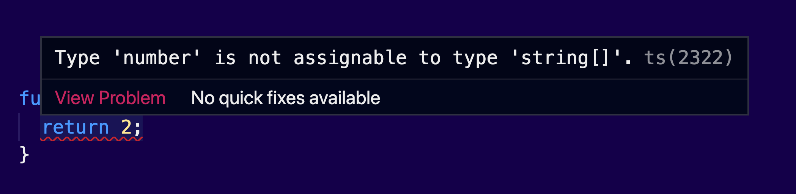
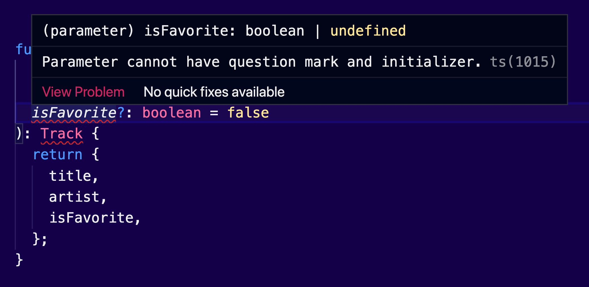
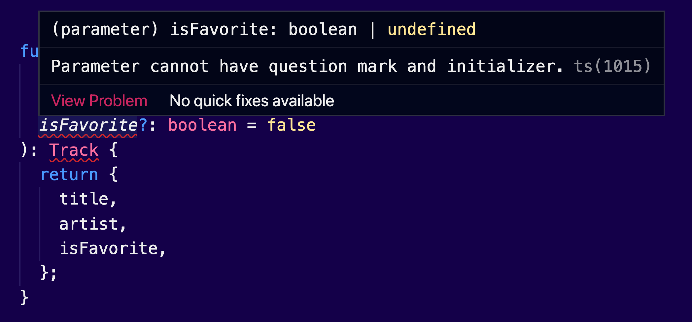
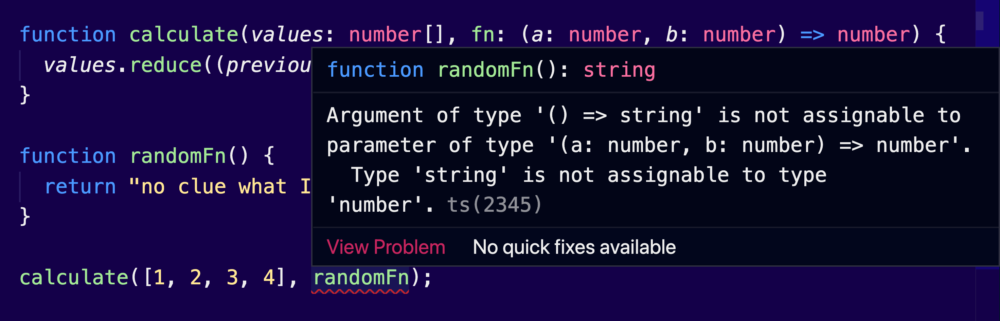
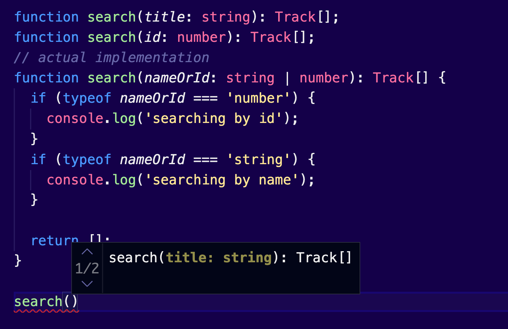
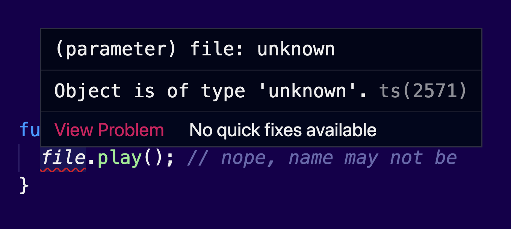

Javascript has some powerful features for **functional programming**. At least a light version of it.

In this article, we will discover what options JS provides for declaring and consuming functions and we find out how to guard them with TypeScript types.

This article belongs to my series Too Long To Read TypeScript. Every article covers in detail a core concept of the language.

Cake? 🍰

## The different ways to declare a function

You're probably familiar with the simple **function declaration**, which uses the `function` keyword:

```jsx
function add(a, b) {
  return a + b
}
```

The variables `a` and `b` are called **parameters**, when the signature of the function is concerned. Within the function itself they are known as **arguments**.

Another way, is to assign a function to a variable, or to an object property. This is called a **function expression**:

```jsx
const fn = add
fn(1, 3) // returns 4
```

You can pass functions as arguments in other functions, which are also known as **callbacks**:

```jsx
function annoyUsers() {
	alert('Subscribe to my channel!').
}

setTimeout(annoyUsers, 1000);
```

In the previous example, we passed `annoyUsers` to `setTimeout()` as a callback. This function will be called after a delay of 1 second. This unlocks the potential of asynchronous code, but it can also increase complexity, something that is known as [callback hell](http://callbackhell.com/).

Another way you can create a function is on the fly:

```tsx
setTimeout(function() {
  alert('Subscribe to my channel!').
}, 1000);
```

These functions don't have a name, and thus we call them **anonymous function expressions**.

Ah, yes! Consider adding names to your functions as much as you can. It helps with easier debugging. It also enables recursion, since there is no way for anonymous functions to refer to themselves.

## Adding type annotations with TypeScript

TypeScript supports all the existing features of JavaScript functions, and of course, we have the option to define types. As with all the other typed elements of TypeScript, type annotations live into your code, and they will be removed after transpilation, which means they will not be available at runtime.

We can define a type for the arguments and the `return` value. Consider the following function:

```tsx
type Track = {
  title: string;
  releasedAt: number;
  gernes: string[];
  isFavorite: boolean;
}

function getTrackTitles(tracks**: Track[]**)**:string[]** {
  return 2; // Type error, the return value must be an array of strings
}
```

In this example, the function `getTrackTitles()` accepts an array of Tracks, and as a return value an `array` of strings. In case we have a different return value, the compilation will fail:



### Optional parameters

We can define **optional parameters**:

```tsx
type Track = {
  title: string
  artist: string
  // highlight-start
  isFavorite?: boolean
  // highlight-end
}

function createTrack(
  title: string,
  artist: string,
  // highlight-start
  isFavorite?: boolean
  // highlight-end
): Track {
  return {
    title,
    artist,
    isFavorite,
  }
}
```

Here the argument `isFavorite` is optional. We can call the function with or without this parameter.

Optional parameters _cannot_ be set for arguments when they have a default value:

```tsx
// this will not work
function createTrack(
  title: string,
  artist: string,
  // highlight-start
  isFavorite?: boolean = false
  // highlight-end
): Track {
  return {
    title,
    artist,
    isFavorite,
  }
}
```

Here, the function parameter `isFavorite` is optional, but it also has a default value of `false`. This is logically impossible, but don't worry, TypeScript will prevent it:



Required arguments cannot follow optional ones:

```tsx
function createTrack(
  // highlight-start
  title?: string, // optional arguments cannot lead
  // highlight-end
  artist: string, // required arguments
  isFavorite?: boolean
): Track {
  return {
    title,
    artist,
    isFavorite,
  }
}
```

Here, define the `title` argument as optional, but the next argument `artist` is mandatory. This will create a messy function invocation, because usually the optional arguments are last in the list. Of course, once again, TypeScript will prevent this:



### Default values

In the latest versions of JavaScript, we have the option to define **default function parameters**, which will allow name parameters to be initialized with default values, if no value or `undefined` is passed:

```jsx
function add(a, b) {
  return a + b;
}
add(); // returns NaN, when no value is passed

function addWithDefaultValues(**a = 0, b = 0**) {
  return a + b;
}
addWithDefaultValues(); // returns 0 when no arguments passed
```

In this example, the argument will get the default value if no value is passed.

---

Now let's see how type definition can work together with default values:

```tsx
function add(a: number = 0, b: number = 0): number {
  return a + b;
```

### void

If a function doesn't return anything, we can use they type `void`:

```tsx
function annoyUsers()**: void** {
  alert('Subscribe to my channel!').
}
```

It is recommended to _always_ provide a return value to your functions.


## Arrow functions

Another way to create an anonymous function is to use an **arrow function**:

```jsx
const multiplyBy2 = (number) => {
  return number * 2
}

[1, 2, 3, 4].map(multiplyBy2)
```

As you can see the syntax is simpler and they end up taking much less space. But you can make it even shorter. Here are all the acceptable forms of arrow functions:

```jsx
// Without arguments
const sayHello = () => {
  return alert('hello')
}

// With only one argument
const sayHello = (name) => {
  return alert(`hello ${name}`)
}

// Without return value
const sayHello = (name) => alert(`hello ${name}`)

// Returning an object
const makeObject = (name) => ({ name })
```

### Adding types to arrow functions

And here's how we can define types for our arrow functions:

```jsx
const add = (a: number, b: number): number => a + b
```

Type annotations can also take the form of an arrow function, to indicate the signature of a function, with the given types for parameters and the return value. This works great with callbacks:

```tsx
function calculate(values: number[], fn: **(a: number, b: number) => number**) {
  values.reduce((previous, current) => fn(previous, current), 0);
}

calculate([1, 2, 3, 4], add);
```

This is a function that calculates a given array of numbers, by using the provided callback. Note that we specified the expected types for this callback. This will prevent consumers to do something like this:

```tsx
function randomFn() {
  return "no clue what I'm doing"
}

calculate([1, 2, 3, 4], randomFn) // type error, that's not my type of fn
```

Here, `randomFn()` doesn't accept 2 numbers as arguments and it doesn't return a number. Therefore, this will not compile:



### Arrow functions vs regular functions

Arrow functions are widely used in modern applications. There are some fundamental changes with the regular functions. You must remember that it's not only about the syntax. I will try to list them here briefly, but I do recommend you to spend some time studying these differences, if you are not familiar with them. Here we go:

1. They are always anonymous, which as we saw before, it may cost you time on debugging.
2. Arrow functions don't alter the value of lexical `this`. The value of `this` inside an arrow function is the closest parent regular function.
3. Arrow functions don't have a binding on `arguments`, which means that the arguments special variable will not be recognized if you try to access it within an arrow function.
4. They can't act as a `constructor`. This means that you can't call them with the keyword `new`, as you can normally do with regular functions, to create new object instances.
5. In JS you are allowed to use the same argument multiple times, like `add(x, x)`, if you use a regular function. This will not work on `strict` mode. Duplicate arguments aren't allowed for arrow functions, even on non-strict mode.


## Hoisting

JavaScript has a feature called **hoisting**. This allows us to use functions or variables before their actual declaration.

Check the example below. It will compile successfully in JS, and the function declarations will be automatically moved to the top of your file.

```jsx
add(2, 3) // returns 5

function add(a, b) {
  return a + b
}
```

Hoisting was very useful back in the days where scripts were randomly referenced within a HTML document, by making the scripting language easier to use. Nowadays, hoisting is yet another weird feature of JavaScript, you should be familiar with. Thankfully, there is a way to protect yourself from unwanted behavior.

Arrow functions are _not_ hoisted, similar to any other declaration that uses the `const` and `let` keywords:

```jsx
add(2, 3) // we will get an error that the function is not declared yet

const add = (a, b) => a + b
```

## Function overloading

Many languages, like C#, or Java, allow multiple implementations of the same function, as long as their argument lists, or their types, are different. JavaScript doesn't have this behavior, since function arguments are what make the actual functions.

TypeScript adds support for **function overloading**. This allows you to have multiple functions with the same name within the same scope, but with a different set of arguments.

The syntax differs from what you have used to see in other languages. At first, you need to define the _overload signatures_, which are function declarations without a body, and then to provide a function with the implementation:

```tsx
// overload signatures
function search(title: string)
function search(id: number)
// actual implementation
function search(nameOrId: string | number) {
  if (typeof nameOrId === 'number') {
    console.log('searching by id')
  }
  if (typeof nameOrId === 'string') {
    console.log('searching by name')
  }
}
```

In this example the function `search()` can accept either a `string`, to search by name, or a `number` to search by id. The first two functions define the multiple ways you can call this function; that's why we omit their bodies. The third function is the actual implementation. We have a single argument `nameOrId` which can be a `string` or a `number`.

It is worth to mention here that this syntax will not work in JS, because you can only have one definition for the `search()` function.

From now on, the moment you start typing the name of the function you will get a useful popup with the different ways you can implement it:



## Advanced types

Are you ready for more? In this section I am listing some additional types that may become useful when you deal with functions. If you already build JS applications, it will be good to know their existence. They are used rarely, though. Feel free to skip this part if you are just starting out with TypeScript.

### object

We discovered in a previous article the available types of JS. There, we also talked about _primitive_ and _reference types_.

If you are sure that a function always returns an object, but it can be a different object structure, you can use the special type `object`:

```tsx
function makeObject(str: string): **object** {
  return { str };
}
```

Now, I'm not advocating for using this specific type, because it is quite similar to `any`. It can be useful when you are writing utility functions, which are meant to be shared across all your projects. Make sure that you have some type declaration in the parent functions, the ones that act as consumers, to avoid any mistakes in your code.

Now, remember that `object` is not the same as `Object` with a capital O. The later one is a reserved JS keyword and it refers to the actual global object type. Never use it, simply ignore its existence.

### unknown

Another useful type for our functions is `unknown`. It works as a wildcard, similar to `any`, but it is safer. It basically prevents us from writing risky code.

Here's a simple example that illustrates the difference between `any` and `unknown`:

```tsx
// using any
function play(file: any) {
  file.play() // works fine
}

// using unknown
function play(file: unknown) {
  file.play() // nope, name may not be
}
```

In the previous example, we have a function that accepts a file, which may or may not have the method `play()`. In case we use `any`, TypeScript will not complain at all. But if we use unknown, we will get the following error:



With the `unknown` keyword we can also guard our arguments:

```tsx
class ServerErrorResponse {
  title: string
}

// highlight-start
function parseErrorResponse(response: unknown): string {
  // highlight-end
  if (response instanceof ServerErrorResponse) {
    return response.title
  }

  if (typeof response === 'string') {
    return response
  }
}
```

In this example, the function `parseErrorResponse()` checks if the `response` is a string or an object. Since we are not sure about the server response, we have to write some extra logic, to make sure we get the value correctly. Because we used `unknown` as a type for our response, TypeScript will expect us to check the type of the value first, before we interact with it.

The same example will not work if we don't explicitly check if `response` is an instance of `ServerErrorResponse`.

### Function

For the same purposes, TypeScript also provides a special keyword `Function` which is another wildcard for functions:

```tsx
// highlight-start
function calculate(values: number[], fn: Function) {
  // highlight-end
  values.reduce((previous, current) => fn(previous, current), 0)
}
```

It is considered a good practice _not_ to use the `Function` keyword over the technique we've learned in the previous sections, which uses an arrow function syntax to describe the signature of the function. It may be useful, when you are accepting multiple function signatures.

Also, this can be confused with the `function` keyword that JS provides. Remember, the type is using a capital F.

### never

Finally, in cases when we know that a function never returns a value, we can use the `never` type:

```tsx
// highlight-start
function throwError(message: string): never {
  // highlight-end
  throw new Error(message)
}
```

Cover Image Credit: [Rodion Kutsaev](https://unsplash.com/photos/0d2zObuClQI)
