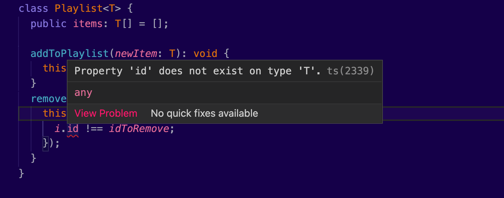
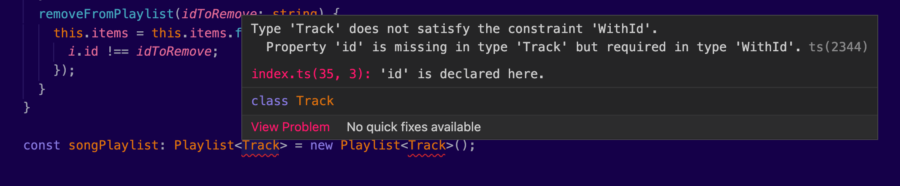
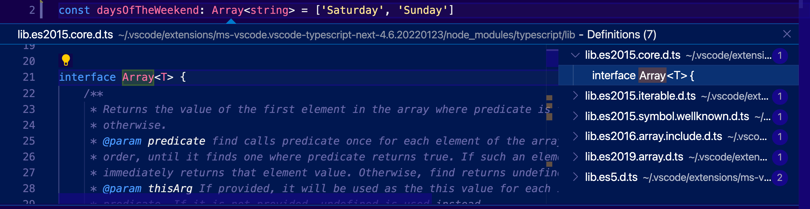

TypeScript can speed up our JavaScript projects. Its type system can show you errors right within your text editor. This can be cool most of the time. By spotting errors faster, you spend less time on debugging and bug fixing. 

Type checking can also cause frustration. In fact, sometimes it’s quite hard to deal with types. Since there were no types around, JavaScript developers got used to writing flexible code that covered a lot of use cases. A function that accepts all kinds of objects. A class that can be applied to multiple types. The situation becomes worse when you have to support legacy JavaScript code.

Don’t get me wrong. Most of the time, having code that handles multiple types is convenient and totally legal. But how can we set boundaries?

Moreover, there are cases that TypeScript becomes very demanding. Focusing on your product and its business logic becomes the hardest thing in the world. Instead, you are writing unnecessary code just to satisfy its type system.

> If you spent a day in your life just trying to get rid of a type mismatch, that you don't even understand where it came from, you are not alone!
> 

Thankfully, TypeScript provides a solution to this problem. It has support for generic types. This unlocks a ton of possibilities. Some people think this is the way to write code for your types. In the following paragraphs, we will learn what problem generics solve, their syntax, and how you can use them practically in your code.

This article belongs to my series Too Long To Read TypeScript. Every article covers in detail a core concept of the language. I am also producing a [free YouTube course](https://www.youtube.com/watch?v=D_0KI6SePcA&list=PL73mkIDIrfyPKjkJ1V151lcgGEDHs3tgG).

Candy? 🍬

## What is the problem Generics are solving?

The problem of introducing types into a language which was never designed with them in mind, shines as we try to create a more production-ready application. Let me give you a simplified example, which demonstrates the challenge that we face here. 

Consider the following function. It receives a song title and it displays it on screen:

```tsx
function echoTitle(title: string): string {
	return title;
}
```

At the moment, our function is working only with `string` types and it is returning a `string`. Obviously the following will not work:

```jsx
echoTitle(2021);  // Type error, we are passing a number instead of a string
```

In order to have a similar function, that works with `number` types, we will need to define it separately:

```tsx
function echoYear(year: number): number {
	return year;
}

echoYear(2021); // it works perfectly!
```

But what if we really, really want to have a single function, which just returns the types we pass on it, like in the good old JavaScript days:

```jsx
function echo(arg) {
	return arg;
}
```

Well, somebody will think, let's use `any`:

```tsx
function echo(arg: any): any {
	return arg;
}
```

Wohohoo! Problem solved. Commit and push! 😎

But wait a minute. Is this really a type type checking? I would argue it is not. As you may know, `any` must be avoided, because it’s basically a wildcard that *disables* type checking completely. Something like `ts-ignore`. As long as I hate to admit it, yes, `any` is not the answer here. We need to be flexible by staying secure. But then what? 


Solving this challenge will help us a lot with our TypeScript journey. For example, how you would you define the map array method itself, a server response promise, or even our most favorite `console.log()`? They can all work with any type. They are all very popular and hard to replace.

What if I told you that TypeScript has support for such *generic* cases. Well, my friends. Let me introduce you to Generics...

## Generic Functions

What if we had some short of a *parameter*, which stores the type of the argument. You could then use that parameter to define what our function accepts and returns.

This is exactly how **generics** work:

```tsx
function echo<Type>(arg: Type): Type {
	return arg;
}
```

Notice that now our general `echo()` function accepts an extra parameter of `Type`. We use `<>` to indicate the existence of this extra type parameter. This is basically a generic variable, that we declare when we will consume the `echo<>()` function. Then, we use this generic to define the type of the `arg` parameter and the type of the return value.

Let’s break down that function declaration:

```
// we have a function
function
// That is named echo
         echo
// Which accepts a type parameter, named Type
             <Type>
// And also accepts a normal parameter, named arg
                   (arg      )
// and it's value is the same as the one Type uses
                   (   : Type)
// And it returns a value that uses the type of Type
                              : Type
```

For simplicity, the TypeScript community simply uses the capital letter `T` to name this type parameter:

```tsx
function echo<T>(arg: T): T {
	return arg;
}
```

Now we can use our newly created function. In order to do so, we *have* to specify the type that we want to use for our generic `T`:

```tsx
echo<number>(2021); // will work
echo<string>('Bohemian Rhapsody'); // will also work
```

Now compare this approach with the `any` approach. TypeScript will *prevent* any other type from being passed to this function accidentally or intentionally:

```tsx
const year = "2021";

echo<number>(year); // Year is not a number, and this will fail
```

And remember, we are not limited to using built-in types only. We can use our own classes, interfaces, type aliases, or anything else.

So far we have been *explicitly* defining the types in our generic functions. TypeScript also supports an *implicit* way:

```tsx
const year = "2021";
echo(year); // T is inferred as a string
```

I have simply removed the type and now it echoes the string. This means that you can simply consume generic functions, without explicitly specifying their types. Type inference kicks. Try hovering over this echo function, to see what type is inferred.

> I don't know about you, but this looks like JavaScript to me.
> 


_Photo Credit: [Shubham Dhage](https://unsplash.com/photos/VRFN2dIBbmU)_

## Generic Classes

So far, we've seen how generics can be used with functions. Let's review another example, this time with classes.

Here's a `Playlist` class that stores some tracks:

```tsx
class Playlist {
	tracks: Track[] = [];
	
	addToPlaylist(newTrack: Track) {}
	removeFromPlaylist(trackToRemove: Track) {}
}
```

We've seen the class `Track` in previous posts:

```tsx
class Track {
	title: string = '';
  releasedAt: number | undefined;
  gernes: string[] = [];
  isFavorite: boolean = false;
	
	constructor(...) {}
}
```

What if I had also music videos in addition to tracks? I will most probably need another playlist class that supports a new type of `VideoClip`. Or I can simply modify my `Playlist` class with a generic:

```tsx
class Playlist<T> {
  public items: T[] = [];

  addToPlaylist(newItem: T): void {
    this.items.push(newItem);
  }
  removeFromPlaylist(idToRemove: string) {
    this.items = this.items.filter((i) => {
      i.id !== idToRemove;
    });
  }
}
```

The same concept applies here. I have a generic type `T`, which stores the type of the class I want to instantiate. We use this type `T` to define the `items` list and the `newItem` parameter of our `addToPlaylist()` method.

Now here’s how you can use this class with multiple types of object types:

```tsx
const songPlaylist: Playlist<Track> = new Playlist<Track>();
const videoPlaylist: Playlist<VideoClip> = new Playlist<VideoClip>();
```

Just like that, we now have the same functionality that handles a playlist, without having to maintain two different classes.

Now the magic begins. As I keep adding items in my playlist, TypeScript prevents me from storing something I'm not supposed to:

```tsx
songPlaylist.addToPlaylist(new Track()); // works fine
songPlaylist.addToPlaylist(new VideoClip()); // throws an error, songPlaylist accepts only Tracks
```

## Generic Constraints

Something you will most probably experience with generic classes, is the fact that TypeScript may start complaining about properties that aren't defined.

In our previous example, the TypeScript compiler is complaining about the `id` property. It simply can't find it in class `T`:



That's unfortunate, because the type of `T` is `unknown`. TypeScript can’t tell if `id` exists there or not. I wonder how I can tell TypeScript that this *thing*, no matter what it is, it must have a property `id` in it. Otherwise, I cannot find how to remove it from my list.

But wait a minute, this is what interfaces are meant for, right? Here’s what we need:

```tsx
interface WithId {
  id: string;
}
```

And here’s how to combine it with our generic type:

```tsx
// highlight-start
class Playlist<T extends WithId> {
// highlight-end
  public items: T[] = [];

  addToPlaylist(newItem: T): void {
    this.items.push(newItem);
  }
  removeFromPlaylist(idToRemove: string) {
    this.items = this.items.filter((i: T) => {
      i.id !== idToRemove;
    });
  }
}
```

In this example I have created an interface `WithId`, which has an `id` property in it. Now all the types that are passed in my class must implement this interface. Basically, this requires them to have an `id` property. So, even if they aren’t explicitly using the `WithId` interface, they could be compatible if they have that property.

Here's what will happen if they don't:



Now let’s modify our `Track` class to implement the new `WithId` interface:

```tsx
class Track implements WithId {
  id: string;
  title: string = '';
  releasedAt: number | undefined;
  gernes: string[] = [];
  isFavorite: boolean = false;

  constructor(newTrackId: string) {
    this.id = newTrackId;
  }
}
```

Again, if I don't explicitly add `implements WithId` in my class declaration, TypeScript will not complain at all, since the `id` property is present in my `Track` class, and its type matches. Just because this is a class under my control, this is considered good practice. It will be difficult to track which properties are really required in this class and which are not.

Finally, instead of creating an interface, we can solve the missing type declaration, by simply providing its type:

```tsx
class Playlist<T extends {id: string}> {
	...
}
```

Use this approach if you think that the interface will not be reused. I personally prefer to create interfaces, because it just looks better when I read a class declaration and it is much easier to modify them in the future.

## Generic Interfaces

We can create generic interfaces, similar to how we declare generic classes:

```tsx
interface IPlaylist<T> {
	items: T[];
	
	addToPlaylist(newItem: T):void;
	removeFromPlaylist(itemToRemove: T):void;
}
```

And check this out. Now we can use the `IPlaylist` interface in our `TrackPlaylist` class:

```tsx
class TrackPlaylist implements IPlaylist<Track> {
  public items: Track[] = [];

  addToPlaylist(newItem: Track): void {}
  removeFromPlaylist(itemToRemove: Track): void {}
}
```

Just like that, we now have an implementation of the `Playlist` interface, which stores `Track` instances.

Generic Interfaces are quite popular in TypeScript. They help you express many challenging scenarios and they are used quite frequently.

## Discovering generics in more places

> Understanding generics will help you read most of the TypeScript code that was ever written.
> 

Now let’s combine everything we’ve learned. Remember the array method `map()`? We could use generic types to implement its signature. Here’s the definition of the `Array` interface, which contains the `map()` method:

```tsx
interface Array<T> {
	map<U>(callbackfn: (value: T, index: number, array: T[]) => U, thisArg?: any): U[];
	...
}
```

Notice that here they utilize two generic types, one at the interface level, named `T`, and one within our method, named `U`.

At the beginning of this series, we talked about arrays. Here’s how we declare an array variable:

```tsx
const daysOfTheWeekend: string[] = ['Saturday', 'Sunday']
```

Since arrays in JavaScript are basically objects, we could actually use the `Array` interface to declare an array:

```tsx
const daysOfTheWeekend: Array<string> = ['Saturday', 'Sunday']
```

This will have the exact same results as before. Failing to pass the right values will fail:

```tsx
daysOfTheWeekend.push(3); // fails because this is an array with string values
```

Now, if you are in VS Code, try to right click on the `Array` interface and select Go to Definition. 



You will witness one of the built-in type definitions that TypeScript already provides for us. More specifically, in the `lib.es5.d.ts` file, TypeScript contains type definitions for all ES5 features. This can give us an idea of how generics can be used to define highly reusable code. Now you can apply functional programming to your project, without worrying about types.

I would encourage you to spend some time reading type definition files. They will help you understand how to use generics in your code. They can act as a good practice to apply what you’ve learned. You can also take ideas about challenging topics and see how other developers have overcome them.

Cover Photo Credit: [Shubham Dhage](https://unsplash.com/photos/PACWvLRNzj8)