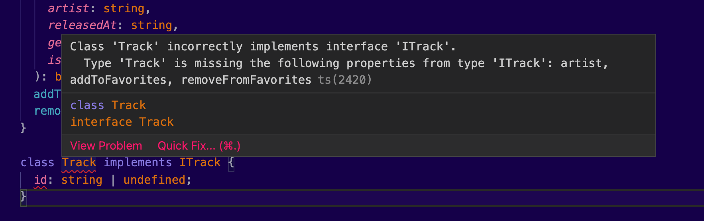
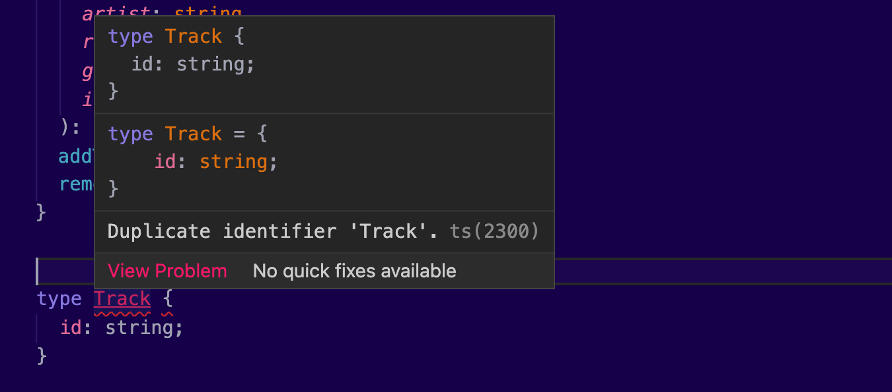

Interfaces help us define the shape of our object structures.

An interface can act as a blueprint for a class, allowing us to add common functionality to unrelated objects. We use this feature to organize our code, by making it easier to follow and scale.

In TypeScript, interfaces can be used as type annotations, similar to `class`, `type` aliases, and other built-in types. This helps us guard our code against types. This strict type system protects us from common errors, which eventually speeds up our development times.

It also helps our code editor to have a better understanding of how our code is interconnected, and provides much more sophisticated auto-completion suggestions.

In the following paragraphs I’m going to explain in detail what an `interface` is and how you can use them in your code. I will give you some practical use cases, which will help you recognize where you have to use interfaces in your code. Before I leave you, I will explain the concept of declaration merging, which is one unique characteristic of interfaces.

🍦Soft Ice cream?

## Why the hell I need another keyword?

Consider the following `track` object:

```tsx
const track = {
  title: 'Bohemian Rhapsody',
  artist: 'Queen',
  isFavorite: true,
}
```

In a traditional JavaScript project, that’s a very convenient way to define objects. This specific one contains everything we need to know about a music track. Such object structures are created on the fly, as we interact with the different modules and packages of our application.

Objects can store anything. An api response. An event payload. Some configuration parameters. Information about styling, animations and many more. The simplest way to deal with such object structures is to create classes with all your models. But what about objects you can’t control, such us browser event payloads?

In the beginning, it didn't cost anything to come up with object structures like these, so we went for it. As we go along we are adding more and more object structures. As the codebase grows, some of these object structures _may_ already be defined somewhere else in our project. And you know what they say, duplication should be avoided.

Most of the times, it is difficult to recognize such duplications. You see, I may want to name the title of the track `title`, but maybe you had another naming convention in mind. Maybe you disagree with the schema of the response, or maybe you want to use underscores, for reasons unknown. And then another person joins the team and suddenly we have three different names. Now we have to collaborate with another team, which has three more different naming schemes for the same concept.

We need a way to be able to quickly form data shapes, without implementing anything about them. That's an interface. It describes the shape of these objects.


## What is an interface?

Historically, this was the main reason to use an interface. Classical object oriented programming languages, such us Java, and C#, also have interfaces that work similarly. This concept is similar to the _protocols_ of Objective-C and Swift. But JavaScript is a dynamic language. The concept of interfaces has evolved to be another way of guarding variables with type annotations.

> An interface describes the shape of an object structure.

An interface is like a set of instructions that describe the data and the behavior of an object. You can’t implement its methods; you can only describe their signature.

We can use interfaces as any other type annotation, to help TypeScript understand what is expected for a specific object variable. TypeScript will enforce a strict policy on that variable, to make sure that the instructions you set upfront are met. It will check the names of its properties, their types, and their restrictions. It will also check the names of the method functions, along with all their associated parameters and their return values.

An interface can also be used to define the shape of a class. In the previous article we saw that a class is a _blueprint_ for an object. In a similar way, an interface acts as a blueprint for classes. Classes _implement_ interfaces, which means they strictly adhere to the shape of them.

## Creating & consuming interfaces

Let’s define an interface about a music track:

```tsx
interface IsTrack {
  // required properties
  id: number | undefined
  title: string
  artist: string
  // optional properties
  releasedAt?: number
  genres?: string[]
}
```

The interface `Track`, defines the expected shape of these objects. That includes properties and their associated types. The properties `releasedAt` and `genres` are optional. No big surprises here compared to what we know about other types, right?

Now, imagine the following JSON structure, as an api response:

```json
[
  {
    "id": 1,
    "title": "Bohemian Rhapsody",
    "artist": "Queen",
    "isFavorite": true
  },
  {
    "id": 2,
    "title": "Dream On",
    "artist": "Aerosmith",
    "isFavorite": true
  }
]
```

We can store this response using our newly defined interface:

```tsx
const tracks: IsTrack[] = apiResponse
```

As you can see, we used an interface similar to how we would have used a type.

---

Interfaces can also contain function signatures:

```tsx
interface IsTrack {
  id: number | undefined
  title: string
  artist: string
  releasedAt?: number
  genres?: string[]
  // highlight-start
  setFavorite(id: number, isFavorite: boolean): void
  // highlight-end
}
```

By adding a `setFavorite()` method to our `IsTrack` interface, the previous response becomes incompatible. The consumers of this interface _must_ implement these additional two functions to modify favorites.

As we’ve seen, interfaces become useful when multiple teams are working on the same project. A team may decide to name their properties differently. By creating interfaces and by storing them in a central place, you are avoiding this mess. You all know what a `Track` is and what it needs to deal with it. The other team can now develop their part, without having any working code from your side. They just depend on the interface you have provided.

You can export interfaces to make them available outside your project:

```tsx
// track.ts
// highlight-start
export interface Track {
// highlight-end
	id: number | undefined;
	title: string;
	...
}
```

This can become very useful when you are creating a shared library. Now, we can import this interface and use it:

```tsx
// another.ts
import Track from './track';

function TrackList(tracks: Track[]) {
	...
}
```

Yeah, I know. I have an issue with the music tracks in this series. I am going through a phase. It will pass. I just need some time with myself.

## Where can I use interfaces?

If you are wondering where and when to use interfaces in your projects, you are not the only one. This has bugged many JavaScript developers, including the author. You see, we never had to deal with classical OOP concepts.

TypeScript has added a lot of flexibility to its interfaces, to support the JavaScript language. In this section, we will review the most important use cases of using interfaces.

### Using Interfaces to implement unrelated classes

So far, we have been using interfaces as types. But interfaces work great with classes. Mind the new keyword `implements`:

```tsx
class Track implements IsPlayable {
  duration: number

  play(): void {}
}
```

I know what you are thinking. This class doesn't implement our interface fully, and TypeScript will let us know about that. But that's why we have the interface, right?



---

We can combine multiple interfaces to mix and match the functionality we want to inherit.

Consider the following interfaces:

```tsx
interface IsTrack {
  id: number | undefined
  title: string
  artist: string
  // Optional properties
  releasedAt?: number
  genres?: string[]
}

interface IsPlayable {
  duration: number
  play(): void
}

interface IsFavorable {
  isFavorite: boolean
  toggleFavorite(): boolean
}
```

The `IsTrack` interface describes the shape of a track object. It’s similar to a model in MVC. The interface `IsPlayable` marks an object as playable, which means we expect these objects to have a `duration` and a `play()` method that we can call. Similarly, the interface IsFavorable describes classes that provide this functionality to get the favorite boolean and `toggle` its value using the `toggeFavorite()` method.

Now let’s put these interfaces together to create our `Track` class:

```tsx
class Track implements IsTrack, IsFavorable, IsPlayable {
  id: number | undefined
  title: string
  artist: string
  isFavorite: boolean
  duration: number

  constructor(
    id: number,
    title: string,
    artist: string,
    isFavorite: boolean,
    duration: number
  ) {
    this.id = id
    this.title = title
    this.artist = artist
    this.isFavorite = isFavorite
    this.duration = duration
  }

  toggleFavorite(): boolean {
    const newValue = !this.isFavorite
    this.isFavorite = newValue
    return newValue
  }

  play() {
    console.log('playing...')
  }
}
```

In this example, we are combining both three interfaces. Try this example by yourself and notice the TypeScript errors as you add more functionality to your class. Also, notice how your editor provides better auto-completion, as you define the expected class members.

### Using interfaces to define the shape of object structures

The nature of JS is open. Data comes from multiple sources. Maybe you are consuming the YouTube api and you want to deal with its response. Maybe the user clicks on a button, or types something in an input. Maybe you want to call a helper function and pass a collection of these entities.

You can create an interface next to your code to annotate this specific part of this interaction.

Consider the following example, where we want to fetch some music tracks using the `fetch` api:

```tsx
let mixtape: IsTrack[] = []

fetch('http://example.com/tracks.json')
  .then((response) => response.json())
  .then((data) => (mixtape = data))
```

Here, we use the `IsTrack` interface we declared above, to annotate the type of the `mixtape`. We know this object pretty well, because it’s a part of our application’s business logic.

You also have the option to declare these interfaces next to your code, to deal with object structures that don’t align with your business logic. Handling user input is a good example here. Usually, we use event handlers to deal with all these use cases. And usually these events come with a _payload_. That’s a specific object structure. We can use an interface to describe the shape of this payload, so that we know what is expected.

In a similar way, you can use interfaces to define the expected structure of a function argument:

```tsx
interface FormValues {
  username: string
  password: string
}

const formData: FormValues = {
  username: document.getElementById('usernameField').value,
  password: document.getElementById('passwordField').value,
}

postToServer(formData)
```

Here we have created an interface that contains a `username` and a `password`.


## Naming Conventions

Interfaces in TypeScript can be used similar to any other type annotation. To avoid name conflicts, the community is used to add a prefix to all the interfaces.

There is no standard for the naming conventions by the language itself. So, TypeScript will not limit you from choosing any name for your interfaces. It is highly recommended, though, to decide on a naming convention and then use it in your project.

I have seen projects that use the letter `I`, for example `ITrack`. I have also seen projects with the words `Is` , `With`, or `Has`, for example, we can have `IsTrack`, `WithId`, or `HasFileExtentions` accordingly. I have seen projects that use a suffix `-able`, like `Comparable` or `Searchable`, to add some unique characteristics to their classes or objects in general.

I have seen projects that don’t use any specific naming convention. For example, if your codebase uses functional programming principles, you probably don’t use the `class` keyword that often. That leaves you with a flexible namespace, because now you don’t have to separate classes from interfaces.

I have also seen projects that use a combination of the naming conventions above.

> In a perfect world, you agree with your team to use a specific name convention, and you follow it with all your heart.

## Declaration Merging

The TypeScript implementation of interfaces differs from other programming languages. **Declaration merging** allows you to declare interfaces with the same name multiple times.

Here’s an illustration of this feature:

```tsx
interface ITrack {
  id: string | undefined
}

interface ITrack {
  title: string
  artist: string
}
```

By declaring the same interface with different members, we are basically creating a bigger one:

```tsx
interface ITrack {
  id: string | undefined
  title: string
  artist: string
}
```

TypeScript will merge the previous declarations into one single `ITrack` interface. Of course, it will complain in case you try to define the same member, with a different type.

---

This concept of interfaces sets them apart from type aliases, which _must_ have unique names across your project:



In general, I would prefer interfaces over types, when it’s possible. Use type aliases when your objects could be `undefined`, or if they can act as a different type, like for example a `string`.

Cover Credit: [Sebastian Svenson](https://unsplash.com/photos/LpbyDENbQQg)
