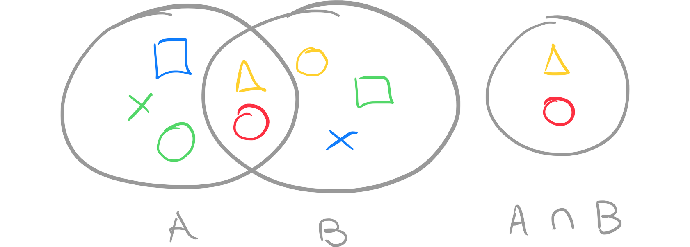
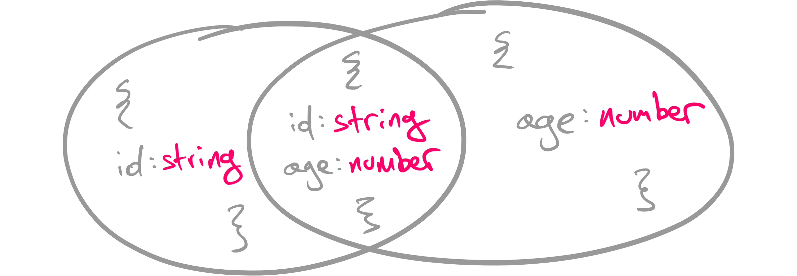
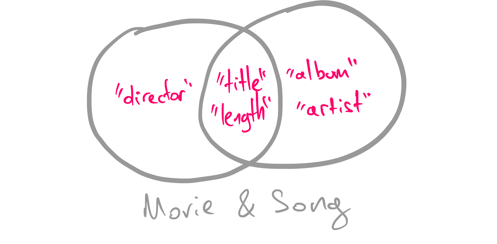
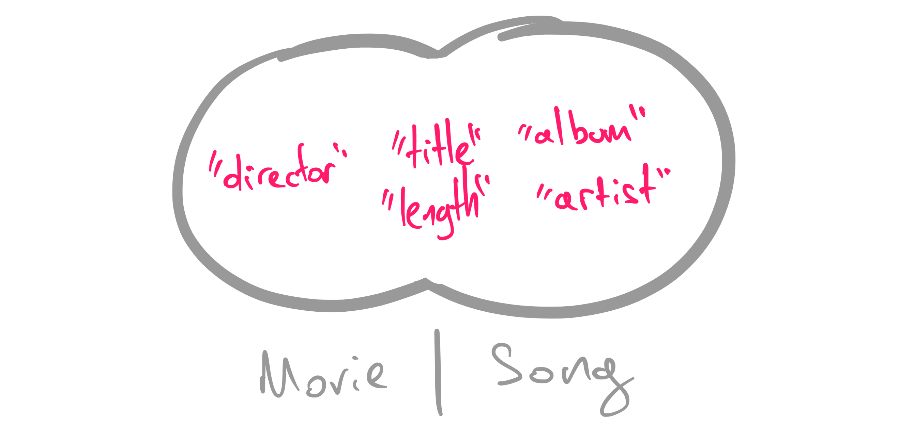

Intersections in TypeScript are really cool. They allow you to mix and match different object structures, to create new ones. Their flexibility comes with surprises. There is a certain misbehavior you should be familiar with. That will help you understand how they are meant to be used and discover what’s happening in your code.

Intersections somehow behave like unions. But how do they compare to unions? What’s their difference? How are they meant to be used?

This article is a deep dive into TypeScript’s intersections. We will learn the syntax, and explain everything you need to know about them.

Fortune cookie? 🥠

## What’s an intersection?

In TypeScript, you can use the intersection `&` operator, to merge two object types into one. The result will be a *new* type which will include all unique members, plus the members that they have in common, as long as they have the same type.

> An intersection practically merges the members of two object structures into a new type.
> 

Here’s an example that illustrates its usage:

```tsx
type FileBase = {
  filename: string;
  play: () => void;
}

type Song = FileBase & {
	extension: 'mp3';
};

type VideoClip = FileBase & {
  extension: 'mp3';
};
```

Here we have a type alias called `FileBase`, which represents a downloadable file. All the other types extend this type alias, by adding additional object members.

The equivalent result will be the following:

```tsx
type Song = {
	// properties from FileBase
	filename: string;
  play: () => void;
	// properties from Song
	type: string;
};

type VideoClip = {
	// properties from FileBase
	filename: string;
  play: () => void;
	// properties from VideoClip
	type: string;
};
```

Pretty neat! 🤘

## When to use an intersection?

We’ve seen how intersections could help us mix and match object structures. This becomes helpful when you have a lot of repeatable properties across different types, and you don’t want to deal with classical inheritance and polymorphism patterns.

Let’s say that all your models have a common property. That could be an `id`. Now, let’s imagine that your project has a more sophisticated way of dealing with ids. We could create an interface for that:

```tsx
interface Id {
	id: `${ 'U' | 'X' }-${number}`
}
```

Our `id` property accepts strings that start with `U-` or `X-`, followed by a number. For example, we could have an id like `U-123`. 

To create new types that re-use this id logic, we can use an intersection:

```tsx
type User = Id & {
  username: string;
  email: string;
}

type Order = Id & {
  total: number;
};
```

An alternative way would be to create a new type on-the-fly. In the following example we are creating a `User` that is also an `Order`:

```tsx
const userWithOrder: User & Order = {
  id: 'U-123',
  total: 123,
  username: 'nicotsou',
  email: 'no@spam.please',
};
```

It’s pretty obvious what the type of `userWithOrder` could be, by reading this example. We didn’t have to come up with a name, which sometimes is really difficult to get right.

As a recap, intersections allow you to extend existing types according to our needs, like the example above. Now let’s discover some edge cases…

## Intersections; The weird parts

I mentioned in the beginning about the misbehavior of intersections. There are some complicated concepts to understand, which I would like to address in this section.

So far, we were using object structures. You may be wondering, will intersections work with literal types?

```tsx
type WhatAmI = boolean & string;
```

The answer is *no*.

> Intersections *only* work with object structures.
> 

If you try to use them with literal types, you will get back `never`. In fact, *both* types must be object structures:

```tsx
type WhatAmI = boolean & string;  // never
type WhatAboutMe = string & { name: string }  // never
```

That makes sense; there can’t be any type that is a `boolean` and at the same time a `string`. That’s why TypeScript will assign `never` to the previous types, preventing us from assigning any values on it. If you remember, the type `never` is a wildcard, that behaves exactly like that.

Another interesting question is, what will happen if two object structures have common members?

```tsx
type User = {
  // highlight-start
  id: string;
  // highlight-end
  name: string;
}

type Order = {
  // highlight-start
  id: string;
  // highlight-end
  total: number;
}

type UserOrder = User & Order;
```

In the example above, both the `User` and the `Order` types have a common `id` property. As expected, this will be included in the result object structure:

```tsx
// the equivalent result of User & Order
type UserOrder = {
	// highlight-start
  id: string;
  // highlight-end
  name: string;
	total: number;
}
```

Easy! But what if we had properties with the same name, but with different *types*?

```tsx
type User = {
  id: string;
  name: string;
	// highlight-start
  length: string;
  // highlight-end
}

type Order = {
  id: string;
  total: number;
	// highlight-start
  length: number;
  // highlight-end
}

type UserOrder = User & Order;
```

The property `length` exists in both types, but it’s a `string` value in `User` and a `number` value in `Order`. 

How TypeScript will behave here? Let’s figure it out:

```tsx
// The equivalent result of User & Order
type UserOrder = {
	id: string;
  name: string;
	total: number;
	length: never;
}
```

As you can see, the `length` property has the type `never`. So basically, the intersection of two types will not return common object members that have different types.

And that’s for a good reason. 😉

## Understanding intersections

Now you may ask… what do we mean by calling this thing an *intersection*? 🤔

This term comes from math, and more specifically the theory of [Set](https://en.wikipedia.org/wiki/Intersection_(set_theory))s. A Set is the mathematical model for a *collection* of different *things*.

We programmers call them *arrays*. 🤓



An intersection of two sets `A` and `B` is the set containing all elements of `A` that also belong to `B` or equivalently, all elements of `B` that also belong to `A`.

Now, going back to our previous example. Let me try to draw what we had:



Now, the object structure that we get as a result doesn’t make any sense. It’s not aligned with the theory of intersections we’ve seen from math.

Why is the name of this feature so confusing?

Well, my friends… After some [research](https://stackoverflow.com/questions/38855908/naming-of-typescripts-union-and-intersection-types), I was able to understand why TypeScript developers named it this way. As Einstein famously said “When we think about TypeScript intersections, instead of thinking about types as sets of object properties, we could instead focus on *scalar* variables and their sets of permissible values”. 

Yeah, I know what you’re thinking. TypeScript was not invented back then. But it’s ok. Everybody is creating memes and putting words in Einstein’s mouth. Why can’t I?

To understand how intersections relate to math, let’s experiment with *literal types*. Consider a set of metadata for songs and another one for video clips:

```tsx
type SongMetadata = 'length' | 'album' | 'title' | 'artist';
type MovieMetadata = 'length' | 'director' | 'title';
```

Here, there are some *common* metadata, like `title` and `length`. We could get those, by using an intersection:

```tsx
type CommonMetadata = SongMeta & MovieMetadata  // "length" | "title"
```

Now, if we compare this example to the diagram we saw previously, math makes total sense:



## How do intersections compare to unions?

A logical question arises here. What is the difference between unions and intersections? Let’s use the previous example, to compare these two features.

Having a union will result in a larger set, containing all the metadata for both `Movie` and `Song`:



A union combines *all* the values they have in common or not. An intersection, on the other side, combines *only* the common values:

```tsx
type AllMetadata = SongMeta | MovieMetadata  // "length" | "album" | "album" | "director" | "artist" | "title"
type CommonMetadata = SongMeta & MovieMetadata  // "length" | "title"
```

Here, I have another million dollar question for you…

## How do intersections compare to the extends keyword?

Remember our previous example?

```tsx
type User = Id & {
  email: string;
  username: string;
};
```

You can get the same result if you use an interface in combination with the `extends` keyword:

```tsx
interface User extends Id {
  username: string;
  email: string;
}
```

The `extends` keyword is more suitable for implementing OOP structures. **It’s basically a [JavaScript feature](https://developer.mozilla.org/en-US/docs/Web/JavaScript/Reference/Classes/extends).** 

Although you can use it with interfaces, which is a TypeScript-only feature, you *can’t* use it with type aliases.

It comes with other limitations. For example, it can only be used with types that have statically known members. You can’t use it with *dynamically* generated types.

If you are not working with classes and OOP is not important to you, it’s better to avoid the `extends` keyword altogether. Intersections can provide much more functionality.

---

For those who find these concepts difficult, you can check out my previous posts. I have a series of articles about TypeScript. I write about my experience learning the language and I’m trying to explain my mental model using practical examples. 

If you are a visual person like me, you can also check out my 📺[YouTube series about TypeScript](https://youtube.com/playlist?list=PL73mkIDIrfyPKjkJ1V151lcgGEDHs3tgG).

Cover photo credit: [Shubham Dhage](https://unsplash.com/photos/gSOJhmAGqT8)