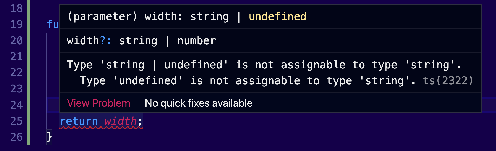
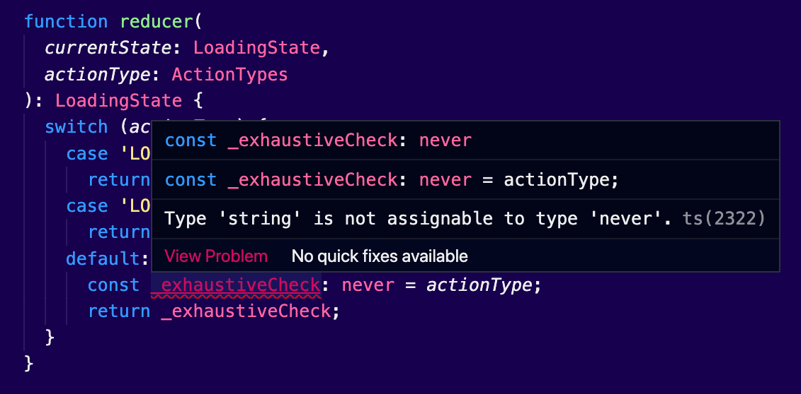

So you have an unknown parameter in your function. Is it a string? Is it a boolean? Is it some kind of weird combination of properties and methods? How can you tell?

In this article we are going to address one of the most important topics; How do we narrow down a type to more specific ones? What options the JavaScript language has built-in and what are the features TypeScript adds to protect us from common mistakes?

If you don’t have a lot of experience with JavaScript, this article will be a gold mine for you. I tried to collect as much information as I could, to make you understand the important bits and pieces of my most favorite language, that usually drive people crazy and discourage them completely.

Enough with the intro. Let’s start with a coding challenge. Hooray! 🤗

Consider the following JavaScript function `getWidth()`:

```tsx
function getWidth(width?: string | number) {
  if (typeof width === 'string') {
    return width
  }

  return `${width}px`
}
```

This basically returns values for the css `width` property. The logic is the following:

```tsx
// number values get the suffix px:
getWidth(100) // '100px'
// string values get no suffix:
getWidth('100%') // '100%'
getWidth('auto') // 'auto'
```

Can you guess what the type of the argument `width` is in every single line of the code above? Do you think this code will work as expected?

I am going to reveal the solution in the next paragraph. Spend a minute thinking about it before you continue.

Chocolate? 🍫

## The Control Flow Analysis of TypeScript

To solve the mystery, let’s fire up our favorite TypeScript text editor and paste the challenge there. Try to hover over the `width` argument in every single line. As you do that, you will notice that TypeScript will give you a special union type with all the types.

Here’s what we have:

```jsx
function getWidth(width?: string | number) {
  if (typeof width === 'string') {
    // string | number | undefined
    return width // string
  }
  return `${width}px` // number | undefined
}
```

Notice that within the `if` block, the type of the argument `width` is a string. That’s logical, since we are checking it with an `if` conditional. But how does TypeScript know what it will be? Has it compiled the code already?

It turns out that it does. 😏

> TypeScript evaluates your code at compilation time, to detect how the type of a value changes at any given position.

Combine this with type inference and you get pretty sophisticated error detections.

Now, back to our example. If we hover over the `width` argument in the last `return` statement, we will see that the possible values are `number | undefined`. That’s logical, because if the `width` argument is _indeed_ a string, the execution will stop right inside the `if` block and our function will return the `width` as it is. TypeScript understands that, and removes the `string` type from the union. But what about the `undefined`? Will this be a problem?

Oops, I did it again! 😬

Of course, `width` can be `undefined`, because it’s an optional parameter. This means that you will not get the best results if you call this function with no arguments:

```tsx
getWidth() // returns 'undefinedpx'
```

With the help of TypeScript, we know that our function needs some refactoring:

```tsx
function getWidth(width?: string | number) {
  if (typeof width === 'number') {
    return `${width}px`
  }

  return width || 'auto'
}
```

Now, no matter what, the function will always return a value or it will default to `auto`. TypeScript helped me identify the bug here.

Now, you may be wondering, do I need to hover over my types and check all these things? Why didn’t TypeScript complain about this? 😒

I could have prevented this from happening, if I had specified a type for the return value:

```tsx
function getWidth(width?: string | number): string {
  if (typeof width === 'number') {
    return `${width}px`
  }

  return width // Error: Type undefined is not assignable to type string
}
```

Now I get back a very informative error:



That’s the reason we really have to encourage our team colleagues to be very descriptive with types.

One last thing; If somebody tries to pass `null` instead of `undefined`, TypeScript will throw an error:

```tsx
getWidth(null) // Error: Argument of type 'null' is not assignable to parameter of type 'string | number | undefined'
```

It got me covered! 😋

So TypeScript is evaluating your code at compile-time and it can predict what type a value can have. Combine this with the _type inference_ feature and you get a very sophisticated bug prevention system.

We’ve seen this behavior with the `unknown` keyword:

```tsx
function someplay(files: unknown) {
  files.map((t) => console.log(t)) // Error: Object is of type 'unknown'
}
```

Here, TypeScript prevented us from calling the method `map()` that may not exist in the files argument. In fact, `files` may not be an array at all.

Control flow analysis is being improved with every version of the language. More and more features are being added.

## Type Guards

Here’s how you can check if the `files` argument of the previous example is an array:

```tsx
function someplay(files: unknown) {
  if (files instanceof Array) {
    files.map((t) => console.log(t))
  }
}
```

I used a condition that checks if the `files` variable is an array. Within the `if` block, we know for sure that the type of the `files` variable is an array, and therefore we can call its `map()` method.

For a TypeScript developer, it’s important to understand how to narrow down types to more specific ones. These kinds of checks are called **type guards**.

> A _type guard_ is a form of a code expression, which helps TypeScript refine types down to more specific types.

Let’s review all the tools JavaScript has already built-in. Yes, all these will work at runtime.

### The `typeof` operator and its misbehavior

You are probably familiar with the `typeof` operator in JavaScript:

```tsx
// Checking the type of a value
typeof 'something' // 'string'
typeof 2022 // 'number'

// Checking the type of a variable
let add = (a, b) => a + b
typeof add // 'function'
```

It always returns a string and the possible return values, according to [MDN](https://developer.mozilla.org/en-US/docs/Web/JavaScript/Reference/Operators/typeof#description), are the following: `undefined`, `object`, `boolean`, `number`, `bigint`, `string`, `symbol`, and `function`. For all the other values that are not in this list, `typeof` will return `"object"`.

Can we really depend on `typeof` to check all kinds of values? No we can’t. It’s very limited and kinda confusing. For example, if you try to get the type of an array, here’s what you will get back:

```jsx
typeof [] // 'object'
```

Of course, arrays in JavaScript _are_ indeed objects. But someone will argue that functions are _too_. So why do we get a return value for functions and not for arrays, which are also really common in our daily code?

The results of `typeof` are not only incomplete, but they are _buggy_ too. You may probably know that `null` is also an object:

```tsx
typeof null // returns 'object'
```

That didn’t go very well. 🤪

> Instead of having the programming language work for us, we have to do the thinking here.

Thankfully, TypeScript knows about such misbehaviors and it can protect us from unnecessary bugs.

### The `instanceof` operator

We can check if a specific object is an instance of another object:

```tsx
function count(values: number | Array<number>): number {
  if (values instanceof Array) {
    return values.reduce(
      (previousValue, currentValue) => previousValue + currentValue,
      0
    )
  }

  return values
}
```

Remember that in JavaScript we have prototypical inheritance. Every object has a prototype, and it derives all its logic. This works like a chain. The parent object of all objects is the actual `Object`.

In the example above, we are counting the numbers by reducing an array of values. If we get a single number instead of an array, we are returning the number itself. We check if the `values` argument is an instance of the `Array` object. If you don’t check this before calling the reduce method, TypeScript will throw an error, because a number doesn’t implement this method.

### Searching for the truth

I bet you are also familiar with the `if` statements, so I’m not going to elaborate more on this topic.

Maybe you are not familiar with the fact that JavaScript can accept _any_ kind of value in a conditional:

```tsx
if (3.14) {
  // oops, that's not a boolean, but is it truthy?
  return 'the value is truthy'
}
```

What JavaScript is doing here, is to coerce the `number` to a `boolean`, and then to evaluate the condition:

```jsx
if (new Boolean(3.14)) {
  return 'the value is truthy'
}
```

You may be wondering how JavaScript decides which values are _truthy_ or _falsy_? That’s one of the trickiest quirks of the language.

Prepare to be amazed! 😋

**Falsy values**

When you compare values, the following are *always* equals \***\*false**: `null`, `undefined`, `false`, `0`, `-0`, `NaN` and the empty string `“”`:

```jsx
// All the following return false
Boolean(false) // The obvious boolean false
Boolean(null) // A null value
Boolean(undefined) // An undefined value
Boolean(0) // The number zero
Boolean(-0) // The negative number zero
Boolean(0n) // The bigint zero
Boolean(NaN) // The result of an operation that is not a number
Boolean('') // An empty string
```

Everything else *always* equals **true**:

```jsx
// Be careful, all the following will return true
Boolean(true) // The obvious boolean true
Boolean({}) // Any object
Boolean([]) // Any array (which is an object)
Boolean(new Date()) // Any date (which is an object)
Boolean(42) // Any number, except zero
Boolean(-42) // Any negative number, except zero
Boolean(12n) // Any bigint, except zero
Boolean(3.14) // Any float number, except zero
Boolean(-3.14) // Any negative float number, except zero
Boolean('0') // Any string, except an empty one, including "0"
Boolean('false') // Any string, except an empty one, including "false"
Boolean(Infinity) // Any object
Boolean(-Infinity) // Any object
Boolean(() => {}) // Any function
```

> The list of truthy values in JavaScript is infinite.

You can also use the **ternary operator** to save some space:

```tsx
'false' ? 'truthy' : 'falsy' // returns 'truthy'
```

I recommend for newbies to spend some time getting familiar with the [truthy](https://developer.mozilla.org/en-US/docs/Glossary/Truthy) and the [falsy](https://developer.mozilla.org/en-US/docs/Glossary/Falsy) values of JavaScript.

### Switch statements & Exhaustiveness checking

We can simplify the example above by using a **switch** statement:

```tsx
function getWidth(width?: string | number): string {
  switch (typeof width) {
    case 'number':
      return `${width}px`
    case 'string':
      return width
    default:
      return 'auto'
  }
}
```

Switch statements support _any_ value you can imagine, even a computed one. We use them to refactor multiple blocks of if statements. More on them later.

TypeScript can be really powerful when you are using a `switch` statement. With a feature called e**xhaustiveness checking**, you can be sure that you handled all the available cases.

Let’s illustrate this logic in the following example:

```tsx
type ActionTypes = 'LOADING' | 'LOADED';

interface LoadingState {
  isLoading: boolean;
}

function reducer(
  currentState: LoadingState,
  actionType: ActionTypes
): LoadingState {
  switch (actionType) {
    case 'LOADING':
      return { ...currentState, isLoading: true };
    case 'LOADED':
      return { ...currentState, isLoading: false };
    default:
      **const _exhaustiveCheck: never = actionType;
      return _exhaustiveCheck;**
  }
}
```

The `never` keyword can play the role of the type guard here. Remember that we can’t assign any type of value to a variable with the type `never`, except from values that are themselves type of `never`.

We basically have a reducer here, which accepts the `currentState` and the `actionType` and it returns the updated state. We define all our action types in a type alias. The magic happens within the `default` \*\*\*\*case. We assign the actionType to a variable that is only meant to be used for exhaustiveness checking. Theoretically, if we did exhaust all the possible cases of the `actionType` values, we would never end up with the default case.

Every time we add a new case block, TypeScript eliminates one of the possible values. When we reach the default case, it expects that there are no types left, which means the type of the `actionType` argument is `never`.

Can you guess how powerful this is? 🤠

Let’s imagine that we have another action, to indicate that something has failed:

```tsx
type ActionTypes = 'LOADING' | 'LOADED' | 'FAILED'
```

The moment we change our type alias, TypeScript will throw an error:



You have successfully guarded your reducer from action types that it doesn’t handle.

### Logical Operators

JavaScript has the following operators: `&&` and `||`. But there’s a catch!

> The result value of AND, and OR operations in JavaScript is _not_ a **Boolean**.

The logical OR `||` operators return the **first** value if it’s true, or the **second** one if it’s false:

```jsx
var s = 'text'
var n = 5
s || n // returns 'text'
```

It’s also a good hack to set a default value in case of a missing variable:

```jsx
const tracks = response || []
```

In the example above, if the `response` is `undefined`, we will set an empty array as the initial value. How cool is that?

The logical AND `&&` operators return the value of the **second** argument if both values are true, or the **first** one if both values are false, or the first falsy value:

```jsx
var s = 'text'
var n = 5
s && n // returns 'text'
```

It’s a good hack to display UI elements:

```jsx
function renderTracks(tracks) {
  return tracks && tracks.map((track) => <Track track={track} />)
}
```

This example will make sense to you if you are familiar with React’s JSX. Basically, we are checking whether the `tracks` parameter is truthy, which means it’s an array. Since the second part will _always_ be truthy, this is the value we will return. If tracks is `null` or `undefined`, we will return that value. It may seem like a huge hack, but it’s been used in every React application.

Finally, the `&&` operator is [more precedent](https://developer.mozilla.org/en/docs/Web/JavaScript/Reference/Operators/Operator_Precedence) than `||`:

```jsx
// with the parenthesis
a || (b && c)
// without the parenthesis (same result)
a || (b && c)
```

### Comparison Operators

There are two different ways to compare if the two values are equal. The `==` double equals and the `===` triple equals operators.

The double equals `==` performs an **implicit** **coercion** before the comparison; aka it doesn’t check the types of the values. You should **only** use it if you and everybody in your team [understand how it works](https://developer.mozilla.org/en-US/docs/Web/JavaScript/Equality_comparisons_and_sameness) and if you are familiar with all its [misbehavior](https://youtu.be/et8xNAc2ic8).

```tsx
5 == '5' // true
```

I will address how this works in a moment. For now I want you to remember that most of the time you should use the triple equals operator `===` which also checks the type of the variable:

```tsx
5 === '5' // false
5 === 3 + 2 // true
```

Objects are being checked for their _reference_. JavaScript will _never_ compare their values.

```tsx
{ name: 'Nicos' } === { name: 'Nicos' }  // false
```

Ah, and `NaN` is not equal to itself:

```tsx
NaN == NaN // false
NaN === NaN // false
```

Which is the reason we use `Object.is()` method:

```jsx
Object.is(NaN, NaN) // true
```

It is safe to use `==` with the **typeof** operator:

```tsx
if (typeof five == 'number') {
  return 'no way!'
}
```

To compare if the two values are not equal, of course, you can use `!=` and `!==`. They work similarly with equal operators. Abstract relational comparison (`<`, `>`, `<=`, `>=`) always coerces the values, similar to `==`.

And one more thing to make fun of your other JavaScript colleagues;  `a > b` is actually `!(b < a)`. 😎

TypeScript understands all these rules as you compare values that can accept different types, and it can predict what the result type will be. This doesn’t work all of the time. It is suggested to setup a linter, if you want to have an indicator that you are probably making some mistakes, as you type code.

### Some words about Coercion

In JavaScript there is a weird feature called **Coercion**. Somehow the language itself takes care of the casting for you, so that you don’t have to. As we’ve seen this is happening everywhere in your code.

Here’s an example we’ve seen before:

```jsx
5 == '5' // true
```

Obviously the `number` five is not equal to the `string` five. But that’s how the double equal operator is working. It first coerces (converts) the values, and _then_ it compares them. In JavaScript, you can compare _any_ value, regardless of their types. Conditionals can even be used anywhere in your code, as a valid _expression_.

That’s basically called **implicit coercion**, because you don’t explicitly cast the value by yourself.

A lot of people prefer **explicit coercion**. Here’s an example:

```tsx
5 == Number('5') // true
```

Now, there’s a misconception about _how_ types will be coerced. Do you expect JavaScript to convert the string to a number or the number to a string? Let’s give it a try:

```tsx
5 + '1' // '51'
```

Yup! We have a winner! 😋
In general, there is a priority in place:

```tsx
// String beats everyone
2 + '1' + true  // '21true'
// Number beats booleans
2 + true  // 3
// Avoid non-primitive types
{} == {}  // false
```

Coercion is _indeed_ a powerful feature, which is intended to help you reduce code and improve readability. It’s one of the reasons developers who are new to coding like JavaScript. It’s extremely unpredictable, though. And you should spend an amount of time getting used to it.

> “Every JavaScript developer should spend some time to [understand the concept of Coercion](https://www.freecodecamp.org/news/js-type-coercion-explained-27ba3d9a2839/) and learn its rules.”
> <cite>Kyle Simpson</cite>

### The `in` operator

We can check if an object contains a member, by using the `in` operator:

```tsx
interface Playable {
  filename: string
  play: () => void
}

interface UnPlayable {
  filename: string
}

function playFile(file: Playable | UnPlayable) {
  if ('play' in file) {
    file.play()
  }
}
```

In this example, we have two interfaces. Only one of them contains the `play()` method. In the play function, we can narrow down the `file` objects, to find the ones that are playable.

## Type predicates

What if I told you that you can use all the tools you’ve learned above to build your own type guards? Sounds intriguing? 😉

Here’s an example:

```tsx
function isPlayable(file: Object): file is Playable {
  return 'play' in file
}
```

Mind the `is` operator in the return value of this function. This is not a function that returns a Playable. It acts as a type guard that checks if an object _is_ Playable. By saying `file is Playable`, we are creating a logical indicator that helps TypeScript treat this function as a type guard.

We can now use this type guard to simplify the logic of our `play()` function:

```tsx
function playFile(file: Playable | UnPlayable) {
  if (isPlayable(file)) {
    file.play()
  }
}
```

Notice how TypeScript now recognizes the type guard and it doesn’t complain about the missing `play()` method in `file`. What a nice feature. This feature is quite useful in a language like JavaScript.

---

This article took a lot of time, but I’m really happy I collected everything you need to know about narrowing types in TypeScript.

If it helped you learn something new, then a tweet would be great 🙂.

Cover Photo Credit: [Rodion Kutsaev](https://unsplash.com/photos/TMa_5BLvDqQ)
