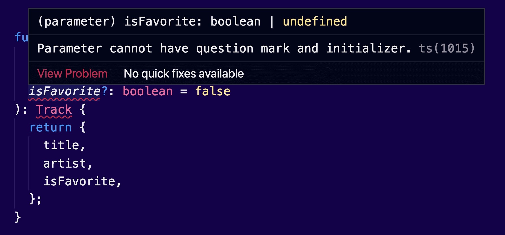

The idea behind optional chaining is very simple.

> Instead of manually checking if a property exists, you can use the same `?` operator that we use when we define optional properties.

Let me show you some practical examples to help you understand this feature.

Pumpkin Spice Latte?🧋

### Accessing optional properties

Consider the following version of a music `Track` object structure:

```tsx
type Track = {
  id: number
  metadata?: {
    timesPlayed: number
  }
  genres?: string[]
}
```

The `timesPlayed` counter is within a `metadata` object. But both `genres` and `metadata` are optional properties. They may have values, they may not:

```tsx
const aTrackWithoutAnything: Track = { id: 1 }
const aTrackWithMetadata: Track = { id: 2, metadata: { timesPlayed: 22 } }
const aTrackWithGenres: Track = { id: 2, genres: ['metal', 'disco'] }
```

I’m not sure if there was ever a metal-disco combination, but it would have been awesome!

Now, having options is _not_ always a good idea. Can you guess what will go wrong in the following example?

```tsx
function getTimesPlayed(track: Track): number {
  return track.metadata.timesPlayed || 0
}
```

Our `getTimesPlayed()` function is a very simple one. It accepts a `Track`, and it returns the `timesPlayed` counter. But the `metadata` object could be possibly `undefined`. And that will cause a **runtime error**.

Of course, TypeScript is complaining here. And it’s a good thing that it does, because this can cause our application to crash. You see, it’s ok if you try to access a property at the _root_ level, it will simply return `undefined`. But nothing great ever happened when accessing a property of `undefined` itself.

Additional code is needed to check we’ll never fall into that case. We can add a **type guard**:

```tsx
function getTimesPlayed(track: Track): number {
  // highlight-start
  if (track.metadata) {
    // highlight-end
    return track.metadata.timesPlayed
    // highlight-start
  }
  return 0
  // highlight-end
}
```

You can imagine if we have a deeply nested property, the amount of code will be unbearable.

JavaScript developers for many years were depending on third-party libraries and frameworks that simplified these checks. The `get()` method from [Lodash](https://lodash.com/docs/4.17.15#get) is a great example. But utilities like these can add extra code in our bundles and it could also cause confusion.

Thankfully, the newer versions of JavaScript have a solution.

---

Here's how **optional chaining** reduces the clutter:

```tsx
function getTimesPlayed(track: Track): number {
  // highlight-start
  return track.metadata?.timesPlayed || 0
  // highlight-end
}
```

Here, we are basically using the same `?` question-mark operator we used to define the optional property, but this time we are checking if it exists in the given object.

### Accessing optional elements

Did you know that in JavaScript there are two ways to access an object member? You can use the dot notation, but you could also use the bracket notation:

```jsx
track.id
track['id']
```

The above lines will have the exact same behavior; they will return the `id` of the `track`.

The second option becomes quite useful in situations when you want to access property names programmatically:

```jsx
function getProperty(track, propertyName) {
  return track[propertyName]
}
```

You can use any expression inside the brackets, which gives you a lot of flexibility on accessing properties.

Thankfully, the same functionality is supported with the optional chaining operator:

```tsx
track?.['id']
```

Note that here we are using both the **dot** and the **brackets** (?.).

We could use it to bulletproof the previous function, so that it won’t cause an error in case we call it with a property that doesn’t exist, or in case the value is undefined:

```jsx
function getProperty(track: Track, propertyName: keyof Track) {
	return track?.[propertyName];
}
```

Let me break down what is happening in the example above:

- Only `Track` types can be passed to the `track` parameter.
- Only keys of the `Track` type can be passed in the `propertyName` parameter. For example, the `id`.
- We use optional chaining to ensure that we won’t have any error if we try to access a property that doesn’t exist.

In fact, the last one isn’t really needed, since we are trying to access a root-level property. It would have been a problem if we were trying to access a nested property.

### Accessing array values by index

We can use the syntax we just learned to access array index values:

```jsx
track.genres?.[1]
```

This will protect you from out of range indexes. Just like that!

### Optional parameters

Another way of using the question-mark operator in TypeScript is to declare optional parameters for our functions or methods.

Consider the following example:

```jsx
function createTrack(
  title: string,
  artist: string,
  isFavorite?: boolean
): Track {
  return {
    title,
    artist,
    isFavorite,
  }
}
```

Here, we let TypeScript know that the `isFavorite` argument is optional. Every time we are calling this function we have the option to skip it.

Optional parameters must be **last in the list** and it’s not possible to receive default values.



### Calling functions/methods

The optional chaining operator could also check if a property is a callable function, before calling it.

Let’s modify our `Track` type to add an optional `play()` method:

```tsx
type Track = {
  id: number
  metadata?: {
    timesPlayed: number
  }
  genres?: string[]
  // highlight-start
  play?: () => void
  // highlight-end
}
```

Every time we call this function, we need to check if it exists, otherwise it will cause a runtime error. Here’s how we could use optional chaining, to reduce code:

```tsx
track.play?.()
```

---

Cover photo credit: [DeepMind](https://unsplash.com/photos/kKYDdRoTydk)
