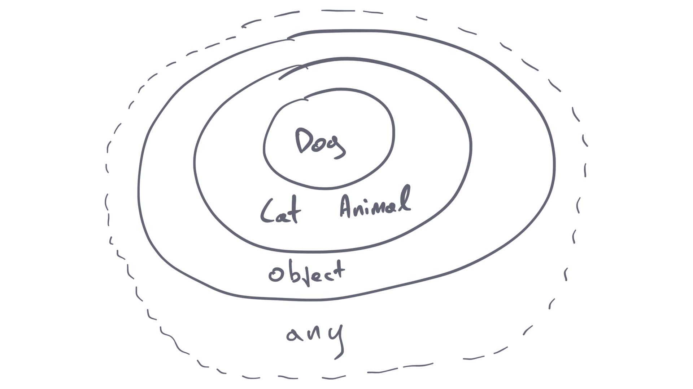
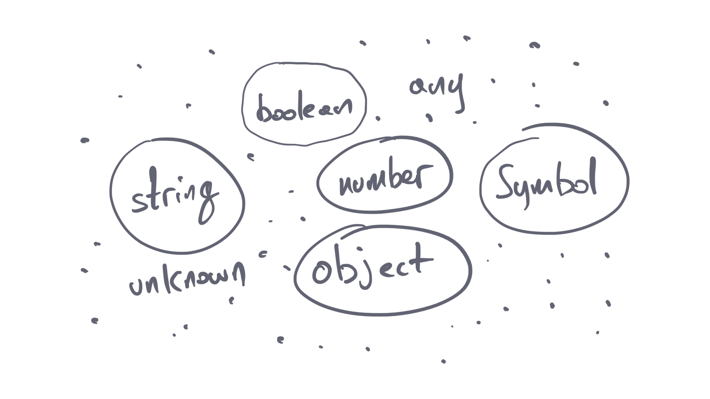
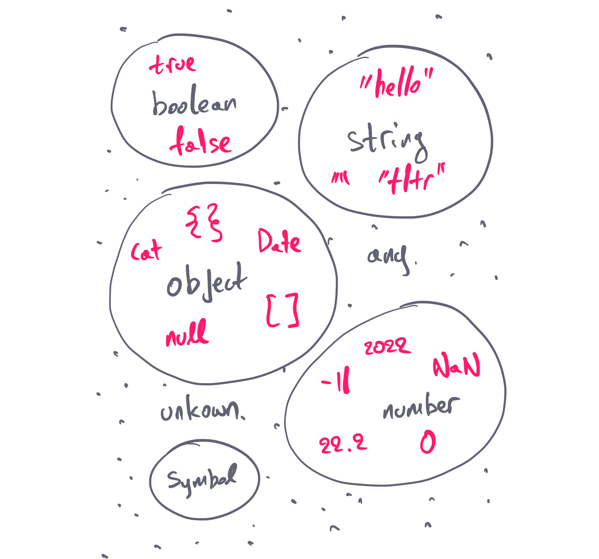

TypeScript has a **structural type system**. This means that the language does not depend on the origin of a type, when deciding if it’s compatible with another one, but it compares their _members_. If all the members of a type exist in another type with their appropriate types, then the two types are _compatible_.

In this article we will observe this behavior to understand it better. I will then explain the top level types that we have in TypeScript and how they are connected. We will also review the case of nullables, to understand how they relate to the other types.

Gianduja? 🍫

## A practical example

We are used to the idea that an **object** is created from a **class**. And that’s true with TypeScript as well; you can use classes to create objects. But objects in TypeScript are _not_ bound to their classes.

Consider the following example:

```tsx
class Dog {
  name: string = 'Nobody'
}

class Cat {
  name: string = 'Nobody'
}
```

These types do _not_ derive from any kind of parent class, like `Animal` for example. And yet they are interchangeable:

```tsx
const cat = new Cat()
const dog = new Dog()
const animal: Dog = cat // it works
```

Observe what’s happening when I assign a `cat` to a `dog`. No errors whatsoever. Bot `Cat` and `Dog` have a `name` property of type `string`. The structural contract is fulfilled.

To spice things up, let’s introduce an `Animal` interface:

```tsx
interface Animal {
  name: string
}
```

Our `Animal` interface is _still_ not connected to our classes. To differentiate between the two classes, let’s add a `bark()` method to the `Dog` class:

```tsx
class Cat {
  name: string = 'Nobody'
}

class Dog {
  name: string = 'Nobody'
  bark() {
    console.log('bark')
  }
}
```

As you may have guessed, our `cat` can be assigned without issues to an `Animal` object:

```tsx
const cat = new Cat();
const animal: Animal = cat;  // it works
```

What about the `Dog`? Well, this will _also_ work just fine:

```tsx
const dog = new Dog();
const animal: Animal = dog;  // it also works
```

Both `Cat` and `Dog` have the property `name: string` in common. That makes them compatible with `Animal`.

This doesn’t work both ways, because `Dog` has an additional method that `Animal` doesn’t support. If you try to assign an `animal` to a `dog`, you will get back an error:

```tsx
// create an animal object
const animal: Animal = { name: 'Apple' }
// Asign it to a Dog class
const dog: Dog = animal // Property 'bark' is missing in type 'Animal' but required in type 'Dog'
```

We say that `Dog extends Animal`, because `Dog` contains _all_ the members that `Animal` contains, and maybe some more. But the opposite, as we’ve seen, is not true.

I hope this gives you an overview of how a **structural type system** works in practice. It’s completely different from a **nominal type system**, in which the language is strictly checking for the _origin_ of an object. In languages like Java for example, the examples above would not work, because `Cat` and `Dog` are completely unrelated classes, regardless of if they are similar.

---

Now a small reminder; If you want to check if an object is related to another one, you have to use the `instanceof` operator:

```tsx
dog instanceof Cat // false
```

We are basically checking if the `dog` has the `cat` in its prototype chain. It certainly doesn’t.

So why is TypeScript that strange? 🙋‍♂️

## Why is structural typing useful?

The reason this feature exists is to make the language backwards compatible with JavaScript applications. JavaScript is a dynamic language, and it never had strict types. TypeScript adds only a minimum set of rules, to enforce strict type checks in your code, by preserving the mechanics of the JavaScript language. This not only makes it backwards compatible, but it also requires less effort from your side to integrate it into your projects.

That’s how TypeScript won the race for strict typing languages. There were plenty of them out there, that were compiling to plain JavaScript. But nobody wants to write everything from scratch. Nobody wants to learn a new language. Such a shame, and yet a reality.

Existing JavaScript code will work as is in TypeScript, _without_ any refactoring. That’s why structural types are useful.

## A journey to TypeScript’s type universe

If we have to visualize the previous example, we will end up with the diagram below. Every bubble represents a type. As we’ve seen, types can be classes, type aliases, interfaces, or a union which is a combination of types.



The `Dog` type can be assigned in bot the `Cat` and the `Animal` types. That logically doesn’t make sense, because the `Animal` is the logical parent of these two types. That’s the tricky part you need to understand with TypeScript. The same applies with the `object` type, which can accept any object structure. At the very top we have `any`, which can accept all the types.

The structural typing system doesn’t affect only object structures, but other kinds of types as well. The situation gets more complicated when you create unions, which can combine `any` types. I will explain how those are connected in the next articles.

For a birds-eye view, here are the top level types that are available in TypeScript:

- We have _immutable_ primitive types: `number`, `string`, and `boolean`, and `Symbol`.
- And we have reference types which can all be represented by the type `object`.



As you can see, the bubbles are completely independent here. That’s because they are not compatible with each other. You can’t assign an `object` to a `boolean`, for example.

Now, let’s zoom in, to see which values are compatible for each of them. Note that a `number` type can also include `NaN`. An `object` type can include any object declaration `{}`, arrays, regular expressions, dates, and the list goes on:

```tsx
// the following asignments will work fine
const aNumber: number = NaN
const generalObject: object = {}
generalObject = /some string/i
generalObject = {}
```

Next to these, TypeScript adds some special wildcard types:

1. `any`: the parent of all TypeScript types. You instruct TypeScript that you don’t know what a type can be, but it’s ok. You give your permission to TypeScript. You’re saying “I know what I’m doing here”. Most of the cases you simply don’t.
2. `unknown`: This is again the parent of all types, with a small catch. You instruct TypeScript that you don’t know what the type can be, but you want to protect yourself from unnecessary mistakes.
3. `never`: This is the opposite of the previous ones. It basically means no type must be assigned to that thing, no matter what. Think of it as the value `null`. It is useless as a value, but it plays a big role in the logic of your application.



Of course, we can create our own custom types:

```tsx
// we have a custom type
type OneTwoThree = 1 | 2 | 3
// we create a variable
const aValue: OneTwoThree = 1
// since all of its values are numbers, it is assignable to a number
const anyNumber: number = aValue // it works fine
// and of course we can assign it to a type of any
const anything: any = aValue // it works fine
```

In the previous example, our type alias `OneTwoThree` can contain specific numbers. This immediately makes it compatible with the `number` type. You can’t assign any number that you want to the `aValue` variable, but you can assign the `aValue` variable to `anyNumber`. In the same way, you can assign `anyNumber` to `anything`.

If you want to learn more details about the available types of TypeScript, I have [another article](https://nicotsou.com/tltr-typescript-types/) which explains everything you need to know about them.

## Nullable primitive values

In JavaScript, we have the the following **nullable** **primitive _values_**:

1. `undefined`: When no value is assigned.
2. `null`: When we specifically assign a null value to an object.

> Don’t be confused, nullable types are not valid types in TypeScript, but _values_ that can be assigned to variables.

Yes, I hear you. You can set a variable to `null` or `undefined`:

```tsx
const alwaysUndefined: undefined = undefined
const alwaysNull: null = undefined // Error: Type undefined is not assignable to type null.
```

In the previous examples, we have declared the variables `alwaysUndefined` and `alwaysNull`, which respectively can only accept `undefined` and `null` as allowed values. Here we are basically instructing TypeScript, to use the `undefined` and `null` values similar to how we use a string value `“green”` or a number value `123`.

```tsx
const alwaysGreen: 'green' = 'green'
type Always123 = 123
```

Kinda boring, isn’t it? 😑

---

Now I want to make a small note here; TypeScript will _not_ allow assigning `null` or `undefined` values to a variable by default. That’s _only_ possible when you have specifically disabled `strictNullChecks` in the compiler configuration file, and you have set the `strict` mode set to off.

By default, `strict` mode is on, which sets all the strict flags to true. If you want to write robust code, you should definitely avoid having nullable variables.

The following will not work, if we have `strict` mode enabled, which is the default option:

```tsx
const space: object = null // Type null is not assignable to type object.
```

This was a useful introduction that will help you create a mind map to have a holistic view on types in TypeScript. In my next posts, I will cover more ways you can dynamically generate type combinations. Until then, stay curious. 🤓

Cover Credit: [Mehdi MeSSrro](https://unsplash.com/photos/r-O95aZ6wvI)
