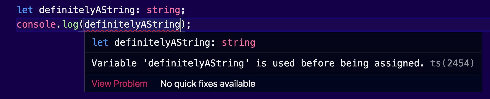
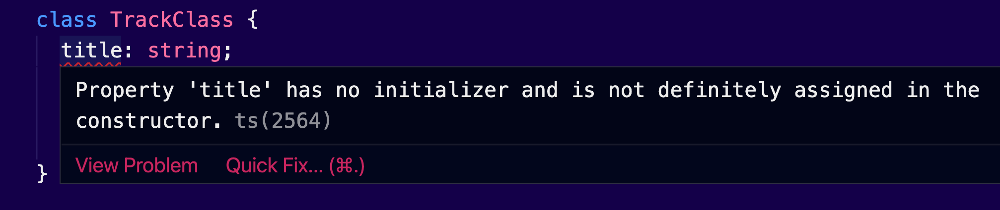

In previous articles, we’ve seen that TypeScript is a superset of JavaScript, that adds strict type support and a better developer experience.

Some of us, including the author of this blog, are pretty skeptical about choosing which of these types to use under which circumstances. Failing to do so, will increase confusion in your team and potentially will make your code hard to follow.

The most difficult to pick is how to define the structure of an object. We can either use a `class`, an `interface`, or even a plain `type` alias. There are some subtle differences between these three keywords. In this article, I am reviewing their syntax, and comparing them side-by-side.

I hope after reading the following paragraphs, you will feel more confident choosing the right type keywords in your projects.

Coconut? 🥥

## Too many keywords to choose from

Consider the following `Track` object, that we’ve seen so far in the previous articles:

```tsx
const track = {
  title: 'Bohemian Rhapsody',
  releasedAt: 1975,
  gernes: ['Rock', 'Hard rock', 'Progressive rock'],
  isFavorite: true,
}
```

I can specify that this is an object in the following ways:

```tsx
// using the object keyword:
// highlight-start
const track: object = {
  // highlight-end
  title: 'Bohemian Rhapsody',
  releasedAt: 1975,
  gernes: ['Rock', 'Hard rock', 'Progressive rock'],
  isFavorite: true,
}
// using the object notation:
// highlight-start
const track: {} = {
  // highlight-end
  title: 'Bohemian Rhapsody',
  releasedAt: 1975,
  gernes: ['Rock', 'Hard rock', 'Progressive rock'],
  isFavorite: true,
}
```

The first one is using the `object` keyword, which pretty much describes every object. The second one uses _object notation_ instead. These `{}` object literals after the `:` colon don’t create a new object. It’s TypeScript’s object notation for setting an object as a type.

This basically tells TypeScript that `track` is expected to be an object. But this is not specific enough, is it? For example, if we try to assign a new object, it will work just fine:

```tsx
track = { message: 'goodbye track!' } // track object has been replaced
```

There is a need to describe what is expected in the individual properties within the object notation:

```tsx
// highlight-start
const track: {
  title: string
  releasedAt: number
  gernes: string[]
  isFavorite: boolean
} = {
  // highlight-end
  title: 'Bohemian Rhapsody',
  releasedAt: 1975,
  gernes: ['Rock', 'Hard rock', 'Progressive rock'],
  isFavorite: true,
}
```

Clearly this works much better now. If we try to store an irrelevant object to the `track` variable, we will get back a compilation error:

```tsx
track = { problem: "I don't know what I'm doing!" } // throws an error
```

Now we are guarding this `track` variable with precise prescriptions on what values it should accept. But again, what if we want to pass this object in multiple places? Clearly this long object notation is not efficient enough. And you know what they say about repeating yourself and how to keep things DRY.

Ah, and good luck if the object structure of our `track` variable change. We don’t want to put ourselves in a situation that requires a complete rewrite of our application just to support some new features. I hear you. We could try to use a type alias.

## Type Aliases

Here’s the syntax of a type alias:

```tsx
type Track = {
  title: string
  releasedAt: number
  gernes: string[]
  isFavorite: boolean
}
```

Now we can refactor our `track` object like so:

```tsx
// highlight-start
const track: Track = {
  // highlight-end
  title: 'Bohemian Rhapsody',
  releasedAt: 1975,
  gernes: ['Rock', 'Hard rock', 'Progressive rock'],
  isFavorite: true,
}
```

Here we use the `Track` alias to guard the `track` variable. Basically, the result is the same as before, if we try to assign a non-compatible object value, or any other type that doesn’t match the `Track` alias, TypeScript will do one thing that knows very well. To throw beautiful colors.

Let’s review the main features of type aliases.

### Type aliases support primitive types

First of, they can support primitive types and object structures:

```tsx
type maybeAString = string | number
```

Here we used a union, to have a string that accepts `undefined` as a value. By default, TypeScript will yell at you if you try to leave a string `undefined`:



But we can if we introduce our own type alias. It won’t be a string. It `maybeAString`.

A type alias can fully support every feature of an `interface`. The opposite isn’t possible. You see, interfaces only describe object structures, not primitive types.

This unlocks the possibility to use a type alias as an enum:

```tsx
type FileTypes = 'mp3' | 'mp4'
```

No other type annotation keyword in TypeScript has support for primitive types. Easy choice!

### Type aliases can only declared once

If we try to declare another track, we will get back an error:

```tsx
type Track = {
  title: string
  releasedAt: number
  gernes: string[]
  isFavorite: boolean
}

type Track = {
  // error: Duplicate identifier 'Track'.
}
```

### So, when to use a type alias?

That’s a type alias. It’s basically a shortcut to create custom types. Something like a variable that you can store any type annotation that you want. It basically supports all the operators and primitives of TypeScript. You must use type aliases when you have to support primitive types. They can take multiple forms. For example, they can act as an enum.

Avoid them if you are building a shared library or if you are writing type definitions. Type aliases can’t be extended, like interfaces, so the consumers of your library will not be able to add new features if they want. This is limiting for type definitions that are meant to support existing JavaScript libraries.

---

Now somebody may argue, if interfaces are the same, then why use a `type` alias and not an `interface` instead? What’s wrong with interfaces?

Great question. Really! Let’s elaborate more on that in the next section.

## Interfaces

The previous example can be easily refactored to use an `interface`:

```tsx
interface ITrack {
  title: string
  releasedAt: number
  gernes: string[]
  isFavorite: boolean
}
```

Mind the difference in their syntax; The `=` equals sign is not required when you declare an interface. We can then use the `ITrack` interface to guard our `track` object:

```tsx
// highlight-start
const track: ITrack = {
  // highlight-end
  title: 'Bohemian Rhapsody',
  releasedAt: 1975,
  gernes: ['Rock', 'Hard rock', 'Progressive rock'],
  isFavorite: true,
}
```

Here, I used the letter `I` as a prefix to distinguish the interface from the type alias.

Now what is the difference? Do these examples produce different results? Does TypeScript get a different message? The answer is no! These two examples are completely identical. TypeScript will behave the same. There is no fundamental change whatsoever.

Let’s review the main characteristics of interfaces, to understand what differentiates them from other type keywords.

### Interfaces can act as type annotations for object structures

Interfaces are meant to declare an object structure. They don’t support primitive types, like type aliases do. In the example above, we replaced the `Track` type alias with the interface `ITrack`.

### Interfaces can connect unrelated classes together

You know that classes can _implement_ interfaces. TypeScript will check if all the members of the interface are being declared appropriately in your class.

Consider the following interface, plain and simple:

```tsx
interface ISpam {
  annoyReaders(): void
}
```

We can use this interface in a blog post class:

```tsx
class BlogPost implements ISpam {
  title: string = 'TLTR; TypeScript';
  releasedAt: number = 2022;
	author: 'nicotsou',
  annoyReaders(): void {
    console.log('Accept our coookie!');
  }
}
```

But we can also use it to an email demon:

```tsx
class EmailDemon implements ISpam {
  annoyReaders(): void {
    console.log('Please accept our coookie!')
  }
}
```

These two classes are completely irrelevant. By implementing the `ISpam` interface, they both share the same functionality. This means that we can now write code that implements functionality for both these objects, without worrying about unexpected results. We will expect that they will contain a method `annoyReaders()`.

Beware of the cookies!

### Interfaces can be extended

In contrary to type aliases, interfaces can be defined multiple times in your project. Their definitions can be merged. This feature is called _declaration merging_.

Consider the following declarations of the same interface `ITrack`:

```tsx
// declaration A
interface ITrack {
  title: string
  releasedAt: number
  gernes: string[]
  isFavorite: boolean
  play(): void
}

// declaration B
interface ITrack {
  length?: number
}
```

They can be in the same file, or in different places within our project. TypeScript will not complain about this duplication. Instead, these two definitions will be merged into the following object structure:

```tsx
interface ITrack {
  // declaration A
  title: string
  releasedAt: number
  gernes: string[]
  isFavorite: boolean
  play(): void
  // declaration B
  length?: number
}
```

This feature of interfaces makes them ideal for type definitions for shared libraries. Consumers of these type definitions will have the opportunity to extend them in the case they want to add missing implementations.

### So, where to use an interface?

It is common to use interfaces to represent the shape of objects, function arguments, and classes you want to behave in a common manner. Use interfaces for type definitions in your shared libraries.

Some examples are a form model, your React component properties, the configuration object of a function, the response object of an api, or the payload of an event action.


_Photo credit: [Dan Counsell](https://unsplash.com/photos/y57MGB34dEE)_

### Interfaces vs type aliases

That’s a tricky choice, because in the end they both can describe object structures. Both interfaces and type aliases can be _implemented,_ which makes type aliases something like a super-type. Interfaces can be represented fully by types, but types cannot be represented with an interface. That's because types can represent primitive types, object data structures or both if you use a union.

Interfaces can be extended. That makes interfaces really great to work with when we are defining type definitions for our libraries.

Types are commonly used in situations when you have an instance of a variable that you want to pass around, but I have seen projects using them to describe object structures.

---

I hear a man screaming at the back of my head. Yes, I confess. Sometimes I do hear voices.

_“Nicos, what about classes? They can also be used to describe object structures, right? What’s wrong with classes?”_

Another great question. Another paragraph for this article. OK, let’s see how this will go.

### Classes

We will create a `Track` class to describe the shape of our `track` object. I will name it `TrackClass`, just to avoid name conflicts:

```tsx
class TrackClass {
  title: string
  releasedAt: number
  gernes: string[]
  isFavorite: boolean
}
```

The syntax is similar to the interface, only the keyword at the beginning changes. But if you try this in your text editor, you will see that TypeScript cries multiple lines of errors:



We did define our class members, but we didn’t provide a way to instantiate objects out of it. Remember, a class is meant to be used as a blueprint to create objects. But how can we create objects if there is no `constructor` in place? Ha! We just found our first difference. Excitement. We will find out more as we go. But first, let’s fix that class:

```tsx
class TrackClass {
  title: string;
  releasedAt: number;
  gernes: string[];
  isFavorite: boolean;

  constructor(
    title: string,
    releasedAt: number,
    gernes: string[],
    isFavorite: boolean
  ) {
    this.title = title;
    this.releasedAt = releasedAt;
    this.gernes = gernes;
    this.isFavorite = isFavorite;
  }
```

OK, now we are ready to review the characteristics of classes.

### Classes are available at runtime

A class is not yet another TypeScript thingy, that we solely use for type annotation. It’s a JavaScript keyword nowadays. This means that it is available at runtime. This doesn’t apply to type aliases and interfaces, which are TypeScript exclusives. They will be completely removed from the transpiled code.

### Classes can instantiate objects

The main purpose of a class is to create objects:

```tsx
const track: TrackClass = new TrackClass(
  'Bohemian Rhapsody',
  1974,
  ['Rock', 'Hard rock', 'Progressive rock'],
  true
)
```

We can’t use other types like this, but we can use a class to annotate objects that have a compatible structure:

```tsx
// highlight-start
const track: TrackClass = {
  // highlight-end
  title: 'Bohemian Rhapsody',
  releasedAt: 1975,
  gernes: ['Rock', 'Hard rock', 'Progressive rock'],
  isFavorite: true,
}
```

Now, this example may look convenient to you, but again, a class is not meant to be used as a type to describe existing objects. In situations like this, consider using an interface or a type alias. It only makes sense to have a class, when you use its constructor to create objects and you want to apply certain rules upon their creation.

### Classes support OOP features

Classes support a lot of features that we can find in classical object-oriented programming languages. You can have `private`, `protected` and `public` members. You can have setters and getters, `readonly`, or `static` properties. You can implement inheritance and many nice design patterns much easier. These features, together with the `constructor` we mentioned before, can provide safety, a sense of privacy to your models. They set standards and make your code much easier to understand and maintain.

Although, using such OOP features is a design decision you have to make for your project, using a `class` is the only way to implement it. No other type keyword has support for such OOP features. No can dosville baby doll. Don’t ask me why, that episode of HIMYM was playing while I was writing this article.


_Photo Credit: [Stillness InMotion](https://unsplash.com/photos/5N75xeV9x9Q)_

### How do abstract classes compare to interfaces?

You may be tempted to use an abstract class instead of an interface. And it’s a very good option, for those who want to structure their models in a certain way. Besides the previous differences that we mentioned, there’s a fundamental one that separates interfaces from abstract classes.

Interfaces can be used to set rules for the classes that implement them. Think of them like a contract. You accept the terms and conditions, now you have to implement them fully. This is similar to how abstract classes work.

> A class can implement multiple interfaces. Classes can only inherit from a single class.

Remember the `ISpam` interface and how we used it to connect two unrelated classes? If we had used an abstract class `Spam`, we would have to _inherit_ from it, and this unavoidably would have established a connection between these classes. That’s not what we want, right?

By inheriting from an abstract class, your classes are strictly dependent on that abstract class. Interfaces on the other side, are loosely coupled. This means we could potentially use them to apply a certain behavior to classes that originate from different parents, or classes that are completely independent.

On the other side, we can use abstract classes and inheritance to structure our code in a way that makes sense. In that case, we will get for free all the OOP features, that abstract classes support. This means we can be much more descriptive about how certain class members must be instantiated.

## Enums

TypeScript has a dedicated `enum` keyword:

```tsx
enum FileTypesEnum {
  Mp3 = 'mp3',
  Mp4 = 'mp4',
}
```

In comparison with the type alias that we used before, enums have the following features.

### Available at runtime

As we said, type aliases are used solely for type annotations and they don’t make it at runtime. On the other side, you can access the contents of an enum at runtime, because it will be included in the transpiled JavaScript code. The truth is, with enums you have the option to decide if you want them at runtime or not; with type aliases you don’t.

### Type aliases vs enums

An `enum` is better to be used when we know all the values upfront. For example, the different statuses of an asynchronous api call, the days of the week, the different status flags, or to map state values to their keys. Use type aliases for dynamically generated values, or value sets that you don’t know upfront.

Ah, and stay tuned, because in the following articles I will show you how to dynamically generate enums by using plain types. We still have a lot to learn from TypeScript.

Cover Photo Credit: [Shubham Dhage](https://unsplash.com/photos/VEEqzwGwnpk)
