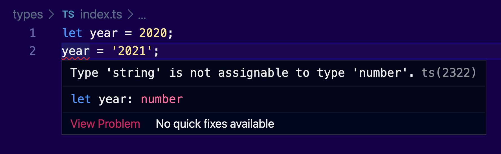
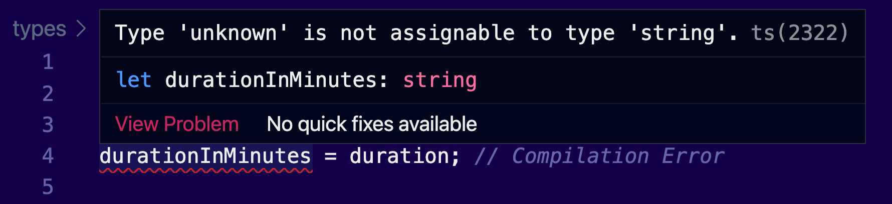
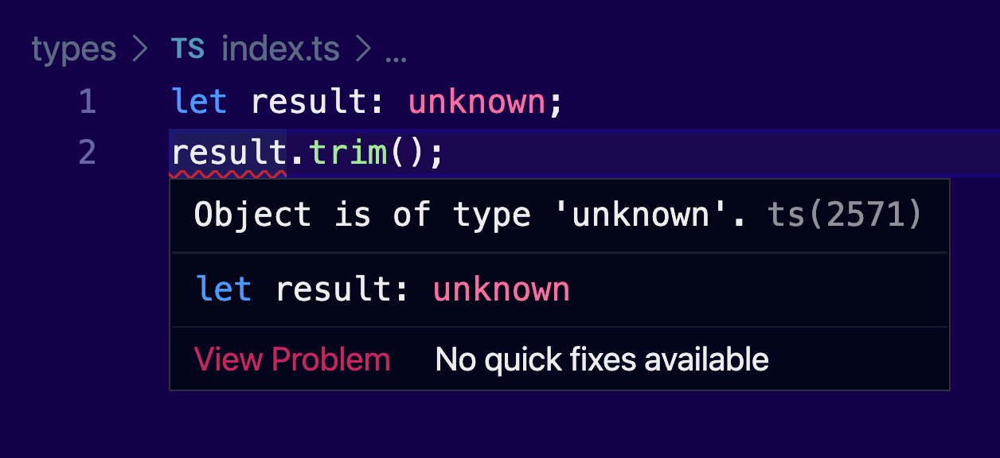
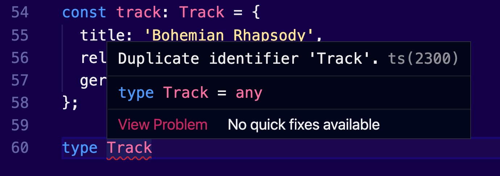

> Does JavaScript have types? Keep reading. The answer may surprise you.

In [programming languages](https://en.wikipedia.org/wiki/Programming_language), a **type system** is a [logical system](https://en.wikipedia.org/wiki/Logical_system) comprising a set of rules that assigns a property called a [type](<https://en.wikipedia.org/wiki/Type_(computer_science)>) to the various constructs of a [computer program](https://en.wikipedia.org/wiki/Computer_program), such as [variables](<https://en.wikipedia.org/wiki/Variable_(computer_science)>), [expressions](<https://en.wikipedia.org/wiki/Expression_(computer_science)>), [functions](<https://en.wikipedia.org/wiki/Function_(computer_science)>) or [modules](https://en.wikipedia.org/wiki/Modular_programming).

But you are not here for definitions, aren't you?

This article belongs to my series [Too Long To Read TypeScript](/tltr-typescript). Every article covers in detail a core concept of the language.

In this Types Special, we will discover how JavaScript deals with types and how you can make your life simpler with TypeScript. I believe a strong JS foundation is important to fully understand TypeScript. That's why I will start from the very basics.

We will then review the built-in types of TypeScript, together with some special keywords that may become really useful in your daily coding. I will introduce you to unions, which let you make your own type combinations. Finally, we will discover how type aliases can be used to build custom types.

Donut? 🍩

## Types in JS

Run the following code in your console, line by line. Spoiler alert in the comments.

```jsx
'Hello' // it works, returns undefined
2021 + 1 // it works, returns 2022
[1, 2, 3].length // it works, returns 3
```

You will notice that JS doesn't complain at all. A value is an acceptable _expression_ for JavaScript.

Now, let's try the following example:

```jsx
let year = 2020
year = '2021'
year * 2 // it returns 4042 as a string!
year = 'two thousand twenty one'
year * 2 // it returns NaN
```

Interesting finding; There were no errors, whatsoever, when we tried to change the type of a variable. This proves that variables in JavaScript don't have types. I can assign anything that I want to any variable that I want.

> In JavaScript, variables don’t have types; their _values_ have.

A type of a _value_ can be `undefined`, `null`, `number`, `string`, and `boolean`. ES6 supports a new type called **`Symbol`**. We call these **primitive types**.

Everything other variable is an `object`, including `array`, regular expressions and `Date`. These are **reference types.**

In the following example, we assign a string value to the variable `artist`:

```jsx
var artist = 'Pink Floyd' // we assigned a string value to artist
```

Primitive types are **[immutable](https://www.sitepoint.com/immutability-javascript/)**, which means you cannot alter their values directly; they create a new instance every time they change. Immutable values can be compared:

```jsx
var artist = ' Pink floyd '
var artistWithoutSpaces = artist.trim()
console.log(artist) // ' Pink floyd '
console.log(artistWithoutSpaces) // 'Pink floyd'
console.log(artist === artistWithoutSpaces) // false
```

Reference types are **mutable.** Which means, when you compare them, you compare their _references_ not their actual values:

```jsx
var track = { artist: 'Pink Floyd' }
var trackWithoutSpaces = track
trackWithoutSpaces.artist.trim()
console.log(track === trackWithoutSpaces) // it's true!
```

You can declare **global variables** if you omit the \*\*\*\*`var` keyword. This also mirrors its value in the global environment object:

```jsx
noDeclarationWhatsoever = 'and it works'
```

---

Now let's try a weird operation:

```jsx
'1' + 2 // returns 12
```

Another interesting finding; Again, we don't see an error. Instead, JavaScript automatically _coerces_ their values, which will allow you to compare apples with oranges if I want to. A `string` wins over a `number`, that's why the result is a `string`. That means there is a predefined priority.

Now, just for fun, try the following:

```jsx
typeof NaN // it returns 'number'
```

What a total disappointment. It turns out that `NaN` has actually the type of a `number`.

Nobody can trust such a language, right? And yet millions of applications are using it. There's a high chance that the application you are using to read this article is also made with JS. That's not because its developers had an alternative and instead decided to make their lives difficult. JavaScript is [almost] the only option on the web. It just works. Everywhere.

> Don’t forget, JavaScript was discovered back when downloading a song was _slower_ than visiting a store to purchase the physical CD album.

If we could somehow improve it. But wait, we already know such a tool. It's called...


## Types in TypeScript

Everything in TypeScript just simply makes sense:

```tsx
let year = 2020
year = '2021' // it doesn't compile; you cannot assign a string to a number. Why on earth you want to do this? Now go back and fix that broken code. Thankfully AI will replace you humans and we will not be annoyed by you anymore...
```

Thankfully, no surprises here. TypeScript will protect us from such mistakes. It's not a warning that we can forget about it; it's a _compilation error_. It completely prevents us from running our application.

We can see errors while writing code. Text editors that are compatible with TypeScript, like Visual Studio Code, will simply indicate the error, as we type:



Notice that if you hover over the year variable, TypeScript already understands it's a `number`. This is called **type inference**. Sometimes it can be redundant to declare the types for your variables, since they are implicitly defined by their declaration.

This way of defining types is called **right-hand typing**, which refers to the right side of the equals sign (=). This probably is more familiar to you if you are a JavaScript developer.

But there is another way to define types, which is called, as you can guess, **left-hand typing**. This is the TypeScript way and we will get into it in the next section.

### Built-in Types

To help TypeScript better understand how your code is interconnected, it provides _type annotations_ that can live within our code.

Here are the most important built-in types, you will most probably use on a daily basis:

```tsx
let title: string = 'Bohemian Rhapsody'
let releasedAt: number = 1975
let gernes: string[] = ['Rock', 'Hard rock', 'Progressive rock']
let isFavorite: boolean = true
```

Here are some special ones:

```tsx
let error: undefined // similar to JS
let loading: null // similar to JS
function init(): void {} // This function should not return any value
```

An important thing to remember, these type annotations are _only_ available in the TypeScript compiler, and they never make it to the actual production code. This means, they are available at compile time and not at runtime. That's how all strongly-typed languages work.

Now let's review two more important types.

### any

What if we want to go back to where we came from? What if we have legacy code, that doesn't respect types at all? Do we need to re-write everything or is there a way to temporarily disable type checking?

Yes, my friends. There is. And it's called `any`:

```tsx
let year: any = 2020
year = '2021' // it perfectly compiles without issues.
```

Now you may be wondering, is this even legal? That's the reason we added TypeScript from the very beginning, right? Because of its type annotations. I mean, it is even called type-script. If we have to use `any`, then what's the point of having TypeScript at all?

Well, my friends, you are right one more time. The usage of `any` is _not_ encouraged. Avoid it whenever you can.

> When you use _any_ in your type annotations, you simply skip the type annotations. You are basically saying "I hate TypeScript and I don't want to deal with it. _You_ deal with it!".

There are some cases that `any` becomes useful, though. I use it a lot when I want to try an idea quickly, let’s say to log something on the console, just to debug my code. So none of my colleagues knows that I’m actually using `any` in our project.

Any is like a wildcard. Use it, but with caution.

An alternative to any is the special comment `@ts-ignore`:

```tsx
let year: any = 2020
// @ts-ignore
year = '2021'
```

This disables the type system for this specific line or file. It’s mostly preferred when there you want to hack your type system on purpose. You can then search and replace all its instances.

There is a better way to deal with unexpected values in TypeScript. The keyword `unknown`, which we will analyze in the next section. The ultimate way is to use Generics. We will cover them in a separate post.

### unknown

The `unknown` keyword works similar to `any`:

```tsx
let duration: unknown
duration = 354 // it works
duration = '5.54m' // it works
```

The difference is that TypeScript doesn't let you assign values of other types to a variable that is of an `unknown` type:

```tsx
let duration: unknown
let durationInMinutes: string
duration = '5.54m'
durationInMinutes = duration // Compilation Error
```

By running the previous example, we will get an error that `unknown` is not assignable to type `string`:



To fully understand the value of the `unknown` keyword, consider the following example:

```tsx
let result: unknown
result.trim() // Compilation Error
```

Since we don't know if the result will a `string`, we can't be sure it implements the `trim()` method. TypeScript again will guard this variable and it will not let us do some inappropriate action with it (sic):



To bypass this error, we can add some logic that narrows down the `unknown` result value. We can simply check if it's a `string`. TypeScript will recognize our efforts to make our code more robust.

Embrace the unknown.

## Unions

Sometimes you know that a variable accepts different types. For example, you have a value that can be undefined if it's not set, or you have a boolean that can become a number. Another example is the response that you get from the server.

TypeScript provides a solution to standardize such scenarios. It is called a **union** and the syntax is the following:

```tsx
let id: string | undefined
```

In this example, the `id` variable can act as a `string` or `undefined`.

### Enumerations

Similar to other languages that support enums, we can define our own `enum`, and then use it:

```tsx
enum Filetypes {
  Mp3,
  Mp4,
  Wav,
}

const fileType = Filetypes.Mp3
```

By using such an enum, we avoid typos that can slow us down, for example, if we use a capital letter or not. We also allow the text editor to provide auto-completion, which speeds up our development even more. Who doesn't like to press Enter all the time?

Enums act like Symbols in ES6. But it's better, because we can control the real values. There are some important rules to remember.

### Enum values

TypeScript assigns values to your enum properties, but you can assign customize them if you want to.

By default, values start counting from `0`:

```tsx
enum Filetypes {
  Mp3, // 0
  Mp4, // 1
  Wav, // 2
}
```

We can set custom values if we want to:

```tsx
enum Filetypes {
	Mp3: 'mp3',
	Mp4: 'mp4',
	Wav: 'wav'
}
```

You can use a `string` or a `number` as a value, but you _can't_ use a `boolean`.

TypeScript compares their actual values:

```tsx
enum Filetypes {
  Mp3 = 20,
  Wav = 2,
}

Filetypes.Mp3 < Filetypes.Wav // returns false
```

### Transpilation behavior

Now, here's a pro tip. Let's revert our `enum` back to how it was:

```tsx
enum Filetypes {
  Mp3,
  Mp4,
  Wav,
}
```

This will be the equivalent code in JS:

```jsx
;(function (Filetypes) {
  Filetypes[(Filetypes['Mp3'] = 20)] = 'Mp3'
  Filetypes['Mp4'] = 'a'
  Filetypes[(Filetypes['Wav'] = 2)] = 'Wav'
})(Filetypes || (Filetypes = {}))
```

You may think this is too much for such a simple code. But there is a way to bypass it if you add the keyword `const`:

```tsx
const enum Filetypes {
  Mp3,
  Mp4,
  Wav,
}
```

Now the enum value disappears from the JS file, but its value will be simply assigned wherever you use it. It's a nice way to completely disable enums from the generated code.

### Type Aliases

TypeScript provides a nice feature called **type aliases**, and it works like this:

```tsx
type Track = {
  title: string
  releasedAt: number
  gernes: string[]
  isFavorite: boolean
}
```

It is useful to reuse complex type definitions across your application. It is also useful, when you want to separate the type declaration code, from the actual implementation, just to keep your code more readable.

Here is how we can use it to guard object structures:

```jsx
const myTrack: Track = {
  title: 'Bohemian Rhapsody',
  releasedAt: 1975,
  gernes: ['Rock', 'Hard rock', 'Progressive rock'],
  isFavorite: true,
}
```

As with all types, these aliases only affect compilation time, and it will not make it at runtime.

Don't be confused. That's not the only way you can describe the structure of an object. I will cover the `class` keyword in a separate post. I will also cover the `interface` keyword, which is by far the most preferred way.

The good thing about type aliases is that you can use unions in them:

```jsx
type ServerResponse = undefined | null | string | Track
```

With this in mind, we can reduce the usage of `any` in our code, when it's possible.

The even better thing is that you _cannot_ modify a type alias after its creation. This eliminates duplicates, which can be caused by different parts in your code.



Cover Credit: [Rodion Kutsaev](https://unsplash.com/photos/6W8H4puOJB0)
