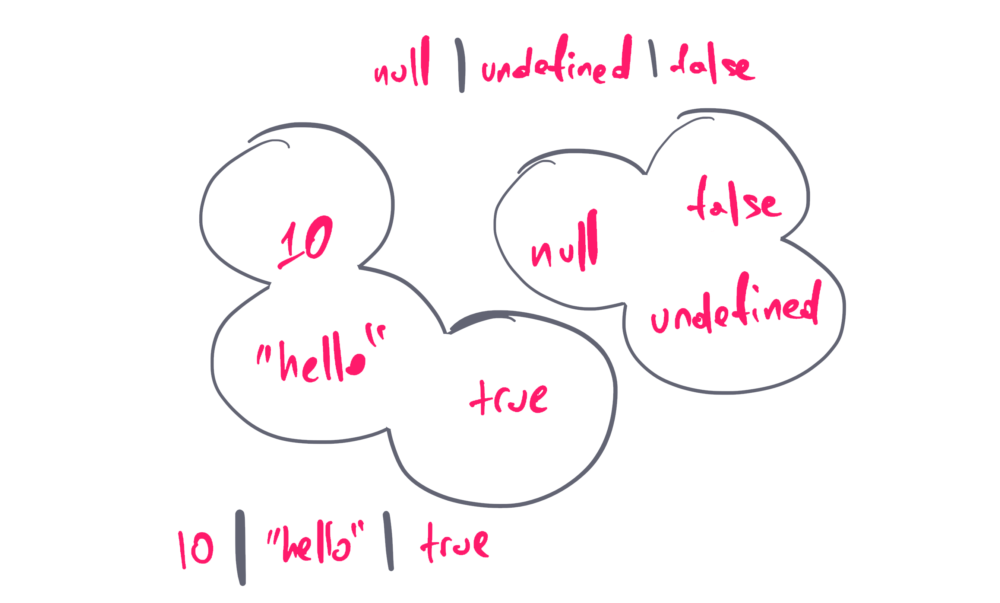

Some days ago I stumbled upon a code review in my project and I was totally confused:

```tsx
track: Movie | Song | Podcast
```

“Why on earth somebody is using the bitwise operator with strings?”, I was wondering.

I started searching online. I went through JavaScript sources I trust. I wasn’t able to find anything useful there. I started Googling about bitwise operators and strings in JavaScript. I did find a couple of nice tricks with numbers. Nothing related to strings. Shift+Cmd+F and search for bitwise operators within the project. It turned out it was very popular within my team. How the hell has this become a trend in a codebase I maintain, and I don’t have a clue about it?

Immediately I started panicking. The fear of missing out. What is this new hipster thingy that everybody knows, and Ι don’t have a clue? Am I that old? Am I still competent enough to have this job?

The aha moment was seconds away. It’s a freaking _union_. This code you are reviewing is not a JavaScript file. It’s a type definition for TypeScript. The moment of truth.

In the following paragraphs I tried to collect everything I know about unions. I want to show you some smart tips and tricks you could do when you use unions and value types. I will also explain the concept of discriminated unions.

For those who find these concepts difficult, you can check out my previous posts. I have a series of articles about TypeScript. I write about my experience learning the language and I’m trying to explain my mental model using practical examples. If you are a visual person like me, you can also check out my 📺[YouTube series about TypeScript](https://youtube.com/playlist?list=PL73mkIDIrfyPKjkJ1V151lcgGEDHs3tgG).

Maroni? 🌰

## What’s a union?

Allow me to make an analogy here.

> If Generics is the equivalent function for your types, conditional types the equivalent if-else statements, then definitely unions are the equivalent arrays.

Yes, basically that’s it! It’s an array of _allowed_ types. The types a value can have at a given moment. You can either set explicitly that a type can be a list of types, or TypeScript will implicitly create this list for you.

Here’s the simplest format for a union:

```tsx
type Track: Movie | Song | Podcast;
```

The `Track` can be a `Movie`, a `Song`, or a `Podcast`.


As we’ve seen, TypeScript evaluates your code at compile time, and it can display the type a value can have in every single line of code. When a value is allowed to have more than one type, a union will be used.

Looks like an array to me! 😃

## Literal Types

In TypeScript, it is possible to set specific _values_ as types:

```tsx
type RatingValues = 1 | 2 | 3 | 4 | 5
type MediaTypes = 'video' | 'audio'
type IsFalsy = false | undefined | 0 | -0 | 0n | null | ''
```

You may ask why this is even useful. Well, think of it as an `enum`. It will protect you from assigning values that aren’t acceptable:

```tsx
const rating: RatingValues = 3 // it works
const rating: RatingValues = '3' // it throws an error
const fileType: MediaTypes = 'video' // it works
const fileType: MediaTypes = 'Video' // it throws an error
const falsyValue: IsFalsy = true // nope!
```

The available value types you can use are `string`, `number`, `boolean`, `null`, `undefined`, and `bigint`.



Remember, all these type aliases are _not_ variables. They will _not_ be available at runtime.

## Template Literal Types

Imagine a variable that stores the font size:

```tsx
const fontSize = '2em'
```

It would be great if we could somehow guard these values with TypeScript, to limit typos that could cost us a lot of debugging. For sure, we can use literal types, but we can’t have all the possible font size combinations. We have infinite values.

In TypeScript, we can use a **template literal** to define even more customized types:

```tsx
type SizeValue = `${number}${'%' | 'em' | 'rem' | 'px' | 'vw' | 'vh'}`
```

Now we can control which values are acceptable and which are not:

```tsx
const fontSize: SizeValue = '2em' // it works
const fontSize: SizeValue = 2 // it throws an error
const fontSize: SizeValue = '2 px' // it throws an error
```

This becomes quite useful when you are building a shared UI library. You have the choice to enforce strict rules, that will help the consumers of your library to understand which values will work and which will not. Less warnings and errors are thrown in your code. The less code, the happier you and your team will be.

Just don’t overdo it. Remember, JavaScript became popular because of its simplicity and its flexibility. Not because it was strict.

## Discriminated Unions

How many times in the past have you used a string value to differentiate the status of your objects? Is my message delivered? Is it still loading? Has it failed?

Consider the following example:

```tsx
type FileBase = {
  filename: string
  type: string
}
type Song = FileBase & {
  type: 'mp3'
  play: () => void
}
type VideoClip = FileBase & {
  type: 'mp4'
  play: () => void
}
type CoverArt = FileBase & {
  type: 'png'
  move: () => void
}
type Receipt = FileBase & {
  type: 'pdf'
  download: () => void
}
```

In the type aliases above, the `type` property represents the file extension. A `Song` will be saved as `mp3`, a `VideoClip` as `mp4`, and the list goes on.

I could have created an enum to store the available values. By using a plain string value, I may lose control over which types will be used, but I get some very interesting features.

First of, I combine all file types under one umbrella:

```tsx
type PlayerFiles = Song | VideoClip | CoverArt | Receipt
```

Now check this out. Let’s say that we want a function that only accepts specific file types:

```tsx
function openFile(file: PlayerFiles) {
  console.log(file.type)
}
```

If you hover over the `file.type` property, you will see that TypeScript was smart enough to understand that the available types are `"mp3" | "mp4" | "png" | "pdf”`. Without even having an enum in place.

And it gets even better. Let’s try to implement our function:

```tsx
function openFile(file: PlayerFiles) {
	switch (file.type) {
		case ...
	}
}
```

The moment we start typing our `case` block, autocompletion kicks in:


That’s awesome. But what’s even more amazing is that if we pick one of the available types, let’s say `mp3`, we are getting autocompletion for their corresponding properties:


If you make the mistake of calling the wrong object member, TypeScript will throw an error:


It’s unbelievable how much functionality we get for free here. We may lose this control of having the available values in one place, but we get back the flexibility to dynamically add/remove types, without having to maintain a hardcoded enum. If this list of types was coming from an api, for example, I assume somebody else would have done this check for you.

These kinds of types are called **discriminated union types**. They are ideal in cases you don’t have a clear list of enum values, or this list is extremely huge, or in cases when you want the flexibility to add/remove values dynamically.

For example, if your app uses Redux, you can use a discriminated union type to build your action creators.

Cover photo credit: [Li Zhang](https://unsplash.com/photos/kdnSoGLjoZ8)
