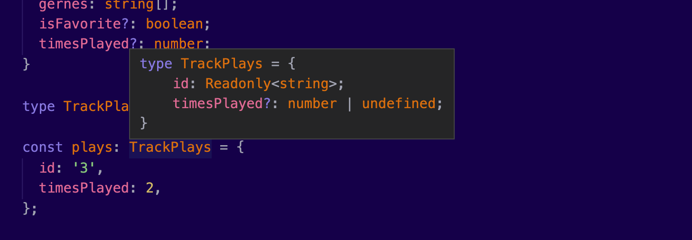

We’ve seen how [generic types](https://nicotsou.com/tltr-typescript-generics/) can help us reduce code, by providing a way to write functions for our types. This not only reduces a lot of clutter, but it also allows us to utilize types in ways we never thought of before. TypeScript takes this to another level, by introducing a couple of helpful built-in constraints, that will allow you to fine-tune your types.

> Utility types help you create new types on the fly, from existing types. They help you reduce code duplication and enforce strict rules.

It’s useful for every TypeScript developer to understand the available utility types and how to use them. This will help you reduce a lot of code in your application to improve readability. It will also save you time.

In this article I’m listing my favorite **utility types**. The ones I have seen in most of the TypeScript projects I have worked on. I've curated practical examples I’ve seen in production, to help you understand how these utilities can be used on a daily basis. I hope it will inspire you to find solutions that apply to your own projects.

Of course, this is not the complete list of built-in utility types. For a more comprehensive list, you can check out the [official documentation](https://www.typescriptlang.org/docs/handbook/utility-types.html).

For those who find these concepts difficult, you can check out my previous posts. I have a series of articles about TypeScript. I write about my experience learning the language and I’m trying to explain my mental model using practical examples. If you are a visual person like me, you can also check out my 📺[YouTube series about TypeScript](https://youtube.com/playlist?list=PL73mkIDIrfyPKjkJ1V151lcgGEDHs3tgG).

Peanut butter? 🍯

## Why do we need utility types?

Here our favorite `Track` interface:

```tsx
interface Track {
  id: number
  title: string
  artist: string
  releasedAt?: number
  genres?: string[]
}
```

There are cases when you want to reuse general types like this one, with some small modifications. Let’s say to omit some of their properties, to include new ones, to enforce read-only, and many more.

We will use this interface as a reference for most of the utility types below.

## Partial

There are cases that we want to deal with a part of an interface. Instead of creating new interfaces every time, with some small modifications, we can use the `Partial<T>` utility type:

```tsx
interface Track {
  id: string
  title: string
  releasedAt: number | undefined
  genres: string[]
  isFavorite?: boolean
  timesPlayed?: number
}

function updateTrackDetails(track: Track, fieldsToUpdate: Partial<Track>) {
  return { ...track, ...fieldsToUpdate }
}

const track = {
  id: '1',
  title: 'Bohemian Rhapsody',
  releasedAt: 1975,
  genres: ['Rock', 'Hard rock', 'Progressive rock'],
  isFavorite: true,
  timesPlayed: 0,
}

updateTrackDetails(track, {
  timesPlayed: 2,
})
```

Our `updateTrackDetails()` function accepts a track and a subset of the Track type. We didn’t have to specify which properties were allowed. Every time you change the `Track` interface, all the other partial types will get the update for free.

Less code to maintain. More time for more important stuff. 🙆‍♂️

## Required

Now, let’s have a look at the `Required<T>` utility type:

```tsx
function strictUpdateTrack(track: Track, fieldsToUpdate: Required<Track>) {
  return { ...track, ...fieldsToUpdate }
}

let initialObject: Track = {
  id: '1',
  title: 'Bohemian Rhapsody',
  releasedAt: 1975,
  genres: ['Rock', 'Hard rock', 'Progressive rock'],
  timesPlayed: 2,
  isFavorite: true,
}

strictUpdateTrack(initialObject, {
  id: '2',
  title: 'Some other track',
  releasedAt: 2022,
  genres: ['Pop'],
  timesPlayed: 0,
  isFavorite: false,
})
```

In this example, the consumers of the `strictUpdateTrack()` function will have to pass _all_ the properties of the track object. Even the `releasedAt` and `genres` which are optional.

## Readonly

I suppose you are familiar with the `readonly` keyword:

```tsx
interface User {
  readonly id: string
  username: string
  name: string
}
```

Since the `id` property is `readonly`, the following code will not compile:

```tsx
const user: User = {
  id: 'A123',
  username: 'nicotsou',
  name: 'Nicos',
}
user.id = '321' // Cannot assign to 'id' because it is a read-only property.
```

The `Readonly<T>` utility type works pretty similar. It basically makes all the properties of the given type `T` read-only.

For example, in the following function somebody used the `push()` array method to add a new entry to the `users` array:

```tsx
function addUser(users: User[], newUser: User) {
  users.push(newUser) // oops, we have mutated the array
  return users
}
```

This will cause a side-effect, because the `push()` method _mutates_ the array. We can easily add a rule to prevent such mistakes, by specifying the `users` parameter as a `readonly` type:

```tsx
function addUser(users: Readonly<User[]>, newUser: User) {
  users.push(newUser) // Property 'push' does not exist on type 'readonly User[]'.
  return users
}
```

The message isn’t clear enough, but it _does_ work. Basically, TypeScript will prevent you from mutating this array.

Specifically, for arrays you can use the `ReadonlyArray<T>` utility type:

```tsx
function addUser(users: ReadonlyArray<User>, newUser: User) {
  return { ...users, user }
}
```

Here we basically replaced `Readonly<User[]>` with `ReadonlyArray<User>`, which is a cleaner way to write `Readonly<Array<User>>`. Our function also returns a fresh reference to the `users` array, without mutating the original structure.

Problem resolved. 🙆‍♂️

Have in mind, that these checks only affect the first level and TypeScript will not perform a deep check:

```tsx
interface Id {
  number: string
  letter: string
}
interface User {
  readonly id: Id
  username: string
  name: string
}
const user: User = {
  id: { number: 'A123', letter: 'A' },
  username: 'nicotsou',
  name: 'Nicos',
}
user.id.letter = '321' // it is perfectly legit!
```

For that you will need a more sophisticated utility type. The bad news is that TypeScript doesn’t have a built-in one. The good news is that you can write one yourself.

## Record

We usually use enums or literal types to keep statuses. The `Record<T>` utility type makes it easier to specify object structures that leverage those statuses to create a key/value object structure.

For example, imagine that we have to implement a button with an icon. In Bootstrap we can have [buttons with icons and different colors](https://getbootstrap.com/docs/4.2/components/spinners/#buttons).


To indicate that something is idle, loading, or failed, we would need to know the loading status in order to display a loading indicator:

```tsx
type LoadingStatuses = 'idle' | 'loading' | 'failed'
```

To describe the condition of the button at any given time, we would need to set its `icon` and its `color`:

```tsx
interface Icon {
  icon: string
  color: string
}
```

Now we can have a more comprehensive object structure, that sets the default icons and colors for every single loading state. Here’s when we can use the `Record<T>` utility type:

```tsx
const icons: Record<LoadingStatuses, Icon> = {
  idle: {
    icon: 'normal',
    color: 'black',
  },
  loading: {
    icon: 'spinner',
    color: 'blue',
  },
  failed: {
    icon: 'warning',
    color: 'red',
  },
}
```

Note that TypeScript will require all the statuses to be present in your object, and it will not allow you to add statuses that aren’t part of the `LoadingStatuses` type.

## Pick

The `Pick<T, K extends keyof T>` utility type is meant to help us create a subset of a type, by specifying the members we want to keep from the original type. This works very similar to the `Partial<T>` utility type, but it gives us more control over the properties that TypeScript has to check.

Here’s an enhanced version of our `Track` interface:

```tsx
interface Track {
  id: Readonly<string>
  title: string
  releasedAt: number | undefined
  genres: string[]
  isFavorite?: boolean
  timesPlayed?: number
}
```

The goal is to create a collection with the times every track has been played:

```tsx
const plays = {
  id: '3',
  timesPlayed: 2,
}
```

Here’s how we can easily use the `Pick<T, K extends keyof T>` utility type to define a new `TrackPlays` type alias:

```tsx
type TrackPlays = Pick<Track, 'id' | 'timesPlayed'>
```

This means that TypeScript will not complain if we don’t pass any other required property from the original Track interface:

```tsx
const plays: TrackPlays = {
  id: '3',
  timesPlayed: 2,
}
```

If you hover over the `TrackPlays` type, you will get an overview of its contents:



## Omit

Similar to Pick, `Omit<T, K extends keyof T>` works the opposite way. You specify the properties you want to _omit_ from the original type:

```tsx
interface Track {
  id: Readonly<string>
  title: string
  releasedAt: number | undefined
  genres: string[]
  isFavorite?: boolean
  timesPlayed?: number
}

type TrackWithoutGenres = Omit<Track, 'genres'>

const plays: TrackWithoutGenres = {
  id: '1',
  title: 'Bohemian Rhapsody',
  releasedAt: 1975,
}
```

In the example above, TypeScript will no longer complain if we forget to include the `genres` property. Basically, with this utility type, we can make all the required properties _optional_.

## Exclude

Consider the following genres enum:

```tsx
type Genres = 'pop' | 'rock' | 'alternative' | 'metal' | 'r&b' | 'jazz'
```

We can use the `Exclude<UnionType, ExcludedMembers>` utility type to exclude some of the states:

```tsx
type CommercialGenres = Exclude<Genres, 'jazz' | 'metal'>
```

The produced type will only contain `'pop' | 'rock' | 'alternative' | 'r&b’`.

## Extract

Similar to `Exclude`, we can use `Extract<Type, Union>` to create a type with types that match with the given union:

```tsx
type CommercialGenres = Extract<Genres, 'rock' | 'instrumental' | 'ost'>
```

This will only return `‘rock’`, since the other two types are not included in `Genres`.

You can use the `Extract<Type, Union>` utility type to get the common properties between 2 object types.

## NonNullable

There are situations when we want to ensure that a value is not `null` or `undefined`. Here’s where `NonNullable<Type>` utility type can help:

```tsx
type TrackDuration = number | undefined | null

function printDuration(duration: NonNullable<TrackDuration>) {
  console.log(duration)
}

const nullDuration: TrackDuration = null

printDuration(nullDuration) // Argument of type 'null' is not assignable to parameter of type 'number'
```

Here, the `printDuration()` function is expecting a `duration` parameter that is not `null` or `undefined`. That’s why when we call it with the `nullDuration`, which is `null`, we get back an error.

This utility type can be very useful if you are using an older version of the language (prior to 2.0) or if you are working on a project that has the `strictNullChecks` option disabled in the compiler configuration. In both cases, TypeScript will consider `null` and `undefined` as allowed values for basically _every_ type. TypeScript’s strict mode can help us avoid all common mistakes that arise with nullable types. If we were using strict mode, the behavior would have been the same if we had used `number` as the type of the `duration` parameter.

## Conclusion

As we’ve seen, utility types help you reuse existing types and modify them according to your needs. This reduces code duplication, because you only need to declare the original types once. It also helps you enforce strict policies in your functions, such as readonly and non-nullable.

I’m only listing built-in utility types that TypeScript offers out-of-the-box. No strings attached. But utility types don’t stop here. There are plenty of [libraries](https://github.com/piotrwitek/utility-types) out there, implementing a variety of utilities for every use case.

Ah, and remember!

TypeScript is an open source language. Don’t forget to check the implementation of these utility types. To do that, you can right-click on one of them and select “Go to definition”, or something similar, while using your favorite text editor. I know, it’s kinda difficult to read the source code, but it will help you understand how to build your own!

In fact, in the next articles we will try to do exactly that! We will learn some of the most powerful features of TypeScript, that will help you build your own utility types. I may also curate another list with my favorite third-party utilities.

Cover Photo Credit: [Javier Miranda](https://unsplash.com/photos/xB2XP29gn10)
