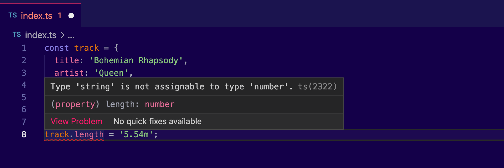
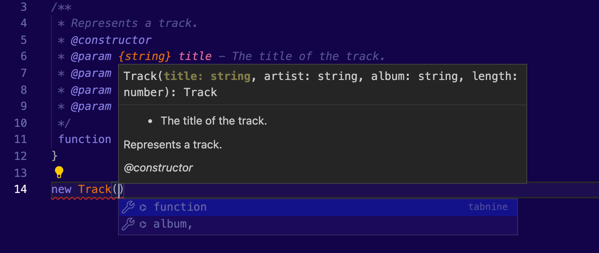
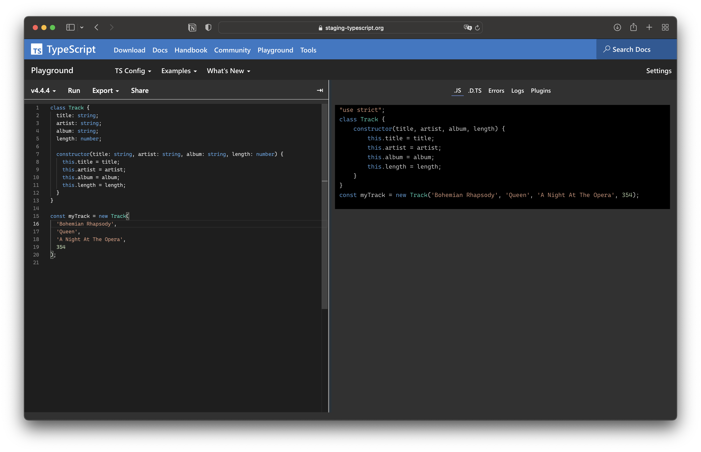
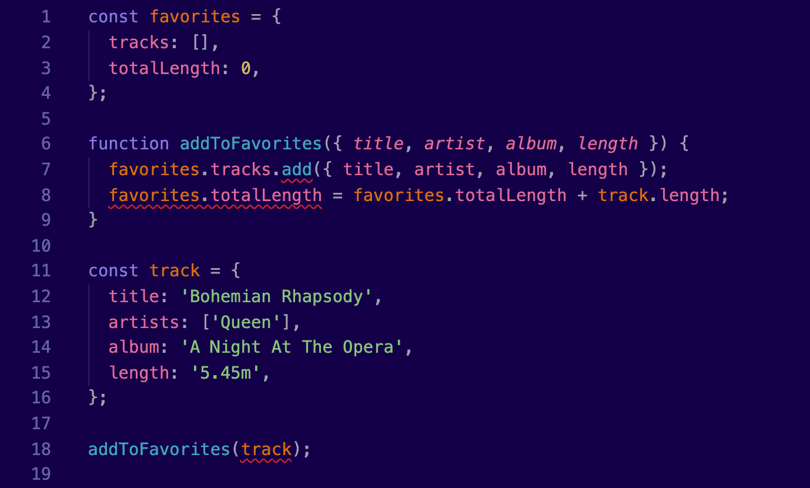

> TypeScript adds support for _strongly typed programming_ in your JavaScript applications. It's tightly integrated with your text editor, to help you catch your errors early.

TypeScript is a superset of JavaScript. All existing features of JS are already supported, but it adds syntax, which helps you build much more structured applications.

TypeScript's compiler transpiles to JavaScript. This means that you can run all the applications on every browser, on Node.js or other native apps that have a built-in JavaScript compiler. You have plenty of options to set the target supported devices.

You can adopt TypeScript gradually into your existing projects. You can also use it to catch JavaScript errors in your continuous integration pipelines. In fact, [Visual Studio Code](https://code.visualstudio.com) has TypeScript built-in, to help you find errors without any configuration from your side.

By introducing types to your code, your editor can understand much better how the different parts of your application are interconnected. Therefore, it can provide you with sophisticated auto-completion suggestions that can speed up your development.

TypeScript has full support for [JSDoc](https://jsdoc.app). Moreover, you can use comments within your code to create live documentation.

Type checking runs on compile-time. If you violate the type rules, your application will not run due to errors. All the extra code that you add it will be removed from the transpiled JS code and it will not be available at runtime.

---

## Introduction

I have to confess something to you, my friends.

My first experience with TypeScript wasn't really satisfactory. You see, I've been using JS for many years and I had to get familiar with its bad and good parts. It wasn't easy and I did suffer a lot. But after some point you learn how to use the language properly. I was pretty much trusting my development skills.

I was wrong.

First of, when I integrated TypeScript into my projects, I uncovered a lot of type mistakes, that could potentially cause bugs. Sometimes, it's hard to think about everything and to remember what you were doing a year ago, for example.

I wasn't only proud of myself. I was also proud of my team. You see, I was convinced everybody in my team understands JavaScript. We had code reviews, we were constantly learning. What could go wrong, right?

I was wrong again.

In every development project, a team is a living organism. It scales up and down. You should not take for granted the level of expertise you have at any moment. You have to think proactively. Maybe some juniors will join the project. Maybe you will need to invest in less experienced developers, because you can’t find any. And what if you had 10 or 50 developers? What if you had more?

That’s the lesson that I’ve learned. Having a strongly typed language reduces time for everyone. And this time grows exponentially as you add more people to the project.


_Photo Credit: [Carl Raw](https://unsplash.com/photos/m3hn2Kn5Bns)_

TypeScript isn’t free. You need to invest time navigating its learning gap. It’s a mind shift compared to traditional JS development. Like every other tool, you need to carefully integrate it into your projects without making your team suffer every time they try to innovate.

One of the things I didn't like about TypeScript, was the fact that I'm not writing JS anymore. I wasn't convinced this was a game changer for the industry. I've seen similar libraries become obsolete and I've seen developers struggling with refactoring their code. In the JavaScript ecosystem, trends come and go.

Back then, JavaScript was evolving rapidly. Don't get me wrong, it still does. But since ES6 there was a huge effort to improve the language. New features were being added. Something inside me was refusing to make the switch to another language.

The fear of missing out.

---

Many things have changed since then. TypeScript changed. It's now aiming to support standards, instead of introducing new features that are completely irrelevant to the JavaScript language itself. It's also backwards compatible, which lets you run pretty much every code written in JS, even the dirtiest ones.

Now you may be wondering, how can you learn a language that has two faces? How can you integrate it into your projects? How far do you need to go with the type restrictions? What different options do you have to structure your code right and which one you should use?

Understanding TypeScript takes time. And I would like to help. I’m introducing a series of posts that will help you scale your applications with confidence. A series that focuses on the most important parts and tries to give you practical ideas and examples that are already used in production applications.

In this introductory article, we will try to understand how TypeScript works, what it brings to your development process, and how to start new TS projects.

I hope the following paragraphs will help you have a better understanding of TypeScript and to know exactly what it needs to get started.

Any feedback will be considered sweet.

Panna cotta? 🍮

## How TypeScript was born?

I love JavaScript. It runs anywhere, it doesn't limit you from coding anything you want, and the development community is amazing. So many projects and patterns to try and a huge variety of applications to build.

It didn’t create a good first impression on me, though. When I first started writing scripts in JavaScript, I really hated the language. You see, JavaScript hides a set of weird quirks, that can cost you a lot of time, if you are not familiar with them.

> But what is wrong with JavaScript, you may ask.

Well, the truth is, JavaScript was never designed to support the complexity of modern applications. It was designed back then when we were surfing the web using these ancient dial-up modems that were making [a characteristic noise](https://www.youtube.com/watch?v=gsNaR6FRuO0). It wasn't designed to write advanced applications like GMail, Netflix, Spotify and many more.

](images/casettes.png)

Photo Credit: [Hello I'm Nick](https://unsplash.com/photos/6nqbKX5UI9I)

From the 90s to the Metaverse era, a lot of things have changed. Applications are now running fully on the browser. In the past, they were only running natively and you had to be home and use that huge computer with the CRT monitor. Now everybody is looking at their phones, even when they are not supposed to. Google is selling Chrome-based laptops. And don't forget, JS now runs on servers too. Even [NASA uses JavaScript](https://www.linkedin.com/pulse/how-nasa-uses-nodejs-rahul-rathod/).

Compared to languages like C# or Java, which are being used widely in the enterprise world, JavaScript seems that it doesn't have anything to offer to these developers, who were used to organizing their code using classes, interfaces, namespaces and modules.

On top of that, the development experience is day and night. Your text editor simply cannot compete with a sophisticated IDE like Xcode, or IntelliJ. Besides the code highlighting - which sometimes is very dum - and some common errors that can be handled with a linter, it doesn't provide any code completion suggestions, it doesn't recognize the types of your variables, and most importantly, it doesn't give you any sophisticated debugging tool.

](images/90s-tech.png)

Photo Credit: [Lorenzo Herrera](https://unsplash.com/photos/p0j-mE6mGo4)

> There were multiple attempts in its history to _fix_ JavaScript. In fact, today you will find more than 50 programming languages that compile to JavaScript.

From the ancient ActionScript, CoffeeScript, ClosureScript and Elm, to the most recent ones Reason ML, Dart, LiveScript and many more. These languages provide a better developer experience and they are strongly typed. Some of them are object-oriented. Others are functional. At the end, the goal is the same. You write your apps in a higher level language that compiles to JavaScript.

As a side note, you can use Python, Ruby, Kotlin, Scala, Swift, or even Java if you find [the right compiler](https://github-wiki-see.page/m/jashkenas/coffeescript/wiki/List-of-languages-that-compile-to-JS#ruby). But there’s no benefit in starting a new JS project with such languages. Who would like to maintain such a monstrosity. But even if you ever have this need, I would recommend you to check [WebAssembly](https://developer.mozilla.org/en-US/docs/WebAssembly).

This is how TypeScript become a game changer. Now check it by yourself.

## The Type Experiment

Read the following code and try to spot any mistakes.

```jsx
const favorites = {
  tracks: [],
  totalLength: 0,
}

function addToFavorites({ title, artist, album, length }) {
  favorites.tracks.add({ title, artist, album, length })
  favorites.totalLength = favorites.totalLength + track.length
}

const track = {
  title: 'Bohemian Rhapsody',
  artists: ['Queen'],
  album: 'A Night At The Opera',
  length: '5.45m',
}

addToFavorites(track)
```

Ah, yes! I forgot to mention that because the author of this post is a music lover, we are going to build a music player in the following posts. This code snippet is basically handling our favorite tracks.

Some of you may think to copy this snippet and paste it into your browser's console. But I will save you from this extra effort. This code has zero errors.

You will find the answer at the end of this post.

## What is TypeScript?

TypeScript is at the moment one of the most popular strongly typed flavors of JS. It is [highly adopted](https://2020.stateofjs.com/en-US/technologies/) by the many of the JS projects over the world, especially on backend applications.

What makes TypeScript easy to adopt is the fact that your code is as close to JavaScript as it can be. As a superset of JavaScript, any code that runs on JavaScript, runs perfectly well on TypeScript too.

The maintainers of the TypeScript language decided to stay away from custom code syntax. Its additional features are already supported or they will be supported in future versions of JS. That's a huge benefit for developers, because you will theoretically don't need to refactor your code completely when an X feature of JavaScript becomes available, when TypeScript becomes obsolete, or when you find a better tool to handle your type definitions much more efficiently.

---

There are plenty of things you _can_ do in JavaScript, that TypeScript will prevent you.

For example, check the object below:

```jsx
const track = {
  title: 'Bohemian Rhapsody',
  artist: 'Queen',
  album: 'A Night At The Opera',
  length: 354,
}

console.log(track.name)
```

This code will not compile, because the name property doesn't exist in the track object. But, this works perfectly on JS. TypeScript will return the following error:

```
Property 'name' does not exist on type '{ title: string; artist: string; album: string; length: string; }'.
```

Now, what will happen if I accidentally forget how I declared the `length` property and I assign a `string` to it?

```jsx
const track = {
  title: 'Bohemian Rhapsody',
  artist: 'Queen',
  album: 'A Night At The Opera',
  length: 354,
}

track.length = '5.54m'
```

Again, this will work on JS, because nobody prevents me from changing the type of a property, but it will throw an error in TypeScript:

```
Type 'string' is not assignable to type 'number'.
```

TypeScript noted that a `string` has been assigned to the property `length` and it will prevent me from changing its type.

Here I want to mention that all I did was to rename my `index.js` file to `index.ts`. Just by changing the extension of the file to `.ts`, I helped my text editor to become a little bit smarter:



TypeScript doesn't stop there.

I can specifically set the types of my properties, without even setting an initial value. What if I had a `class` of music tracks:

```tsx
class Track {
  title: string
  artist: string
  album: string
  length: number
}
```

Yes, my friends. This doesn't look like JavaScript anymore.

It's important to understand that classes exist in JS, but types exist only in TypeScript. When your code is transpiled to JS, all the type definitions will be removed.

## How to integrate TypeScript in your projects?

The easiest way to use the TypeScript compiler is to install the TypeScript plugin on your favorite text editor. We've seen already that TypeScript has its own file extension `.ts`. Your editor will compile all these files using the TypeScript compiler automatically for you.

The editor of my choice is [Visual Studio Code](https://code.visualstudio.com), which has excellent built-in support for TypeScript. By simply pressing the _Run_ button you will find in the debugging panel, VS Code will compile your TypeScript code and if it has debugging capabilities built-in, it will even run it for you and show the result in a browser window or in the Node.js runtime.

There are plugins for Eclipse, IntelliJ, Sublime Text, Emacs, Vim, and many more. They provide the same functionality, but some may have less debugging options. This doesn't mean you can't use a plain text editor, like Notepad++, but you will need to do some manual work to run and debug your application.

](images/nintendo.png)

Photo Credit: [Terry Lee](https://unsplash.com/photos/8OCgMK2SSOo)

### Type checking on demand

You can also choose to enable TypeScript only in specific files. Let's say that you are working with an existing application that already runs in JS and you want to slowly migrate it to TypeScript.

Here, I'm using the `.js` extension, but because I added the `//@ts-check` comment, my editor treats this file as a TypeScript code:


### JSDoc

Another approach to enable TypeScript in your JS application, is to use [JSDoc](https://jsdoc.app). JSDoc acts as an API documentation generator for your JavaScript project, similar to [Javadoc](https://www.oracle.com/technical-resources/articles/java/javadoc-tool.html) or [phpDocumentor](https://www.phpdoc.org). You can add documentation comments directly to your source code, right alongside the code itself. The JSDoc tool will scan your source code and generate an HTML documentation website for you.

Here's an example of how JSDoc is working:

```typescript
/**
 * Represents a track.
 * @constructor
 * @param {string} title - The title of the track.
 * @param {string} artist - The artist of the track.
 * @param {string} album - The album of the track.
 * @param {number} length - The length of the track.
 */
function Track(title, artist, album, length) {}
```

Your text editor will now display useful information about this function as I type:



This is a premium feature that you find only in sophisticated IDEs like Xcode or Visual Studio.

### The tsc compiler

So far, we have been using the built-in features of our text editor, to compile our TypeScript code. But what is happening in the background? I would like to introduce you to the TypeScript compiler. Visual Studio Code has built-in support for TypeScript, but it doesn't include the TypeScript compiler. You will have to install it yourself.

You can install the TypeScript compiler by running the following command:

```bash
> npm install --global typescript
```

Like every other JS library, TypeScript works with Node.js. It is being distributed via the Node Package Manager (call me `npm`). This means, that in order to run the TypeScript compiler, a latest version of [Node.js](https://nodejs.org/en/) must be installed on your system.

---

Now let's try it in practice. Somewhere in your development directory, create a file called `index.ts`. We will use it to write our first TypeScript example.

For the sake of this demonstration, we can enhance our `Track` class, that we mentioned before, to include a _constructor_:

```typescript
class Track {
  title: string;
  artist: string;
  album: string;
  length: number;

  **constructor(title: string, artist: string, album: string, length: number) {
    this.title = title;
    this.artist = artist;
    this.album = album;
    this.length = length;
  }**
}
```

Now we can use our newly created class to instantiate an object:

```typescript
const myTrack = new Track(
  'Bohemian Rhapsody',
  'Queen',
  'A Night At The Opera',
  354
)
```

Now, navigate to this directory with your terminal, and use the command to compile your TypeScript code:

```typescript
tsc index.ts
```

Now, take a look at the directory the file is located. You will notice that the TypeScript compiler has generated a new file called `index.js`. The output depends on the compiler configuration file. Here are the contents I got when I ran it:

```typescript
var Track = /** @class */ (function () {
  function Track(title, artist, album, length) {
    this.title = title
    this.artist = artist
    this.album = album
    this.length = length
  }
  return Track
})()
var myTrack = new Track(
  'Bohemian Rhapsody',
  'Queen',
  'A Night At The Opera',
  354
)
```

The code is quite similar to the one we had in the `index.ts` file. You will notice that the `class` declaration has been replaced by a variable, and the `constructor` method, with a `function`.

That's due to the limitation JavaScript has for classes. Although it has been added in recent versions of EcmaScript, some of the browsers that are still used on production are still in a previous version.

I'm talking about you, Internet Explorer.

If you are writing a backend application, you can try to run this example via node:

```bash
> node index.js
```

Make sure, you are using the `.js` file, because Node.js doesn't have any clue about TypeScript. At least by default.

If you are targeting a client-based app, the `index.js` file is the one you are supposed to share with the world:

```html
<!DOCTYPE html>
<html>
  **
  <script type="text/javascript" src="./index.js"></script>
  **
</html>
<body>
  ...
</body>
```

TypeScript knows already which features are supported by which browser and it is smart enough to transpile our code to a version of JavaScript that will always work. We also have the option to configure which version we are targeting, in the `tsconfig.json` configuration, which we will cover in a minute.

Now you may ask, what if I change this `js` file? Will this cause any issues. Well, in general, you don't have to. You are not supposed to touch these files. Your goal is to write your source code in your `ts` files and then you have to run the `tsc` command every time to generate a new version of the `js` file. From now on, you can forget about these automatically generated `js` files.

To avoid running this command manually, every time you change your code, you can use the watch option:

```bash
> tsc --watch
```

Now the TypeScript compiler will watch for changes and every time you save any of the ts files in this directory, it will re-transpile the code for you.

](images/phone.png)

Photo Credit: [Ben Blennerhassett](https://unsplash.com/photos/LR5eS1C9IUU)

## Our first TypeScript project

Excited about types? I know, the next thing you are wondering is how you can force them in your applications. Well, my friends, it only takes a line of code.

Back to our example, you have to delete the newly generated `index.js` file. Then, run the following command:

```bash
> tsc --init
```

This command will generate a new file `tsconfig.json`. This file includes all the configuration that your TypeScript compiler needs, to do its job.

Here's are the most important options:

```json
{
  "compilerOptions": {
    /* The transpiled code will be in ECMAScript 5 */
    "target": "es5",
    /* We will use commonjs to modularize our code */
    "module": "commonjs",
    /* The transpiled code will be stored in the subfolder /js */
    "outDir": "./js/"
  }
}
```

As you will observe, there are plenty of options to be commented out. For simplicity, I have omitted all the other options. You may want to read the comments and customize them according to your needs. Have a look in the [official documentation](https://www.staging-typescript.org/tsconfig) to find more about the available options. We will cover some important ones in the upcoming posts.

Now every time you run `tsc` to this folder, the TypeScript compiler will read this file and it will adjust its settings accordingly. This works for other projects you are contributing to.

In case this file is absent, or some of the options are not listed in the file, the default options will be the values that you see in the comments. For most projects, these defaults are good enough.

By having this configuration file in your project repo, you ensure that all the developers on your team will have the same `tsc` configuration, and the project will compile correctly everywhere. The same applies for your CI pipeline.

## The Online Playground

One more tip before I let you go.

If you just want to try out the TypeScript compiler, without installing it locally on your system, you can try the [TypeScript Playground](https://www.typescriptlang.org/play).

Try to write a TypeScript code on the left side and press _Run_. You can see the transpiled JavaScript code on the right.



## The Solution

Remember the JS example I shared with you in the beginning of this post? Let's copy that code snippet to our TypeScript file to see what we will get.



This code will not work, but believe it or not, it is perfectly legit in JavaScript. By that, I mean that we are technically not violating any of its rules.

> Not even [strict mode](https://developer.mozilla.org/en-US/docs/Web/JavaScript/Reference/Strict_mode) can save us.

At line `#7`, we are using an array method that doesn't exist. The correct method is `push()` not `add()`.

At line `#8`, we are adding a string `'5.45m'` to the number `0`. Again, this is valid JavaScript code. The JavaScript compiler will automatically coerce the number to a string and the result will be `'5.45m'`, which is far ahead of what we wanted to achieve here.

Ultimately, at line `#13`, we have a typo in the property name `artist`, which must not be plural.

---

Already a JS dev? You will be surprised at how many mistakes TypeScript will find in your code. Just give it a try.

I hope that now you have a better understanding of what TypeScript is, how it works, and how you can integrate it in your applications.

If you have any questions, don't hesitate to drop me a text, you know where you will find me. If you want to help the author fix common mistakes and errata, feel free to create a pull request on GitHub. It would be highly appreciated.

Until the next one, happy type checking! 🧐

Cover Credit: [Shubham Dhage](https://unsplash.com/photos/R5A_YlcSJwA)
