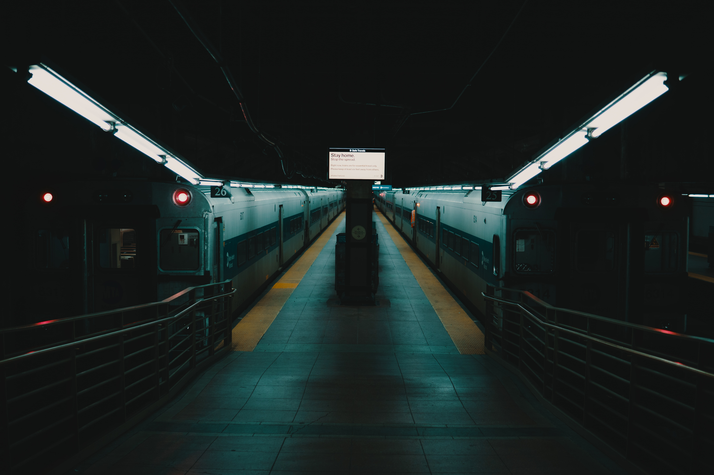
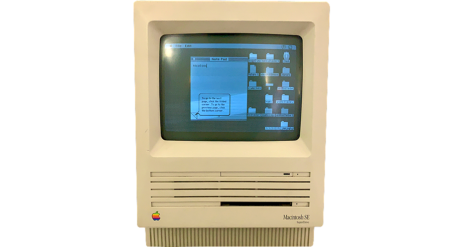
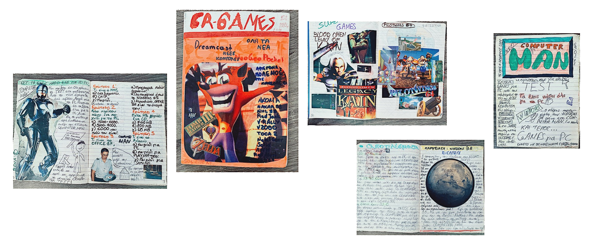

No, seriously now, why did you become a software engineer?

Was it the beauty of the algorithms? The intelligence of the design patterns? The mysteriously blinking lights in server rooms? The revolution of technology and how it improves our lives? The happiness to see other people react to your creations? The agile manifest? The money they promised you? The feeling you helped the world become a better place? The need to have a job? The dirty hacks you invent to deal with something you don't know? The fact you will never be without a job? The coffee you drink in your breaks? The dream to become the cockiest boss alive? Was it your mom?

Can you easily tell what your main driver was? Do you think it _still_ drives you today or was there something you lost in the process?

I have a story to share. It’s gonna take some time. I will let you prepare a beverage first. Today's special hot chocolate with whipped cream. Ready? Ok, here we go...

---

My middle-age crisis started earlier than the usual. One day I woke up and all of a sudden various philosophical questions besieged my brain.

Who am I? What am I good at? What I am _not_ good at? How can I contribute to this world and how far am I to make my dreams come true? Am I doing the right job? Am I gonna be successful? What is success anyway? Are we gonna be friends again?

I felt like something was missing from my life. Something I wanted so badly and I din't know what. Nothing was giving me joy anymore. The same job. The same place. The same people. The same routine.

In the beginning I thought, it wasn't really necessary putting myself in this trouble. I believed this wasn't a healthy habit for me. I tried to escape these dark thoughts. Why do you have to feel bad when you are living like a king? You are a software engineer, you have a very nice job, you are working on high scale projects and the list goes on. Why don't you just post another selfie to tell the world how happy this burger makes you feel? You can find multiple ways to distract your brain. But can you really escape these feelings?

No, you can't! The more you try to ignore a feeling, the stronger it gets. And you find yourself drowning in this endless feed, that never gives you any satisfaction anymore. I knew I had to _deal_ with it. I knew I had to _change_ something.

So I did what everybody else does. I opened YouTube and I watched every self-improvement video ever created. You know this feeling when you are not motivated to do anything but you waste your time watching videos about motivation. We've all been there. It took me plenty of time to actually try the practices I was watching. And this is when the fun starts.

I want to share with you what worked best for me. It's an easy exercise you _can_ try at home. Spoiler alert: It turned out these thoughts I had from the very beginning were really healthy. I feel very thankful I had to go through all these. In fact, this blog would never been created otherwise.

---

_Credit: [Alec Favale](https://unsplash.com/photos/nGJboLqJx3M)_

Another day was about to end. I was home. Everybody was. The city was empty because of the pandemic. I had the windows closed because I was afraid of the zombies. Better to be prepared for anything. You can't play games with 2020. I was bored and lost in self-improvement blogs. Suddenly I’ve read about this mind-blowing idea.

> I opened a portal through time and I asked my young self how he feels watching me in this moment of my life. Was he happy with my progress so far? Was this the future he was dreaming about?

It worked! I was able to see my teenage self. He was studying math in my green painted room. My first thought was pretty obvious. Damn my hair needed an extreme makeover. Later on I started talking to him.

At first he was scared. Not because I was able to communicate with him from the future, he was actually thrilled this is possible. He was shocked as I was giving him an update about his future. I will never forget the words he used to describe it.

"Man what the f\*ck are you doing? Are you f\*cking crazy?"

The guy had a point, so I let him speak. I listened very carefully to the things he had to say. In order to transfer his message, I have to go back to where all this started.

---

_"Oh great, I know where this is going. He will write the story of his life again."_

_"It's a personal blog, of course I have to write about my life, what else should I write about?"_

_"Please make it quick. It's hard to keep my eyes open with all this drama."_

_"I will if you let me write. I thought I'm done with you when I stopped writing my previous blog. How the hell you survived all these years?"_

_"I thought you've stopped writing blogs that nobody is willing to read, but I lost my faith the moment you started opening portals and talking to yourself."_

_"Ok mister, you got it. I will write the story of my whole life with all the unnecessary details I can think of. I will use as many words as I can. And you know what, you can't escape reading it, because you are a part of me. In fact, you will read it multiple times until I am happy publishing it."_

_"..."_

_"Yeah, remember this day the next time you will think to interrupt me again."_

---

_Credit: [JD X](https://unsplash.com/photos/pj1aVH2tiLE)_

When I was a kid, I had an obsession with electronic devices and especially those that had screens. SONY Trinitron TVs, VHS, calculators, CRT monitors, LCD panels and retina displays.

I was observing UI interfaces in every possible format. When everybody was watching a trailer for a movie, I was checking the motion graphics. When everyone was refusing to switch from MS DOS to Windows, I was extremely excited with the user interface and the endless possibilities that came along with it. When everyone was bored waiting for a game to load on PlayStation, my mind was running on how they made this loading screen look so nice. It was just so cool!

School years were lazy. All I wanted to do was to go back home and turn on my PC. I loved video games. I wanted to play every video game ever created. It was fascinating to watch the technology evolve so rapidly. From text based adventures to Myst and Syberia. From green console terminals to 3dfx. Video games were pushing metal to the maximum. Plus, it was really a pleasure, saving the universe with your friends.

I had an interesting hobby back then. I used to buy textbooks, flip their cover and create albums by cutting off pictures from magazines. Later on I started making my own fake computer magazines. Yes, as an only child I did have plenty of time to spend. Other kids had imaginary friends, I had imaginary magazines!

And then the web arrives and changes everything.

It was very slow to connect and files were taking hours to download. Images were considered luxury. Platforms like Blogspot and Wordpress were getting really popular. It was really easy for someone without any technical skills, like myself, to create their own website.

I started a personal blog about video games and technology using Yahoo! Geocities. For the first time someone could _actually_ read my articles. It wasn't a successful one, depending on the traffic, but it helped me to expose myself to many activities.

I had to play many roles. Coding, storytelling, video editing, graphic design and the list goes on. I was constantly searching for ways to improve my craft. Reading people's comments and adapting my work according to their feedback. I learned programming by myself before I started my IT studies. Or at least something I was calling programming.

I also made some good friends in the process. People I never met in person until today. We had a lot of interests in common. You see, I couldn't find schoolmates with the same curiosity about computers. And vice versa. It was strange for me that nobody was excited as I was.

But I was still captivated by user interfaces. This time on the web. Something inside me was making that _click_ again.

> It’s those pixels you can’t take your eyes off. All these little details that fit together perfectly.

It's like a living piece of art. You start with an empty canvas. You combine different elements together to construct a composition. You choose the tools, the language and basically you make decisions about every single element. You deal with the technical limitations and any other problems you may face along the way. You try to keep it modern and easy to navigate.

I can't explain what was keeping me up endless hours working on my blog, without getting anything in return. I didn't care about money or fame. I didn't care how many visitors I will reach. It was just my creative space. I was feeling good. I was myself.

---

_Credit: [Florian Krumm](https://unsplash.com/photos/1osIUArK5oA)_

My career as a software developer was a nice continuation of this story. It combines many of the things I like to do. It's not only a job to me, it's my hobby too. And I was lucky. Very lucky. It proved to be one of the best in-demand jobs.

But trust me, it wasn't easy to stay in this path. I made plenty of risky choices in my life to retain my ambition. You see, back then IT wasn't the hottest place to work. Computers were neither cool nor popular as today. Today if you are a software engineer it's considered kinda cool, back then it was the hobby of the geeks.

This desire to make my hobby a profession, forced me to take risky decisions in my life. I refused to work for our family business. I resigned from jobs in profitable companies, for positions that were closer to what I wanted to work on. There was a period I was working 12 hours a day, coding personal projects right after my regular job. For almost two years I was working (almost) without getting paid. But I didn’t care back then.

I wanted experience. I knew this would be the best deal for me. I would never have to work anymore.

Going for what you love is the best decision you will ever make in your life. It pays _a lot_.

---

Now I know what was missing from my life. The reason I was not satisfied, even though I gained a lot. I lost my creativity.

It took me 3 years to build this website. I had already the design in Sketch and it was just a matter of a weekend or two to write the code. Every time I was pushing myself to work on it, something was distracting me. I tried different technologies, different ways to organize myself, different hardware, different writing styles, but I never managed to publish it. At the end I was always giving up. I wasn't satisfied with anything I was producing.

> It wasn't a project a kid was making with _love_, persuading to become a successful developer. It was a project a "successful" developer was making with _fear_, persuading not to be perceived as a kid. And guess what. He was constantly failing.

Now let's take some lessons from my young self.

---

Find what you love to do. Put your heart and soul in it. Make it your profession. You need a job that embodies who you are. Expose yourself to new ideas, learn new things, meet people who share the same passion, take more risks.

If you haven't found yet what drives you, I have a tip for you. Take an empty piece of paper. Write down what drives you, what are you curious about. What makes you lose the sense of time. What are the tasks you are willing to do that everybody else doesn't. You got it? Great.

Now you have to find the courage and the time to work on it.

Start simple. Schedule the time that you'll spend working on your craft, without any interruptions. No internet, no phones, no messages and no people around you. One hour at a time is enough. Don't set any goals. Just let yourself free.

You will see your motivation will increase as time goes. You will find more interesting things to work on. You will meet inspiring people and at the same time you will inspire others. You will leave your comfort zone.

Working on what you love will give you the courage to carry on. You will be confident to take risks you weren't able to take before. To quit this boring job. To start a business. To produce something good. To be you.

Scary isn't it? Just give it a try. You don’t have anything to lose.

The opposite of love is fear, not hate.

Cover Credit: [Luca Bravo](https://unsplash.com/photos/9l_326FISzk)
