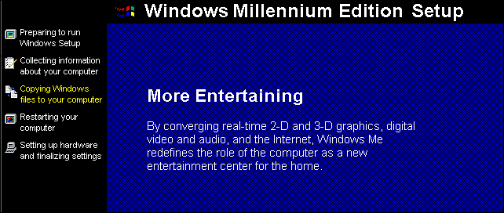
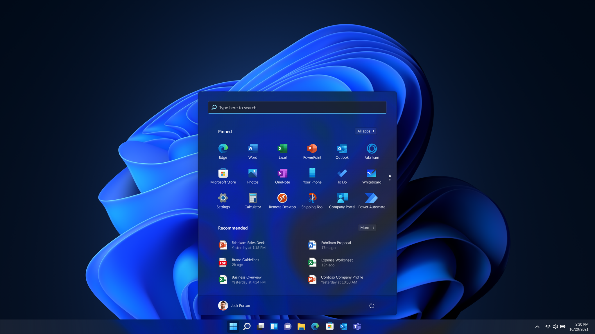
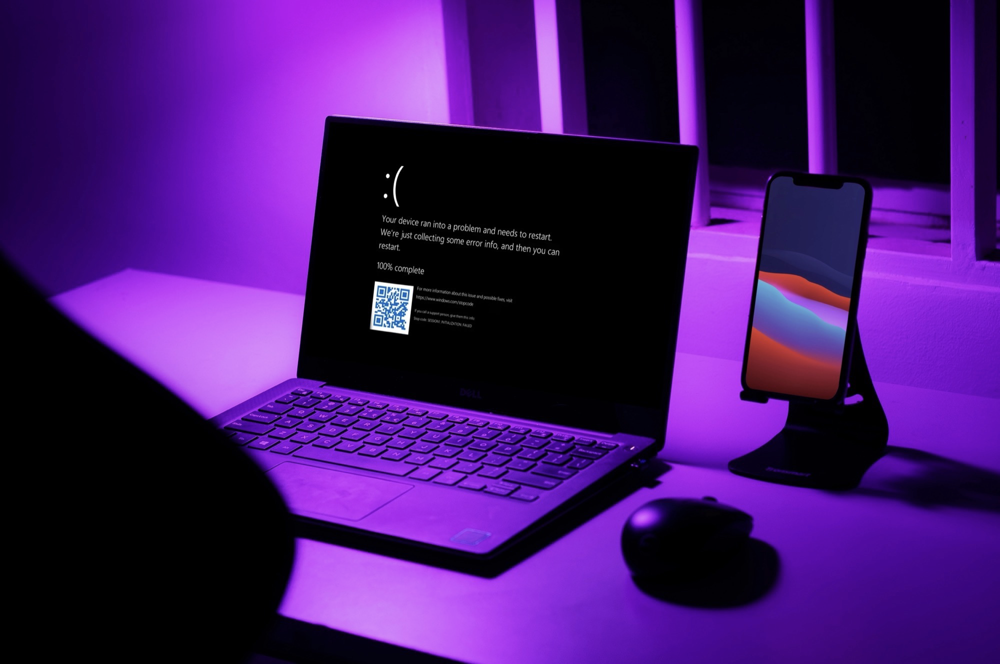

OK, I admit it. I use Apple devices for many years now. I’m a frontend engineer, what else do you expect me ‌to do? I have a proper hipster backpack, a card at Starbucks, I pay double to be a “Pro”, and I’m using a Magic Mouse.

But that wasn’t always the case with me. I used to be a Microsoft kid. I grew up with Windows. In fact, I’m still using Windows at work and I’m enjoying gaming on my PC when I have the opportunity. Windows was always my thing. I have spent endless hours building PCs, formatting, overclocking, benchmarking after a big upgrade, and dealing with its idiocracies.

It's been 30 years now. Man, time goes by so fast.

I want to spend a moment celebrating the most important moments in the history of Windows, as I experienced it. It’s also an invitation for you to share your experiences. Do not expect this to be a technical article ‘cause all I wanna do is [have some fun](https://www.youtube.com/watch?v=ClbmWkbocoY). Instead, you’ll find a lot of irony and sarcasm inside. Let’s explore life without walls.

Martini? 🍸

## Windows 1.0

It's 1983, and Microsoft releases the first-ever operating system with a Graphical User Interface. Yes, I know, this was not the first. Yes, I am familiar with IBM and Steve Jobs. It's the first second. The first of its kind. The best they've ever made (because they've never made another one yet).

_The team behind Windows._

Gone are the days someone would type machine words on the terminal, touching the metal.

I wouldn’t say that most of its users were perceiving it as a real OS, rather than something you use on top of your existing Operating System, which was [MS-DOS](https://en.wikipedia.org/wiki/MS-DOS) back then. Although Windows was based on MS-DOS, it added a lot of useful applications that are still present in modern versions of the OS.

_The design wasn’t inspired by Lego. It’s just most computers were only able to display 16 colors._

I don’t have much to share here, since I never had the chance to [play](https://www.pcjs.org/software/pcx86/sys/windows/1.01/ega/) with the first version of Windows. My depute to the world of bad software engineering was with…

## Windows 3.1

Windows OS was becoming so advanced that it jumped to 2.1 versions ahead. OK, that’s what I thought was true for many years, up until [Wikipedia](https://en.wikipedia.org/wiki/List_of_Microsoft_Windows_versions) became a thing. This was my first ever Windows version, and the truth is I was hating it. But not for the reason you may think of.

_Left: The boot screen. Right: The desktop._

This may seem strange, but people were refusing to upgrade to using a GUI for many years. You see, most of the PC users at that time were electronic engineers or hobbyists. Spending time in front of a [computer monitor](https://en.wikipedia.org/wiki/Cathode-ray_tube#/media/File:Trinitron_computer-monitor.jpg) was only a benefit for nerds like me. On top of that, most of the apps people we were using back then were still running on MS-DOS.

Eventually, the adoption of Windows gradually transformed into a tangible reality. More and more companies were firing their employees because they were playing Solitaire at work. And besides all the efforts Microsoft was putting into [teaching them](https://www.businessinsider.com/why-computers-comewith-solitaire-and-minesweeper-2015-8?r=US&IR=T&IR=T&utm_source=reddit.com) how to use their mouse, they were still preferring to use their keyboard instead.

_The user could customize the deck cards. There used to be a cheat shortcut too._

While [flying stars and windows](https://thespinoff.co.nz/tech/13-08-2021/all-the-classic-windows-screensavers-ranked) were decorating offices, a trend was arising among aspiring graphic designers. It was called Paint. Those underrated artists were using [dot matrix printers](https://en.wikipedia.org/wiki/Dot_matrix_printing) to share their creations with the world.

But the most popular app was ‌[Blue Screens of Death](https://en.wikipedia.org/wiki/Blue_screen_of_death). Software should inspire people to create. If I had a guess, I would say that this was the inspiration for the creators of [The Matrix](https://en.wikipedia.org/wiki/The_Matrix). At least Matrix was readable, because most of the BSOD errors back then had broken encoding.

_These kind of errors used to scare those who didn't understand how computers work._

And just as the world was finally recovering, a new disaster began to emerge...

## Windows 95

Also known as "The 32-bit OS", [Windows 95](https://www.youtube.com/watch?v=miZHa7ZC6Z0) debuts with a new set of minimum technical requirements. In other words, you would have to buy a new PC.

_There was always a visual indicator (loading thingy) to let you know if your PC crashed while booting._

Don't be fooled by the "plug n' play" label! No device will work after plugging it in unless you restart your computer. Bad marketing I guess?

Mouse was the new black. MS-DOS was slowly becoming the OS of old-school hobbyists, gamers, and cashiers. We were all transitioning from floppy disks to CD-ROMs. I mean, what would you choose between thirteen floppy disks or a CD to install your OS?

_Your PC back then wasn't able to turn off automatically; you had to manually switch it off when this message appeared._

Get ready for the global debut of the notorious Registry lurking in the shadows, ready to crash your PC with the first program setup. Probably it will be something innocent such as your printer drivers.

Blue screens of death are now in English. You could find them on a monitor near you. It's one of the best ways to identify that your computer runs "genuine Microsoft software".

.](images/windows-bosd-tshirt.png)
_Back in 90's sexism wasn’t really a topic. You can confirm that if you watch any Hollywood films from that era. At least we were not wearing meat to go to the [MTV Awards](https://en.wikipedia.org/wiki/Meat_dress_of_Lady_Gaga)._

The Web is starting to becoming a thing. Of course, Internet connections were so slow that you'd have to wait half an hour to download a music track. Windows 95 taught us how to surf [the Internet](https://www.youtube.com/watch?v=iDbyYGrswtg&t=24s) by double-clicking on the blue "e" icon. Yes, this was the year Internet Explorer was released. An application that will shape the web industry. The world would never be the same again.

[Where](https://en.wikipedia.org/wiki/Where_do_you_want_to_go_today%3F) do you want to go today?

## Windows NT

Nobody paid attention all these years. Why should you?

## Windows 98

Released in 1998 (really now?) Windows 98 was taking advantage of new technologies. If your PC had [MMX](<https://en.wikipedia.org/wiki/MMX_(instruction_set)>), DVD Drive, USB port and an AGP card, Windows 98 could have taken the advance of them.

_As you can tell from the similarities between the previous version, this was a minor release._

Tip: Never say a bad word about Internet Explorer. Microsoft has integrated it into the whole OS and it's collaborating with the registry to make fun of you.

_I remember I was so fascinated when I saw this setup for the first time._

For the first time ever, friendly error messages apologize to you every time an application has to terminate. How nice of them. You can also send an error report to Microsoft. It just takes just one click and it arrives directly in the Bill’s Recycle Bin.

_At least you had an entertaining activity to play with when something was crashing._

Oh common, I told you that Windows 98 _could_ take advantage of the new technologies. I never said they _would_. Your new computer still needs new drivers silly! And of course, Internet Explorer is restarting every time you try to download them. But look how nicer the new BSOD looks. It’s not in 256 bits of colors anymore.

Hands down Windows 98 was one of the best versions of Windows ever. It remained for many years our favorite choice. It wasn’t because it was _that_ good, it was because the other versions were _so_ awful. Overall, it was a stable and performant OS.

## Windows ME

The revelation of software engineering. A real masterpiece in the world of Operating Systems.

_If you used to know someone who was using WINME please call them to make sure they are still alive._

Windows ME stands for Millenium Edition. Mind the capital “E”. The [Y2K bug](https://en.wikipedia.org/wiki/Year_2000_problem) was extremely scary at that time. We were all prepared for the worst. Microsoft tried to solve the Millenium bug, once and for all. They released an OS with so many bugs, that people forgot about the Millenium bug altogether.

_Every time Microsoft was trying to simplify the Control Panel, people were still going back to the icon view._

Known as "the multimedia OS", Windows ME introduced us to the Windows Media Player and Movie Maker. System Restore revolutionized backups. It was so smart, that it was able to restore your OS at a specific point in time, by recovering all your data and settings, including the viruses you had quarantined.

_Broken promises._

For the first time, you can delete the files within `System`, `System 32`, and `Windows` folders. Not a bad idea actually, because all these files needed a complete erase and rewrite from the ground up. But wait a minute, this green-field project exists. It is called...

## Windows 2000

No, not that one. I told you, nobody cares about good Operating Systems. Besides, this was released together with ME.

I’m talking about…

## Windows XP

_You could tell from the boot screen that this brings something fresh._

Microsoft is releasing its biggest invention yet, by combining WINME and 2000. This Windows version doesn't require knowing the year it was released to pronounce its name. This was unheard of.

_The iconic wallpaper we all loved. The original Sonoma, not the [copycat](https://www.apple.com/macos/sonoma-preview/)._

Also known as "Let's activate Windows", Windows XP was a big hit. Drivers and programs were working in harmony. Developers were happy. Hackers were happier. They had a new activation system to break, and Internet Explorer gave them the opportunity to share their software with a large user base. If you had told me this is the OS with the most security patches, I would’ve believed you.

_If you didn’t have an internet connection you had to call Microsoft’s call center._

BOSD is friendlier than ever, by resetting your PC automatically every time it crashes, so that you don't have to press unnecessary keys or buttons.

_Life is like a blue screen of death; unexpected, frustrating, and a reminder to save your progress._

Windows supports multiple users. Yes, that's exactly what it means! Now your mom can use your PC without accessing your browser’s history. A mysterious guest user appears some days after buying a new PC. Nobody knows who invited them. But they were there. Watching.

_The Enterprise-looking window for user selection has now been replaced by this friendly welcome screen._

## Windows Vista

Welcome to the future. No more crappy error messages and static blue screens. Time to replace them with fancy 3D windows that are flying in the air. It’s called Aero, and the [wow starts now](https://www.youtube.com/watch?v=QN5DW8jlkB0)!

_It’s funny how modern 3D elements are mixed with legacy 256-bit icon applications._

Oh c’mon, don’t listen to the bad rumors, you know people like to complain about things. Yes, I know, maybe a limited amount of games (all of them) were running a bit slower (much slower) compared to previous versions. And yes, a lot of software was refusing to work, even with ‌compatibility features turned on. And maybe a small portion of device drivers (most of them) can be incompatible (or break your OS). But why would you care if you had windows that could fly, right?

_Now you have the option to close a program that crashed by pressing a button. Very convenient._

Compared to the childish look and feel of Windows XP, Vista really impressed me every time I was turning my PC on. This aerial experience though came at a cost; it required a GPU. Without it the interface was becoming so slow, that you would beg to buy one. A lot of PCs weren’t ready to support these 3D effects.

Also known as "Longhorn", Windows Vista introduced different pricing packages, with Ultimate being the most packed one. They introduced a revolutionary search functionality. Sometimes it was taking 30 minutes to return a result, which didn't give you the appropriate time to enjoy the magnificent graphics.

_Windows Media Center back then was the Google TV of the ages. Add an IR remote receiver and you transformed your PC to a TV._

This was by far the most hated version in the history of Windows. I remember the most popular question back then was how to uninstall Windows Vista and install XP. You see, stores were selling “Vista Capable” PCs, giving the impression to consumers that these devices were capable enough to run the OS however, this was never the case.

Microsoft had to change. They had to come up with a plan. And they did it.

## Windows 7

Known as “the fast OS”, Windows 7 was an attempt to fix the mess that Vista created. And it worked. People were looking forward to migrating their PCs.

_A clean interface, with speed and security built-in, and packed with new technologies. That’s what defines a good OS._

Everything was magically working faster. I don’t know how to explain this, but Vista was slow. Sometimes, you had to wait a minute for a task that the other OS would finish in a couple of seconds. This was not the case with Windows 7, in which everything was smooth like butter. Fun fact, most of these speed improvements were being introduced to Vista as well, with multiple Service Packs.

Windows 7 focused on solving the biggest pain points users had. They also introduced helpful features for managing your files, a more modern Start Menu, and the hated Task Bar with icons, compared to labels they were using before. You’ll find a lot of old-school Windows users that still prefer this way for managing their open apps.

Sure, Windows 7 was a great OS, but it wasn’t designed to support the variety of devices and touch interfaces that were becoming more and more popular. Those users wanted something more touch-friendly. And they got it. All of us did…

## Windows 8

A Microsoft product designer, waiting in the subway, was struck with inspiration while staring at a signboard. Suddenly, an idea sparked within him.

“Wait a minute. Yes! That must be the future of computing!”

He was dreaming of huge monitor screens, walls, tables, carpets, everything! And they were all running Windows.

The next day he presented his idea to Steve Ballmer, who [loved it](https://tenor.com/search/steve-ballmer-crazy-gifs). Together, they built Windows from the ground up.

_The start menu was now in full screen._

Apps? Let’s make them universal. Start menu? Let’s make it full-screen. Desktop? So lame, let’s show some icon ‌tiles instead. I mean Apple is doing it, why can’t we? My computer? Who wants my computer, it’s not a computer anymore. It’s an ecosystem. For the first time, you can _touch_ your BSODs. Microsoft also hired copywriters. Instead of “A fatal exception 0E has occurred”, we now have “Your PC ran into a problem and needs to restart”. A sad smiley makes the whole experience even better. Who cares about that error anymore?

_The trend with the sad faces started back then._

Windows 8 was booting ten times faster than Windows 7 and a hundred and ten times faster than Windows Vista. Not only were the boot speeds fast but the whole operating system ‌was pretty responsive too. People were resurrecting older PCs they were considered useless. I’m telling you, it was night and day. And if you could spend some extra bucks to add an SSD, you could keep your PC running for another 1-3 years.

Yes, you’ve read it correctly. This was the first Windows OS that didn’t require a new PC to run properly. Miracles do happen.

Known as “the one that introduced the Metro apps”, Windows 10 was basically a tablet OS. Of course, since Microsoft is famous for providing good UX, you had 2 different versions of apps, the regular ones, and the Metro ones. So what would you choose? Features or portability?

People loved Windows 8 so much that they wanted their tablets and smartphones to have the same UI.

_Nope._

No, I’m just kidding. This never happened. Everybody was switching back to Windows 7 because they couldn’t deal with the new UI. Just to shut down your PC you had to launch the Start Menu, move your mouse all the way to the right, then perform a slide towards the center, and then you could find the power off button which was showing an additional context menu. If you were lucky and your cursor was not out, and if you were not having multiple monitors. You needed a ‌PhD to turn off your PC.

And the story repeats itself.

## Windows 8.1

It takes courage to stay innovative. And Microsoft did it again. This time they brought back the Start Menu. No more full-screen bullshit. Ah, and you can shut down your PC from the Start Menu as well.

_The Start Menu is back. You can still use the full-screen one on Tablet-mode if you want._

This was a patch version, with some leftovers from the previous version that couldn’t pass the acceptance tests and the Product Owner decided to postpone for the next iteration. It was basically reverting to UI changes that didn’t make any sense for desktop users.

But you know what they say... Haters gonna hate. And that’s what they did back then. So Microsoft didn’t have any other choice...

## Windows 10

No more ugly patches, no more mobile-looking apps, and no more slides to unlock. Windows 10 now runs anywhere. PCs, tablets, laptops, ARMs, Macs, Cloud, you name it. And each device is getting the UI it deserves.

Microsoft seemed like they had found a secret sauce to building modern operating systems. Where? Well, at the Apple Keynotes, of course.

_The iconic hero desktop image of Windows 10 was pretty [challenging to make](https://www.youtube.com/watch?v=ewmXizBqjl0&t=9s)._

Dear PCs, you are a Mac now. Just mind how we call things here. We say Cortana instead of Siri, Virtual Desktops instead of Spaces, Spotlight instead of Universal Control, Continuum instead of Continuity, and Task View instead of Expose. I know it takes some time, but you’ll eventually get used to it.

Internet Explorer is being deprecated. The new Microsoft Edge web browser brings new features and incredible performance. When it’s working, of course.

_Scanning a stop code may give you more information about what has failed._

The blue screens have a QR code so that you can interact with them. Don’t get confused. It’s not like Pokemon Go. But actually, this would be a nice game to play with your friends. Collect error codes and [earn points](https://www.microsoft.com/en-us/rewards/search-and-earn).

When Paint was added to the list of deprecated software, [activists](https://x.com/kaylacolgan/status/889465766667591681?s=61&t=-0schIy_9kbMVOAnITe8nQ) around the world were protesting on social media, convincing Microsoft to revert to their decision. Thanks to [them](https://x.com/saalem1975/status/889477864269246464?s=61&t=dp9-ibQGkklC-bYxhH1mow) we can now enjoy our favorite design software of our youth.

_It was the time we stopped worrying about driver incompatibility issues and we focused more on how many RGB lights our PC could fit._

Also known as “the last version of Windows”, since Microsoft announced they would never release a newer version after Windows 10.

And yet they did it again.

## Windows 11

Microsoft discovered what people _actually_ needed: Rounded corners.

So they teamed up with a bunch of Android users, they forked Windows 10, and they created a pull request with some CSS changes. But you know, we say Fluent here, not Material.

_A new design language across the board._

Just picture this for a second. A designer (I imagine him like Bob Ross) with a brush in his hand (sorry, I mean a [surface pen](https://www.google.com/search?q=surface+pen&sxsrf=AOaemvJmsg7f7THbjy5nvuz1v7LNNUesPw:1635969076286&source=lnms&tbm=isch&sa=X&ved=2ahUKEwjOw57d-_zzAhWosKQKHakkBWQQ_AUoAXoECAEQAw&biw=2384&bih=1252&dpr=2)), thinking about how to improve the UI (sorry, these days we call it UX), and running out of ideas. Then another guy comes in with the face of [Archimedes](<https://en.wikipedia.org/wiki/Eureka_(word)>).

"Eurica! Let's center the Start Menu!"

According to Microsoft, the Windows Start Menu is the center of your world. Well, I can’t blame them now that we’re all in front of a computer. How could I?

But the CSS changes didn't stop there. For the first time in history, BSODs are now painted in black. Because, you know, black is the new... black?

_Small details add to the user experience._

Also known as "this version doesn't run on my PC but I've read a guide on how to install it". Not even Microsoft knew which PCs were compatible with this OS. And yes, you will need a new PC again. It’s for your own good since you’ll be less vulnerable to hackers. I mean, you can’t just use your Vista-capable machine from a million years ago.

The designer has probably left the company at some point, and the team has replaced him with someone from the Sales department. He worked on more CSS changes in the search bar (seriously who decided to add a doodle there?), added Microsoft Teams in the Taskbar, forced Edge as the main browser, made ‌browser selection difficult, and integrated MSN in a new area called Widgets.

_It’s getting harder and harder to see errors like this._

I give them credit for redesigning the new Settings though. I think it’s one of these moments that Apple should take UX lessons from Microsoft. Maybe they will find a way to completely replace the old Control Panel. Maybe not.

---

Thank you, Windows for being a big part of my life. And thank you, reader that you made it to the very end.

It seems that we’re going to see big changes in the following years. AI and copilots are changing the way we interact with computers. Until my next anniversary, stay safe. 👋
