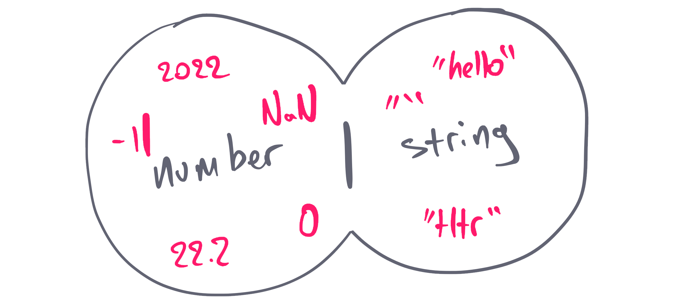
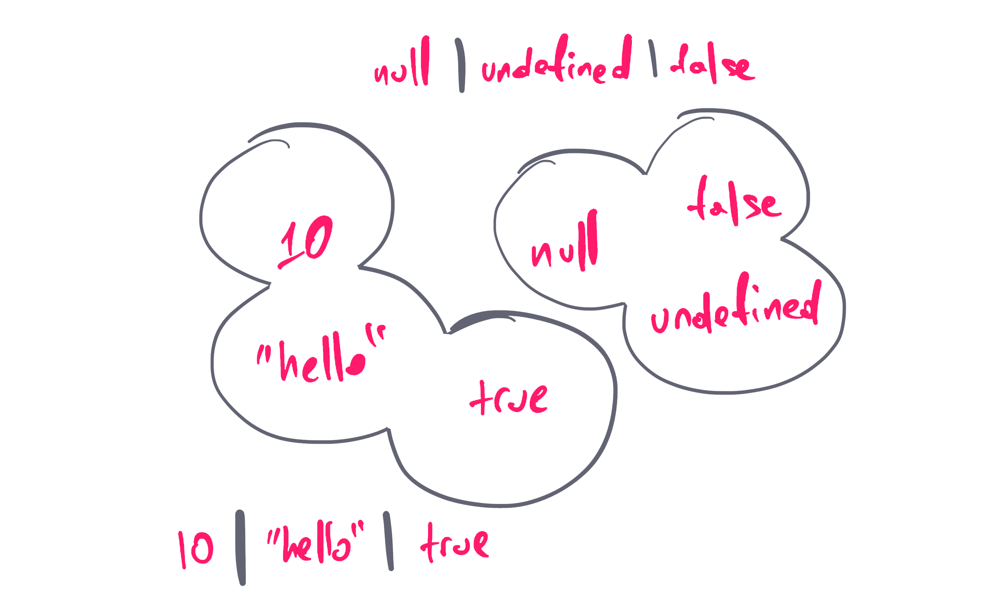
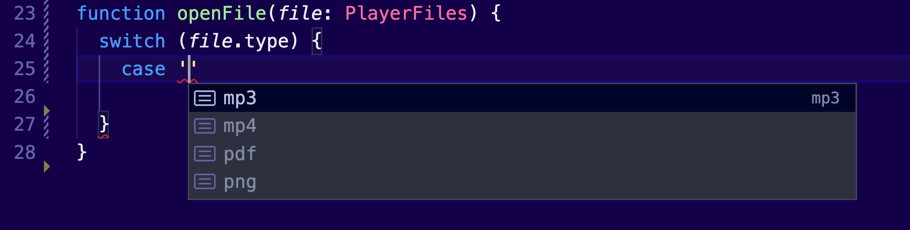

## TypeScript in a nutshell

A list of the most frequent questions someone wants to know about TypeScript.

<details>
  <summary>
  What is TypeScript?
  </summary>

TypeScript adds support for _strongly typed programming_ in your JavaScript applications. It's tightly integrated with your text editor, to help you catch your errors early.

TypeScript is a superset of JavaScript. All existing features of JS are already supported, but it adds syntax, which helps you build much more structured applications.

TypeScript's compiler transpiles to JavaScript. This means that you can run all the applications on every browser, on Node.js or other native apps that have a built-in JavaScript compiler. You have plenty of options to set the target supported devices.

Type checking runs on compile-time. If you violate the type rules, your application will not run due to errors. All the extra code that you add it will be removed from the transpiled JS code and it will not be available at runtime.

</details>
<details>
  <summary>
  What are the benefits of using TypeScript?
  </summary>

By introducing types to your code, your editor can understand much better how the different parts of your application are interconnected. Therefore, it can provide you with sophisticated auto-completion suggestions that can speed up your development.

</details>
<details>
  <summary>
  How to migrate an existing JavaScript project into TypeScript?
  </summary>

You can adopt TypeScript gradually into your existing projects. You can also use it to catch JavaScript errors in your continuous integration pipelines. In fact, [Visual Studio Code](https://code.visualstudio.com) has TypeScript built-in, to help you find errors without any configuration from your side.

</details>

## Everyday types

Learning TypeScript from scratch? Here’s a curated list with all the popular types.

<details>
  <summary>Literal</summary>

```tsx
let title: string = 'Bohemian Rhapsody'
let releasedAt: number = 1975
let gernes: string[] = ['Rock', 'Hard rock', 'Progressive rock']
let isFavorite: boolean = true
```

</details>

<details>
  <summary>Object literal</summary>

```tsx
type Track = {
  id: number
  artist: string
  title: string
}
```

</details>

<details>
  <summary>Nullables</summary>

```tsx
let error: undefined // similar to JS
let loading: null // similar to JS
```

</details>

<details>
  <summary>Wildcards</summary>

When you use `any` in your type annotations, you simply skip the type annotations. You are basically saying "I hate TypeScript and I don't want to deal with it. _You_ deal with it!".

```tsx
let year: any = 2020
year = '2021' // it perfectly compiles without issues.
```

When you’re dealing with a value that has an unpredictable type, use `unknown` instead of `any`:

```tsx
let duration: unknown
let durationInMinutes: string
duration = '5.54m'
durationInMinutes = duration // Doesn't compile since unknown can be anything!
```

The `never` keyword can play the role of the type guard. We can’t assign any type of value to a variable with the type `never`, except from values that are themselves type of `never`.

```tsx
function throwError(message: string): **never** {
  throw new Error(message);
}
```

</details>

<details>
  <summary>Literal</summary>

```tsx
type On = 'on'
```

</details>

<details>
  <summary>Union</summary>



An array of types:

```tsx
let id: string | undefined
let status: 'open' | 'in progress' | 'resolved'
```

</details>

<details>
  <summary>Template literal</summary>



```tsx
type SizeValue = `${number}${'%' | 'em' | 'rem' | 'px' | 'vw' | 'vh'}`
```

</details>

<details>
  <summary>Intersection</summary>

```tsx
type User = Id & {
  username: string
  email: string
}

type Order = Id & {
  total: number
}

const userWithOrder: User & Order = {
  id: 'U-123',
  total: 123,
  username: 'nicotsou',
  email: 'no@spam.please',
}
```

</details>

<details>
  <summary>Enum</summary>

```tsx
enum Filetypes {
  Mp3,
  Mp4,
  Wav,
}

const fileType = Filetypes.Mp3
```

TypeScript compares their actual values:

```tsx
enum Filetypes {
  Mp3 = 20,
  Wav = 2,
}

Filetypes.Mp3 < Filetypes.Wav // returns false
```

Rarely used, but they can be really helpful in certain situations.

</details>

## Advanced types

<details>
  <summary>Tuple</summary>

```tsx
type Coordinates = [lat: number, long: number]
```

</details>

<details>
  <summary>Lookup types</summary>

```tsx
type Data = Response['body']
```

</details>

<details>
  <summary>keyof</summary>

```tsx
type ArtistKey = keyof Artist // "type" | "id" | "name" | "followed" | "plays"
type StringKey = keyof string // all members of the string object like: "toString" | "charAt" | "charCodeAt" | etc...
type UndefinedKey = keyof undefined // never
```

</details>

<details>
  <summary>infer</summary>

By using the `infer` keyword, you are creating a new generic type `R`, which then can be returned as a type value. So basically, you are catching the type of the generic `Promise<T>`. This can become really useful, when you are developing your APIs.

```tsx
type PromiseReturnType<T> = T extends Promise<infer R> ? R : T
```

</details>
<details>
  <summary>Discriminated unions</summary>

Consider the following types:

```tsx
type FileBase = {
  filename: string
  type: string
}
type Song = FileBase & {
  type: 'mp3'
  play: () => void
}
type VideoClip = FileBase & {
  type: 'mp4'
  play: () => void
}
type CoverArt = FileBase & {
  type: 'png'
  move: () => void
}
type Receipt = FileBase & {
  type: 'pdf'
  download: () => void
}
```

First of, you combine all file types under one umbrella:

```tsx
type PlayerFiles = Song | VideoClip | CoverArt | Receipt
```

Then, we try to implement the following function

```tsx
function openFile(file: PlayerFiles) {
  switch (file.type) {
    case ...
	}
}
```

The moment we start typing our `case` block, autocompletion kicks in:


</details>

## Functions

<details>
  <summary>Arguments</summary>

```tsx

function add(a: number = 0, b: number = 0): number {
  return a + b;
```

</details>
<details>
  <summary>Arrow functions</summary>

```tsx
const add = (a: number, b: number): number => a + b
```

</details>
<details>
  <summary>Void</summary>

```tsx
function init(): void {} // This function should not return any value
```

</details>

<details>
  <summary>Overloading</summary>

```tsx
// overload signatures
function search(title: string): Track[]
function search(id: number): Track[]
// actual implementation
function search(nameOrId: string | number): Track[] {
  if (typeof nameOrId === 'number') {
    console.log('searching by id')
  }
  if (typeof nameOrId === 'string') {
    console.log('searching by name')
  }
  return []
}
```

</details>

## Code structure

<details>
  <summary>Type alias</summary>

```tsx
type Track =
  | undefined
  | {
      title: string
      releasedAt: number
      gernes: string[]
      isFavorite: boolean
    }
```

Key characteristics:

- A TypeScript-only feature, therefore only available only at compilation.
- They can support primitive types.
- They can only be declared once (unless exported).
</details>

<details>
  <summary>Interface</summary>

```tsx
interface ITrack {
  title: string
  releasedAt: number
  gernes: string[]
  isFavorite: boolean
}
```

Key characteristics:

- A TypeScript-only feature, therefore only available only at compilation.
- Act as object type annotations for object structures.
- Can connect unrelated classes together.
- Can’t support primitive types, only object structures.
- Can only be declared once (unless exported).
- Can be extended.
</details>

<details>
  <summary>Class</summary>

```tsx
class TrackClass {
  title: string
  releasedAt: number
  gernes: string[]
  isFavorite: boolean

  constructor(
    title: string,
    releasedAt: number,
    gernes: string[],
    isFavorite: boolean
  ) {
    this.title = title
    this.releasedAt = releasedAt
    this.gernes = gernes
    this.isFavorite = isFavorite
  }
}
```

Key characteristics:

- This is a JavaScript feature, and therefore it’s available at runtime.
- They are meant to instantiate objects by encapsulating their logic.
- Can’t support primitive types, only object structures.
- Full support for object-oriented features.

</details>

## Dynamic types

Wouldn’t be great if you can program your types similar to how you program your applications? Here are some core TypeScript features that will help you create types dynamically.

<details>
  <summary>Generics</summary>

A function but for types:

```tsx
interface IPlaylist<T> {
  items: T[]

  addToPlaylist(newItem: T): void
  removeFromPlaylist(itemToRemove: T): void
}
```

</details>

<details>
  <summary>Conditional types</summary>

**Conditional types** allow you to add logic to your types. As a result, you can reuse existing types, by reducing the boilerplate of having multiple types for every use case.

```tsx
type Playable<T> = T extends { play: () => void } ? T : never
```

</details>
<details>
  <summary>Mapped types</summary>

Allows you to loop over your types and create new ones:

```tsx
type ReadonlyUser = { readonly [Key in keyof User]: User[Key] }
```

</details>

## Additional Resources

You can check out the following:

- The [official TypeScript cheat sheets](https://www.typescriptlang.org/cheatsheets) are in a PDF format, and they may contain some more information.
- The [React TypeScript Cheatsheets](https://react-typescript-cheatsheet.netlify.app) website is the missing manual for implementing React apps with TypeScript.</summary>

---

This is still work in progress. I’m planning to add more sections as I’m adding content to my course. Do you have anything else in mind you want to suggest? Just send me a DM on X.
